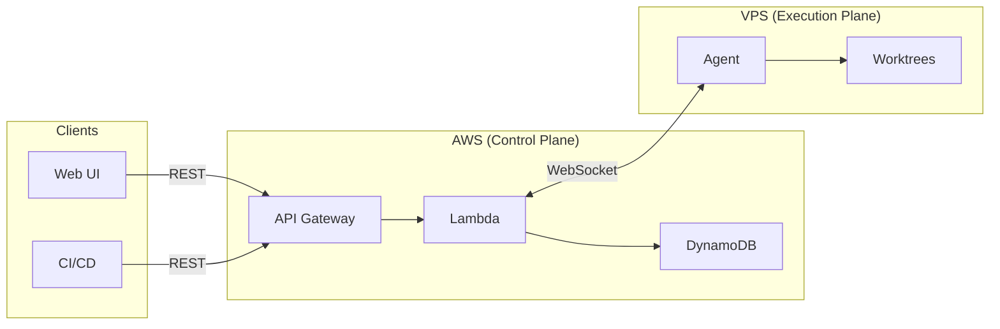

# Auto-Harness Documentation

Auto-Harness is an AI automation tool for your software factory. It allows you to programmatically trigger CLI-based AI coding agents (Codex, Claude Code, Cursor, Grok, etc.) against your repositories and manage sessions through a web interface.

Auto-Harness uses AWS infrastructure as the control plane and a Node.js agent on your VPS as the execution plane, with git worktrees providing concurrent, isolated workspaces.

## Architecture at a Glance

## Documentation

| Document | Description |
|----------|-------------|
| [Architecture](architecture.md) | System design, component internals, data flows, and key design decisions |
| [Plan](plan.md) | Implementation phases, project structure, and data model |
| [API Reference](api.md) | REST endpoints and WebSocket message protocol |
| [Security](security.md) | Authentication model, credential types, and VPS hardening |
| [Web UI](web.md) | Web interface features, session views, live streaming, and keyboard shortcuts |
| [Agent Guide](agent.md) | VPS agent setup, configuration, worktree management, and troubleshooting |
| [Costs](costs.md) | AWS infrastructure costs, scale estimates, and optimization tips |
| [Integrations](integrations.md) | Slack thread-per-session, GitHub webhooks, and custom webhooks |

## Quick Start

See the root [README](../README.md) for setup instructions.
