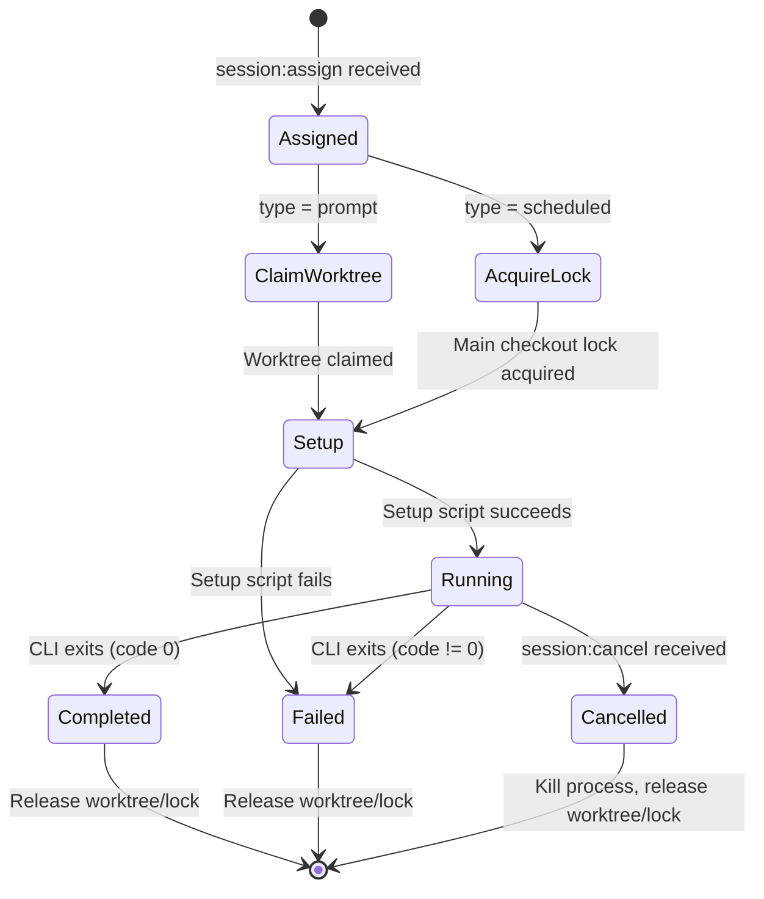

# VPS Agent

## Overview

The Auto-Auto-Harness agent is a Node.js daemon that runs on your VPS or local machine. It maintains a persistent WebSocket connection to the Auto-Auto-Harness cloud service and executes AI coding sessions in pre-configured git worktrees.

## Prerequisites

- **Node.js** 20+
- **Git** 2.20+ (for worktree support)
- **AI CLI tools** installed and configured — whichever you plan to use:
  - [Codex CLI](https://github.com/openai/codex) — `npm install -g @openai/codex`
  - [Claude Code](https://docs.anthropic.com/en/docs/claude-code) — `npm install -g @anthropic-ai/claude-code`
  - Others as needed (Cursor, Grok, etc.)
- **Docker** (optional) — some AI agents use Docker for sandboxed development within repos
- **Git credentials** — SSH keys or HTTPS tokens for accessing your repositories
- **Service account API key** — created by a Auto-Harness admin (see [security.md](security.md))

## Installation

```bash
# Clone the auto-harness repo
git clone <repo-url>
cd auto-harness
pnpm install
pnpm --filter @auto-harness/agent build
```

## Configuration

The agent is configured via a JSON config file and/or environment variables.

### Config File

Default path: `./auto-harness-agent.config.json` (override with `HARNESS_CONFIG_PATH`)

```json
{
  "apiUrl": "wss://your-api.execute-api.us-east-1.amazonaws.com/ws",
  "apiKey": "hns_k8f2m9x...",
  "agentId": "vps-prod-1",
  "repositories": [
    {
      "id": "repo-abc",
      "path": "/home/harness/repos/my-app",
      "worktrees": [
        {
          "id": "wt-1",
          "path": "/home/harness/repos/my-app/.worktrees/wt-1",
          "labels": ["codex", "claude"],
          "setupScript": "git fetch && git reset --hard origin/main && pnpm install"
        },
        {
          "id": "wt-2",
          "path": "/home/harness/repos/my-app/.worktrees/wt-2",
          "labels": ["codex"],
          "setupScript": "git fetch && git reset --hard origin/main && pnpm install"
        }
      ]
    }
  ]
}
```

### Environment Variables

| Variable | Description | Default |
|----------|-------------|---------|
| `HARNESS_API_URL` | WebSocket URL for the Auto-Auto-Harness API | — (required) |
| `HARNESS_API_KEY` | Service account API key | — (required) |
| `HARNESS_AGENT_ID` | Unique identifier for this agent | hostname |
| `HARNESS_CONFIG_PATH` | Path to config file | `./auto-harness-agent.config.json` |
| `HARNESS_LOG_LEVEL` | Logging level: `debug`, `info`, `warn`, `error` | `info` |

Environment variables override config file values where both are specified.

## Running

### Direct

```bash
# Start the agent
npx auto-harness-agent start

# With environment variables
HARNESS_API_URL=wss://... HARNESS_API_KEY=hns_... npx auto-harness-agent start
```

### systemd (Recommended for Production)

Create `/etc/systemd/system/auto-harness-agent.service`:

```ini
[Unit]
Description=Auto-Harness Agent
After=network-online.target
Wants=network-online.target

[Service]
Type=simple
User=harness
Group=harness
WorkingDirectory=/home/harness/harness
ExecStart=/usr/bin/node packages/agent/dist/index.js start
Restart=always
RestartSec=10
Environment=HARNESS_CONFIG_PATH=/home/harness/auto-harness-agent.config.json
Environment=NODE_ENV=production

# Security hardening
NoNewPrivileges=true
ProtectSystem=strict
ReadWritePaths=/home/harness

[Install]
WantedBy=multi-user.target
```

```bash
sudo systemctl daemon-reload
sudo systemctl enable auto-harness-agent
sudo systemctl start auto-harness-agent

# Check status
sudo systemctl status auto-harness-agent

# View logs
sudo journalctl -u auto-harness-agent -f
```

## Worktree Management

### How Worktrees Work

Worktrees are pre-configured in the config file. The agent manages them automatically:

1. **On startup**, the agent checks if each configured worktree exists
2. **If missing**, it creates the worktree via `git worktree add`
3. **Each worktree has labels** that determine which AI CLI tools can be assigned to it
4. **Concurrency = number of worktrees** — each runs at most one session at a time

### Labels

Labels work like GitHub Actions runner labels:

- A session with `requiredLabels: ["codex"]` will only be assigned to a worktree that has a `codex` label
- A worktree with labels `["codex", "claude"]` can run either Codex or Claude sessions
- A session with `requiredLabels: []` can run on any worktree
- A session with `requiredLabels: ["codex", "gpu"]` requires a worktree with **both** labels

### Setup Scripts

Setup scripts run at the **start of each session** to prepare the worktree:

```bash
# Typical setup script
git fetch && git reset --hard origin/main && pnpm install
```

More complex examples:

```bash
# Create a branch for the session, reset to main, install dependencies
git checkout -b claude/auto-harness/$(date +%s) && git fetch && git reset --hard origin/main && pnpm install
```

```bash
# Source environment variables, then prepare
source /home/harness/.env.codex && git fetch && git reset --hard origin/main
```

If the setup script fails (non-zero exit), the session is marked as `failed` and the worktree is released.

### Queue Behavior

If all worktrees matching a session's labels are busy:

1. The session stays in `queued` status
2. When a worktree becomes idle, the scheduler assigns the highest-priority queued session
3. Priority ties are broken by creation time (FIFO)

## Non-Worktree Sessions (Scheduled Updates)

Some sessions run directly on the main repository checkout instead of in a worktree. These are typically scheduled maintenance tasks created by cron schedules.

### How It Works

- When the agent receives a `session:assign` with `worktreeId: null`, it runs the command on the **main repo checkout**
- The main checkout is **not** part of the worktree concurrency pool — it's a separate execution context
- Only **one non-worktree session can run per repository** at a time (serial execution on main checkout)
- If a non-worktree session is already running for the repository, new ones are queued
- The setup script from the session (or repository default) runs before the command

### Use Cases

```bash
# Keep dependencies up to date
git pull && pnpm install

# Automated formatting
pnpm lint:fix && git add -A && git commit -m 'chore: lint' && git push

# Security patches
pnpm audit fix && git add -A && git commit -m 'chore: security' && git push

# Database migrations
git pull && pnpm db:migrate
```

### Differences from Worktree Sessions

| | Worktree Session | Non-Worktree Session |
|---|---|---|
| Runs in | Dedicated worktree | Main repo checkout |
| Concurrency | Parallel (one per worktree) | Serial (one per repo) |
| Typical use | AI coding prompts | Maintenance scripts |
| Created by | API, UI, webhook | Schedules, manual trigger |
| Session `type` | `prompt` | `scheduled` |

## Session Lifecycle

When a session is assigned to the agent:



Detailed steps:

1. Agent receives `session:assign` via WebSocket
2. **For worktree sessions:** Agent claims the specified worktree (marks it busy). **For scheduled sessions:** Agent acquires a lock on the main repo checkout.
3. Agent sends `session:ack` to confirm
4. Agent runs the setup script as a child process
5. Agent spawns the CLI command (e.g., `codex -p "fix the bug"`) with PTY via `node-pty`
6. Agent streams stdout/stderr back via WebSocket as `session:log` messages
7. CLI process exits
8. Agent sends `session:status` with the exit code
9. Worktree is released back to idle (or main checkout lock is released)
10. Scheduler checks for queued sessions matching this worktree/repo

## CLI Commands

| Command | Description |
|---------|-------------|
| `auto-harness-agent start` | Start the agent daemon |
| `auto-harness-agent status` | Show agent status, worktrees, running sessions |
| `auto-harness-agent add-repo --path /path/to/repo` | Add a repository interactively |
| `auto-harness-agent add-worktree --repo <id> --path /path --labels codex,claude` | Add a worktree |
| `auto-harness-agent list-worktrees` | List configured worktrees and status |
| `auto-harness-agent validate` | Validate config file and check prerequisites |

## Troubleshooting

### WebSocket Connection Failures

```
ERROR: Failed to connect to wss://...
```

- Verify `HARNESS_API_URL` is correct
- Check that the API Gateway is deployed and the stage exists
- Verify the API key is valid and not revoked
- Check outbound firewall rules (port 443)

### Git Worktree Errors

```
ERROR: Failed to create worktree at /path/wt-1
```

- Ensure the parent repository is cloned at the configured path
- Check file permissions — the agent user needs write access
- Verify git version supports worktrees (`git --version`, need 2.20+)
- Check for stale worktree locks: `git worktree prune`

### PTY / CLI Issues

```
ERROR: CLI tool not found: codex
```

- Ensure the AI CLI tool is installed globally or in the agent's PATH
- If using `nvm`, ensure the correct Node version is active for the agent user
- Test manually: `su - harness -c "which codex"`

### High Memory Usage

AI CLI tools can be memory-intensive. Monitor with:

```bash
# Check agent memory
sudo systemctl status auto-harness-agent
# Or
ps aux | grep auto-harness-agent
```

Consider limiting concurrent worktrees if memory is constrained.

## Local Development

For local development, you run the same API and web UI locally instead of deploying to AWS. The agent connects to a local API server instead of API Gateway.

### Architecture

```
Next.js dev server (localhost:3000)
        │
        ▼
Local API server (localhost:7420)  ◄──WebSocket──  Agent
        │
        ▼
DynamoDB Local (localhost:8000)
```

All three components use the same code as production — the Lambda handlers are wrapped in an Express server, and the Next.js app points at `localhost:7420`.

### Starting

```bash
# Terminal 1: Start DynamoDB Local
docker run -p 8000:8000 amazon/dynamodb-local

# Terminal 2: Start the local API server (wraps Lambda handlers + WebSocket)
pnpm --filter @auto-harness/api dev
# API: http://localhost:7420
# WebSocket: ws://localhost:7420/ws

# Terminal 3: Start the Next.js dev server
pnpm --filter @auto-harness/web dev
# Web UI: http://localhost:3000

# Terminal 4: Start the agent (points at local API)
HARNESS_API_URL=ws://localhost:7420/ws npx auto-harness-agent start
```

### Local API Server

The local API server (`packages/api/src/local-server.ts`) is a thin Express + `ws` wrapper around the same Lambda handler functions used in production:

- REST routes map to the same handler functions (sessions, repos, auth, schedules)
- WebSocket connections are managed by the `ws` library instead of API Gateway
- Message routing reuses the same `$connect`, `$disconnect`, and `$default` handlers
- DynamoDB client points at `localhost:8000` (DynamoDB Local) via `AWS_ENDPOINT_URL`
- On first start, creates all DynamoDB tables automatically
- Seeds a default admin account (`admin` / `admin`) for local development

```typescript
// packages/api/src/local-server.ts (simplified)
import express from 'express';
import { WebSocketServer } from 'ws';
import { sessionsHandler, reposHandler, authHandler } from './handlers';

const app = express();
app.use('/api/v1/sessions', sessionsHandler);
app.use('/api/v1/repositories', reposHandler);
app.use('/api/v1/auth', authHandler);

const wss = new WebSocketServer({ server });
wss.on('connection', (ws, req) => {
  // Reuse $connect handler logic
  // Route messages via $default handler logic
});
```

### What Works Locally

| Feature | Local | Cloud |
|---------|-------|-------|
| REST API | ✓ (Express) | ✓ (API Gateway + Lambda) |
| WebSocket | ✓ (`ws` library) | ✓ (API Gateway WebSocket) |
| DynamoDB | ✓ (DynamoDB Local) | ✓ (DynamoDB) |
| Web UI | ✓ (Next.js dev server) | ✓ (Next.js deployed) |
| Agent | ✓ (connects to local WS) | ✓ (connects to API Gateway) |
| S3 archival | ✗ (logs stay in DynamoDB Local) | ✓ |
| Slack integration | ✗ (skipped locally) | ✓ |
| CloudWatch cron | ✗ (manual trigger only) | ✓ |

### Environment Files

Each package has a `.env.example`:

```bash
# packages/api/.env.example
AWS_ENDPOINT_URL=http://localhost:8000
AWS_REGION=us-east-1
AWS_ACCESS_KEY_ID=local
AWS_SECRET_ACCESS_KEY=local
HARNESS_ADMINS=W3sidXNlcm5hbWUiOiJhZG1pbiIsInBhc3N3b3JkIjoiYWRtaW4ifV0=
HARNESS_SESSION_SECRET=local-dev-secret

# packages/web/.env.example
NEXT_PUBLIC_API_URL=http://localhost:7420
NEXT_PUBLIC_WS_URL=ws://localhost:7420/ws
```
