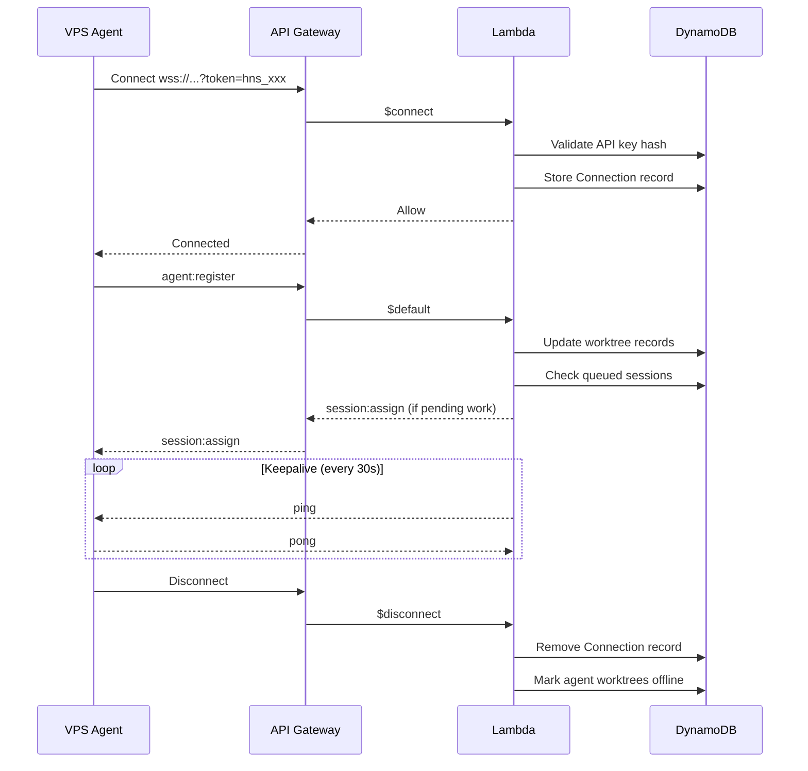

# API Reference

## Overview

The Auto-Auto-Harness API is served via AWS API Gateway with Lambda backends. It consists of two parts:

- **REST API** — CRUD operations for sessions, repositories, service accounts
- **WebSocket API** — Real-time communication between the cloud, VPS agents, and the Web UI

## Authentication

Three authentication methods are supported:

| Method | Format | Used By |
|--------|--------|--------|
| Session cookie | `Cookie: auto_harness_session=<jwt>` | Web UI (after login) |
| Bearer token | `Authorization: Bearer <hns_...>` | Service accounts (API keys) |
| Basic auth | `Authorization: Basic <base64(user:pass)>` | Admin and user accounts (direct API) |

WebSocket connections authenticate via query parameter: `?token=<api-key>` (service accounts only).

See [security.md](security.md) for full details on credential types and the login flow.

Unauthenticated requests receive `401 Unauthorized`.
Insufficient role permissions receive `403 Forbidden`.

---

## REST API

Base path: `/api/v1`

### Error Responses

All errors return a consistent JSON body:

```json
{
  "error": {
    "code": "VALIDATION_ERROR",
    "message": "repositoryId is required"
  }
}
```

| Status | Code | Description |
|--------|------|-------------|
| 400 | `VALIDATION_ERROR` | Invalid or missing request body fields |
| 401 | `UNAUTHORIZED` | Missing or invalid token |
| 403 | `FORBIDDEN` | Insufficient role permissions |
| 404 | `NOT_FOUND` | Resource not found |
| 409 | `CONFLICT` | Resource conflict (e.g. duplicate name) |
| 429 | `RATE_LIMITED` | Too many requests |
| 500 | `INTERNAL_ERROR` | Unexpected server error |

Rate limit headers on all responses:
- `X-RateLimit-Limit`
- `X-RateLimit-Remaining`
- `X-RateLimit-Reset`

---

### Auth — Login

#### `POST /auth/login`

Authenticate as a human user (admin or user account). Returns a session cookie.

**Request:**
```json
{
  "username": "jong",
  "password": "my-password"
}
```

**Response:** `200 OK` + `Set-Cookie: auto_harness_session=<jwt>`
```json
{
  "username": "jong",
  "role": "operator"
}
```

The server checks `HARNESS_ADMINS` env var first, then DynamoDB user records. On success, sets an `HttpOnly`, `Secure`, `SameSite=Strict` session cookie (24h expiry).

#### `POST /auth/logout`

Clear the session cookie.

**Response:** `200 OK` + `Set-Cookie: auto_harness_session=; Max-Age=0`

#### `GET /auth/me`

Get the current authenticated user's info.

**Response:** `200 OK`
```json
{
  "username": "jong",
  "role": "operator",
  "type": "user"
}
```

The `type` field is `admin` (env var), `user` (DynamoDB), or `service-account`.

#### `PUT /auth/password`

Change the current user's password. Not available for admin accounts (rotate via env var) or service accounts.

**Request:**
```json
{
  "currentPassword": "old-password",
  "newPassword": "new-password"
}
```

**Response:** `200 OK`

---

### Auth — User Accounts

#### `POST /auth/users`

Create a user account. **Admin only.**

**Request:**
```json
{
  "username": "jong",
  "password": "initial-password",
  "role": "operator"
}
```

**Response:** `201 Created`
```json
{
  "id": "usr-e5f6g7h8",
  "username": "jong",
  "role": "operator",
  "createdAt": "2026-08-01T00:00:00Z"
}
```

#### `GET /auth/users`

List all user accounts. **Admin only.**

#### `DELETE /auth/users/:id`

Delete a user account. **Admin only.**

**Response:** `204 No Content`

---

### Auth — Service Accounts

#### `POST /auth/service-accounts`

Create a service account. **Admin only.**

**Request:**
```json
{
  "name": "ci-frontend",
  "role": "operator",
  "allowedRepositories": ["repo-abc"],
  "boundAgentId": "vps-prod-1"
}
```

| Field | Type | Required | Description |
|-------|------|----------|-------------|
| `name` | string | ✓ | Human-readable name |
| `role` | string | ✓ | `read-only`, `operator`, or `admin` |
| `allowedRepositories` | string[] | ✗ | Restrict to specific repos. Default: all repos. |
| `boundAgentId` | string | ✗ | Required for agent service accounts. Binds this key to a specific agent identity (see [security.md](security.md#agent-binding)). |

**Response:** `201 Created`
```json
{
  "id": "sa-a1b2c3d4",
  "name": "ci-frontend",
  "role": "operator",
  "allowedRepositories": ["repo-abc"],
  "apiKey": "hns_k8f2m9x...",
  "createdAt": "2026-08-01T00:00:00Z"
}
```

> **Note:** The `apiKey` is returned only once. Store it securely.

#### `GET /auth/service-accounts`

List all service accounts. **Admin only.**

**Response:** `200 OK`
```json
{
  "items": [
    {
      "id": "sa-a1b2c3d4",
      "name": "ci-frontend",
      "role": "operator",
      "allowedRepositories": ["repo-abc"],
      "createdAt": "2026-08-01T00:00:00Z"
    }
  ]
}
```

#### `DELETE /auth/service-accounts/:id`

Delete a service account and revoke its API key. **Admin only.**

**Response:** `204 No Content`

---

### Repositories

#### `POST /repositories`

Add a repository. **Admin only.**

**Request:**
```json
{
  "name": "my-app",
  "url": "git@github.com:org/my-app.git",
  "defaultBranch": "main",
  "setupScript": "pnpm install"
}
```

**Response:** `201 Created`
```json
{
  "id": "repo-abc",
  "name": "my-app",
  "url": "git@github.com:org/my-app.git",
  "defaultBranch": "main",
  "setupScript": "pnpm install",
  "createdAt": "2026-08-01T00:00:00Z"
}
```

#### `GET /repositories`

List all repositories.

**Response:** `200 OK`
```json
{
  "items": [
    {
      "id": "repo-abc",
      "name": "my-app",
      "url": "git@github.com:org/my-app.git",
      "defaultBranch": "main",
      "createdAt": "2026-08-01T00:00:00Z"
    }
  ]
}
```

#### `GET /repositories/:id`

Get repository details.

#### `PUT /repositories/:id`

Update a repository. **Admin only.**

#### `DELETE /repositories/:id`

Delete a repository. **Admin only.** Fails if there are active sessions for this repository.

---

### Sessions

#### `POST /sessions`

Create a new session. This is the main endpoint for triggering AI work. **Operator or admin.**

**Request:**
```json
{
  "repositoryId": "repo-abc",
  "prompt": "Fix the failing test in src/utils.test.ts",
  "command": "codex -p",
  "timeout": 1800,
  "priority": 10,
  "requiredLabels": ["codex"],
  "source": "ui"
}
```

| Field | Type | Required | Description |
|-------|------|----------|-------------|
| `repositoryId` | string | ✓ | Target repository |
| `prompt` | string | ✓ | The prompt/instruction for the AI agent |
| `command` | string | ✓ | CLI command to execute, e.g. `codex -p`, `claude --print` |
| `timeout` | number | ✓ | Max session duration in seconds. The agent kills the process after this time. |
| `priority` | number | ✗ | Higher = more urgent. Default: `0` |
| `requiredLabels` | string[] | ✗ | Worktree labels required. Default: `[]` (any worktree) |
| `source` | string | ✗ | Origin of the session: `api`, `ui`, `webhook`, `schedule`. Default: `api` |
| `type` | string | ✗ | Session type: `prompt` (runs in worktree) or `scheduled` (runs on main checkout). Default: `prompt` |

> **Note:** The Web UI uses this same endpoint to create sessions directly from the browser. The UI provides a form with repo selection, prompt text area, command/agent type picker, timeout, priority slider, and label selection.

**Response:** `201 Created`
```json
{
  "id": "sess-x1y2z3",
  "repositoryId": "repo-abc",
  "prompt": "Fix the failing test in src/utils.test.ts",
  "command": "codex -p",
  "status": "queued",
  "timeout": 1800,
  "priority": 10,
  "requiredLabels": ["codex"],
  "source": "ui",
  "type": "prompt",
  "createdAt": "2026-08-01T12:00:00Z"
}
```

The session enters the `queued` state. The scheduler will assign it to an available worktree matching the required labels. If none are available, it remains queued.

If the session exceeds `timeout` seconds while running, the agent kills the process and the status becomes `timed_out`.

#### `GET /sessions`

List sessions with optional filters.

**Query parameters:**

| Param | Type | Description |
|-------|------|-------------|
| `status` | string | Filter by status: `queued`, `running`, `completed`, `failed`, `cancelled`, `timed_out` |
| `repositoryId` | string | Filter by repository |
| `search` | string | Full-text search across session prompts |
| `sort` | string | Sort order: `latest` (default), `oldest`, `priority_desc`, `priority_asc` |
| `limit` | number | Max results (default: 50, max: 100) |
| `cursor` | string | Pagination cursor from previous response |

**Response:** `200 OK`
```json
{
  "items": [...],
  "nextCursor": "eyJ..."
}
```

#### `GET /sessions/:id`

Get session details.

**Response:** `200 OK`
```json
{
  "id": "sess-x1y2z3",
  "repositoryId": "repo-abc",
  "worktreeId": "wt-1",
  "userId": "sa-a1b2c3d4",
  "prompt": "Fix the failing test in src/utils.test.ts",
  "command": "codex -p",
  "status": "running",
  "type": "prompt",
  "source": "ui",
  "timeout": 1800,
  "priority": 10,
  "requiredLabels": ["codex"],
  "exitCode": null,
  "createdAt": "2026-08-01T12:00:00Z",
  "startedAt": "2026-08-01T12:00:05Z",
  "completedAt": null
}
```

#### `POST /sessions/:id/clone`

Clone a session — creates a new session with the same prompt, command, timeout, priority, and labels. The new session is queued immediately. **Operator or admin.**

Optional request body to override fields:
```json
{
  "prompt": "Updated prompt text",
  "priority": 20
}
```

**Response:** `201 Created` (same schema as `POST /sessions` response)

#### `POST /sessions/:id/cancel`

Cancel a queued or running session. **Operator (own sessions) or admin.**

**Response:** `200 OK`
```json
{
  "id": "sess-x1y2z3",
  "status": "cancelled"
}
```

#### `GET /sessions/:id/logs`

Get **historical** session logs. For live streaming of in-progress sessions, use the WebSocket API (see [Live Session Viewing](#live-session-viewing) below).

**Query parameters:**

| Param | Type | Description |
|-------|------|-------------|
| `stream` | string | Filter by stream: `stdout`, `stderr`, `system` |
| `since` | string | ISO 8601 timestamp — return logs after this time |
| `limit` | number | Max log entries (default: 1000) |

**Response:** `200 OK`
```json
{
  "items": [
    {
      "timestamp": "2026-08-01T12:00:06Z",
      "stream": "stdout",
      "content": "Analyzing codebase..."
    },
    {
      "timestamp": "2026-08-01T12:00:08Z",
      "stream": "stdout",
      "content": "Found 3 failing tests. Applying fix..."
    }
  ]
}
```

---

### Worktrees

#### `GET /worktrees`

List all worktrees across all connected agents.

**Response:** `200 OK`
```json
{
  "items": [
    {
      "id": "wt-1",
      "agentId": "vps-prod-1",
      "repositoryId": "repo-abc",
      "path": "/home/harness/repos/my-app/.worktrees/wt-1",
      "labels": ["codex", "claude"],
      "status": "idle",
      "currentSessionId": null
    }
  ]
}
```

#### `GET /worktrees/:id`

Get worktree details.

---

### Schedules

Schedules run recurring maintenance tasks on the main repository checkout (not worktrees). Useful for dependency updates, linting, formatting, and other automated maintenance.

#### `POST /schedules`

Create a scheduled task. **Operator or admin.**

**Request:**
```json
{
  "repositoryId": "repo-abc",
  "name": "daily-update",
  "command": "git pull && pnpm install && pnpm lint:fix",
  "cron": "0 6 * * *",
  "enabled": true
}
```

| Field | Type | Required | Description |
|-------|------|----------|-------------|
| `repositoryId` | string | ✓ | Target repository |
| `name` | string | ✓ | Human-readable name for the schedule |
| `command` | string | ✓ | Shell command to execute on the main checkout |
| `cron` | string | ✓ | Cron expression (5-field) |
| `timeout` | number | ✗ | Max duration in seconds. Default: `3600` (1 hour) |
| `enabled` | boolean | ✗ | Default: `true` |

**Response:** `201 Created`
```json
{
  "id": "sched-m1n2o3",
  "repositoryId": "repo-abc",
  "name": "daily-update",
  "command": "git pull && pnpm install && pnpm lint:fix",
  "cron": "0 6 * * *",
  "enabled": true,
  "lastRunAt": null,
  "nextRunAt": "2026-08-02T06:00:00Z",
  "createdAt": "2026-08-01T12:00:00Z"
}
```

#### `GET /schedules`

List schedules. Filter by `repositoryId`.

#### `GET /schedules/:id`

Get schedule details including last run status.

#### `PUT /schedules/:id`

Update a schedule. **Operator or admin.**

#### `DELETE /schedules/:id`

Delete a schedule. **Admin only.**

#### `POST /schedules/:id/trigger`

Manually trigger a schedule immediately. Creates a session with `type: 'scheduled'` and `source: 'schedule'`. **Operator or admin.**

**Response:** `201 Created`
```json
{
  "sessionId": "sess-t1r2g3",
  "scheduleId": "sched-m1n2o3",
  "status": "queued"
}
```

---

### Agents

#### `GET /agents`

List connected agents and their status.

**Response:** `200 OK`
```json
{
  "items": [
    {
      "id": "vps-prod-1",
      "status": "connected",
      "worktreeCount": 4,
      "busyWorktrees": 2,
      "connectedAt": "2026-08-01T08:00:00Z"
    }
  ]
}
```

#### `GET /agents/:id`

Get agent details including worktrees and current sessions.

---

## WebSocket API

**Endpoint:** `wss://<api-domain>/ws?token=<api-key>`

All messages are JSON with a `type` field. Connection types are distinguished by the first message sent after connect.

### Agent ↔ Server

#### Server → Agent

| Type | Description | Payload |
|------|-------------|---------|
| `session:assign` | Assign a session to the agent | `{ sessionId, repositoryId, prompt, command, timeout, worktreeId, setupScript }` |
| `session:cancel` | Cancel a running session | `{ sessionId }` |
| `ping` | Keepalive | `{}` |

**Example — session:assign:**
```json
{
  "type": "session:assign",
  "sessionId": "sess-x1y2z3",
  "repositoryId": "repo-abc",
  "prompt": "Fix the failing test in src/utils.test.ts",
  "command": "codex -p",
  "timeout": 1800,
  "worktreeId": "wt-1",
  "setupScript": "git fetch && git reset --hard origin/main && pnpm install"
}
```

#### Agent → Server

| Type | Description | Payload |
|------|-------------|---------|
| `agent:register` | Register agent on connect | `{ agentId, worktrees: [{ id, repositoryId, labels[], status }] }` |
| `session:ack` | Acknowledge session assignment | `{ sessionId }` |
| `session:status` | Status update | `{ sessionId, status, exitCode? }` |
| `session:log` | Log output chunk | `{ sessionId, stream, content, timestamp }` |
| `worktree:status` | Worktree status change | `{ worktreeId, status }` |
| `pong` | Keepalive response | `{}` |

**Example — session:log:**
```json
{
  "type": "session:log",
  "sessionId": "sess-x1y2z3",
  "stream": "stdout",
  "content": "Analyzing codebase...\n",
  "timestamp": "2026-08-01T12:00:06.123Z"
}
```

### Client ↔ Server (Web UI)

#### Client → Server

| Type | Description | Payload |
|------|-------------|---------|
| `client:register` | Identify as a UI client | `{ userId }` |
| `session:subscribe` | Subscribe to live session updates | `{ sessionId }` |
| `session:unsubscribe` | Unsubscribe from session updates | `{ sessionId }` |

#### Server → Client

| Type | Description | Payload |
|------|-------------|---------|
| `session:log` | Forwarded log chunk | `{ sessionId, stream, content, timestamp }` |
| `session:status` | Session status update | `{ sessionId, status, exitCode? }` |
| `agent:status` | Agent connected/disconnected | `{ agentId, status }` |

### Live Session Viewing

The WebSocket API provides real-time log streaming for in-progress sessions. This powers the live terminal view in the Web UI.

**Flow:**

1. Client connects via WebSocket and sends `client:register`
2. Client sends `{ type: 'session:subscribe', sessionId: 'sess-x1y2z3' }`
3. Server immediately replays the **last 100 log lines** (buffered) so the client catches up
4. Server forwards all new `session:log` messages in real-time as the agent streams them
5. Server sends `session:status` when the session status changes (running → completed/failed)
6. Client sends `session:unsubscribe` when leaving the page, or the subscription ends automatically on disconnect

**Notes:**
- Multiple clients can subscribe to the same session simultaneously
- The Web UI combines REST `GET /sessions/:id/logs` for full history with WebSocket for live tail
- Log chunks are delivered in order per stream (stdout, stderr) but may interleave between streams
- The replay buffer ensures clients joining mid-session see recent context immediately

### Connection Lifecycle


