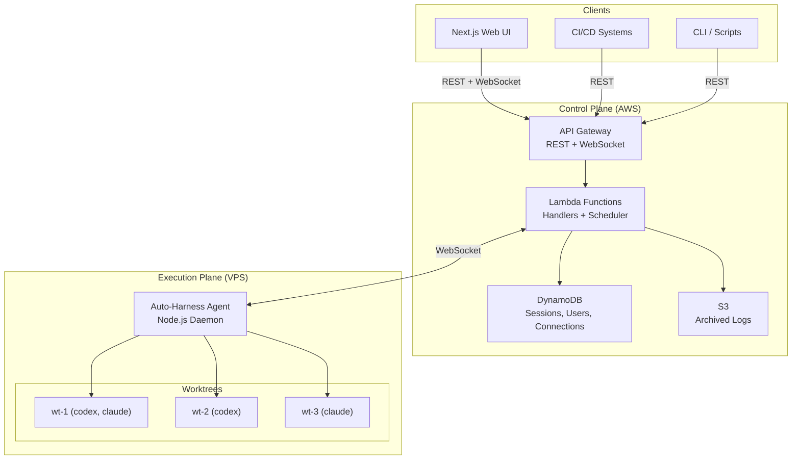
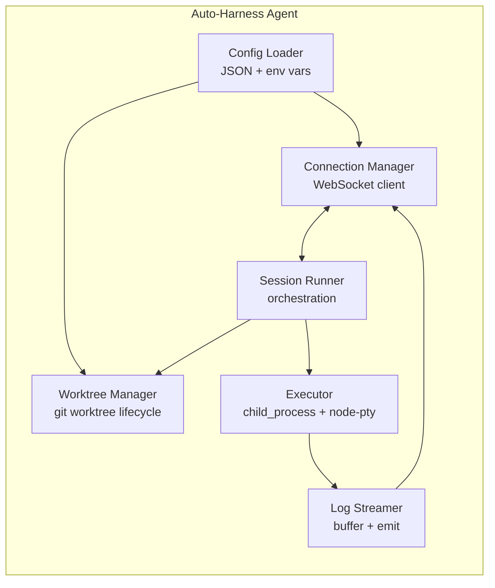
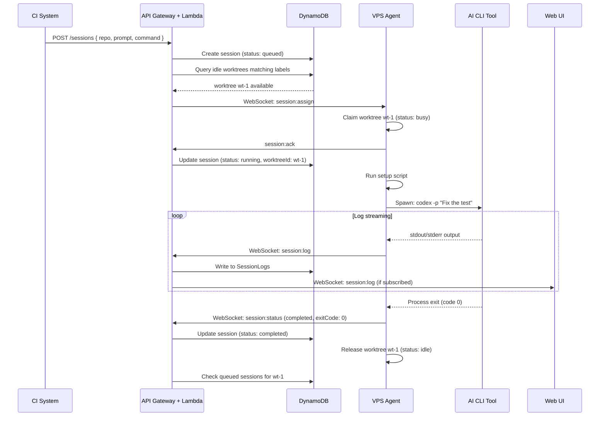
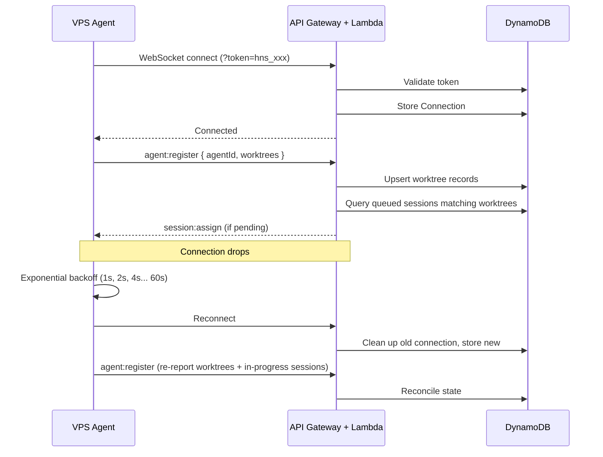
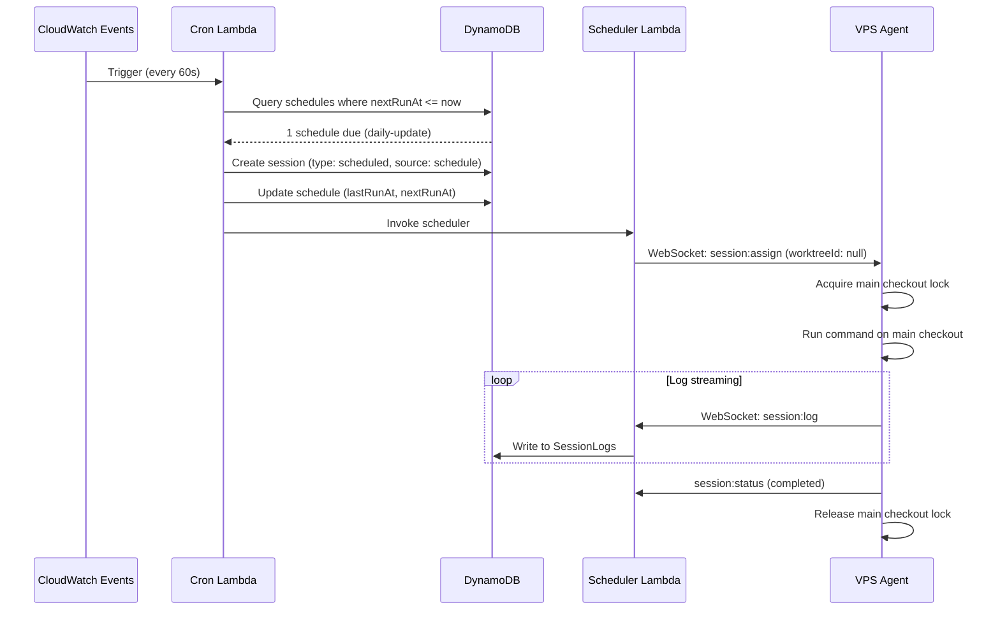

# Architecture

## System Overview

Auto-Harness operates on two planes:

- **Control Plane** (AWS) — API Gateway, Lambda, DynamoDB, S3. Handles API requests, session scheduling, WebSocket management, and log storage.
- **Execution Plane** (VPS) — Node.js agent daemon. Manages git worktrees, spawns AI CLI tools as child processes, streams output back to the control plane.

## Component Design

### API Gateway

Two API types on a single gateway:

| API | Protocol | Purpose |
|-----|----------|---------|
| REST | HTTPS | CRUD operations — sessions, repos, auth |
| WebSocket | WSS | Real-time — agent communication, live log streaming to UI |

The WebSocket API handles two connection types:
- **Agent connections** — VPS agents that execute sessions
- **Client connections** — Web UI browsers that subscribe to live updates

Both authenticate via token but are distinguished by the first message sent (`agent:register` vs `client:register`).

### Lambda Functions

Organized as individual handlers, bundled per route:

| Handler Group | Routes | Responsibility |
|---------------|--------|----------------|
| Auth | `POST/GET/DELETE /auth/service-accounts` | Service account CRUD |
| Sessions | `POST/GET /sessions`, `POST /sessions/:id/cancel` | Session lifecycle |
| Repositories | `CRUD /repositories` | Repository management |
| Worktrees | `GET /worktrees` | Worktree read access |
| Agents | `GET /agents` | Agent status |
| Schedules | `CRUD /schedules`, `POST /schedules/:id/trigger` | Scheduled task management |
| Cron Evaluator | CloudWatch Events (1-min interval) | Evaluate due schedules, create sessions |
| WS Connect | `$connect` | Validate token, store connection |
| WS Disconnect | `$disconnect` | Clean up connection, mark worktrees offline |
| WS Message | `$default` | Route by message `type` field |
| Scheduler | (Internal) | Match queued sessions to available worktrees |

**Scheduler logic:**
1. On session creation: query available worktrees matching `requiredLabels`
2. If a matching idle worktree exists: push `session:assign` via WebSocket
3. If none available: session remains `queued` in DynamoDB
4. On worktree becoming idle: query highest-priority queued session matching its labels
5. Priority ties broken by `createdAt` (FIFO)

**Cron evaluator logic:**
1. Triggered by CloudWatch Events every 60 seconds
2. Queries Schedules table for records where `nextRunAt <= now` and `enabled: true`
3. Creates a session with `type: 'scheduled'`, `source: 'schedule'` for each due schedule
4. Scheduled sessions run on the main repository checkout (not worktrees)
5. Updates `lastRunAt` and computes the next `nextRunAt` from the cron expression

### DynamoDB Tables

| Table | PK | SK | GSIs | Description |
|-------|----|----|------|-------------|
| Users | `id` | — | `apiKeyHash` (auth lookups), `username` (login lookups) | User and service accounts |
| Repositories | `id` | — | — | Repository configuration |
| Sessions | `id` | — | `status-createdAt` (queue queries), `repositoryId-createdAt` | Session records |
| Schedules | `id` | — | `repositoryId-nextRunAt` (cron queries) | Scheduled maintenance tasks |
| SessionLogs | `sessionId` | `timestamp` | — | Append-only log entries (TTL-enabled) |
| Connections | `connectionId` | — | `agentId` (find agent's connection) | Active WebSocket connections |
| AuditLogs | `id` | `timestamp` | `userId-timestamp` | Mutating operation audit trail |
| Integrations | `id` | — | — | Integration configs (Slack, etc.) |

**Capacity mode:** On-demand (pay-per-request) for all tables. Switch to provisioned with auto-scaling if costs warrant it.

**SessionLogs TTL:**
The SessionLogs table has DynamoDB TTL enabled on the `ttl` attribute. Each log entry is written with a TTL of **7 days** from creation. After 7 days, DynamoDB automatically deletes the entry at no cost. Before TTL expiry, completed session logs are archived to S3 (see below). This ensures:
- DynamoDB storage stays small (only recent/active session logs)
- Costs don't grow unboundedly with session volume
- Archived logs remain accessible in S3 indefinitely

### S3

- Single bucket: `auto-harness-archives-{account-id}`
- Path structure: `sessions/{sessionId}/logs.jsonl`
- Completed sessions are archived from DynamoDB → S3, then DynamoDB log entries are deleted
- Lifecycle policy: transition to Infrequent Access after 30 days, Glacier after 90 days

### VPS Agent

A long-running Node.js process with these internal components:

| Component | Responsibility |
|-----------|----------------|
| Connection Manager | WebSocket client with auto-reconnect (exponential backoff, max 60s). Sends/receives typed messages. |
| Config Loader | Reads `auto-harness-agent.config.json` and env vars. Validates configuration on startup. |
| Worktree Manager | Creates worktrees on startup if missing (`git worktree add`). Tracks status (idle/busy/error). Handles claim/release. |
| Session Runner | Orchestrates a session: claim worktree → run setup script → spawn command → monitor → report. |
| Executor | Wraps `child_process.spawn` with `node-pty` for PTY emulation. Handles process signals, exit codes, timeouts. |
| Log Streamer | Buffers stdout/stderr chunks, adds timestamps, emits via WebSocket. Rate-limits to avoid flooding. |

**Concurrency** = number of configured worktrees. Each worktree runs at most one session at a time.

### Next.js Web UI

Server-side rendered React application.

| Page | Purpose |
|------|---------|
| Dashboard | Active sessions, queue depth, connected agents, worktree utilization. "New Session" button opens prompt form. |
| Sessions | List with filters (status, repo, agent, source), create new, live detail view |
| Session Detail | Terminal-like log viewer (xterm.js) connected via WebSocket for real-time output. On page load, fetches historical logs via REST then switches to WebSocket for live tail. |
| Schedules | Create/edit/delete scheduled tasks, view run history, manual trigger |
| Repositories | Add, edit, remove repositories |
| Settings | Service accounts, API keys |

The **New Session form** allows users to create sessions directly from the browser with: repository selector, prompt textarea, agent/command picker (codex, claude, etc.), timeout (required), priority slider, and optional label filters. Submits via `POST /sessions` with `source: 'ui'`.

The UI connects to the REST API for CRUD and opens a WebSocket for live session log streaming.

---

## Data Flows

### Creating and Running a Session

### Agent Connection and Recovery

### Running a Scheduled Update

---

## Key Design Decisions

| Decision | Rationale |
|----------|-----------|
| WebSocket over polling | Lower latency for task dispatch and log streaming. Real-time UI updates. |
| Worktree reuse over create/delete | Faster session startup. Avoids repeated git clone overhead. Setup scripts handle branch reset. |
| Labels on worktrees | Enables routing Codex sessions to Codex-configured worktrees, Claude to Claude worktrees. Similar to GitHub Actions runner labels. |
| No Docker for agent | The VPS is a trusted environment. Docker is available for AI agents to use within repos for development tasks. |
| PTY emulation (node-pty) | Some AI CLIs (Codex, Claude Code) require a TTY for proper interactive output. |
| Priority queue | CI failure fixes can jump ahead of lower-priority prompt-based sessions. |
| DynamoDB on-demand | Simplifies capacity management for unpredictable workloads. Sessions can be bursty. |
| Separate admin token from service account keys | Admin token is a simple bootstrap mechanism (env var). Service accounts are trackable, scopeable, revocable. |
| Non-worktree scheduled sessions | Maintenance tasks (deps, lint) run on main checkout to avoid wasting worktree slots. Serial per-repo locking prevents conflicts. |
| xterm.js for live logs | Full terminal emulation renders ANSI colors, progress bars, and interactive output from AI CLIs correctly. |
| Session source tracking | Distinguishes `api`, `ui`, `webhook`, `schedule` origins for audit and filtering. |
