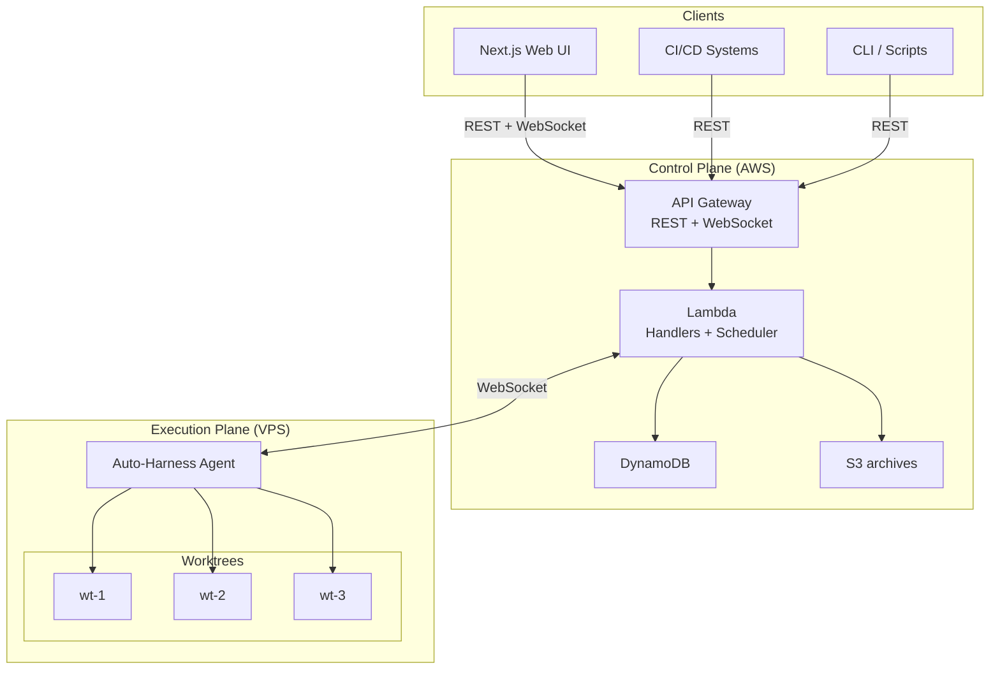
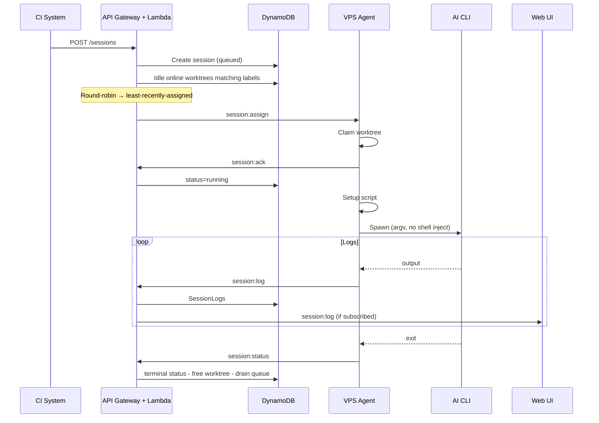
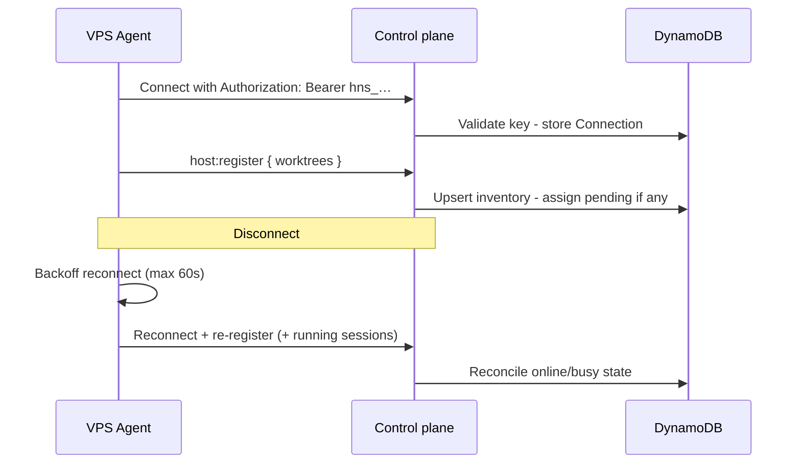
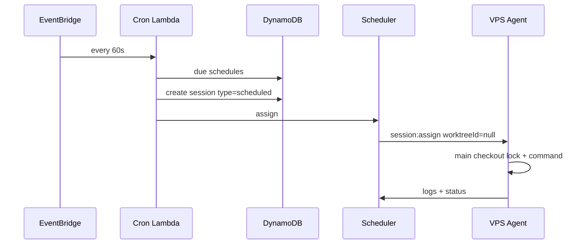

# Architecture

## System Overview

Auto-Harness is designed around two planes:

| Plane               | Where                                                        | Doc                                  |
| ------------------- | ------------------------------------------------------------ | ------------------------------------ |
| **Control plane**   | Target: AWS — API Gateway, Lambda, DynamoDB, S3, EventBridge | **[aws.md](aws.md)**                 |
| **Execution plane** | VPS — Node.js agent, git worktrees, AI CLIs                  | **[host-daemon.md](host-daemon.md)** |

> **Maturity:** the control-plane and daemon behavior is implemented and exercised locally with
> DynamoDB Local and local WebSockets. The AWS deploy, update, REST health, and teardown lifecycle
> has also passed an account-backed proof. The diagrams below describe the deployable cloud
> topology; no permanent production environment is implied by that disposable proof.

**Synthesized runtime split of responsibility:**

- **AWS** authenticates callers, stores sessions, runs the queue, assigns work (label match + round-robin), fans out logs, archives data, evaluates cron.
- **Agent** maintains workspaces, spawns processes, streams output, holds secrets (git + AI keys).

Today, those control-plane behaviors run in the local API. Durable session-log archival writes
JSONL through an injected S3 adapter when `ARCHIVE_BUCKET` is configured and retains archive
metadata in DynamoDB. That metadata contains only bounded pointer/retry state, never the log body;
pending first-time uploads are retried idempotently at the same object key. Complete metadata with
a stored object version is not discarded until a replacement version is committed. A legacy complete
row with no `versionId` remains on the pending retry path if a later upload fails. Authorized
session reads use a durable metadata point lookup, verify the canonical S3 object's expected
bytes and content type, and mint a short-lived direct download. The private lifecycle-managed bucket
grants writes only to REST/Cron and reads only to REST; WebSocket has neither permission.

Deep dives live in the layer docs above; this page keeps cross-plane flows and design decisions only.

---

## Architecture principles

These principles govern implementation choices across both planes. AWS service choices and vendor
capabilities are constraints or implementation decisions; they may change without changing these
rules.

1. **Each fact has one authoritative owner.** The control plane owns admission, desired work, and
   leases. Hosts report process and filesystem facts. Lambda memory is only a request-local cache
   and never determines correctness.
2. **An acknowledgement names one durable fact.** Accepted, assigned, running, finished, and
   transcript archived are separate facts. A successful socket write proves none of them.
3. **Commit intent before external effects.** Persist commands and notification jobs atomically
   with the state change that created them. Delivery retries independently.
4. **Assume duplicate delivery and uncertain execution.** Fence messages by attempt identity and
   make processing idempotent. After ambiguous host loss, require an explicit retry; do not promise
   exactly-once effects in GitHub or another external system.
   The one automatic infrastructure retry is limited to a checkout-fetch failure whose reporting
   attempt proves its terminal hook was deferred, or a host loss proven to precede the v4
   command-start acknowledgement; post-launch and ambiguous loss is terminal (D10). Before
   command authorization, a terminal hook is deferred until the control
   plane durably decides the attempt's disposition, so a lost status cannot replay an already-run
   escalation hook.
5. **Operational work scales with active work and new bytes.** Heartbeats, scheduling, recovery,
   and log reads use bounded access paths. Retaining more terminal history must not increase their
   routine cost.
6. **Match storage to purpose.** DynamoDB owns compact coordination records and temporary packed-log
   staging. S3 owns verified transcript history. Large prompts and frozen command snapshots stay
   outside frequently updated lease records.
7. **Observability cannot interfere with execution.** Browser and notification delivery may fall
   behind without delaying host ingestion, assignment, cancellation, or terminal reports.
8. **Retention and completeness are product contracts.** Archived means the expected bytes were
   verified and an authorized reader can retrieve them. Truncated, incomplete, unavailable, and
   expired are distinct visible states.

---

## Layer Map

| Topic                  | AWS layer                                                                                      | Agent layer                                                                                  |
| ---------------------- | ---------------------------------------------------------------------------------------------- | -------------------------------------------------------------------------------------------- |
| Public API & auth      | [api.md](api.md), [websocket.md](websocket.md), [auth.md](auth.md), [security.md](security.md) | API key over WSS ([cli.md](cli.md) / [local-development.md](local-development.md))           |
| Session queue / assign | Scheduler + round-robin                                                                        | Accepts `session:assign` only                                                                |
| Worktrees              | DynamoDB inventory + online flags                                                              | Create/claim/release on disk                                                                 |
| Workspace pools/slots  | Pool/profile records + host path-only attachments                                              | Claim/release host-local non-git directories; realpath under `allowedRoots`                  |
| Logs                   | SessionLogs + UI fan-out + optional S3 JSONL writes; DynamoDB Archives stores bounded metadata | Current: assigned-command PTY + pipe-based setup/hooks, each `session:log`; target: batching |
| Schedules              | EventBridge cron → sessions                                                                    | Main-checkout lock + run command                                                             |
| Secrets                | No repo/AI secrets                                                                             | `.env`, SSH, vendor keys                                                                     |
| UI                     | Hosted clients → REST/WS                                                                       | —                                                                                            |

Web UI feature surface: [web.md](web.md).

---

## Data Flows

### Creating and running a session

Details: [aws.md — Scheduler](aws.md#scheduler), [host-daemon.md — Session lifecycle](host-daemon.md#session-lifecycle-agent-view).

### Agent connection and recovery

Details: [aws.md — Disconnect](aws.md#disconnect-handling), [host-daemon.md — Recovery](host-daemon.md#disconnect-and-crash-recovery).

### Scheduled update

Dispatch is capability-gated: only agents advertising
`scheduled-main-checkout` are eligible. This permits the daemon support to roll
out before the scheduler begins emitting null-worktree assignments.

Details: [aws.md — Cron](aws.md#cron-evaluator), [host-daemon.md — Non-worktree](host-daemon.md#non-worktree-sessions-scheduled).

### Workspace session

Workspace sessions use `repositoryId: null` and select a `workspacePoolId`; placement chooses an
idle slot on a host advertising `workspace-sessions`. The daemon skips Git checkout and worktree
label matching, runs host setup followed by the selected trusted setup profile, and optionally
cleans the slot when the session ends. `ref`, non-empty `requiredLabels`, and raw setup scripts are
invalid; workspace sessions are fresh-only (no resume) but support clone. Missing or unsafe paths
are rejected by the existing non-empty `allowedRoots` realpath check. Slot cleanup failures are
reported as `workspace_cleanup_failed` and quarantine the slot until it is safe to reuse.

---

## Key Design Decisions

| Decision                                     | Rationale                                                                                                                                                                                                                                                                                             |
| -------------------------------------------- | ----------------------------------------------------------------------------------------------------------------------------------------------------------------------------------------------------------------------------------------------------------------------------------------------------- |
| Two-plane split                              | Cloud stays secret-light and elastic; heavy/untrusted execution stays on your VPS                                                                                                                                                                                                                     |
| WebSocket over polling                       | Low-latency assign + log streaming                                                                                                                                                                                                                                                                    |
| Worktree reuse                               | Fast start; daemon checkout resets tracked state while preserving unrelated untracked paths, then setup scripts apply repository-specific preparation                                                                                                                                                 |
| Labels on worktrees                          | Route Codex vs Claude (etc.) like Actions runners                                                                                                                                                                                                                                                     |
| Match then round-robin                       | Filter repo/labels/online idle worktrees, then least-recently-assigned                                                                                                                                                                                                                                |
| No Docker wrapping the agent                 | Trusted host; Docker optional inside repos                                                                                                                                                                                                                                                            |
| PTY (`@replit/ruspty`, POSIX only) — current | Assigned AI CLIs run in a fixed 120x40 terminal; git, setup scripts, and hooks remain pipe-based                                                                                                                                                                                                      |
| Prompt as argv/stdin, not shell string       | Avoid injection from untrusted prompts                                                                                                                                                                                                                                                                |
| Priority queue + FIFO ties                   | CI fixes can preempt batch work                                                                                                                                                                                                                                                                       |
| DynamoDB on-demand                           | Bursty session traffic                                                                                                                                                                                                                                                                                |
| Scheduled on main checkout                   | Maintenance without burning worktree slots; serial per repo                                                                                                                                                                                                                                           |
| Host-scoped workspace pools                  | Non-git research/data/orchestration runs use pre-provisioned host directories, with the same realpath trust boundary as repository paths and explicit capability gating                                                                                                                               |
| Session log viewer — current                 | Readable wrapping log document by default (pretty JSONL, type labels, `#L<n>` links); optional xterm.js 120×40 raw replay for ANSI/cursor-addressed PTY output                                                                                                                                        |
| Session `source`                             | Audit and filter by api / ui / webhook / schedule                                                                                                                                                                                                                                                     |
| Agent auto-update drains                     | Signed-manifest orchestration drains, waits, verifies, stages, activates, restarts the supervisor, and rolls back on failure; HTTPS fetch/install/supervisor adapters run when update env is set, and the manual runbook remains available                                                            |
| Principal session drains                     | A durable DynamoDB `CURRENT` fence plus retained operation rows atomically blocks creation/assignment for one authenticated principal and repository while the scheduler cancels and reconciles only that scope                                                                                       |
| Usage limits: account cooldown + fallback    | Validate a provider-aware CLI adapter's structured quota/rate-limit signal, report `usage_limit`, pause the assigned account globally (5h default/configurable), and route the queued session to the next eligible account or explicit fallback; providerless and non-structured commands are ungated |
| Bounded infrastructure retry                 | Retry one checkout-stage fetch failure or pre-launch host loss with a fresh attempt fence while preserving the logical session, concurrency lock, and queue deadline; a second eligible failure is terminal (D10)                                                                                     |
| Session resume prefers native placement      | Resume by session id → pin the source agent, re-check out the ref in any eligible worktree there, and use the native CLI ref; if unschedulable, clear pin/ref and route fresh through target/fallback order                                                                                           |
| Subscriptions via non-interactive CLI        | Cost path is vendor seats/quota, not API metering; drive CLIs headlessly ([why.md](why.md), [costs.md](costs.md))                                                                                                                                                                                     |
| Native harness invocation                    | Spawn each vendor's own CLI directly—no intermediary Agent SDK, no universal harness. That interface is what every vendor ships and supports for unattended use, and stays stable across whatever a vendor's SDK/subscription licensing does next ([why.md](why.md))                                  |
| Repo harness fire-and-forget                 | Callers (e.g. GHA) only `POST /sessions`; GitHub carries agent-authored feedback and configured Slack installations receive lifecycle delivery through durable `NotificationDeliveries` when the outbound worker is available ([harness.md](harness.md))                                              |

---

## Related documents

| Doc                                          | Role                     |
| -------------------------------------------- | ------------------------ |
| [why.md](why.md)                             | Product rationale        |
| [costs.md](costs.md)                         | Subscription vs AWS cost |
| [setup.md](setup.md)                         | Install / AWS / VPS      |
| [local-development.md](local-development.md) | Local stack              |
| [api.md](api.md)                             | REST                     |
| [websocket.md](websocket.md)                 | Real-time protocol       |
| [cli.md](cli.md)                             | Agent CLI                |
| [aws.md](aws.md)                             | Control plane            |
| [host-daemon.md](host-daemon.md)             | Execution plane          |
| [plan.md](plan.md)                           | Phases + data model      |
| [auth.md](auth.md)                           | Credentials / roles      |
| [security.md](security.md)                   | Trust boundaries         |
| [web.md](web.md)                             | UI                       |
| [integrations.md](integrations.md)           | Slack                    |
| [comparison.md](comparison.md)               | Vs. background-agents    |
