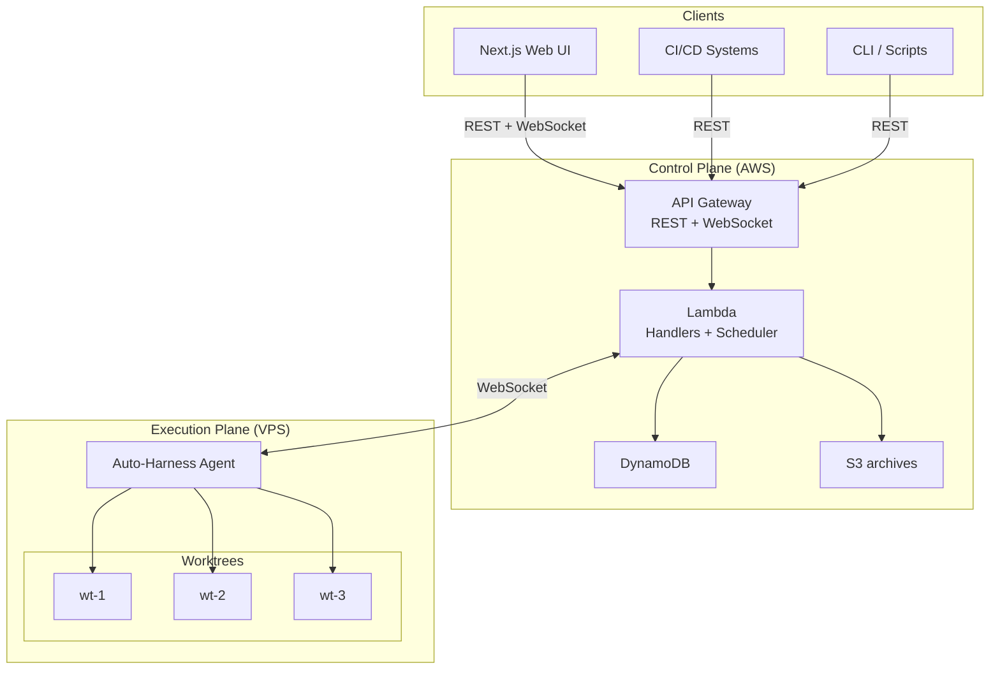
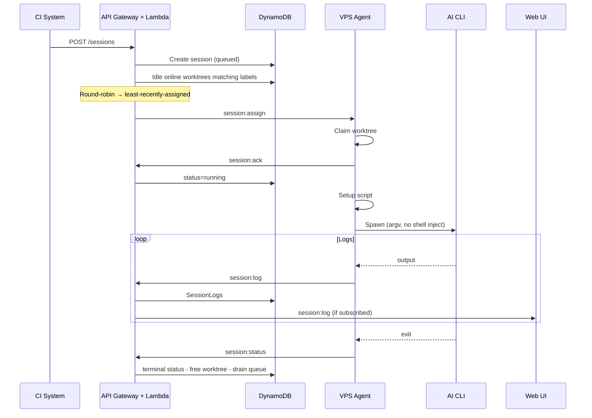
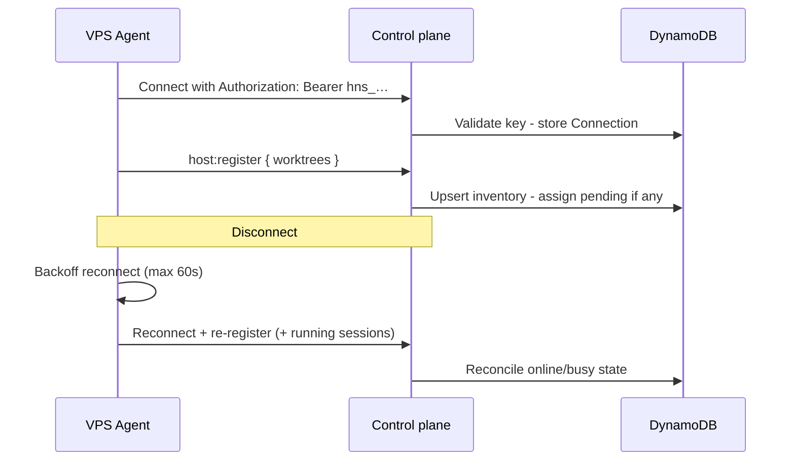
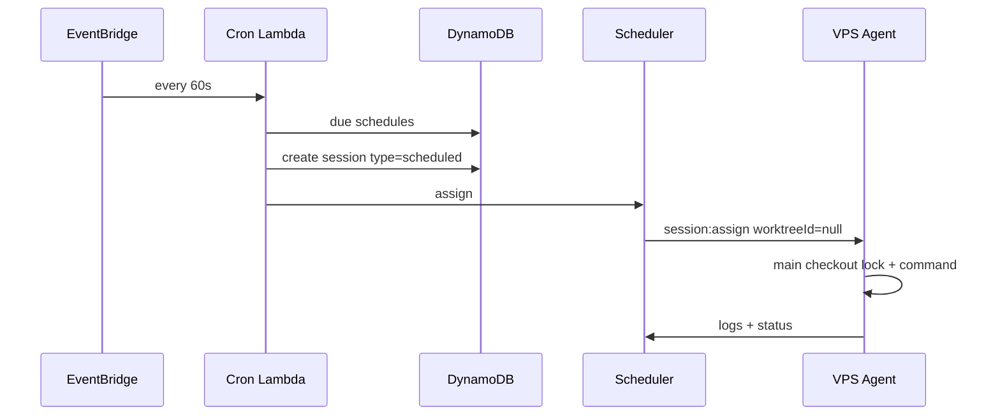

# Architecture

## System Overview

Auto-Harness is designed around two planes:

| Plane               | Where                                                        | Doc                                  |
| ------------------- | ------------------------------------------------------------ | ------------------------------------ |
| **Control plane**   | Target: AWS — API Gateway, Lambda, DynamoDB, S3, EventBridge | **[aws.md](aws.md)**                 |
| **Execution plane** | VPS — Node.js agent, git worktrees, AI CLIs                  | **[host-daemon.md](host-daemon.md)** |

> **Maturity:** the control-plane and daemon behavior is implemented and exercised locally with
> DynamoDB Local and local WebSockets. The AWS resources on `main` are a synthesizable persistence
> foundation only; there is no repository-supported runtime deployment, live endpoint, or
> account-backed end-to-end proof yet. The diagrams below describe the target cloud topology, not
> a currently deployed service.

**Target split of responsibility:**

- **AWS** authenticates callers, stores sessions, runs the queue, assigns work (label match + round-robin), fans out logs, archives data, evaluates cron.
- **Agent** maintains workspaces, spawns processes, streams output, holds secrets (git + AI keys).

Today, those control-plane behaviors run in the local API. Durable session-log archival writes a
JSON object to the DynamoDB Archives table; the S3 bucket exists in the synthesized foundation,
but no runtime uploads archives to it.

Deep dives live in the layer docs above; this page keeps cross-plane flows and design decisions only.

---

## Layer Map

| Topic                  | AWS layer                                                                                      | Agent layer                                                                                  |
| ---------------------- | ---------------------------------------------------------------------------------------------- | -------------------------------------------------------------------------------------------- |
| Public API & auth      | [api.md](api.md), [websocket.md](websocket.md), [auth.md](auth.md), [security.md](security.md) | API key over WSS ([cli.md](cli.md) / [local-development.md](local-development.md))           |
| Session queue / assign | Scheduler + round-robin                                                                        | Accepts `session:assign` only                                                                |
| Worktrees              | DynamoDB inventory + online flags                                                              | Create/claim/release on disk                                                                 |
| Logs                   | Current: SessionLogs + UI fan-out + DynamoDB Archives; target: S3 archival                     | Current: assigned-command PTY + pipe-based setup/hooks, each `session:log`; target: batching |
| Schedules              | EventBridge cron → sessions                                                                    | Main-checkout lock + run command                                                             |
| Secrets                | No repo/AI secrets                                                                             | `.env`, SSH, vendor keys                                                                     |
| UI                     | Hosted clients → REST/WS                                                                       | —                                                                                            |

Web UI feature surface: [web.md](web.md).

---

## Data Flows

### Creating and running a session

Details: [aws.md — Scheduler](aws.md#scheduler), [host-daemon.md — Session lifecycle](host-daemon.md#session-lifecycle-agent-view).

### Agent connection and recovery

Details: [aws.md — Disconnect](aws.md#disconnect-handling), [host-daemon.md — Recovery](host-daemon.md#disconnect-and-crash-recovery).

### Scheduled update

Dispatch is capability-gated: only agents advertising
`scheduled-main-checkout` are eligible. This permits the daemon support to roll
out before the scheduler begins emitting null-worktree assignments.

Details: [aws.md — Cron](aws.md#cron-evaluator), [host-daemon.md — Non-worktree](host-daemon.md#non-worktree-sessions-scheduled).

---

## Key Design Decisions

| Decision                                  | Rationale                                                                                                                                                                                                                                      |
| ----------------------------------------- | ---------------------------------------------------------------------------------------------------------------------------------------------------------------------------------------------------------------------------------------------- |
| Two-plane split                           | Cloud stays secret-light and elastic; heavy/untrusted execution stays on your VPS                                                                                                                                                              |
| WebSocket over polling                    | Low-latency assign + log streaming                                                                                                                                                                                                             |
| Worktree reuse                            | Fast start; setup scripts reset state                                                                                                                                                                                                          |
| Labels on worktrees                       | Route Codex vs Claude (etc.) like Actions runners                                                                                                                                                                                              |
| Match then round-robin                    | Filter repo/labels/online idle worktrees, then least-recently-assigned                                                                                                                                                                         |
| No Docker wrapping the agent              | Trusted host; Docker optional inside repos                                                                                                                                                                                                     |
| PTY (`node-pty`) — current                | Assigned AI CLIs run in a fixed 120x40 terminal; git, setup scripts, and hooks remain pipe-based                                                                                                                                               |
| Prompt as argv/stdin, not shell string    | Avoid injection from untrusted prompts                                                                                                                                                                                                         |
| Priority queue + FIFO ties                | CI fixes can preempt batch work                                                                                                                                                                                                                |
| DynamoDB on-demand                        | Bursty session traffic                                                                                                                                                                                                                         |
| Scheduled on main checkout                | Maintenance without burning worktree slots; serial per repo                                                                                                                                                                                    |
| xterm.js in UI — target                   | Faithful ANSI / progress rendering; the current viewer is a live monospace text log                                                                                                                                                            |
| Session `source`                          | Audit and filter by api / ui / webhook / schedule                                                                                                                                                                                              |
| Agent auto-update drains — target         | Stop new assigns, finish in-flight CLIs, then restart — today an operator invokes drain, waits, deploys, and restarts manually                                                                                                                 |
| Usage limits: account cooldown + fallback | Detect AI vendor quota/rate-limit text, report `usage_limit`, pause the assigned account globally (5h default/configurable), and route the queued session to the next eligible account or explicit fallback; providerless commands are ungated |
| Session resume prefers native placement   | Resume by session id → try same agent/worktree + native ref; if unschedulable, clear pins/ref and route fresh through target/fallback order                                                                                                    |
| Subscriptions via non-interactive CLI     | Cost path is vendor seats/quota, not Agent SDKs / API metering; drive CLIs headlessly ([why.md](why.md), [costs.md](costs.md))                                                                                                                 |
| Repo harness fire-and-forget              | Callers (e.g. GHA) only `POST /sessions`; GitHub carries agent-authored feedback today. Slack lifecycle reconciliation/outbox code exists locally, but production has no outbound transport, so session-thread delivery remains a target ([harness.md](harness.md)) |

---

## Related documents

| Doc                                          | Role                     |
| -------------------------------------------- | ------------------------ |
| [why.md](why.md)                             | Product rationale        |
| [costs.md](costs.md)                         | Subscription vs AWS cost |
| [setup.md](setup.md)                         | Install / AWS / VPS      |
| [local-development.md](local-development.md) | Local stack              |
| [api.md](api.md)                             | REST                     |
| [websocket.md](websocket.md)                 | Real-time protocol       |
| [cli.md](cli.md)                             | Agent CLI                |
| [aws.md](aws.md)                             | Control plane            |
| [host-daemon.md](host-daemon.md)             | Execution plane          |
| [plan.md](plan.md)                           | Phases + data model      |
| [auth.md](auth.md)                           | Credentials / roles      |
| [security.md](security.md)                   | Trust boundaries         |
| [web.md](web.md)                             | UI                       |
| [integrations.md](integrations.md)           | Slack                    |
