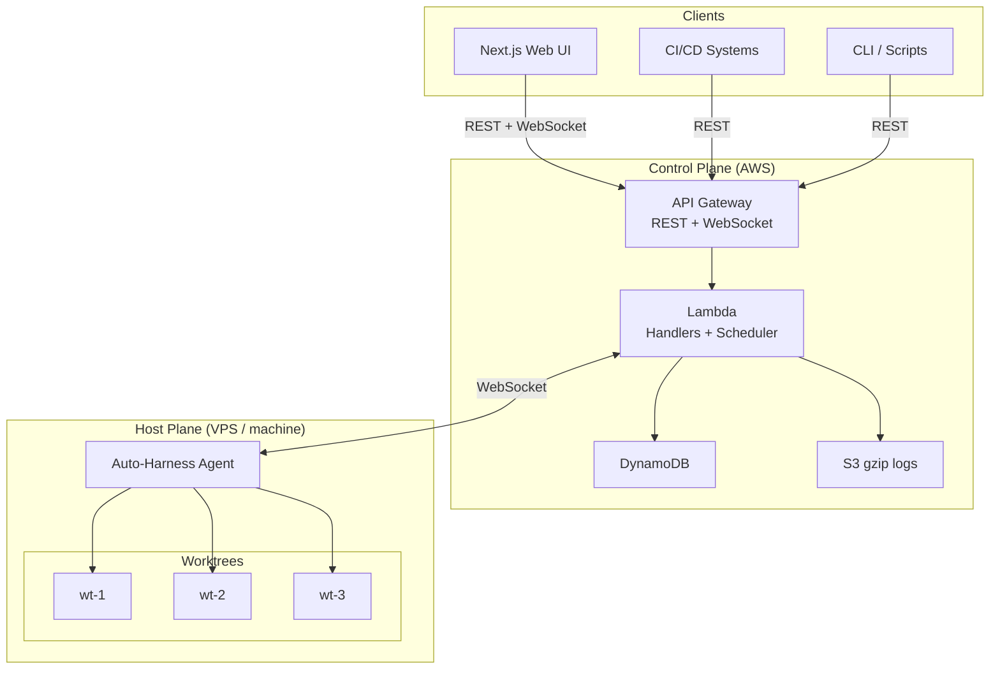
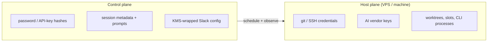

# Architecture

Cross-plane overview. Layer internals: [aws.md](../aws.md) (control), [host-daemon.md](../host-daemon.md) (host). Locked decisions: [plan.md](../plan.md). Product shape: [why.md](../why.md).

| Page                                         | What it explains                                        |
| -------------------------------------------- | ------------------------------------------------------- |
| [principles.md](principles.md)               | Eight rules that survive a vendor change                |
| [decisions.md](decisions.md)                 | Why the system is this shape                            |
| [session-lifecycle.md](session-lifecycle.md) | Create → run → terminal; prompt / scheduled / workspace |
| [assignment.md](assignment.md)               | Match, round-robin, ack, resume, bounded retry          |
| [connection.md](connection.md)               | Register, keepalive, disconnect, drain                  |
| [communication.md](communication.md)         | WebSocket vs the 1-minute cron; what invokes Lambda     |
| [logs.md](logs.md)                           | S3 gzip parts; CP poll; host-pane live stream           |
| [request-lifetime.md](request-lifetime.md)   | Browser and host never share a request                  |
| [gotchas.md](gotchas.md)                     | Traps, maturity, “do not improve this”                  |

> **Maturity:** control-plane and daemon behavior is implemented and exercised locally with
> DynamoDB Local and local WebSockets. The AWS deploy, update, REST health, and teardown
> lifecycle has also passed an account-backed proof. Diagrams describe the deployable cloud
> topology; no permanent production environment is implied by that disposable proof.

## Two planes

The **control plane** is the serverless web + queue + API half (it can idle at zero). The
**host plane** is the daemon on a VPS, laptop, or other machine you provision (formerly
called the execution plane). Hosts do not autoscale to zero — that is the point of the
queue. [terminology.md](../terminology.md) disambiguates **host plane** from **host pane**.

| Plane             | Where                                                               | Doc                                     |
| ----------------- | ------------------------------------------------------------------- | --------------------------------------- |
| **Control plane** | Target: AWS — API Gateway, Lambda, DynamoDB, S3, EventBridge        | **[aws.md](../aws.md)**                 |
| **Host plane**    | VPS / laptop / any machine — Node.js daemon, git worktrees, AI CLIs | **[host-daemon.md](../host-daemon.md)** |

Today those control-plane behaviors also run in the local API. Transcript bytes live in S3 gzip
parts and `logs.jsonl.gz` when upload is on; DynamoDB keeps bounded archive metadata — see
[logs.md](logs.md).

## Who owns what

| Plane   | Owns                                                                                         | Does not own                         |
| ------- | -------------------------------------------------------------------------------------------- | ------------------------------------ |
| Control | Auth, session records, queue, assignment, S3 log poll, archive metadata, cron, notifications | Git credentials, SSH, AI vendor keys |
| Host    | Worktrees/slots on disk, process spawn, output streaming, git + AI secrets                   | Admission, desired work, leases      |

Trust-boundary detail: [security.md](../security.md).

## Layer map

| Topic                  | Control plane                                                                                              | Host plane                                                                               |
| ---------------------- | ---------------------------------------------------------------------------------------------------------- | ---------------------------------------------------------------------------------------- |
| Public API & auth      | [api.md](../api.md), [websocket.md](../websocket.md), [auth.md](../auth.md), [security.md](../security.md) | API key over WSS ([cli.md](../cli.md) / [local-development.md](../local-development.md)) |
| Session queue / assign | Scheduler + round-robin — [assignment.md](assignment.md)                                                   | Accepts `session:assign` only                                                            |
| Worktrees              | DynamoDB inventory + online flags                                                                          | Create / claim / release on disk                                                         |
| Workspace pools/slots  | Pool/profile records + host path-only attachments                                                          | Claim/release host-local non-git directories; realpath under `allowedRoots`              |
| Logs                   | S3 gzip parts + Archives pointers; CP polls REST — [logs.md](logs.md)                                      | PTY stream to host pane; optional host PUT of gzip parts                                 |
| Schedules              | EventBridge cron → sessions                                                                                | Main-checkout lock + run command                                                         |
| Secrets                | No repo/AI secrets                                                                                         | `.env`, SSH, vendor keys                                                                 |
| UI                     | Hosted clients → REST/WS — [web.md](../web.md)                                                             | Host pane is debug-only                                                                  |

Compatibility stub for the old blob URL and `#architecture-principles`:
[../architecture.md](../architecture.md).

## Related

| Doc                      | Role                     |
| ------------------------ | ------------------------ |
| [why.md](../why.md)      | What / does-not / why    |
| [costs.md](../costs.md)  | Subscription vs AWS cost |
| [plan.md](../plan.md)    | Phases + data model      |
| [gotchas.md](gotchas.md) | Traps and maturity       |
