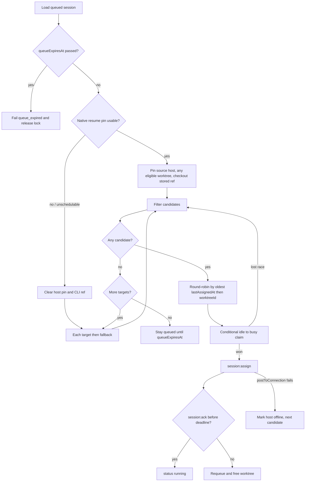
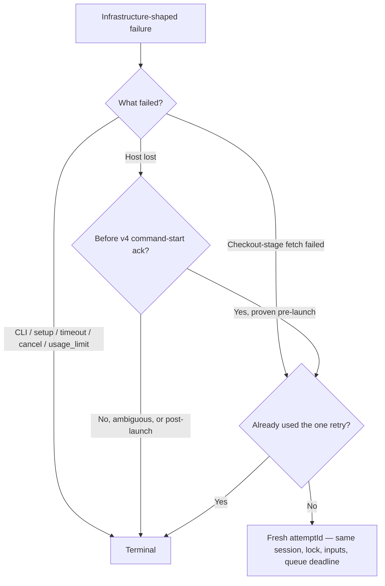

# Assignment

How a queued session becomes a running one. Algorithm detail: [aws.md — Scheduler](../aws.md#scheduler).
Wire payload: [websocket.md](../websocket.md).

A successful `postToConnection` is **not** assigned, running, finished, or archived — those are
separate durable facts ([principles.md](principles.md) #2).

| Fact                | Evidence                                                   |
| ------------------- | ---------------------------------------------------------- |
| Accepted            | Session row exists                                         |
| Assigned            | Conditional worktree/slot claim + `session:assign`         |
| Running             | Agent `session:ack` persisted                              |
| Finished            | Accepted terminal `session:status`                         |
| Transcript archived | Verified S3 object + archive metadata — [logs.md](logs.md) |

## Placement

Candidate filters (prompt sessions):

- `repositoryId` matches
- worktree `idle`, agent **online**, host not draining
- labels are a superset of `requiredLabels` (empty requirements → any)
- provider-backed targets have an attached account outside `usageLimitedUntil`; providerless commands have no account gate

Workspace placement uses an idle slot on a `workspace-sessions` host instead of label matching.

The EventBridge one-minute rule is a repair sweep (ack deadlines, running timeouts, stale hosts,
missed assigns). Create, resume, clone, register, and terminal also invoke the scheduler.

## Ack deadline

A `session:assign` that does not receive `session:ack` inside the deadline returns the session to
`queued` and the worktree to `idle` (plan invariant 2). No unbounded “ignore” may leave a worktree
wedged `busy`.

## Resume (D5)

Resume pins the **host**, not the worktree. The original worktree may already have been reused.

- Native route: source host online and not draining, account eligible, `cliResumeRef` present → any
  eligible worktree on that host, checkout the stored `ref`, run the frozen command snapshot.
- Unavailable (deleted Command, unschedulable account, `pinExpiresAt`, or an explicit
  `target`/`fallbacks` override): clear pin and CLI ref, continue as a fresh target/fallback run.
  `resumedFromSessionId` is preserved.

Details: [host-daemon.md — Session resume](../host-daemon.md#session-resume).

## Usage limit (D8)

A structured provider quota/rate-limit signal reports `usage_limit`, pauses that Provider Account
globally (5h default), releases the worktree, and immediately tries the next eligible account or
fallback. The logical session stays queued until capacity returns or `queueExpiresAt` (8 days
default). Providerless and non-structured commands are ungated. Ordinary failures stay terminal.

## Bounded infrastructure retry (D10)

The terminal hook is deferred until the control plane durably decides the attempt’s disposition, so
a lost status cannot replay an already-run escalation hook.

## Related

[session-lifecycle.md](session-lifecycle.md) · [principles.md](principles.md) · [gotchas.md](gotchas.md) · [plan.md](../plan.md)
