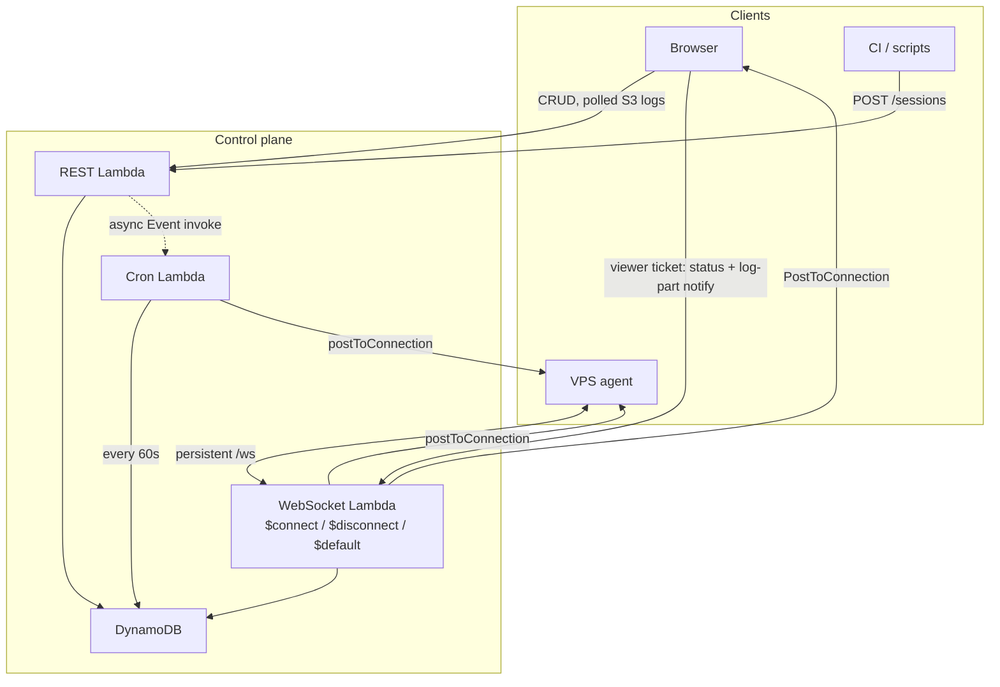
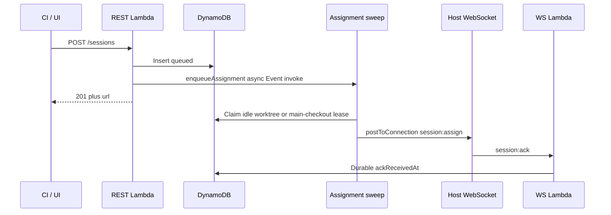
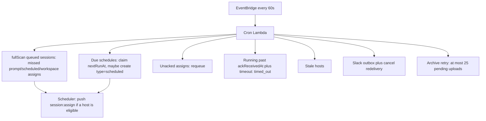
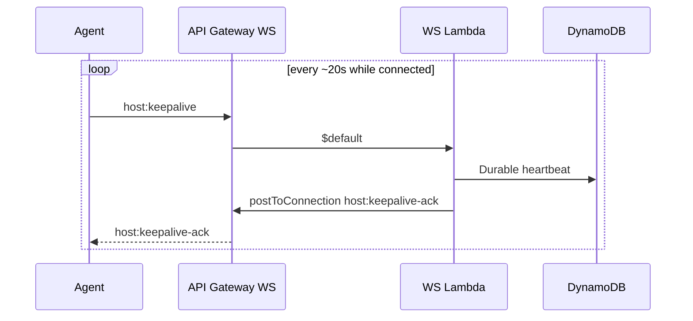

# How the planes talk

Short version: **hosts do not poll for work.** They hold a WebSocket. The control plane
**pushes** `session:assign`. The one-minute EventBridge rule is a **repair sweep**, not the
dispatcher.

Cost model: **[costs.md](../costs.md)** — modelled AWS floor **~$1/month** with S3 gzip parts
(upload off by default). Wire types: [websocket.md](../websocket.md). Request-lifetime split:
[request-lifetime.md](request-lifetime.md).

## Who talks how

| Path                   | Transport                   | Invokes Lambda?                                     | Used for                                          |
| ---------------------- | --------------------------- | --------------------------------------------------- | ------------------------------------------------- |
| Browser / CI CRUD      | REST                        | Yes, that request                                   | Create, list, cancel, history                     |
| Host control           | Persistent WebSocket `/ws`  | Yes, **each inbound frame** (`$connect`/`$default`) | Register, keepalive, ack, status (not log bodies) |
| Control → host         | `postToConnection`          | **No** (outbound)                                   | `session:assign`, cancel, `host:keepalive-ack`    |
| Session log bodies     | Host PUT gzip parts to S3   | No Lambda per line                                  | [logs.md](logs.md)                                |
| Control-plane log view | REST poll                   | Yes, that GET                                       | S3 parts or final gzip                            |
| Host-pane live logs    | Loopback daemon stream      | No control-plane Lambda                             | PTY/debug                                         |
| EventBridge            | 1-minute rule → Cron Lambda | Yes, **every minute whether or not work is due**    | Repair + due schedules                            |

The agent never pulls a global queue. It only accepts `session:assign` and reports idle so the
next session can drain. See [assignment.md](assignment.md).

## Are we making Lambda calls every minute?

**Yes — one Cron Lambda per minute**, plus keepalives. That is not how sessions get assigned.

| Clock                 | Interval  | Invokes Lambda?                                                                                                                                  | What it is for                                                                                           |
| --------------------- | --------- | ------------------------------------------------------------------------------------------------------------------------------------------------ | -------------------------------------------------------------------------------------------------------- |
| EventBridge cron      | 60 s      | Cron Lambda                                                                                                                                      | Due schedules, ack-deadline requeue, running timeouts, stale hosts, Slack outbox, archive retry          |
| Host `host:keepalive` | ~20 s     | WebSocket `$default`                                                                                                                             | Beat API Gateway’s idle timeout; durable heartbeat. Ack is outbound `postToConnection`, not a 2nd invoke |
| Scheduler on events   | Immediate | REST: `enqueueAssignment` submits an async Cron invoke (await submit, not the sweep). Host WS: `requestAssignment` **inline** in this `$default` | Create, resume, clone, register, terminal, usage-limit — **this** is the dispatcher                      |

At the [costs.md](../costs.md) reference workload that is 43,200 scheduler/cron invocations per
month from EventBridge alone. Assignment does **not** wait for that tick: `POST /sessions`
persists `queued`, **awaits** `enqueueAssignment()` (on AWS that is submitting
`InvocationType: Event` of the cron function; locally it is in-process), then returns 201. The
sweep itself is a different invocation. Browser requests never `await` the host
([request-lifetime.md](request-lifetime.md)). Host-driven events (register, terminal,
usage-limit) call `requestAssignment` in the current WebSocket `$default` invocation — they do
not Event-invoke Cron.

Lambda has no process to hold a server-side ping. Keepalive is **agent-initiated**. A successful
local `send()` is not an ack. Protocol-2 daemons re-arm the stall watchdog only on
`host:keepalive-ack` or `host:registered`.

## What the minute tick actually does

If EventBridge were down, **in-flight** create/register/terminal would still assign. Missed acks,
timeouts, due cron fires, and archive retries would stall until the sweep ran again. The tick is
the bound that makes those converge — not a work poller.

CloudWatch Events for that 1-minute rule are included free; the Lambda invocation is not. See
[costs.md](../costs.md).

## Keepalive vs work

Two connected hosts ≈ 3 keepalive invokes/host/minute, independent of whether any session is
running. Log **bodies** do not traverse this socket — see [logs.md](logs.md).

## Browser

The Web UI does not subscribe to a host socket. Catalog and session **lists** are REST (one page
and Load more). Session logs on the control plane **poll** `GET /sessions/:id/logs` (S3 parts or
final gzip) at the configured interval. Viewer WS may send `session:log-part` notifies when
someone is subscribed; it does not carry log text. For a live PTY stream, open the host pane.

## Related

[connection.md](connection.md) · [assignment.md](assignment.md) · [request-lifetime.md](request-lifetime.md) · [costs.md](../costs.md) · [websocket.md](../websocket.md) · [aws.md](../aws.md)
