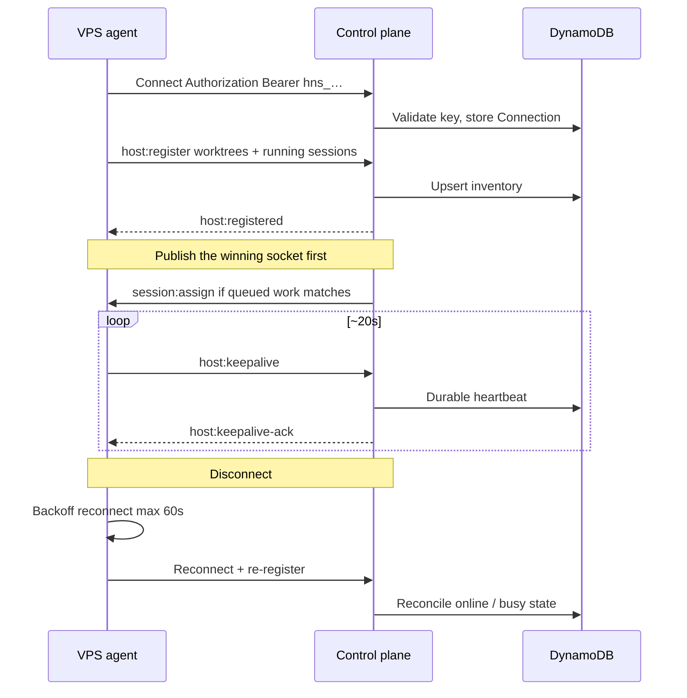

# Connection and recovery

How a host becomes present, stays present, and is reconciled after loss. Wire protocol:
[websocket.md](../websocket.md). Disconnect handling: [aws.md](../aws.md#disconnect-handling).
Agent recovery: [host-daemon.md](../host-daemon.md#disconnect-and-crash-recovery).

Keepalive is **agent-initiated**. Lambda has no process to hold a server-side ping timer. A
successful local `send()` is not evidence the peer received the frame.

## Connect, register, reconnect

`host:register` is a conditional put keyed on `hostId` (plan invariant 3): one live connection per
agent. A stale row from a lost `$disconnect` must not let two sockets both own one identity.

Protocol-2 daemons re-arm the stall watchdog only on `host:keepalive-ack` or `host:registered`, not
on a local `send()`.

## Loss modes

| Scenario                       | Agent                                                               | Control plane                                                                                                              |
| ------------------------------ | ------------------------------------------------------------------- | -------------------------------------------------------------------------------------------------------------------------- |
| Network blip                   | Reconnect backoff; keep local processes running                     | Rebind connection; reconcile running sessions                                                                              |
| Agent process crash            | systemd restarts; in-flight children may be orphaned                | After grace, mark stale running sessions failed / timed_out                                                                |
| Auto-update / drain restart    | Stop new jobs; finish current CLIs; **do not kill** in-process CLIs | Skip host for new assigns while `draining`; re-register restores capacity                                                  |
| Clean shutdown                 | Same drain path as auto-update when possible                        | Worktrees offline until re-register                                                                                        |
| Mid-session host reboot        | Same as crash                                                       | Sessions are **not** auto-moved to another agent (disk state is local)                                                     |
| Stale lease, socket still open | Force-close trips reconnect                                         | API Gateway does not deliver a `$default` response; without the close the daemon would keepalive into a dead lease forever |

Force-killing the agent (`OOM`, `kill -9`) is not the auto-update path and may orphan CLI children.

On disconnect, worktrees for that `hostId` go offline so the scheduler never assigns to a stale
inventory. Running sessions are left briefly (the agent may reconnect). After grace with no
reconnect: mark failed/timed_out and clear the assignment so the queue can move — except an
acknowledged v4 assignment whose command-start checkpoint is still `pending`, which may take the
one D10 `host_lost` retry. See [assignment.md](assignment.md).

Local-hub register reconcile (storage-less) is a layer detail: [aws.md — Agent reconnect](../aws.md#agent-reconnect).

## Related

[assignment.md](assignment.md) · [request-lifetime.md](request-lifetime.md) · [gotchas.md](gotchas.md)
