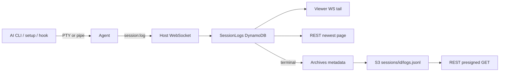

# Logs and archives

Three surfaces, three bounds. Viewer WebSocket is tail-only and never replays REST history (plan
invariant 13). Archive fencing, generations, and empty-transcript races live in
[aws.md — SessionLogs retention and archival](../aws.md#sessionlogs-retention-and-archival) — not
here.

| Surface                          | Bound                                   | Replays history? | S3 access                                  |
| -------------------------------- | --------------------------------------- | ---------------- | ------------------------------------------ |
| Viewer WebSocket                 | Tail-only; in-memory window per session | No               | None                                       |
| REST `GET /sessions/:id/logs`    | Newest page + cursor                    | DynamoDB only    | None                                       |
| REST `GET /sessions/:id/archive` | One version-pinned object               | S3 JSONL         | REST `GetObject` / `GetObjectVersion` only |

IAM: REST and Cron may `PutObject` under `sessions/*`. REST alone may read. WebSocket has neither
grant. DynamoDB archive rows are bounded pointer/retry state, never a duplicate log body.

New SessionLogs writes carry a 7-day TTL. Rows written before that change omit `ttl` and are not
backfilled. Glacier objects are unavailable until restored **outside** Auto Harness.

The UI defaults to a wrapping readable document (pretty JSONL, type labels, `#L<n>` links) with an
optional xterm.js 120×40 raw replay for ANSI/PTY output. Assigned AI CLIs run in that PTY; git,
setup scripts, and hooks stay pipe-based.

Log chunks use a per-session monotonic `seq` assigned by the **agent**. Replay and reconnect must
not renumber previously assigned values (plan invariant 5). Local WS ingress may coalesce adjacent
frames; a plain `BatchWriteItem` cannot preserve the host-connection fence.

## Related

[request-lifetime.md](request-lifetime.md) · [session-lifecycle.md](session-lifecycle.md) · [websocket.md](../websocket.md) · [costs.md](../costs.md)
