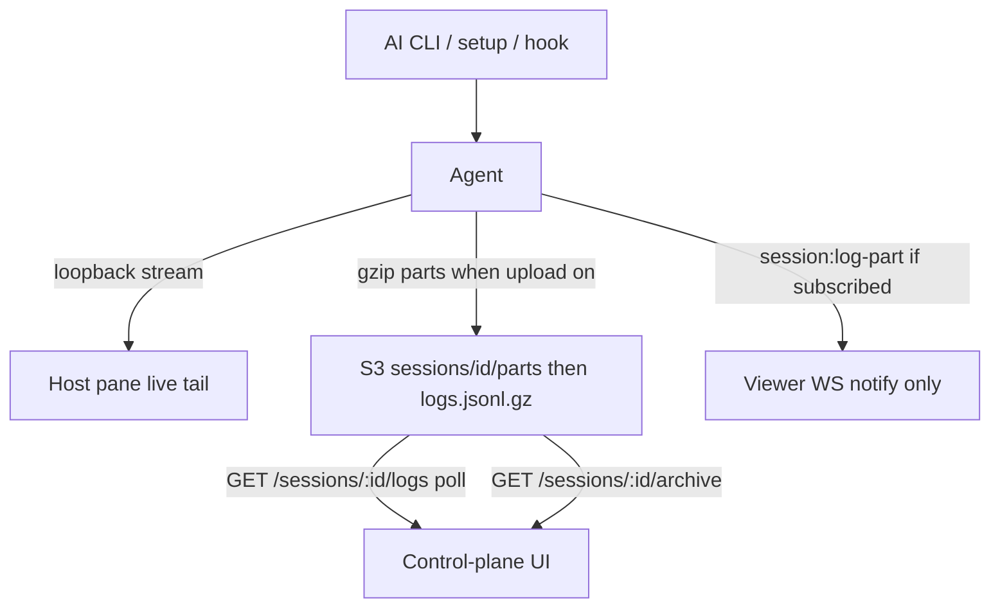

# Logs and archives

Log **bodies** live in S3, not DynamoDB. The control plane shows a **polled** S3 view. A live
PTY-quality stream exists only on the **host pane** (loopback to the daemon). Autonomous default:
**do not upload** session logs at all.

Invariant 13: REST is a bounded page. Viewer WebSocket does **not** carry log text.

| Surface                          | Bound                       | Live?                  | Store                         |
| -------------------------------- | --------------------------- | ---------------------- | ----------------------------- |
| Host pane                        | Local daemon stream         | Yes                    | Process memory / PTY          |
| Control-plane UI                 | REST page, poll interval    | Near-real-time at poll | S3 parts or final gzip        |
| Viewer WebSocket                 | Optional `session:log-part` | Notify only            | No body                       |
| REST `GET /sessions/:id/archive` | One version-pinned object   | After terminal         | `sessions/{id}/logs.jsonl.gz` |

## Operator settings

Structured control-plane Settings form (host pane may mirror; it is never the only editor).

| Knob               | Default | Meaning                                             |
| ------------------ | ------- | --------------------------------------------------- |
| Upload mode        | `off`   | `off` / `subscribed` / `always`                     |
| Batch max KB       | 256     | Uncompressed JSONL bytes before a part flush        |
| Batch max lines    | 500     | JSONL lines before a part flush                     |
| Batch max time     | 60s     | Flush pending output at least this often            |
| Control-plane poll | 60s     | Browser REST poll while the session is non-terminal |

`subscribed`: the host uploads only while at least one control-plane viewer is registered (fan-out
of **part keys**, not log text). EventBridge remains a 1-minute **repair sweep**, not this poll.

## S3 layout

| Key                                                       | When                                            |
| --------------------------------------------------------- | ----------------------------------------------- |
| `sessions/{sessionId}/parts/{seqStart}-{seqEnd}.jsonl.gz` | Each flush                                      |
| `sessions/{sessionId}/logs.jsonl.gz`                      | Terminal: host concatenates parts into one gzip |

Do **not** use S3 multipart upload for these parts: minimum part size is **5 MB** except the last
part. Staging is ordinary `PutObject` of gzip members; the host concatenates (gzip members may be
concatenated, or recompressed as one member) into the final key.

Every JSONL line, in both parts and the final archive, is `{timestamp, stream, content, seq,
dropped?}` (Invariant 5) -- the same shape `gzipLogRecords`/`serializeLogRecordLine` produce.
Cron can also write the terminal archive itself (from durable log rows or leftover parts, via
`archiveBody`) when the host never finishes concatenating. A small number of archives written
before `seq` was added to that path predate this shape; readers assign each such line a `seq`
from its position in the file (already chronological) rather than dropping it, so those archives
still read back in full.

The host PUTs parts and the terminal archive over REST (`PUT /sessions/:id/log-parts` and
`PUT /sessions/:id/log-archive`) with the attempt-scoped session API key. That avoids a
presigned URL that expires mid-session and keeps S3 off the WebSocket Lambda. REST has
`sessions/*` Put/Get/List plus version-pinned Get. Cron has Put plus Get/List of **current**
objects so it can concatenate leftover parts; it does not get `GetObjectVersion`. DynamoDB
`Archives` rows remain pointer/`versionId`/retry metadata only.

## Control plane vs host pane

The control plane **must** still show the transcript (invariant 10) via S3 poll. Copy on that view:

> Near-real-time via S3. For a live PTY stream, open the host pane on that machine.

The host pane streams from the daemon on loopback. It is debug-only; it is not required to **read**
a finished archive.

## Why not other AWS stores

| Store                              | Why not here                                                                                    |
| ---------------------------------- | ----------------------------------------------------------------------------------------------- |
| DynamoDB `SessionLogs`             | 27M transact writes/month at the old 10 msg/s path; wrong shape for bodies                      |
| S3 Express One Zone                | Single AZ; directory buckets; latency we do not need; request $ ≈ Dynamo if still 27M tiny PUTs |
| Kinesis / Firehose                 | Ingest bus, not `GET last page for session X`; Firehose 5 KB round-up                           |
| CloudWatch Logs                    | Ops product; no attempt-fenced `seq` page                                                       |
| MSK / Redis / OpenSearch / AppSync | Cluster floor or more expensive fan-out than API Gateway WS                                     |

Batch on the host + Standard S3 parts is the cost lever. See [costs.md](../costs.md).

## Related

[communication.md](communication.md) · [request-lifetime.md](request-lifetime.md) · [costs.md](../costs.md) · [websocket.md](../websocket.md) · [aws.md](../aws.md)
