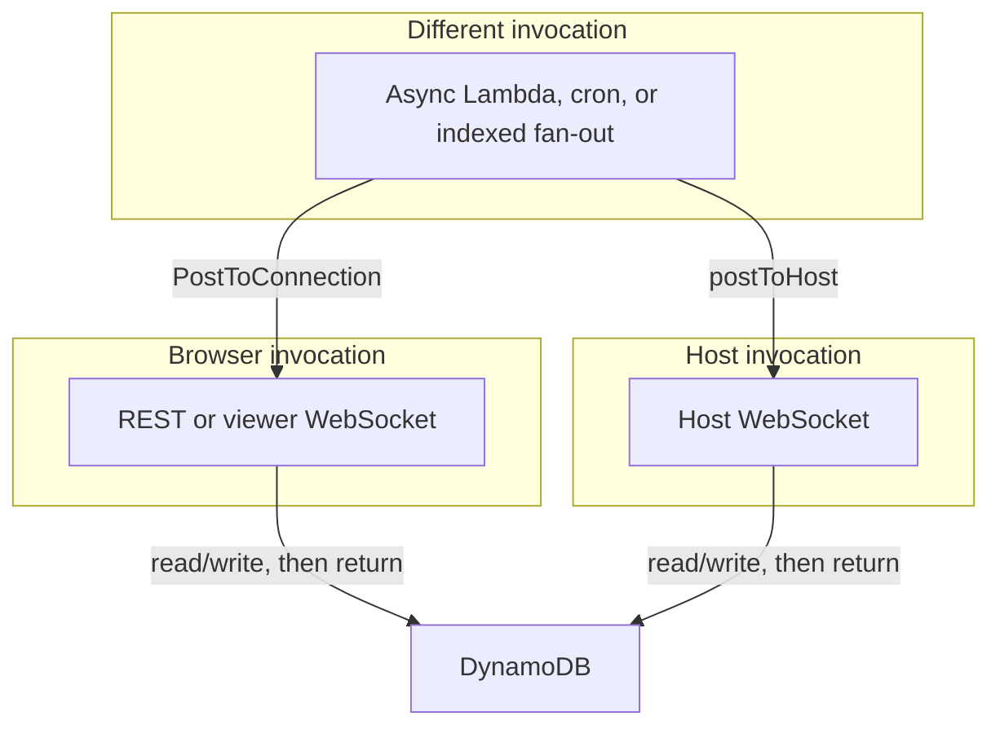

# Request lifetime

Plan [invariant 12](../plan.md#5-invariants): a browser request and a host request never share a
lifetime. This is how [principle 7](principles.md) is enforced on the current API Gateway + Lambda
substrate — observability cannot delay execution.

| This request                          | May                                     | Must not                                                          |
| ------------------------------------- | --------------------------------------- | ----------------------------------------------------------------- |
| Browser REST / viewer WebSocket       | Read and write DynamoDB, return         | `await` assignment, ack, log replay, or host filesystem/git       |
| Host WebSocket                        | Read and write DynamoDB, return         | Scan the Connections table to find a peer or a session’s viewers  |
| Async Lambda / cron / indexed fan-out | `postToHost`, viewer `PostToConnection` | Be inlined into the browser or host request that created the work |

Do not Scan Connections in order to talk to one host or one session’s viewers. Push uses an indexed
path from a **later** invocation.

The specific prohibitions (don’t Scan `Connections`; never `await` a host push inside a browser
request) are API-Gateway-shaped and would look different on another substrate. The principle they
serve — observability cannot interfere with execution — does not. See [comparison.md](../comparison.md).

## Related

[principles.md](principles.md) · [logs.md](logs.md) · [connection.md](connection.md) · [gotchas.md](gotchas.md) · [aws.md](../aws.md)
