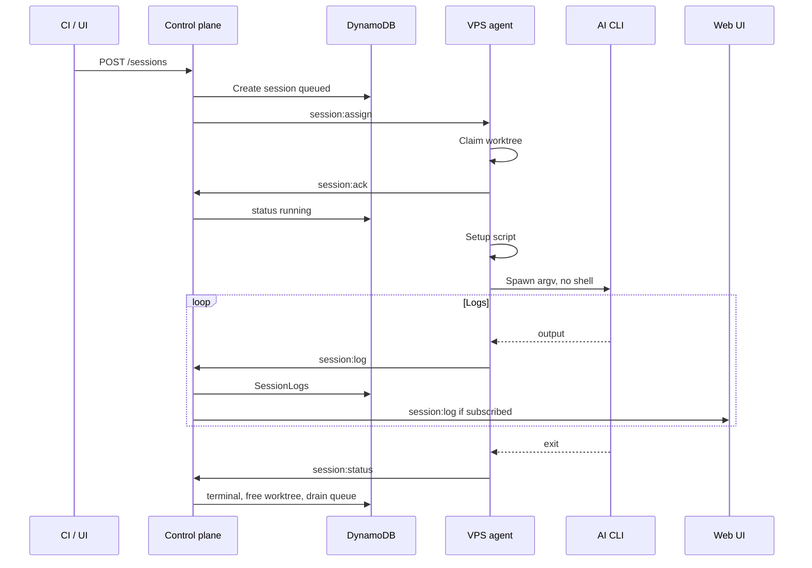
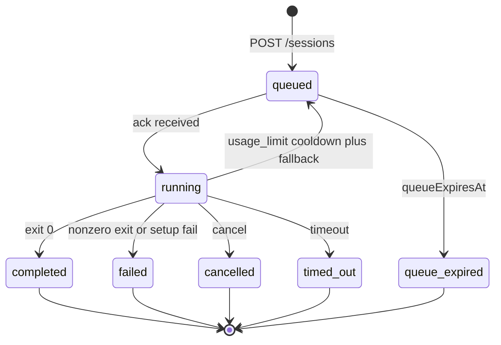
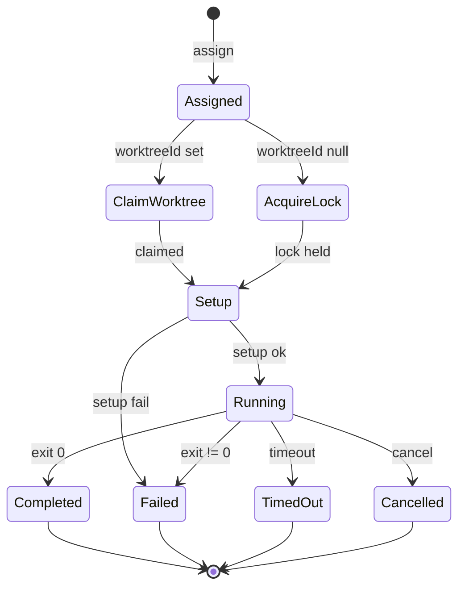
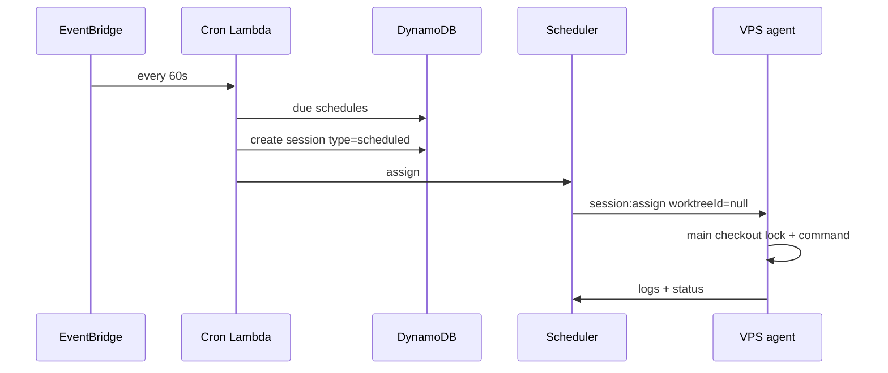
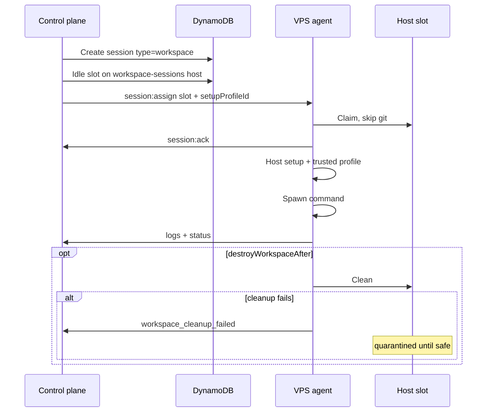

# Session lifecycle

How a session is created, placed, run, and finished. Assignment detail: [assignment.md](assignment.md).
Agent internals: [host-daemon.md](../host-daemon.md#session-lifecycle-agent-view). Scheduler:
[aws.md](../aws.md#scheduler).

## Session kinds

|                 | Prompt                          | Scheduled                          | Workspace                              |
| --------------- | ------------------------------- | ---------------------------------- | -------------------------------------- |
| Placement       | Labeled worktree                | Main checkout (`worktreeId: null`) | Pool slot                              |
| Host capability | —                               | `scheduled-main-checkout`          | `workspace-sessions`                   |
| Git             | Checkout `ref` (branch/tag/SHA) | Branch-name `ref` only             | None (`repositoryId: null`)            |
| Resume          | Yes (host pin, not worktree)    | No                                 | No (clone is allowed)                  |
| Concurrency     | 1 per worktree                  | Serial per repo on that host       | 1 per slot                             |
| Cleanup         | Worktree reset                  | Release main-checkout lock         | Optional; failure quarantines the slot |

Workspace sessions reject `ref`, non-empty `requiredLabels`, and raw setup scripts. They run host
setup plus a trusted setup profile. Missing or unsafe paths fail the existing non-empty
`allowedRoots` realpath check. Cleanup failure is `workspace_cleanup_failed`.

## Create and run (prompt)

The control plane chooses the worktree (match then round-robin). The agent does not pull a global
queue — it only accepts `session:assign` and reports idle so the next session can drain.

## Control-plane status

`usage_limit` is not a logical-session finish: the account is paused, the worktree is released, and
the session stays queued for the next eligible target until `queueExpiresAt`. See D8.

## Agent view

## Scheduled (main checkout)

Only agents advertising `scheduled-main-checkout` are eligible, so daemon support can roll out
before the scheduler emits null-worktree assignments. The one-minute EventBridge rule is a **repair
sweep**, not the primary dispatcher — create/register/terminal also invoke the scheduler.

Details: [aws.md — Cron](../aws.md#cron-evaluator), [host-daemon.md — Non-worktree](../host-daemon.md#non-worktree-sessions-scheduled).

## Workspace

## Related

[assignment.md](assignment.md) · [connection.md](connection.md) · [logs.md](logs.md) · [api.md](../api.md)
