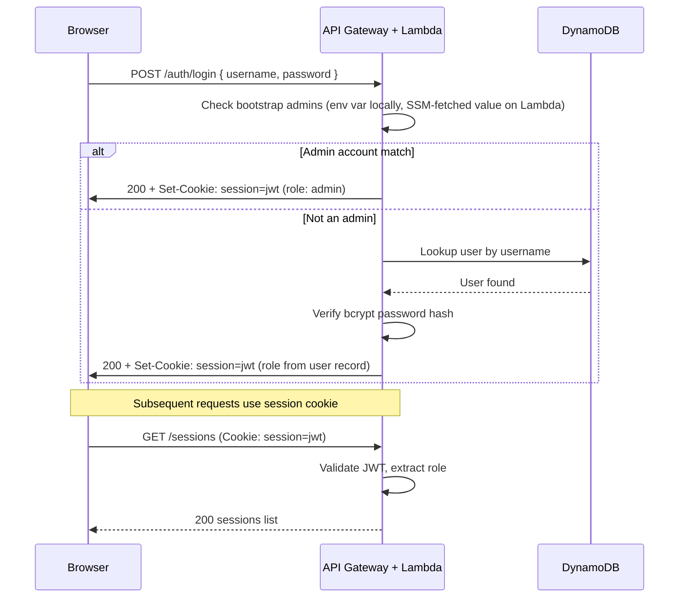
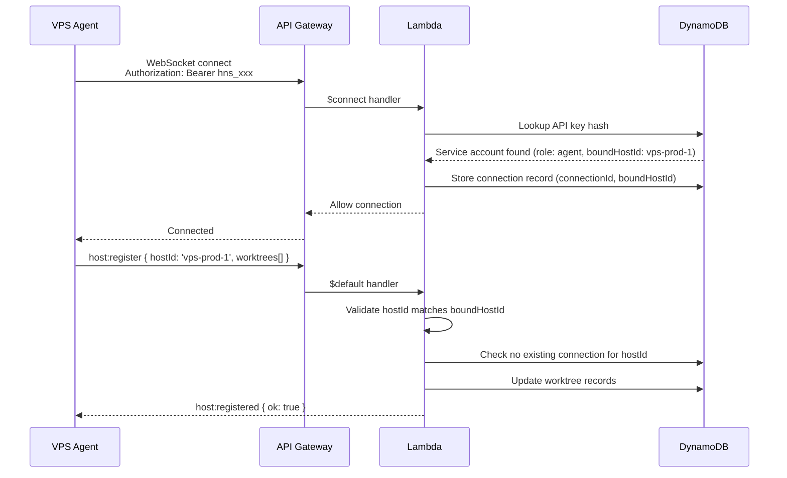

# Authentication & authorization

How principals prove identity. **Named roles and the permission matrix:**
[roles.md](roles.md). Security principles, transport, hardening, and threat
boundaries: [security.md](security.md).

## Credential types

Auto Harness has three tiers of credentials:

| Tier             | For                      | Auth method                      | Managed by                                                   |
| ---------------- | ------------------------ | -------------------------------- | ------------------------------------------------------------ |
| Admin accounts   | Platform administrators  | Username + password (env var)    | Local/VPS: env var. Lambda: [SSM parameter](#admin-accounts) |
| User accounts    | Human operators          | Username + password (basic auth) | Admins                                                       |
| Service accounts | Machines (CI/CD, agents) | API key (`hns_...`)              | Admins                                                       |

## Local authentication and public binds

The local API and both local UIs bind only to `127.0.0.1` by default. Set an
explicit host (`HARNESS_API_HOST`, `HARNESS_WEB_HOST`, or
`HARNESS_HOST_PANE_HOST`) only when remote access is intended. A non-loopback
bind is refused unless all of the following are set:

```bash
HARNESS_AUTH_MODE=required
HARNESS_SESSION_SECRET=<at least 32 random characters>
HARNESS_ADMINS=<base64 JSON bootstrap admins>
```

`HARNESS_AUTH_MODE=disabled` is the loopback-only developer mode. In required
mode, users and service accounts are stored in the `Users` table; bootstrap
admins remain environment-only and can administer those accounts. Passwords
are bcrypt hashes and API keys are SHA-256 hashes. The one-time plain API key
is never stored or returned again after creation.

### Account cache freshness

Each API worker serves credential decisions from an in-process account cache. The
cache is re-read when it passes `HARNESS_AUTH_CACHE_TTL_MS` (default `30000`), which
bounds how long a **revoked** API key or a deleted user's session cookie can still be
accepted by a worker that did not handle the revocation. A credential that is not
found locally also triggers an immediate re-read — rate-limited to once per second, so
unknown tokens cannot drive one table read per request — so an account created on
another worker is usable right away rather than after the TTL.

Set the TTL lower to shorten the revocation window at the cost of more reads. `0`
re-reads on every request. Immediate, read-free revocation would need a key-hash index
on the `Users` table; that is not implemented.

### Admin accounts

Admin accounts are bootstrapped outside the database — this is the root
credential, and it exists before any database records. **Local/VPS mode**
(`services/api/src/local-server.ts`) reads `HARNESS_ADMINS` directly from the
process environment, same as `HARNESS_SESSION_SECRET` above. **Lambda mode**
does not: the Lambda's own environment holds only the _name_ of an SSM
`SecureString` parameter, not the admin JSON itself — see
[deploy-aws.md](deploy-aws.md#secrets-and-config-never-commit) for why a real
secret never lands in a Lambda's environment configuration and how to create
the environment-scoped parameter through the AWS UI.

| Property    | Value                                                                                                             |
| ----------- | ----------------------------------------------------------------------------------------------------------------- |
| Source      | Local/VPS: `HARNESS_ADMINS` env var. Lambda: SSM SecureString parameter, name given by `HARNESS_ADMINS_SSM_PARAM` |
| Format      | Base64-encoded JSON array of `{ username, password }` objects                                                     |
| Rotation    | Local/VPS: update the env var and restart. Lambda: replace the Parameter Store value — no redeploy                |
| Storage     | Never stored in a database                                                                                        |
| Auth method | Basic auth (`Authorization: Basic <base64(username:password)>`)                                                   |

**Local/VPS mode — setting the environment variable:**

```bash
# Create the admins JSON
echo '[{"username":"admin","password":"your-secure-password-here"}]' | base64
# Result: W3sidXNlcm5hbWUiOiJhZG1pbiIsInBhc3N3b3JkIjoieW91ci1zZWN1cmUtcGFzc3dvcmQtaGVyZSJ9XQ==

HARNESS_ADMINS=W3sidXNlcm5hbWUiOiJhZG1pbiIsInBhc3N3b3JkIjoieW91ci1zZWN1cmUtcGFzc3dvcmQtaGVyZSJ9XQ==
```

**Lambda mode:** populate the environment-scoped SecureString in the AWS Systems
Manager Parameter Store UI as described in the AWS deployment runbook.

Multiple admins can be defined in the array. Passwords should be long, random strings.

Admin operations:

- Create, list, delete **user accounts**
- Create, list, delete **service accounts**
- Manage repositories
- View all sessions across all users
- System configuration

> **Note:** Prefer an `author` or `operator` account for everyday session work so the bootstrap `HARNESS_ADMINS` credential stays off the hot path. Unscoped `admin` **can** create sessions; the split is operational hygiene, not an API restriction.

### User accounts

User accounts are for humans interacting with the Web UI and API. Created by admins.

| Property    | Value                                                                                                                            |
| ----------- | -------------------------------------------------------------------------------------------------------------------------------- |
| Storage     | DynamoDB (Users table), password bcrypt-hashed                                                                                   |
| Auth method | Basic auth (`Authorization: Basic <base64(username:password)>`)                                                                  |
| Session     | On Web UI login, a session cookie is issued (HTTP-only, secure, 24h expiry). Service accounts cannot log in or receive a cookie. |

Admins create user accounts via the API or Web UI:

```json
{
  "username": "jong",
  "password": "initial-password",
  "role": "operator"
}
```

The user can change their password after first login.

### Service accounts (API keys)

Service accounts are for machines — CI/CD systems, VPS agents, and external integrations. Created by admins.

| Property    | Value                                                                                                                                |
| ----------- | ------------------------------------------------------------------------------------------------------------------------------------ |
| Format      | `hns_` prefix + 48 random characters                                                                                                 |
| Storage     | SHA-256 hash stored in DynamoDB. Plain key shown once on creation.                                                                   |
| Rotation    | Create a new key, update consumers, delete the old key                                                                               |
| Auth method | `Authorization: Bearer <api-key>` header (REST and host WebSocket). Browser login, session cookies, and viewer tickets are rejected. |

Service accounts have the same role system as user accounts (`read-only`, `author`, `operator`, `maintainer`, `agent`, `admin`) and can optionally be scoped to specific repositories. `agent` additionally requires `boundHostId`.

```json
{
  "name": "ci-frontend",
  "role": "operator",
  "allowedRepositories": ["repo-abc", "repo-def"]
}
```

---

## Roles

Named roles, the capability matrix, REST path map, scopes, and what to assign:
**[roles.md](roles.md)**.

Accounts pick one of `read-only`, `author`, `operator`, `maintainer`, `agent`,
or `admin`. Optional `allowedRepositoryIds` and (on `agent` only) `boundHostId`
are filters, not extra roles. Catalog argv stays admin-only ([plan.md](plan.md)
D4). A bound key that tries to author a session still gets `404 NOT_FOUND`, not
`403` — see [roles.md — Object-level rules](roles.md#object-level-rules).

---

## Web UI login flow



**Session cookie details:**

| Property    | Value                                                                                                                                       |
| ----------- | ------------------------------------------------------------------------------------------------------------------------------------------- |
| Name        | `auto_harness_session`                                                                                                                      |
| Content     | Signed JWT with `{ userId, username, role, exp }`                                                                                           |
| Flags       | `HttpOnly`, `Secure`, `SameSite=Strict`                                                                                                     |
| Expiry      | 24 hours (configurable)                                                                                                                     |
| Signing key | `HARNESS_SESSION_SECRET`: local/VPS env var, or Lambda's SSM-fetched value ([deploy-aws.md](deploy-aws.md#secrets-and-config-never-commit)) |
| Principals  | Admin and user accounts only. A service-account API key cannot mint or present a browser session cookie.                                    |

### Viewer tickets

Live log viewing uses a separate credential from the session cookie. `POST /api/v1/auth/viewer-ticket` mints a 60-second, **one-time** opaque ticket from an authenticated browser session (cookie or user/admin basic auth). The response is `{ ticket }` with `Cache-Control: no-store`. Service accounts receive `403`.

The API stores only a hash of the ticket (DynamoDB `ViewerTickets` with TTL, or the in-memory equivalent on a local ControlPlane). Connecting to `/ws/viewer?ticket=…` consumes that hash transactionally, so a replay — including two concurrent consumes — succeeds at most once. The raw ticket is never logged.

The viewer WebSocket also requires a browser `Origin` that matches the configured web origin. Locally that is `HARNESS_PUBLIC_BASE_URL` (ControlPlane `publicBaseUrl`); on AWS it is the deployed `PUBLIC_BASE_URL`. It must be the control UI origin, not the API listen address. A missing or mismatched `Origin` is rejected.

---

## Auth priority

When a request arrives, the API checks credentials in this order:

1. **Session cookie** (`auto_harness_session`) — Web UI users
2. **Bearer token** (`Authorization: Bearer hns_...`) — service accounts
3. **Basic auth** (`Authorization: Basic ...`) — admin or user accounts (direct API usage)

If none are present, the request receives `401 Unauthorized`.

---

## VPS agent authentication

The VPS agent authenticates using a service account API key. Each agent service account is **bound** to a specific `hostId` to prevent spoofing.

### Agent binding

When creating a service account for an agent, the admin specifies the `boundHostId`:

```json
{
  "name": "vps-prod-1-agent",
  "role": "agent",
  "boundHostId": "vps-prod-1"
}
```

The `boundHostId` is stored on the service account record. On WebSocket connect and `host:register`, the server validates:

1. The API key is valid and has the `agent:protocol` grant (effective `agent` role, service-account kind, `boundHostId` set). Pre-migration bound `operator`/`admin` keys still authenticate: `effectiveRole()` treats them as `agent` at request time, and create/rotate rewrites the stored role to `agent`.
2. The `hostId` in the `host:register` message matches the `boundHostId` on the service account
3. No other connection is already registered with the same `hostId`

If any check fails, the connection is rejected with an error message and closed.

### A bound key cannot create sessions

A service account with `boundHostId` set can register a host over WebSocket, but
**cannot** author sessions — `POST /api/v1/sessions` (and `/sessions/:id/clone`,
`/sessions/:id/resume`, and schedule writes) all check `canAuthorSessions`
(`services/api/src/local-routes-session-access.ts`), which requires the
principal to have **no** `boundHostId`. This is deliberate: without it, a stolen
daemon key could create a session for any repository it can reach, and the
scheduler has no notion of who authored a session, so it could place that
session on a **different** host — turning one host compromise into execution
across the fleet.

A bound key attempting to create a session gets a bare
`404 {"error":{"code":"NOT_FOUND","message":"resource not found"}}` —
deliberately not `403`, and with **no mention of `boundHostId` anywhere in the
response** (confirmed against a real deployment). If a session-authoring call
unexpectedly 404s, check whether the key used is the daemon's bound key.

Practically, this means every host needs **two** service accounts, not one:

- a **bound** one (`boundHostId` set) for the host daemon's `HARNESS_API_KEY`
  ([deploy-host-daemon.md](deploy-host-daemon.md))
- an **unbound** `author` (CI) or `operator` (humans) one for anything that creates sessions —
  a CI trigger, a webhook consumer, a scheduled-task caller

### Connection flow



**Why this matters:** Without binding, a compromised CI service account could connect as `host:register { hostId: "vps-prod-1" }` and receive sessions intended for a legitimate agent. Binding ensures each API key can only claim its designated agent identity.

**Reconnection:** On disconnect, the agent reconnects with exponential backoff (1s, 2s, 4s, ... max 60s). On reconnect, it re-sends `host:register` and reports any in-progress sessions.

**Recommended role:** Use an `agent` service account dedicated to the daemon. Do not reuse CI/CD keys.

Wire formats: [websocket.md](websocket.md). REST account APIs: [api.md](api.md).

---

## Related

| Doc                          | Role                                     |
| ---------------------------- | ---------------------------------------- |
| [roles.md](roles.md)         | Roles, capabilities, grant matrix        |
| [security.md](security.md)   | Principles, transport, hardening         |
| [api.md](api.md)             | REST including account management        |
| [websocket.md](websocket.md) | Agent/UI tokens on connect               |
| [web.md](web.md)             | Login UI behavior                        |
| [setup.md](setup.md)         | `HARNESS_ADMINS` / session secret deploy |
