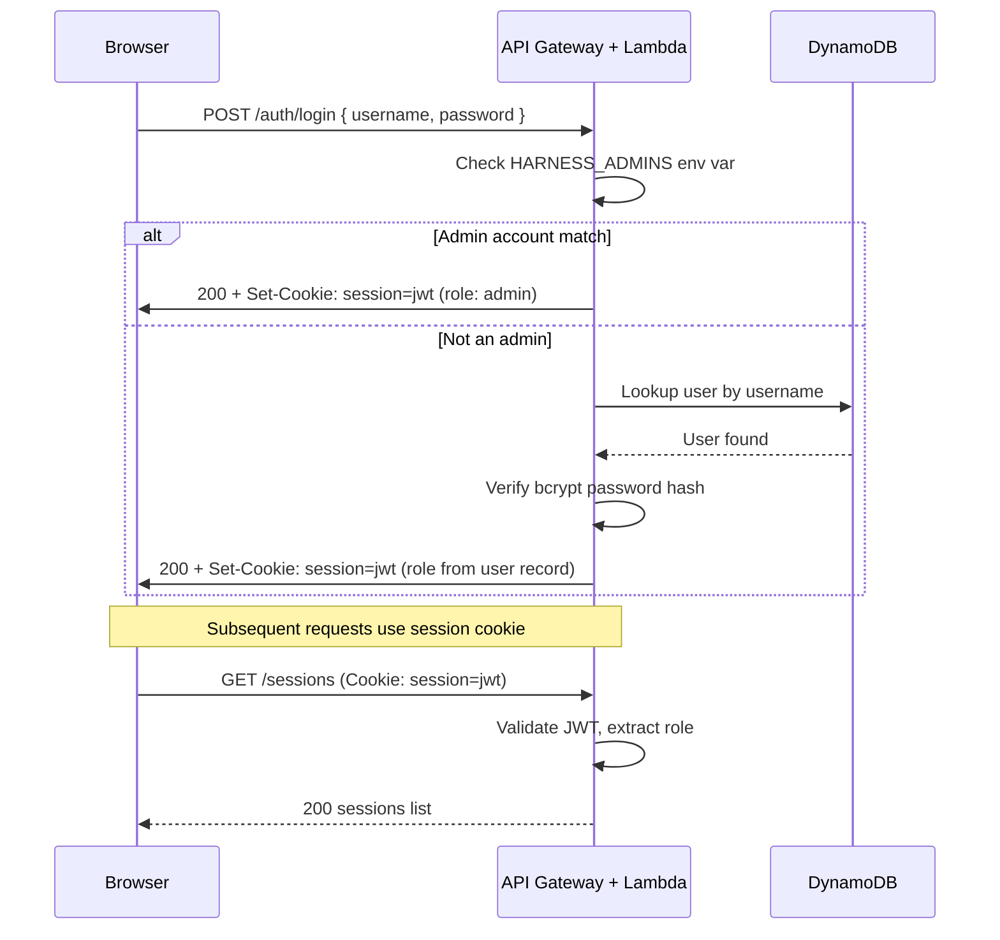
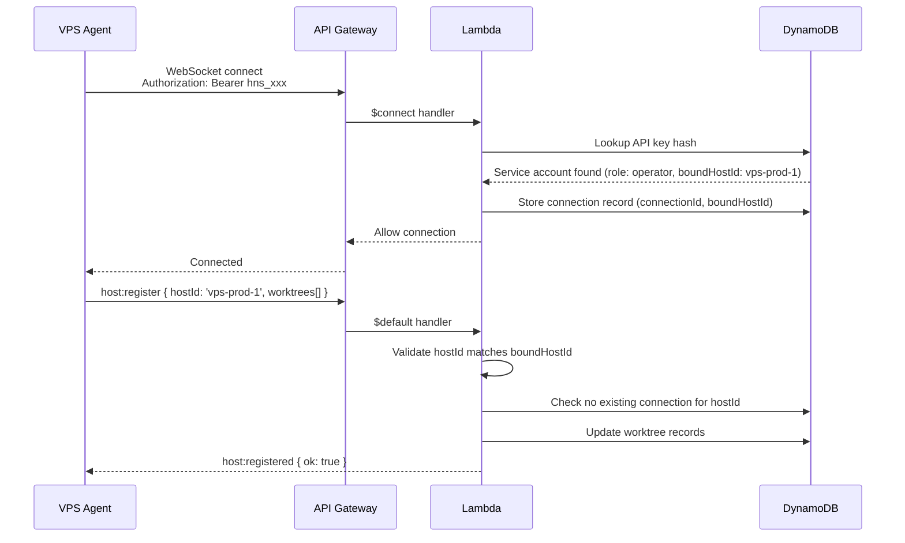

# Authentication & authorization

How principals prove identity and what they can do. Security principles, transport, hardening, and threat boundaries: [security.md](security.md).

## Credential types

Auto Harness has three tiers of credentials:

| Tier             | For                      | Auth method                      | Managed by           |
| ---------------- | ------------------------ | -------------------------------- | -------------------- |
| Admin accounts   | Platform administrators  | Username + password (env var)    | Environment variable |
| User accounts    | Human operators          | Username + password (basic auth) | Admins               |
| Service accounts | Machines (CI/CD, agents) | API key (`hns_...`)              | Admins               |

## Local authentication and public binds

The local API and both local UIs bind only to `127.0.0.1` by default. Set an
explicit host (`HARNESS_API_HOST`, `HARNESS_WEB_HOST`, or
`HARNESS_HOST_PANE_HOST`) only when remote access is intended. A non-loopback
bind is refused unless all of the following are set:

```bash
HARNESS_AUTH_MODE=required
HARNESS_SESSION_SECRET=<at least 32 random characters>
HARNESS_ADMINS=<base64 JSON bootstrap admins>
```

`HARNESS_AUTH_MODE=disabled` is the loopback-only developer mode. In required
mode, users and service accounts are stored in the `Users` table; bootstrap
admins remain environment-only and can administer those accounts. Passwords
are bcrypt hashes and API keys are SHA-256 hashes. The one-time plain API key
is never stored or returned again after creation.

### Admin accounts

Admin accounts are bootstrapped via environment variable on the Lambda. This is the root credential — it exists before any database records.

| Property    | Value                                                           |
| ----------- | --------------------------------------------------------------- |
| Source      | `HARNESS_ADMINS` environment variable on Lambda                 |
| Format      | Base64-encoded JSON array of `{ username, password }` objects   |
| Rotation    | Update the environment variable and redeploy via CDK            |
| Storage     | Never stored in a database — only in Lambda environment         |
| Auth method | Basic auth (`Authorization: Basic <base64(username:password)>`) |

**Setting the environment variable:**

```bash
# Create the admins JSON
echo '[{"username":"admin","password":"your-secure-password-here"}]' | base64
# Result: W3sidXNlcm5hbWUiOiJhZG1pbiIsInBhc3N3b3JkIjoieW91ci1zZWN1cmUtcGFzc3dvcmQtaGVyZSJ9XQ==

# Set in CDK
HARNESS_ADMINS=W3sidXNlcm5hbWUiOiJhZG1pbiIsInBhc3N3b3JkIjoieW91ci1zZWN1cmUtcGFzc3dvcmQtaGVyZSJ9XQ==
```

Multiple admins can be defined in the array. Passwords should be long, random strings.

Admin operations:

- Create, list, delete **user accounts**
- Create, list, delete **service accounts**
- Manage repositories
- View all sessions across all users
- System configuration

> **Note:** Admin accounts can only manage accounts and platform settings. To actually use the service (create sessions, view logs), use a separate user account. This separation keeps admin credentials off everyday workflows.

### User accounts

User accounts are for humans interacting with the Web UI and API. Created by admins.

| Property    | Value                                                                       |
| ----------- | --------------------------------------------------------------------------- |
| Storage     | DynamoDB (Users table), password bcrypt-hashed                              |
| Auth method | Basic auth (`Authorization: Basic <base64(username:password)>`)             |
| Session     | On Web UI login, a session cookie is issued (HTTP-only, secure, 24h expiry) |

Admins create user accounts via the API or Web UI:

```json
{
  "username": "jong",
  "password": "initial-password",
  "role": "operator"
}
```

The user can change their password after first login.

### Service accounts (API keys)

Service accounts are for machines — CI/CD systems, VPS agents, and external integrations. Created by admins.

| Property    | Value                                                              |
| ----------- | ------------------------------------------------------------------ |
| Format      | `hns_` prefix + 48 random characters                               |
| Storage     | SHA-256 hash stored in DynamoDB. Plain key shown once on creation. |
| Rotation    | Create a new key, update consumers, delete the old key             |
| Auth method | `Authorization: Bearer <api-key>` header (REST and WebSocket)      |

Service accounts have the same role system as user accounts (`read-only`, `operator`, `admin`) and can optionally be scoped to specific repositories:

```json
{
  "name": "ci-frontend",
  "role": "operator",
  "allowedRepositories": ["repo-abc", "repo-def"]
}
```

---

## Roles

| Role        | Create sessions | Cancel sessions | List/view | Manage repos | Manage accounts |
| ----------- | :-------------: | :-------------: | :-------: | :----------: | :-------------: |
| `read-only` |        ✗        |        ✗        |     ✓     |      ✗       |        ✗        |
| `operator`  |        ✓        |    Own only     |     ✓     |      ✗       |        ✗        |
| `admin`     |        ✓        |       Any       |     ✓     |      ✓       |        ✓        |

User accounts with `admin` role have the same permissions as env-var admins but are tracked per-user in audit logs.

Post-D4, `operator` means **target any catalog Provider or Command**, with ordered fallbacks — not arbitrary shell execution. Provider targets use healthy attached account pools; a Command with `providerId: null` is a pure CLI. Free-form `command` strings are not accepted ([plan.md](plan.md) D4).

---

## Web UI login flow



**Session cookie details:**

| Property    | Value                                             |
| ----------- | ------------------------------------------------- |
| Name        | `auto_harness_session`                            |
| Content     | Signed JWT with `{ userId, username, role, exp }` |
| Flags       | `HttpOnly`, `Secure`, `SameSite=Strict`           |
| Expiry      | 24 hours (configurable)                           |
| Signing key | `HARNESS_SESSION_SECRET` env var on Lambda        |

---

## Auth priority

When a request arrives, the API checks credentials in this order:

1. **Session cookie** (`auto_harness_session`) — Web UI users
2. **Bearer token** (`Authorization: Bearer hns_...`) — service accounts
3. **Basic auth** (`Authorization: Basic ...`) — admin or user accounts (direct API usage)

If none are present, the request receives `401 Unauthorized`.

---

## VPS agent authentication

The VPS agent authenticates using a service account API key. Each agent service account is **bound** to a specific `hostId` to prevent spoofing.

### Agent binding

When creating a service account for an agent, the admin specifies the `boundHostId`:

```json
{
  "name": "vps-prod-1-agent",
  "role": "operator",
  "boundHostId": "vps-prod-1"
}
```

The `boundHostId` is stored on the service account record. On WebSocket connect and `host:register`, the server validates:

1. The API key is valid and has `operator` role
2. The `hostId` in the `host:register` message matches the `boundHostId` on the service account
3. No other connection is already registered with the same `hostId`

If any check fails, the connection is rejected with an error message and closed.

### Connection flow



**Why this matters:** Without binding, a compromised CI service account could connect as `host:register { hostId: "vps-prod-1" }` and receive sessions intended for a legitimate agent. Binding ensures each API key can only claim its designated agent identity.

**Reconnection:** On disconnect, the agent reconnects with exponential backoff (1s, 2s, 4s, ... max 60s). On reconnect, it re-sends `host:register` and reports any in-progress sessions.

**Recommended role:** Use an `operator` service account dedicated to the agent. Do not reuse CI/CD keys.

Wire formats: [websocket.md](websocket.md). REST account APIs: [api.md](api.md).

---

## Related

| Doc                          | Role                                     |
| ---------------------------- | ---------------------------------------- |
| [security.md](security.md)   | Principles, transport, hardening         |
| [api.md](api.md)             | REST including account management        |
| [websocket.md](websocket.md) | Agent/UI tokens on connect               |
| [web.md](web.md)             | Login UI behavior                        |
| [setup.md](setup.md)         | `HARNESS_ADMINS` / session secret deploy |
