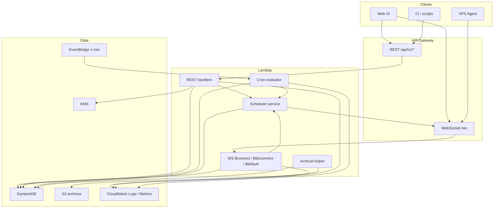

# AWS Layer (Control Plane)

This document describes the **AWS control plane** in depth: API Gateway, Lambda handlers, DynamoDB, S3, scheduling, WebSocket fan-out, and how those pieces talk to VPS agents.

Execution plane: [host-daemon.md](host-daemon.md). Overview: [architecture.md](architecture.md).  
REST: [api.md](api.md). WebSocket: [websocket.md](websocket.md). Install: [setup.md](setup.md). AWS deploy/update/teardown: [deploy-aws.md](deploy-aws.md). Ops index: [deploy.md](deploy.md). Local stack: [local-development.md](local-development.md).

---

## Responsibilities

The control plane owns:

| Concern                       | Implementation                                                 |
| ----------------------------- | -------------------------------------------------------------- |
| Public REST API               | API Gateway HTTP API + Lambda                                  |
| Real-time agent + UI channels | API Gateway WebSocket API + Lambda                             |
| Durable state                 | DynamoDB (on-demand)                                           |
| Long-term log archives        | S3                                                             |
| Session queue + assignment    | Scheduler service (invoked from REST/WS/cron)                  |
| Cron schedules                | EventBridge rule (1 min) → Cron Lambda                         |
| Authn / authz                 | Session cookies, API keys, basic auth (see [auth.md](auth.md)) |
| Integrations                  | Slack (and future webhooks) via KMS-encrypted config           |
| Audit trail                   | AuditLogs table                                                |

The control plane **does not** hold git credentials, SSH keys, or AI vendor API keys. Those live only on the VPS ([host-daemon.md](host-daemon.md), [security.md](security.md)). Authn/authz: [auth.md](auth.md).

---

## Stack Overview



### CDK package layout

```
services/cdk/
├── bin/auto-harness.ts
└── lib/
    ├── auto-harness-stack.ts   # top-level stack
    ├── api-gateway.ts          # REST + WebSocket APIs, routes, stages
    ├── lambda.ts               # function defs, env, IAM roles
    ├── dynamodb.ts             # tables, GSIs, TTL
    ├── s3.ts                   # archive bucket + lifecycle
    └── eventbridge.ts          # 1-minute schedule rule
```

Stack outputs (typical):

| Output              | Example use             |
| ------------------- | ----------------------- |
| `RestApiUrl`        | Web UI / CI base URL    |
| `WebSocketUrl`      | Agent `HARNESS_API_URL` |
| `ArchiveBucketName` | Ops / debug             |
| `Region`            | Client config           |

---

## API Gateway

### REST (HTTPS)

- Base path: `/api/v1`
- Auth: cookie JWT, `Authorization: Bearer hns_...`, or Basic (see [auth.md](auth.md))
- CORS: allow only the configured Web UI origin(s)
- Payload: JSON request/response; consistent error envelope (see [api.md](api.md))

Route groups map 1:1 to handler modules under `services/api/src/handlers/rest/`.

### WebSocket (WSS)

- Endpoint: `wss://…/ws` with `Authorization: Bearer …`
- Routes:
  - `$connect` — authenticate, write `Connections` row
  - `$disconnect` — delete connection; if agent, mark its worktrees offline / reconcile sessions
  - `$default` — parse JSON `{ type, … }`, dispatch by type
- Two logical client kinds after connect:
  - **Agent** — first app message `host:register`
  - **UI client** — first app message `client:register`

Keepalive: server `ping` every ~30s; agent/client `pong`. API Gateway idle timeout is respected via this heartbeat.

**Outbound push:** Lambda uses API Gateway Management API (`postToConnection`) with the stored `connectionId` from DynamoDB.

---

## Lambda Handlers

### Packaging and runtime

| Setting     | Recommendation                                                              |
| ----------- | --------------------------------------------------------------------------- |
| Runtime     | Node.js 20.x                                                                |
| Memory      | 256 MB (most handlers); raise only if profiling shows need                  |
| Timeout     | REST 10–15s; WS message 15–30s; cron 60s; archival 5 min if batched         |
| Bundling    | esbuild via CDK (one artifact per logical handler group or a shared router) |
| Concurrency | Unreserved by default; optional reserved concurrency for cron               |

### Handler inventory

| Group         | Triggers                                           | Responsibility                                                                 |
| ------------- | -------------------------------------------------- | ------------------------------------------------------------------------------ |
| Auth          | REST `/auth/*`                                     | Login/logout, users, service accounts, password change, `/auth/me`             |
| Sessions      | REST `/sessions/*`                                 | Create, list, get, cancel, clone, **resume**, logs; enqueue + invoke scheduler |
| Repositories  | REST `/repositories/*`                             | CRUD repos                                                                     |
| Worktrees     | REST `/worktrees/*`                                | Read models (written by agents)                                                |
| Agents        | REST `/agents/*`                                   | Connected agents derived from Connections + Worktrees                          |
| Schedules     | REST `/schedules/*`                                | CRUD + manual trigger                                                          |
| Integrations  | REST `/integrations/*`                             | Slack config (KMS encrypt/decrypt token)                                       |
| WS Connect    | `$connect`                                         | Validate token; store connection                                               |
| WS Disconnect | `$disconnect`                                      | Cleanup + agent offline handling                                               |
| WS Message    | `$default`                                         | Agent/client messages; log writes; status updates; subscribe                   |
| Cron          | EventBridge rate(1 minute)                         | Due schedules → sessions; stale-session sweep                                  |
| Scheduler     | Invoked in-process or as shared service from above | Match queue → worktrees; `session:assign`                                      |
| Archival      | On session terminal status (async invoke optional) | DynamoDB SessionLogs → S3 JSONL                                                |

Handlers share:

- `services/api/src/db/client.ts` — DynamoDB Document Client
- `services/api/src/services/scheduler.ts` — assignment logic
- `services/api/src/services/session-service.ts` — status transitions, validation
- `services/api/src/services/notification.ts` — Slack thread updates
- `modules/shared` — types, constants, Zod (or equivalent) schemas

Durable DynamoDB rows are authoritative across concurrent API workers and restarts. Process maps
may cache a working set, but REST reads and scheduling decisions read through the relevant durable
rows; startup hydration restores every durable catalog, session, worktree, connection, archive, and
historical session-log record. This avoids periodic full-state rehydration during normal requests.

### Environment variables (Lambda)

| Variable                         | Required  | Purpose                                        |
| -------------------------------- | --------- | ---------------------------------------------- |
| `HARNESS_ADMINS`                 | ✓         | Base64 JSON admin bootstrap list               |
| `HARNESS_SESSION_SECRET`         | ✓         | JWT signing for UI session cookies             |
| `TABLE_*` or single table prefix | ✓         | DynamoDB table names (from CDK)                |
| `ARCHIVE_BUCKET`                 | ✓         | S3 bucket name                                 |
| `WEB_ORIGIN`                     | ✓         | CORS allow-list origin                         |
| `WS_API_ENDPOINT`                | ✓         | Management API endpoint for `postToConnection` |
| `KMS_KEY_ID`                     | for Slack | Encrypt integration secrets                    |
| `HARNESS_RATE_LIMIT_*`           | optional  | REST buckets, window, fail mode, and WS budget |
| `AWS_REGION`                     | auto      | Region                                         |

---

## DynamoDB

### Tables and access patterns

| Table                   | PK                | SK            | GSIs                                          | Primary access patterns                                                    |
| ----------------------- | ----------------- | ------------- | --------------------------------------------- | -------------------------------------------------------------------------- |
| Users                   | `id`              | —             | `username`, `apiKeyHash`                      | Login by username; auth by key hash; list users                            |
| Repositories            | `id`              | —             | —                                             | CRUD by id; list all (scan or sparse GSI later if needed)                  |
| Sessions                | `id`              | —             | `status-createdAt`, `repositoryId-createdAt`  | Get by id; queue (`status=queued`); list by repo; sort/filter              |
| Schedules               | `id`              | —             | `repositoryId-nextRunAt`                      | List by repo; cron: due rows with `nextRunAt <= now`                       |
| SessionLogs             | `sessionId`       | `timestamp`   | —                                             | Append logs; range read for REST/history                                   |
| SessionConcurrencyLocks | `concurrencyId`   | —             | —                                             | Conditional acquire/release for active session dedupe and schedule overlap |
| Connections             | `connectionId`    | —             | `hostId`                                      | Connect/disconnect; find agent connection for assign                       |
| Worktrees               | `id`              | —             | `hostId`, `repositoryId-status` (recommended) | Idle matching for scheduler; list by agent/repo                            |
| AuditLogs               | `scope` (`audit`) | `timestampId` | —                                             | Append-only newest-first query; opaque cursors + exact filters             |
| RateLimits              | `bucketKey`       | —             | —                                             | Atomic actor/bucket fixed-window counters with TTL                         |
| Integrations            | `id`              | —             | —                                             | Get/put Slack config                                                       |

> Worktrees are **registered by agents** on `host:register` and updated on status changes. They are not created via REST.

**Capacity:** on-demand for all tables.

`AuditLogs.timestampId` is `<ISO createdAt>#<event id>`, so concurrent writers
remain totally ordered even when their timestamps are equal. The API cursor
encodes the last evaluated DynamoDB key and is opaque to callers. Audit table
writes are conditional inserts; no lifecycle code deletes or updates records.

### SessionLogs TTL and archival

1. Each log item written with `ttl` = now + **7 days** (epoch seconds). DynamoDB TTL deletes expired items at no charge.
2. On session reaching a terminal status (`completed` | `failed` | `cancelled` | `timed_out`), archival runs:
   - Query all SessionLogs for `sessionId`
   - Write `s3://…/sessions/{sessionId}/logs.jsonl`
   - Prefer **leaving DynamoDB rows for TTL** (no bulk delete cost) unless storage pressure requires explicit delete after successful S3 put
3. REST `GET /sessions/:id/logs` serves recent DynamoDB rows; archived-only sessions may stream from S3 (optional enhancement)

### Connections model

```json
{
  "connectionId": "abc123=",
  "type": "agent",
  "hostId": "vps-prod-1",
  "boundHostId": "vps-prod-1",
  "userId": null,
  "connectedAt": "2026-08-01T08:00:00Z"
}
```

UI connections store `type: "client"` and `userId` from the authenticated principal.

### Worktree model (control-plane view)

```json
{
  "id": "wt-1",
  "name": "codex-1",
  "hostId": "vps-prod-1",
  "repositoryId": "repo-abc",
  "path": "/home/harness/repos/my-app/.worktrees/wt-1",
  "labels": ["codex", "claude"],
  "status": "idle",
  "currentSessionId": null,
  "lastAssignedAt": "2026-08-01T11:00:00Z",
  "online": true
}
```

`online` (or equivalent) is cleared when the agent disconnects so the scheduler never assigns to stale worktrees.

---

## Scheduler

The scheduler is a **shared service** (not only a free-standing Lambda) invoked when:

- A session is created
- An agent registers / reconnects
- A worktree becomes idle (`worktree:status` or session terminal status)
- Cron creates scheduled sessions

### Assignment algorithm

1. **Load session** (must be `queued`).
2. **Native resume preference** — if a source route and `cliResumeRef` are available, prefer that host/worktree while it is idle, online, not draining, and the account is eligible. If it is unavailable, clear the native ref and placement pins, preserve `resumedFromSessionId`, and continue as a fresh target/fallback assignment.
3. **Target/fallback path** — for each target in order, filter candidates — worktrees where:
   - `repositoryId` matches session
   - `status === idle`
   - agent is **online** (active Connection for `hostId`)
   - not draining
   - `labels` is a superset of session `requiredLabels` (empty requirements → any labels)
   - Provider-backed targets have an attached account outside `usageLimitedUntil`; providerless commands have no account gate
4. If no candidates for this target, advance to the next fallback. If no target has candidates, leave session `queued` until its absolute `queueExpiresAt`; then fail `queue_expired`.
5. **Round-robin** among candidates:
   - Sort by `lastAssignedAt` ascending (missing/null first)
   - Tie-break by `worktreeId` ascending
   - Take the first
6. **Assign:**
   - Set worktree `status=busy`, `currentSessionId`, `lastAssignedAt=now`
   - `postToConnection` → `session:assign` payload
   - On agent `session:ack`: set session `status=running`, `worktreeId`, `startedAt`, `hostId`
7. If `postToConnection` fails (stale connection): mark agent offline; try the next eligible candidate/target or re-queue.

### Drain path (worktree free)

When a session ends or is cancelled:

1. Agent reports `session:status` and releases worktree locally
2. Control plane sets worktree `idle`, clears `currentSessionId`
3. Query highest-priority `queued` session matching that worktree’s labels + repository
4. Priority descending; ties by `createdAt` ascending (FIFO)
5. Run assignment steps above for that session

### Scheduled sessions (`type: scheduled`)

- Created by cron or `POST /schedules/:id/trigger`
- Assigned with `worktreeId: null` only to an **online, non-draining agent** whose live registration advertises both the repository and `scheduled-main-checkout`
- `HostLocks.mainCheckoutLeases[repositoryId]` is the durable exclusive lease, fenced to both `sessionId` and `connectionId`; it is acquired with the queued → running transition and released only by that exact terminal/retry/requeue transition
- Host selection is deterministic round-robin using the durable `lastScheduledAssignedAt` cursor; no worktree row is read or mutated
- An unacknowledged assignment releases immediately. An acknowledged disconnect keeps the lease for the 75-second reconnect grace, transfers it only when that exact session is reported by the replacement connection, and otherwise requeues/releases it.

Each session may carry an optional global exact-match `concurrencyId`. The scheduler acquires it
in the durable SessionConcurrencyLocks table before enqueueing; a duplicate manual create returns
the existing session (`200`, `created: false`). Terminal sessions release the lock for retry. This
is the scheduler's concurrency invariant, not a best-effort scan of session rows.

### Multi-agent behavior summary

| Situation                                 | Behavior                                                                                                   |
| ----------------------------------------- | ---------------------------------------------------------------------------------------------------------- |
| Several matching idle worktrees           | Round-robin by `lastAssignedAt`                                                                            |
| **Resume native route**                   | Prefer source agent/worktree; if unavailable, clear ref/pins and route fresh through target/fallback order |
| Matching worktrees only on offline agents | Stay `queued`                                                                                              |
| Agent is **draining** (auto-update)       | Exclude from new assigns; in-flight sessions continue ([Agent draining](#agent-draining))                  |
| Agent disconnect mid-session              | See [Disconnect handling](#disconnect-handling)                                                            |
| No agent has the repository registered    | Stay `queued` until some agent registers it                                                                |

---

## Cron Evaluator

Triggered every **60 seconds** by EventBridge.

```
1. Query Schedules where enabled=true and nextRunAt <= now
2. For each due schedule:
   a. Derive concurrencyId = explicit schedule value or `schedule-${scheduleId}`
   b. Acquire the schedule's due-fire claim and concurrency lock atomically
   c. If the lock is already held, skip creating a duplicate, advance `nextRunAt`, and leave
      `lastRunAt` unchanged
   d. Otherwise create Session { type: scheduled, source: schedule, concurrencyId, timeout,
      repositoryId, priority: 0 }, set `lastRunAt = now`, advance `nextRunAt`, and invoke scheduler
3. Stale-session sweep:
   - Sessions with status=running and (now - startedAt) > timeout + grace
     and no recent agent activity → mark timed_out, free worktree if still marked busy
```

Grace window (e.g. 60–120s) avoids racing a legitimate slow `session:status`.

The lock table is keyed by the exact `concurrencyId` and stores the active session id plus expiry
metadata. Conditional put is the write-side invariant; conditional delete on terminal transition
releases it only for the owning session.

---

## WebSocket routing (server)

Message types and live-tail behavior: **[websocket.md](websocket.md)**.

Server responsibilities only:

- `$connect` / `$disconnect` — Connections table; mark worktrees offline
- `$default` — dispatch by `type`; persist logs; fan-out to UI subscribers
- Replay last ~100 lines on `session:subscribe`
- `postToConnection` for `session:assign` / `session:cancel` / `ping`

## Agent draining

Used for **auto-update** and graceful agent restart. Protocol details: [host-daemon.md — Auto-update](host-daemon.md#auto-update-graceful-restart).

When the agent reports draining (e.g. `host:status` with `draining: true`, or register flag):

1. Keep the Connection row and treat the agent as **connected**
2. **Exclude all of its worktrees from the idle candidate set** for new `session:assign` (match + round-robin must not pick them)
3. Continue accepting `session:log` / `session:status` for sessions already running on that agent
4. Do **not** mark running sessions failed solely because the agent is draining
5. On disconnect after a completed drain, normal offline handling applies; on reconnect + register with `draining: false`, worktrees become schedulable again

If a `session:assign` was in flight when drain started, the agent nacks or fails the assign; the session remains `queued` for another agent/worktree.

---

## Disconnect handling

### Agent disconnect (`$disconnect` or failed post)

1. Delete Connection row for `connectionId`
2. Mark all worktrees for that `hostId` as offline (`online=false` or `status=error`/offline flag)
3. For sessions `running` on that agent:
   - Prefer **leave running briefly** (agent may reconnect and re-register in-progress sessions), or
   - After grace (e.g. 2 minutes) with no reconnect: mark `failed` or `timed_out`, clear worktree assignment so queue can move to other agents
4. Do **not** auto-reassign an in-flight session to another agent (workspace state is on the original disk)

### Agent reconnect

1. New `$connect` + `host:register` with current worktree inventory and any still-running local sessions
2. Control plane reconciles: worktrees online; running session IDs re-bound; queued sessions may assign to newly idle capacity

---

## S3 archival

| Item          | Value                                                      |
| ------------- | ---------------------------------------------------------- |
| Bucket        | `auto-harness-archives-{account-id}`                       |
| Object key    | `sessions/{sessionId}/logs.jsonl`                          |
| Format        | One JSON object per line: `{ timestamp, stream, content }` |
| Encryption    | SSE-S3 (or SSE-KMS if required)                            |
| Lifecycle     | Standard → IA @ 30d → Glacier @ 90d                        |
| Public access | Blocked                                                    |

IAM: only archival Lambda role can `s3:PutObject`; optional read role for UI “download archive”.

---

## KMS and integrations

- Slack bot token stored in Integrations table as ciphertext (`encryptedConfig`)
- Encrypt on write with `KMS_KEY_ID`; decrypt only in notification path when posting messages
- Never return raw token from REST GET (redacted)

See [integrations.md](integrations.md).

---

## IAM (least privilege sketch)

| Role            | Permissions                                                         |
| --------------- | ------------------------------------------------------------------- |
| REST Lambda     | DynamoDB R/W on app tables; KMS encrypt/decrypt; optional SES later |
| WS Lambda       | DynamoDB R/W; `execute-api:ManageConnections` on this API           |
| Cron Lambda     | DynamoDB R/W Sessions + Schedules; invoke scheduler path            |
| Archival Lambda | DynamoDB read/delete SessionLogs; S3 put on archive bucket          |
| EventBridge     | `lambda:InvokeFunction` on Cron only                                |

No Lambda role gets S3/DynamoDB access outside Auto-Harness resources.

---

## Observability

| Signal                  | Source                                                        |
| ----------------------- | ------------------------------------------------------------- |
| API latency / 4xx / 5xx | API Gateway + Lambda metrics                                  |
| Queue depth             | Custom metric or periodic count of `status=queued`            |
| Connected agents        | Count Connections `type=agent`                                |
| Assign failures         | Log + metric when `postToConnection` fails                    |
| Cron lag                | `nextRunAt` age for due schedules                             |
| Logs                    | CloudWatch Logs per function; retention 7–14 days recommended |

Alarms (recommended): Lambda errors, API 5xx, zero agents for N minutes, DLQ if used.

---

## Local stand-in

Express + `ws` wrapping the same handlers; DynamoDB Local. Commands and env: **[local-development.md](local-development.md)**.

## Security boundaries (AWS side)

```
✓ Password hashes, API key hashes, JWT secret
✓ Session metadata and prompts (treat prompts as sensitive operational data)
✓ Encrypted integration tokens (KMS)
✗ Repository git credentials
✗ AI vendor keys (OpenAI, Anthropic, …)
✗ Arbitrary shell from the control plane on customer code
```

Execution always happens on the agent. The control plane only **schedules and observes**.

---

## Related documents

| Doc                                          | Content                         |
| -------------------------------------------- | ------------------------------- |
| [setup.md](setup.md)                         | Deploy and env                  |
| [local-development.md](local-development.md) | Local DynamoDB + `pnpm local:*` |
| [api.md](api.md)                             | REST                            |
| [websocket.md](websocket.md)                 | Real-time protocol              |
| [host-daemon.md](host-daemon.md)             | Execution plane                 |
| [architecture.md](architecture.md)           | Flows                           |
| [auth.md](auth.md)                           | Authn / authz                   |
| [security.md](security.md)                   | Trust boundaries / hardening    |
| [costs.md](costs.md)                         | Cost model                      |
