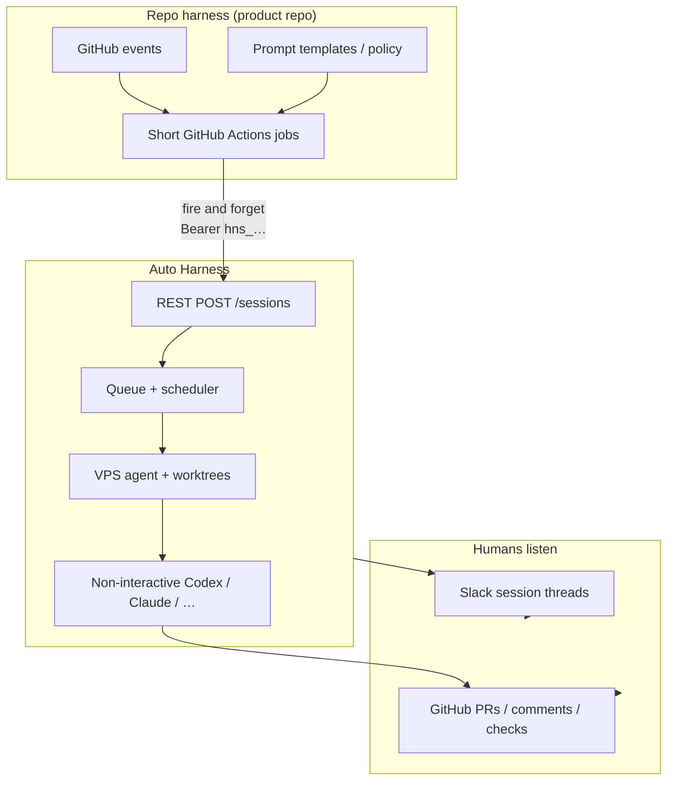
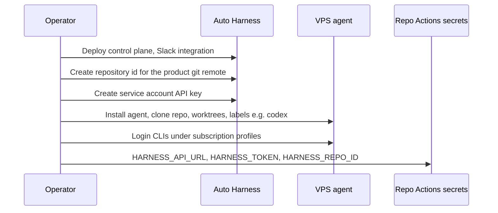
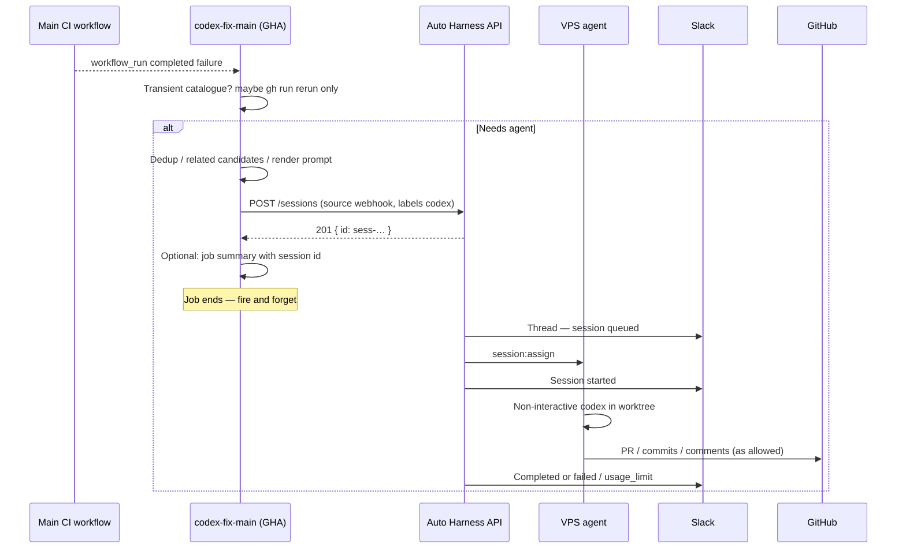
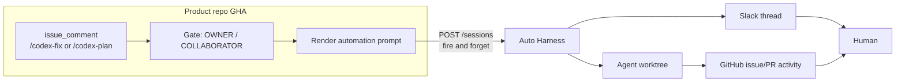
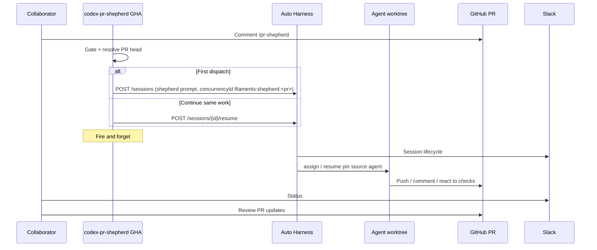
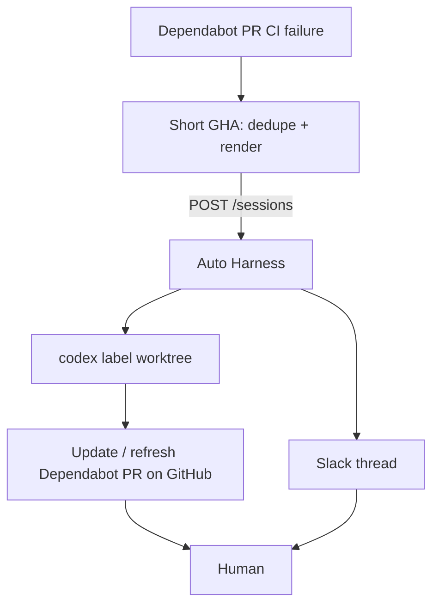
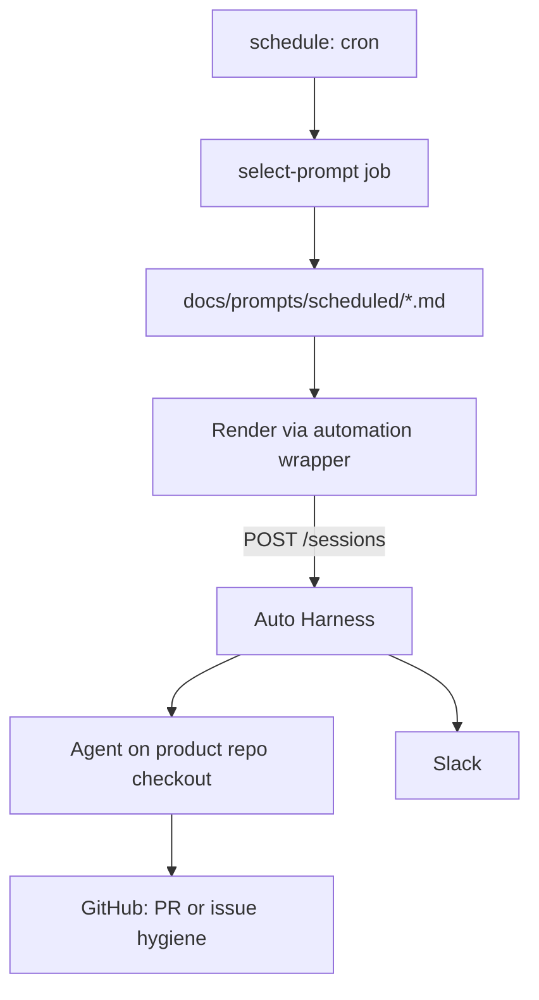
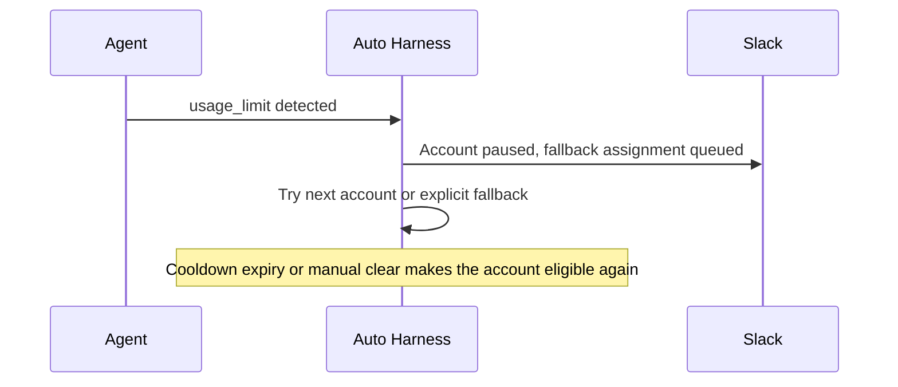
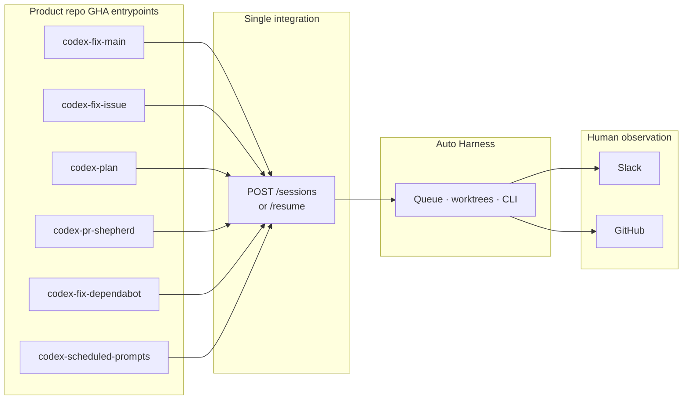

# Repo harness → Auto Harness

How a product repository’s **automation harness** (GitHub Actions, prompts, policy) hooks into **Auto Harness** (queue, worktrees, non-interactive CLIs).

Examples use a typical monorepo shape (`codex-*` workflow names, `docs/prompts/…`). Any product repo can copy the same pattern.

API: [api.md](api.md). Slack: [integrations.md](integrations.md). Why / cost model: [why.md](why.md), [costs.md](costs.md).

## Packaged automation

For GitHub workflows, `jonathanong/auto-harness/actions/dispatch@main` wraps the fire-and-forget
session create call and returns `session-id`, `session-url`, and `created` outputs. It accepts the
control-plane URL and service-account key as secrets plus repository, prompt, target JSON, and
optional ref/concurrency/metadata inputs; see [`actions/dispatch`](../actions/dispatch/README.md).

Node automation can use the dependency-free public `@auto-harness/client` package. Its methods
cover session create/read/cancel, repository list, and pause/drain/activate. HTTP failures are
`AutoHarnessError` instances with `status`, stable API `code`, and optional `retryAfter`.

The source contract for this supported subset is [`docs/openapi.yaml`](openapi.yaml). Direct HTTP
remains supported; all dispatch forms return after acceptance and never wait for completion.

---

## Requirements

### Auto Harness must provide

| Requirement                                  | Notes                                                                                              |
| -------------------------------------------- | -------------------------------------------------------------------------------------------------- |
| Fast `POST /sessions` (and `/resume`)        | Repo GHA is **fire and forget** — 201 + `id`, then the job ends                                    |
| Service-account auth                         | Actions secret `HARNESS_TOKEN` (`hns_…`)                                                           |
| Queue, labels, worktrees, multi-agent assign | Actually runs the CLI after GHA is gone                                                            |
| Non-interactive CLI execution                | Subscription path; not Agent SDKs ([why.md](why.md))                                               |
| Slack session lifecycle threads              | Primary harness-side status for unattended runs ([integrations.md](integrations.md))               |
| Terminal statuses including `usage_limit`    | Visible in Slack / API; account cooldown/fallback routing is automatic for provider-backed targets |
| Session id in Slack (and API)                | Resume, UI deep links                                                                              |
| Resume pins the source agent                 | Any eligible worktree there checks out the ref; unschedulable native resumes route fresh           |
| Cancel, timeout, agent drain-on-update       | Ops                                                                                                |

### Repo harness owns (out of scope for Auto Harness)

| Concern                              | Typical home in the product repo                                                               |
| ------------------------------------ | ---------------------------------------------------------------------------------------------- |
| Event triggers                       | `workflow_run`, `issue_comment`, cron                                                          |
| Policy before create                 | Transient CI triage, dedup, comment authz                                                      |
| Prompt content                       | `docs/prompts/…`, render actions                                                               |
| Trusted publish / write-token policy | If any — not the fire-and-forget create path                                                   |
| Usage-limit policy                   | Auto Harness pauses the account and tries ordered fallbacks; callers may still resume manually |
| Host sandbox / CLI hooks             | `.codex/`, bubblewrap, runner disk health                                                      |

### Human observation (not the trigger job)

| Channel    | What humans watch                                |
| ---------- | ------------------------------------------------ |
| **Slack**  | Session thread from Auto Harness                 |
| **GitHub** | PRs, comments, checks from agent work on the VPS |

---

## Two harnesses

| Layer            | Lives in                                             | Owns                                                                  |
| ---------------- | ---------------------------------------------------- | --------------------------------------------------------------------- |
| **Repo harness** | Product repo (`.github/workflows`, `docs/prompts/…`) | When to run, who may trigger, prompt text, dedup, triage, GitHub UX   |
| **Auto Harness** | Shared control plane + VPS agents                    | Queue, worktrees, spawn CLI, logs, Slack session threads, resume pins |



**Contract:** repo harness **creates a session and exits**. Auto Harness **runs the work**. Humans watch **Slack and/or GitHub**, not the trigger Actions job.

---

## Shared setup (once per org)



Each product repo only needs:

| Secret / var      | Purpose                                         |
| ----------------- | ----------------------------------------------- |
| `HARNESS_API_URL` | e.g. `https://harness.example.com`              |
| `HARNESS_TOKEN`   | Service account `hns_…`                         |
| `HARNESS_REPO_ID` | Control-plane repository id for this git remote |

Agent host maps that same `repositoryId` to a local checkout path in agent config ([setup.md](setup.md), [local-development.md](local-development.md)).

---

## Pattern A — Main CI failed → auto-fix session

**Typical workflow name:** `codex-fix-main` (after transient triage).  
**Hookup:** short job decides “needs Codex,” renders fix-main prompt, `POST /sessions`, done.



Illustrative step (after prompt is in `$PROMPT`):

```yaml
# .github/workflows/codex-fix-main.yml (conceptual)
- name: Dispatch Auto Harness session
  env:
    HARNESS_API_URL: ${{ secrets.HARNESS_API_URL }}
    HARNESS_TOKEN: ${{ secrets.HARNESS_TOKEN }}
    HARNESS_REPO_ID: ${{ secrets.HARNESS_REPO_ID }}
    PROMPT: ${{ steps.render.outputs.prompt }}
  run: |
    curl -fsS -X POST "${HARNESS_API_URL}/api/v1/sessions" \
      -H "Authorization: Bearer ${HARNESS_TOKEN}" \
      -H "Content-Type: application/json" \
      -d "$(jq -n \
        --arg repositoryId "$HARNESS_REPO_ID" \
        --arg prompt "$PROMPT" \
        '{
          repositoryId: $repositoryId,
          prompt: $prompt,
          target: { providerId: "prov-codex" },
          timeout: 6300,
          priority: 20,
          requiredLabels: ["codex"],
          source: "webhook"
        }')"
    # no poll — humans watch Slack + GitHub
```

---

## Pattern B — Issue comment `/codex-fix` or `/codex-plan`

**Typical workflows:** `codex-fix-issue` / `codex-plan` gate on `issue_comment`.  
**Hookup:** validate author association + command → render prompt → `POST /sessions` → exit.



| Comment       | Typical session intent                                                   |
| ------------- | ------------------------------------------------------------------------ |
| `/codex-fix`  | Implement fix; agent/GitHub surfaces PR or updates                       |
| `/codex-plan` | Plan-only prompt; outcome often issue comment or plan artifact via tools |

Same fire-and-forget API; only the **rendered prompt** (and maybe `priority` / `timeout`) changes.

---

## Pattern C — PR `/pr-shepherd`

**Typical workflow:** `codex-pr-shepherd` with long runner session + resume.  
**Hookup:** short gate job → `POST /sessions` with `concurrencyId: filaments:shepherd:<pr>` (first tick) or `POST /sessions/:id/resume` (continue on the same host) → exit. Repeated webhook/manual delivery receives the existing active session and does not queue a duplicate. Humans follow Slack + the PR on GitHub.



Resume is how the **repo harness** re-enters the prior CLI conversation and remote branch: pass the prior **session id** (from Slack, job summary, or a comment your gate stored). Auto Harness re-checks out the stored ref in any eligible worktree on the pinned agent; uncommitted worktree state is not preserved.

```bash
# Continue shepherd on the same agent with the stored ref re-established
curl -fsS -X POST "${HARNESS_API_URL}/api/v1/sessions/${SESSION_ID}/resume" \
  -H "Authorization: Bearer ${HARNESS_TOKEN}" \
  -H "Content-Type: application/json" \
  -d '{"prompt":"Continue pr-shepherd from current PR state.","concurrencyId":"filaments:shepherd:<pr>"}'
```

The create response is `201`/`created: true` for the first active run and `200`/`created: false`
with the existing session for a duplicate delivery. Once the run is terminal, the identity is
released and the next explicit delivery can retry it.

---

## Pattern D — Dependabot CI red

**Typical workflow:** `codex-fix-dependabot`.  
**Hookup:** on failed Dependabot PR workflow → render dependabot prompt → `POST /sessions` → humans watch Slack + the Dependabot PR on GitHub.



---

## Pattern E — Scheduled maintenance prompts

**Typical workflow:** `codex-scheduled-prompts` rotates `docs/prompts/scheduled/*.md`.  
**Hookup:** cron workflow selects + renders one prompt file → `POST /sessions` → done. Catalog stays **in the product repo**; Auto Harness only receives the final string.



Optional alternative: Auto Harness [schedules](api.md) with a fixed command that only runs a **repo-local** script (`node ci/run-scheduled-prompt.mts`)—selection logic still owned by prompt files on disk in the product repo.

---

## Pattern F — Usage limit then route around the account

Agent hits plan quota → session reports `usage_limit` → Auto Harness pauses that
Provider Account globally and immediately tries another eligible account or the
next explicit fallback. **Slack** shows the route/cooldown. Providerless pure
CLI commands do not pause an account. If every route is unavailable, the
session remains queued until its absolute queue TTL (8 days by default) and
then fails with `queue_expired`.



---

## End-to-end map (repo workflows → AH)



What **leaves** the long-running Actions runner: Codex process, multi-hour job, log babysitting in GHA.  
What **stays** in the product repo: event filters, triage, dedup, prompt files, comment gates—anything that finishes in minutes before the `curl`.

---

## Checklist for another repo

1. Register repo + service account in Auto Harness; put secrets in that repo’s Actions.
2. Run an agent with worktrees/labels matching `requiredLabels`.
3. For each automation entrypoint: **prepare prompt → `POST /sessions` → exit**.
4. Configure Slack; tell humans to watch **Slack + GitHub**, not the trigger workflow.
5. Use **resume** when the same CLI conversation and remote branch should continue; do not rely on dirty worktree state.

API details: [api.md](api.md). Why CLI/subscriptions: [why.md](why.md).
