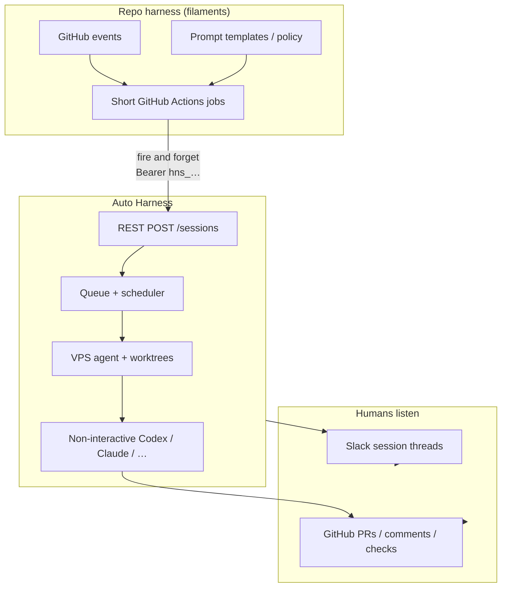
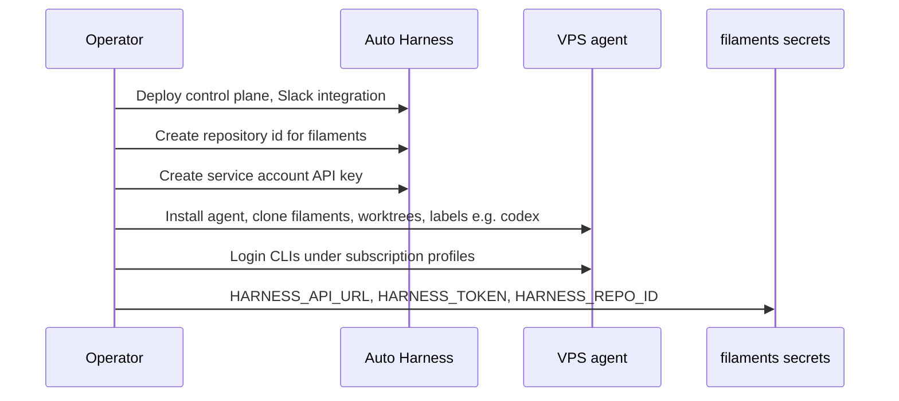
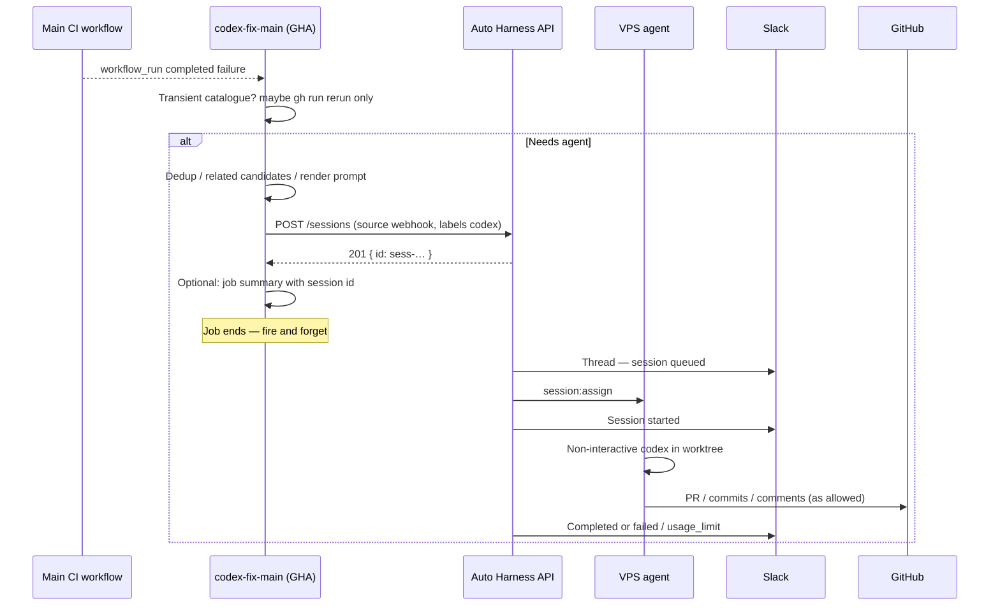
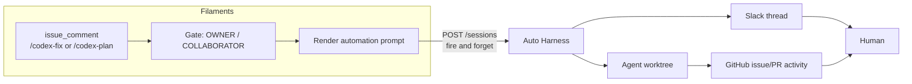
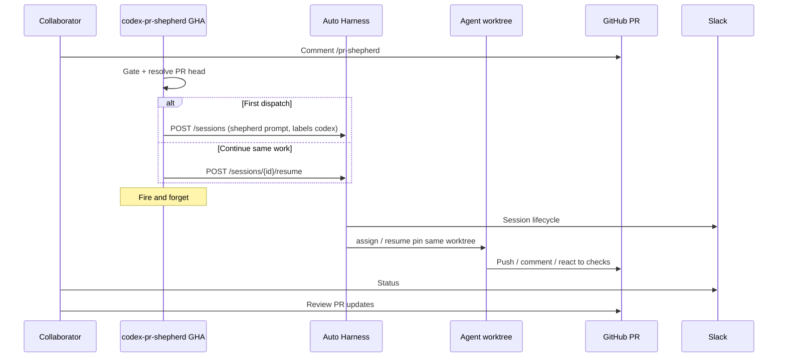
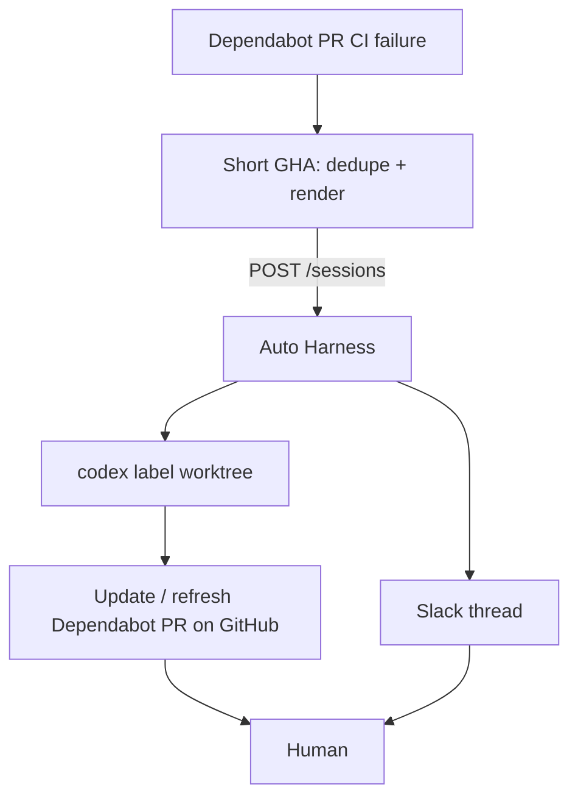
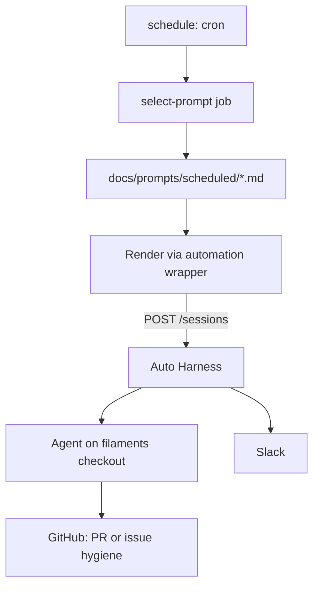
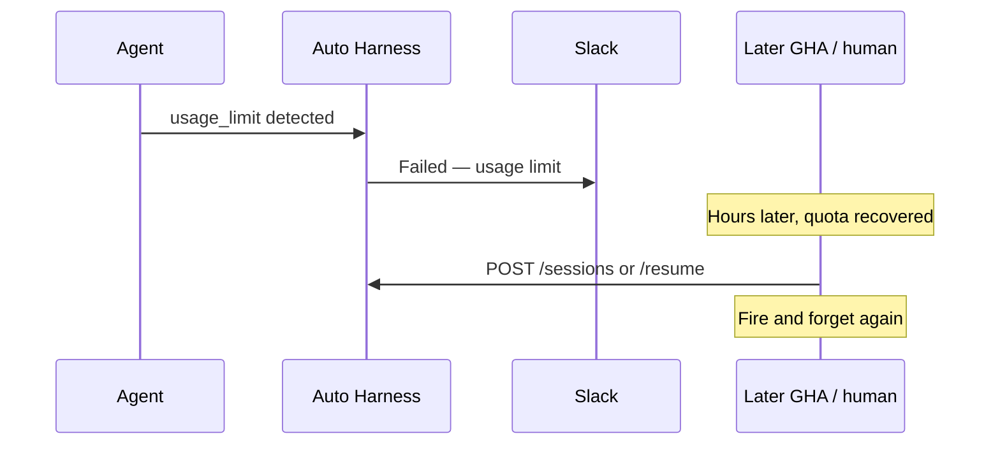
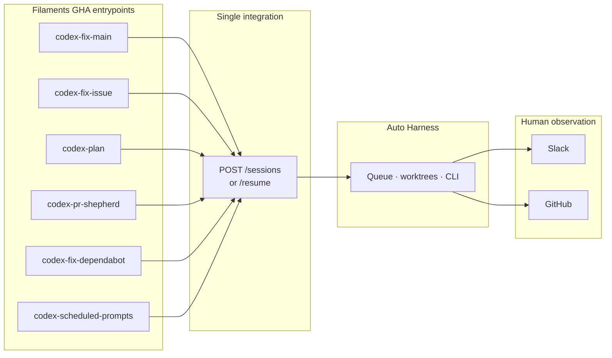

# Repo harness → Auto Harness

How a product repository’s **automation harness** (GitHub Actions, prompts, policy) hooks into **Auto Harness** (queue, worktrees, non-interactive CLIs).

Examples use **filaments** (internal monorepo) naming and flows. Any monorepo can copy the same shape.

API: [api.md](api.md). Slack: [integrations.md](integrations.md). Why / cost model: [why.md](why.md), [costs.md](costs.md).

---

## Requirements

### Auto Harness must provide

| Requirement                                  | Notes                                                                                |
| -------------------------------------------- | ------------------------------------------------------------------------------------ |
| Fast `POST /sessions` (and `/resume`)        | Repo GHA is **fire and forget** — 201 + `id`, then the job ends                      |
| Service-account auth                         | Actions secret `HARNESS_TOKEN` (`hns_…`)                                             |
| Queue, labels, worktrees, multi-agent assign | Actually runs the CLI after GHA is gone                                              |
| Non-interactive CLI execution                | Subscription path; not Agent SDKs ([why.md](why.md))                                 |
| Slack session lifecycle threads              | Primary harness-side status for unattended runs ([integrations.md](integrations.md)) |
| Terminal statuses including `usage_limit`    | Visible in Slack / API; caller decides retries                                       |
| Session id in Slack (and API)                | Resume, UI deep links                                                                |
| Resume pins same agent + worktree            | Shepherd / multi-tick work                                                           |
| Cancel, timeout, agent drain-on-update       | Ops                                                                                  |

### Repo harness owns (out of scope for Auto Harness)

| Concern                              | Example in filaments                              |
| ------------------------------------ | ------------------------------------------------- |
| Event triggers                       | `workflow_run`, `issue_comment`, cron             |
| Policy before create                 | Transient CI triage, dedup, comment authz         |
| Prompt content                       | `docs/prompts/…`, render actions                  |
| Trusted publish / write-token policy | If any — not the fire-and-forget create path      |
| Usage-limit _retry scheduling_       | Later GHA, human, or poller → new `POST` / resume |
| Host sandbox / CLI hooks             | `.codex/`, bubblewrap, runner disk health         |

### Human observation (not the trigger job)

| Channel    | What humans watch                                |
| ---------- | ------------------------------------------------ |
| **Slack**  | Session thread from Auto Harness                 |
| **GitHub** | PRs, comments, checks from agent work on the VPS |

---

## Two harnesses

| Layer            | Lives in                                                            | Owns                                                                  |
| ---------------- | ------------------------------------------------------------------- | --------------------------------------------------------------------- |
| **Repo harness** | Product repo (e.g. filaments `.github/workflows`, `docs/prompts/…`) | When to run, who may trigger, prompt text, dedup, triage, GitHub UX   |
| **Auto Harness** | Shared control plane + VPS agents                                   | Queue, worktrees, spawn CLI, logs, Slack session threads, resume pins |



**Contract:** repo harness **creates a session and exits**. Auto Harness **runs the work**. Humans watch **Slack and/or GitHub**, not the trigger Actions job.

---

## Shared setup (once per org)



Filaments (or any repo) only needs:

| Secret / var      | Purpose                                         |
| ----------------- | ----------------------------------------------- |
| `HARNESS_API_URL` | e.g. `https://harness.example.com`              |
| `HARNESS_TOKEN`   | Service account `hns_…`                         |
| `HARNESS_REPO_ID` | Control-plane repository id for this git remote |

Agent host maps that same `repositoryId` to a local checkout path in agent config ([setup.md](setup.md), [local-development.md](local-development.md)).

---

## Pattern A — Main CI failed → auto-fix session

**Today in filaments:** `codex-fix-main` (after transient triage).  
**Hookup:** short job decides “needs Codex,” renders fix-main prompt, `POST /sessions`, done.



Illustrative step (after prompt is in `$PROMPT`):

```yaml
# filaments/.github/workflows/codex-fix-main.yml (conceptual)
- name: Dispatch Auto Harness session
  env:
    HARNESS_API_URL: ${{ secrets.HARNESS_API_URL }}
    HARNESS_TOKEN: ${{ secrets.HARNESS_TOKEN }}
    HARNESS_REPO_ID: ${{ secrets.HARNESS_REPO_ID }}
    PROMPT: ${{ steps.render.outputs.prompt }}
  run: |
    curl -fsS -X POST "${HARNESS_API_URL}/api/v1/sessions" \
      -H "Authorization: Bearer ${HARNESS_TOKEN}" \
      -H "Content-Type: application/json" \
      -d "$(jq -n \
        --arg repositoryId "$HARNESS_REPO_ID" \
        --arg prompt "$PROMPT" \
        '{
          repositoryId: $repositoryId,
          prompt: $prompt,
          command: "codex -p",
          timeout: 6300,
          priority: 20,
          requiredLabels: ["codex"],
          source: "webhook"
        }')"
    # no poll — humans watch Slack + GitHub
```

---

## Pattern B — Issue comment `/codex-fix` or `/codex-plan`

**Today:** `codex-fix-issue` / `codex-plan` gate on `issue_comment`.  
**Hookup:** validate author association + command → render prompt → `POST /sessions` → exit.



| Comment       | Typical session intent                                                   |
| ------------- | ------------------------------------------------------------------------ |
| `/codex-fix`  | Implement fix; agent/GitHub surfaces PR or updates                       |
| `/codex-plan` | Plan-only prompt; outcome often issue comment or plan artifact via tools |

Same fire-and-forget API; only the **rendered prompt** (and maybe `priority` / `timeout`) changes.

---

## Pattern C — PR `/pr-shepherd`

**Today:** `codex-pr-shepherd` with long runner session + resume.  
**Hookup:** short gate job → `POST /sessions` (first tick) or `POST /sessions/:id/resume` (continue same worktree) → exit. Humans follow Slack + the PR on GitHub.



Resume is how the **repo harness** re-enters without losing the workspace: pass the prior **session id** (from Slack, job summary, or a comment your gate stored).

```bash
# Continue shepherd on same agent + worktree
curl -fsS -X POST "${HARNESS_API_URL}/api/v1/sessions/${SESSION_ID}/resume" \
  -H "Authorization: Bearer ${HARNESS_TOKEN}" \
  -H "Content-Type: application/json" \
  -d '{"prompt":"Continue pr-shepherd from current PR state."}'
```

---

## Pattern D — Dependabot CI red

**Today:** `codex-fix-dependabot`.  
**Hookup:** on failed Dependabot PR workflow → render dependabot prompt → `POST /sessions` → humans watch Slack + the Dependabot PR on GitHub.



---

## Pattern E — Scheduled maintenance prompts

**Today:** `codex-scheduled-prompts` rotates `docs/prompts/scheduled/*.md`.  
**Hookup:** cron workflow selects + renders one prompt file → `POST /sessions` → done. Catalog stays **in filaments**; Auto Harness only receives the final string.



Optional alternative: Auto Harness [schedules](api.md) with a fixed command that only runs a **repo-local** script (`node ci/run-scheduled-prompt.mts`)—selection logic still owned by filaments files on disk.

---

## Pattern F — Usage limit then try again later

Agent hits plan quota → session `failed` + `errorCode: usage_limit` → **Slack** shows it.  
Retry is **outside** Auto Harness: human, later GHA, or filaments poller creates a **new** session or **resume**.



---

## End-to-end map (filaments workflows → AH)



What **leaves** the long-running Actions runner: Codex process, multi-hour job, log babysitting in GHA.  
What **stays** in filaments: event filters, triage, dedup, prompt files, comment gates—anything that finishes in minutes before the `curl`.

---

## Checklist for another repo

1. Register repo + service account in Auto Harness; put secrets in that repo’s Actions.
2. Run an agent with worktrees/labels matching `requiredLabels`.
3. For each automation entrypoint: **prepare prompt → `POST /sessions` → exit**.
4. Configure Slack; tell humans to watch **Slack + GitHub**, not the trigger workflow.
5. Use **resume** when the same worktree context must continue.

API details: [api.md](api.md). Why CLI/subscriptions: [why.md](why.md).
