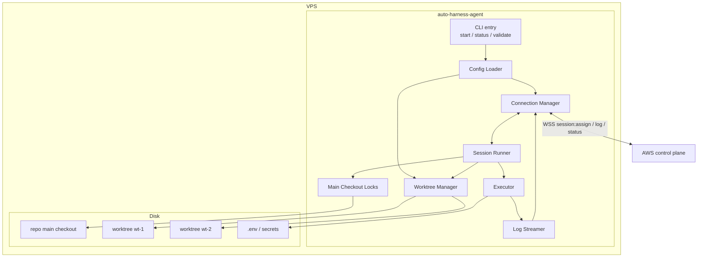
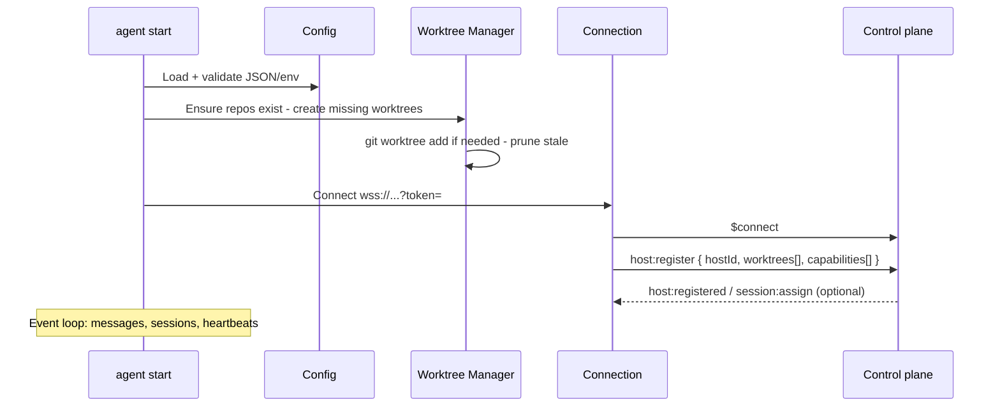
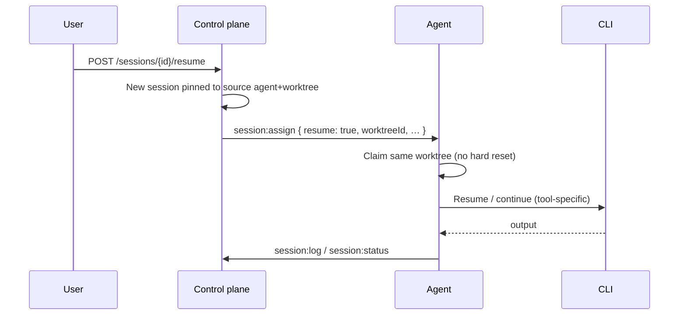
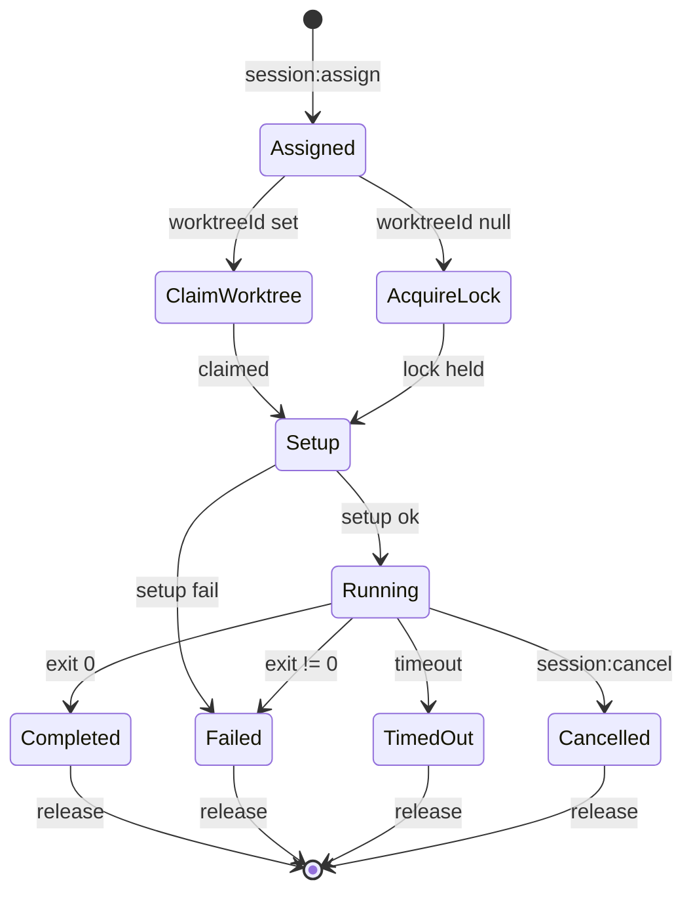
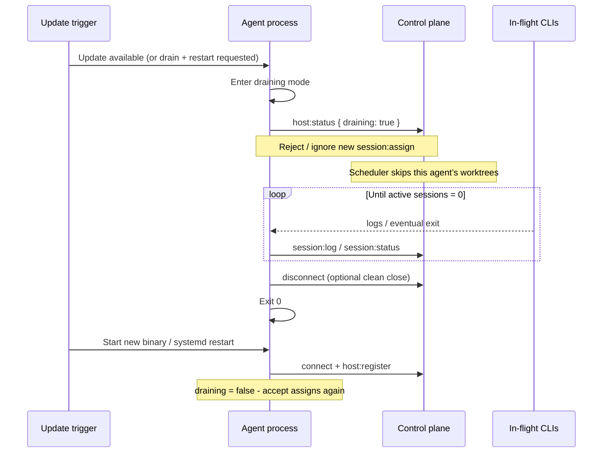

# Agent Layer (VPS Execution Plane)

Internals of the VPS daemon: process model, worktrees, executor, recovery.

| Need                       | Doc                                          |
| -------------------------- | -------------------------------------------- |
| Install / config / systemd | [setup.md](setup.md)                         |
| Local stack / e2e          | [local-development.md](local-development.md) |
| CLI commands               | [cli.md](cli.md)                             |
| Wire protocol              | [websocket.md](websocket.md)                 |
| Control plane              | [aws.md](aws.md)                             |

---

## Responsibilities

The agent owns:

| Concern                   | Implementation                                                    |
| ------------------------- | ----------------------------------------------------------------- |
| Outbound control channel  | Persistent WebSocket client to the control plane                  |
| Workspace concurrency     | Pre-provisioned git worktrees (one session per worktree)          |
| Process execution         | `node-pty` / `child_process` for setup scripts and AI CLIs        |
| Main-checkout maintenance | Serial lock per repository for `scheduled` sessions               |
| Live output               | Buffered stdout/stderr/system log streaming                       |
| Local secrets             | AI vendor keys, git credentials, `.env` files (never sent to AWS) |
| Inventory reporting       | Worktree list + status on register and on change                  |

The agent **does not** implement the global queue, multi-agent round-robin, or durable session storage. Those live in the [AWS layer](aws.md).

---

## Runtime Overview



### Package layout

```
services/host-daemon/
├── src/
│   ├── index.ts              # CLI entry (start, status, …)
│   ├── config.ts             # load + validate config / env
│   ├── connection.ts         # WebSocket client, reconnect, routing
│   ├── worktree-manager.ts   # create, claim, release, status
│   ├── session-runner.ts     # session orchestration
│   ├── executor.ts           # spawn + PTY + timeout + signals
│   ├── log-streamer.ts       # buffer, rate-limit, emit
│   ├── main-lock.ts          # per-repo main checkout mutex
│   └── types.ts              # agent-local types
└── package.json
```

---

## Startup Sequence



On validation failure (missing repo path, bad JSON, missing key), the process exits non-zero before connecting.

---

## Internal Components

### Connection Manager

- Opens WebSocket with `Authorization: Bearer <apiKey>` (the key is kept out of URL/query logs)
- Sends `host:register` immediately after open
- Routes inbound messages by `type` to Session Runner
- Auto-reconnect with exponential backoff: 1s → 2s → 4s → … → **max 60s**
- On reconnect: re-register full inventory + any **in-progress** sessions still running locally
- Responds to server `ping` with `pong`
- Handles `post` failures only as disconnect (server detects stale connections separately)

Outbound message types: `host:register`, `session:ack`, `session:log`, `session:status`, `worktree:status`, `pong`.

### Config Loader

- Merge file + env
- Resolve absolute paths
- Validate unique worktree ids, non-overlapping paths, non-empty `hostId`
- Expose immutable config snapshot to other modules

### Worktree Manager

| Operation       | Behavior                                                                               |
| --------------- | -------------------------------------------------------------------------------------- |
| `ensureAll()`   | On startup: `git worktree list`; create missing via `git worktree add <path> <branch>` |
| `claim(id)`     | Local mutex: fail if already busy; set busy + `currentSessionId`                       |
| `release(id)`   | Clear session; set idle; emit `worktree:status`                                        |
| `snapshot()`    | Array for `host:register` and status CLI                                               |
| `markError(id)` | On unexpected git failures; report status `error`                                      |

**Concurrency:** number of configured worktrees. Each worktree runs **at most one** session at a time.

Worktree records in DynamoDB are written by the control plane from register/status messages; the agent is source of truth for **local** busy/idle.

### Session Runner

Orchestrates a single session after `session:assign`:

1. Validate payload (`sessionId`, `repositoryId`, `resolvedArgv`, `timeout`, optional `worktreeId`, `prompt`, `setupScript`, `resume`, `resumedFromSessionId`, `cliResumeRef`, and non-secret route metadata)
2. If `worktreeId` set → claim worktree; else → acquire main-checkout lock for `repositoryId`
3. Send `session:ack`
4. **Setup:**
   - Normal run: run setup script (may reset branch / install)
   - **Resume** (`resume: true`): **skip destructive setup** (no `git reset --hard` / wipe). Optional light `resumeSetup` only if configured; default is leave the worktree as-is
5. Spawn primary command via Executor (resume-aware argv when `resume: true`)
6. Pipe output to Log Streamer
7. On exit / timeout / cancel → `session:status`, release claim/lock, emit worktree status
8. If the CLI prints a resumable conversation/session id, capture and send it in status metadata as `cliResumeRef` for later resumes

Concurrent sessions: one runner instance per claimed worktree (and at most one main-lock session per repo).

### Session resume

Operators resume by session id via the control plane: [`POST /sessions/:id/resume`](api.md#post-sessionsidresume). The control plane first prefers the source session's native route. If that route is no longer schedulable, it discards the stored `cliResumeRef` and placement pins, preserves `resumedFromSessionId`, and schedules a fresh run through the configured target and ordered fallbacks. The agent then tries native resume only when the assignment includes a usable route.



#### Placement (control plane)

| Rule           | Behavior                                                                                |
| -------------- | --------------------------------------------------------------------------------------- |
| Prefer         | Try the source `hostId` + `worktreeId` and native `cliResumeRef` first                  |
| Re-route       | If unavailable, clear `cliResumeRef` and placement pins, then use target/fallback order |
| Preserve       | Keep `resumedFromSessionId` on the fresh assignment for audit/history                   |
| Same host disk | Native resume only makes sense on the machine that still has the worktree files         |

#### How the agent “tries to resume”

Order of preference:

1. **Native CLI resume** — if `cliResumeRef` is present (or the tool can resume by worktree path / last session), invoke the tool’s resume/continue mode (tool-specific flags; mapped in agent config per command family).
2. **Workspace continue** — same worktree cwd, spawn the usual command with the **continuation prompt** so the model sees existing dirty tree / branch / files from the prior run.
3. **Fresh route** — if the native route cannot be scheduled, discard the native ref/pins and execute the normal target/fallback chain. This is a fresh CLI run, but retains `resumedFromSessionId`.

#### Must / must not

| Must                                                                     | Must not                                                                                                               |
| ------------------------------------------------------------------------ | ---------------------------------------------------------------------------------------------------------------------- |
| Use the assigned `worktreeId` only when native resume is selected        | Run full “fresh session” setup that discards prior work (`reset --hard` to main, delete branch, etc.) on native resume |
| Stream logs and honor timeout/cancel as usual                            | Silently fall back to another worktree                                                                                 |
| Preserve git working tree state from the prior session for native resume | Assume every CLI has native resume — a fresh fallback route is valid when native resume is unschedulable               |

#### Capturing `cliResumeRef`

When a CLI emits a session/conversation id, parse and return it on terminal `session:status` (or a dedicated field). The control plane stores it on the session row and passes it back in `session:assign` only for a native-route resume. A provider/account/route id is diagnostic metadata; it never changes the daemon's command resolution.

### Executor

**Goals:** correct TTY behavior for AI CLIs; no shell injection of prompts; **non-interactive** invocation suitable for **subscription-plan** CLIs (not Agent SDKs)—see [why.md](why.md) and [costs.md](costs.md).

#### Command execution model

| Piece             | Rule                                                                                                                                                                                                                                                                                                                                      |
| ----------------- | ----------------------------------------------------------------------------------------------------------------------------------------------------------------------------------------------------------------------------------------------------------------------------------------------------------------------------------------- |
| Spawn             | Prefer **argv array** / `node-pty` spawn **without** `shell: true`                                                                                                                                                                                                                                                                        |
| `resolvedArgv`    | From `session:assign` — already resolved control-plane-side from the selected target/fallback (**non-interactive CLI** form, e.g. `codex exec` / print flags, `claude -p`, not an Agent SDK process). The agent does zero provider/account/command resolution — an empty `resolvedArgv` is a defensive error (`unknown_command_profile`). |
| Route metadata    | Optional non-secret `targetIndex`, `commandId`, and `providerAccountId` breadcrumbs for logs and UI diagnostics. They are never used to select a command or credentials.                                                                                                                                                                  |
| `prompt`          | Already appended as the final `resolvedArgv` element when the Command's `appendPrompt` is true — **never** interpolated into a shell string                                                                                                                                                                                               |
| Working directory | Worktree path, or main repo path for scheduled sessions                                                                                                                                                                                                                                                                                   |
| Environment       | Small baseline (`PATH`, home/temp/locale/terminal fields) plus explicit `HARNESS_CHILD_ENV_ALLOWLIST`; control-plane `HARNESS_*` credentials are never inherited. Repo-local env files may be sourced only inside trusted setup scripts.                                                                                                  |
| Timeout           | A single deadline covers checkout checks, setup, and the primary command. Running processes receive SIGTERM, then SIGKILL after a 5-second grace period; report `timed_out`.                                                                                                                                                              |
| Cancel            | `session:cancel` aborts setup or the primary command through the same SIGTERM → 5s → SIGKILL chain; report exactly one `cancelled` terminal status.                                                                                                                                                                                       |

Example (illustrative):

```text
assign.resolvedArgv = ["codex", "exec", "Fix the failing test"]  // computed control-plane-side

→ argv: ["codex", "exec", "Fix the failing test"]  // spawned as-is, no further resolution
→ cwd:  /home/harness/repos/my-app/.worktrees/wt-1
→ pty:  yes (cols/rows default 120x40)
```

If a site needs a full shell pipeline for maintenance, use a **scheduled** session whose `command` is a fixed script path on disk (e.g. `/home/harness/scripts/daily-update.sh`) rather than untrusted prompt text.

#### Signals and exit

| Event                    | Action                                                                |
| ------------------------ | --------------------------------------------------------------------- |
| Process exit 0           | `status: completed`, `exitCode: 0`                                    |
| Process exit ≠ 0         | `status: failed`, `exitCode`                                          |
| **Usage limit detected** | stop session → `status: failed`, `errorCode: usage_limit` (see below) |
| Timeout                  | kill → `status: timed_out`                                            |
| Cancel                   | kill → `status: cancelled`                                            |
| Setup non-zero           | no primary spawn → `status: failed`                                   |

#### Usage limits (AI vendor / CLI quotas)

AI CLIs often hit **plan or rate limits** (monthly quota, TPM/RPM, “you've hit your limit”, etc.). Auto Harness reports the limit and lets the control plane pause the assigned account, try another eligible account/fallback, or queue-wait for cooldown recovery.

**Policy: parse → report → let the control plane route.**

1. While the session runs, the executor scans **stdout and stderr** (and final process output) for known usage-limit patterns.
2. On a match (even if the process has not exited yet):
   - Emit a `system` log line, e.g. `[system] Usage limit detected — releasing session for fallback routing`
   - Stop the session process with the normal signal chain (SIGTERM → wait → SIGKILL) so the worktree can be released
   - Report `session:status` with `status: failed`, `errorCode: "usage_limit"`, optional `errorMessage` (short excerpt), and `exitCode` if already known; do not retry or resolve a fallback on the host
3. Report `session:status` with `status: failed`, `errorCode: "usage_limit"`; the control plane pauses the assigned Provider Account globally for its configured cooldown (default 5 hours), releases the worktree, and immediately tries the next eligible account or explicit fallback.
4. Providerless commands (`providerId: null`) still report `usage_limit`, but no account is paused; the control plane may try the next fallback or leave the session queued. A queued session remains eligible until its absolute `queueTtlSeconds` expires (default 8 days), then fails with `queue_expired`.

**What counts as a usage-limit error (parse targets):**

Matchers are case-insensitive substrings / light regexes maintained in the agent (extensible per CLI). Examples:

| Family                   | Example signals in output                                                                 |
| ------------------------ | ----------------------------------------------------------------------------------------- |
| Generic                  | `usage limit`, `rate limit`, `rate_limit`, `quota exceeded`, `quota_exceeded`             |
| OpenAI / Codex-style     | `insufficient_quota`, `You exceeded your current quota`, `Rate limit reached`             |
| Anthropic / Claude-style | `rate_limit_error`, `usage limit`, `monthly limit`                                        |
| HTTP-ish in logs         | `429`, `Too Many Requests` when clearly tied to the provider API (not the app under test) |

Prefer **provider-specific phrases** over bare `429` when possible, to avoid false positives from the **customer application's** own rate limits in tests. If both could match, require a provider/CLI context line nearby or an allowlist of patterns only from known tools.

**What is not a usage limit:**

- App under test returning 429
- GitHub API secondary rate limits during a push (unless classified separately later)
- Agent host OOM / missing CLI → ordinary `failed` without `usage_limit`
- Auto Harness API rate limits (control plane `429`) — separate; see [api.md](api.md) / [security.md](security.md#rate-limiting)

Account cooldown is not a general retry policy: ordinary command failures, timeouts, and cancellations remain terminal. Only `usage_limit` invokes account cooldown/fallback routing. Cooldown duration is configurable per Provider Account, and operators can clear it manually.

### Log Streamer

- Attach to PTY data / stdout / stderr
- Tag `stream`: `stdout` | `stderr` | `system`
- Add ISO timestamps
- **Rate limit:** default max ~10 WebSocket messages/sec/session
- **Batch:** coalesce lines up to `logBatchMaxLines` or `logBatchMaxWaitMs`
- Emit `session:log` via Connection Manager. Per-session output is capped (32 KiB per chunk, 256 KiB retained for output classification, and at most 10,000 streamed chunks / 10 MiB retained logs), and sequence numbers continue after a reassignment/retry.
- Serialize outbound messages FIFO. The daemon flushes queued logs before it sends a terminal `session:status`; a failed send is reported but does not permanently block later messages.
- On backpressure: drop or coalesce with a system warning line (prefer coalesce)

Control plane persists logs and fans out to UI subscribers ([aws.md](aws.md)).

### Main Checkout Locks

For `type: scheduled` / `worktreeId: null`:

- One FIFO async mutex **per `repositoryId`** on this agent; different repositories remain parallel.
- Waiting consumes the session deadline. Cancellation or timeout removes the waiter without running setup, the command, or a terminal hook in the busy checkout.
- The lock covers branch preparation, setup, the command, and the terminal hook, and is released in `finally` on every outcome.
- Until the capability-gated dispatcher is deployed, scheduled sessions remain
  queued. That dispatcher will add its own per-host/repository lease; the local
  mutex remains defense in depth for each capable daemon.

---

## Worktrees

### Lifecycle

1. Operator configures worktrees in agent config (paths + labels)
2. Agent creates missing worktrees on startup
3. Control plane learns inventory via `host:register`
4. Scheduler assigns sessions to idle matching worktrees ([round-robin](aws.md#scheduler))
5. Setup script resets branch/deps at **session start**
6. Worktree is reused across sessions (not deleted after each run)

### Labels

Same model as GitHub Actions runner labels:

- Session `requiredLabels: ["codex"]` → worktree must include `codex`
- Worktree `["codex","claude"]` can run either
- `requiredLabels: []` → any worktree
- Multiple labels → **all** required (AND)

### Setup scripts

Run at the start of each session in the session cwd (worktree or main):

```bash
git fetch && git reset --hard origin/main && pnpm install
```

```bash
git checkout -b claude/auto-harness/$(date +%s) && git fetch && git reset --hard origin/main && pnpm install
```

```bash
source /home/harness/.env.codex && git fetch && git reset --hard origin/main
```

Non-zero exit → session `failed`, worktree released.

### Disk layout (example)

```text
/home/harness/
├── .env                          # HARNESS_HOST_ID, HARNESS_API_URL, HARNESS_API_KEY
├── .env.codex                    # chmod 600 — AI CLI credentials
├── repos/
│   └── my-app/                   # main checkout (paths configured via API/UI)
│       ├── .git/
│       └── .worktrees/
│           ├── wt-1/
│           └── wt-2/
└── harness/                      # cloned auto-harness monorepo (agent code)
```

Host inventory (repo paths, worktrees, attached Provider Accounts) is **not** a local file — configure with `PUT /api/v1/hosts/:hostId/inventory` or the Agents UI. Commands themselves live in the global Provider/Provider Account/Command catalog, not host inventory.

---

## Session Lifecycle (agent view)



### Inbound `session:assign` (typical fields)

```json
{
  "type": "session:assign",
  "sessionId": "sess-x1y2z3",
  "repositoryId": "repo-abc",
  "prompt": "Fix the failing test",
  "command": "codex -p",
  "timeout": 1800,
  "worktreeId": "wt-1",
  "setupScript": "git fetch && git reset --hard origin/main && pnpm install"
}
```

`worktreeId: null` → scheduled/main checkout path.

### Queue behavior (what the agent sees)

The agent does **not** pull a global queue. It only:

1. Accepts `session:assign` when the control plane chooses this worktree/agent
2. Reports idle via status/release so the control plane can **drain** the next queued session

If all matching worktrees are busy (possibly on other agents), the session stays `queued` in DynamoDB until capacity frees. Multi-agent **match then round-robin** is entirely control-plane logic ([aws.md](aws.md#scheduler)).

---

## Non-Worktree Sessions (Scheduled)

|                | Worktree session          | Non-worktree session              |
| -------------- | ------------------------- | --------------------------------- |
| Runs in        | Dedicated worktree        | Main repo checkout                |
| Concurrency    | Parallel (1 per worktree) | Serial (1 per repo on this agent) |
| Typical use    | AI coding prompts         | Maintenance scripts               |
| Created by     | API, UI, webhook          | Schedules, manual trigger         |
| Session `type` | `prompt`                  | `scheduled`                       |

Example maintenance commands (fixed scripts preferred):

```bash
git pull && pnpm install
pnpm lint:fix && git add -A && git commit -m 'chore: lint' && git push
pnpm audit fix && git add -A && git commit -m 'chore: security' && git push
```

Before a scheduled run, the daemon requires the main checkout to be clean,
including untracked files, and switches to `ref` or the configured default
branch without detaching or resetting. Scheduled refs are branch names; tags
and commit SHAs are rejected. A configured setup script is trusted operator
code and runs inside this locked main checkout, so destructive setup belongs
only in an explicitly chosen maintenance policy.

Capable daemons advertise `scheduled-main-checkout` during registration. The
control-plane dispatcher is deployed only after this capability, and excludes
older daemons that omit it.

---

## Auto-update (graceful restart)

Each agent service supports **auto-update** of the agent binary/package without interrupting in-flight AI CLI work.

### Goals

| Goal                      | Behavior                                                                           |
| ------------------------- | ---------------------------------------------------------------------------------- |
| No new work during update | Agent enters **draining** — stops accepting new jobs                               |
| Finish current work       | In-progress sessions run to completion (or their normal timeout / explicit cancel) |
| Safe restart              | Process exits and restarts **only after** active sessions finish                   |
| Do not kill CLIs          | Auto-update **never** sends signals to in-process CLI commands                     |

This is different from session **cancel** or **timeout**, which intentionally stop a single session’s process.

### Flow



### Steps (agent)

1. **Detect update** — e.g. package updater, `auto-harness-agent update`, or `SIGUSR1` / systemd `ExecReload` mapped to drain-then-restart (not hard kill).
2. **Enter draining**
   - Set local flag `draining = true`
   - Notify control plane: `host:status` (or equivalent) with `draining: true` so idle worktrees are not scheduled
   - Stop listening for **new** jobs: do not `session:ack` new assigns; if an assign arrives, reply with a drain nack (or ignore so control plane retries elsewhere after timeout — prefer explicit nack so the session stays queued for other agents)
3. **Keep running current jobs**
   - Continue log streaming, timeout watches, and cancel handling for sessions already claimed
   - **Do not** SIGTERM/SIGKILL child CLIs as part of the update path
4. **Wait for drain**
   - When active session count hits zero (all worktree + main-checkout jobs finished), proceed
   - Optional max drain wait (config); if exceeded, **still do not kill CLIs by default** — log a warning and keep waiting, or only force-exit if an operator opts into an unsafe flag (not the default auto-update path)
5. **Restart**
   - Exit cleanly (code 0)
   - Supervisor (systemd `Restart=always`, or updater) starts the new version
   - New process connects, `host:register` with inventory, `draining: false`

### What auto-update must not do

- Kill or reparent-kill in-process CLI commands to “hurry” the update
- Accept new `session:assign` while draining
- Leave the control plane thinking idle worktrees are schedulable while draining

### Control plane during drain

See [aws.md — Agent draining](aws.md#agent-draining). Summary: treat the agent as **online for existing sessions only**; exclude its worktrees from the idle candidate set for **new** assigns until re-register without draining.

### Relation to systemd

| Signal / action             | Intended behavior                                                                                                     |
| --------------------------- | --------------------------------------------------------------------------------------------------------------------- |
| Auto-update / drain restart | Drain → wait for jobs → exit → start new version                                                                      |
| `systemctl restart` (hard)  | Prefer configuring the unit so stop uses drain (long `TimeoutStopSec`) rather than immediate kill of the process tree |
| `session:cancel` / timeout  | May kill **that** session’s CLI only — unrelated to update                                                            |

Recommended: `TimeoutStopSec=` long enough for typical session length (or unbounded drain with a high limit), and `KillMode=mixed` / avoid killing the whole cgroup’s children before the agent has drained — the agent should own child lifecycle except on explicit cancel/timeout.

---

## Disconnect and Crash Recovery

| Scenario                        | Agent behavior                                                                     | Control plane (see aws.md)                                                 |
| ------------------------------- | ---------------------------------------------------------------------------------- | -------------------------------------------------------------------------- |
| Network blip                    | Reconnect backoff; re-register; keep local processes running                       | Rebind connection; reconcile running sessions                              |
| Agent process crash             | systemd restarts agent; in-flight children may be orphaned                         | After grace, mark stale running sessions timed_out/failed                  |
| **Auto-update / drain restart** | Stop new jobs; finish current CLIs; exit; restart — **no kill of in-process CLIs** | Skip agent for new assigns while `draining`; re-register restores capacity |
| Clean shutdown (operator stop)  | Same drain path as auto-update when possible                                       | Worktrees offline until re-register                                        |
| Mid-session host reboot         | Same as crash                                                                      | Sessions not auto-moved to another agent (disk state is local)             |

Force-killing the agent process (OOM, `kill -9`) is **not** the auto-update path and may orphan CLI children.

On re-register, include:

```json
{
  "type": "host:register",
  "hostId": "vps-prod-1",
  "capabilities": ["scheduled-main-checkout"],
  "worktrees": [
    {
      "id": "wt-1",
      "name": "wt-1",
      "repositoryId": "repo-abc",
      "labels": ["codex"],
      "status": "busy",
      "currentSessionId": "sess-…"
    },
    {
      "id": "wt-2",
      "name": "wt-2",
      "repositoryId": "repo-abc",
      "labels": ["codex"],
      "status": "idle"
    }
  ],
  "runningSessions": ["sess-…"]
}
```

---

## Resource Planning

| Workloads                  | Guidance                                                                         |
| -------------------------- | -------------------------------------------------------------------------------- |
| 1–2 concurrent AI sessions | ≥ 2 vCPU, 4 GB RAM                                                               |
| 3–4 concurrent             | ≥ 4 vCPU, 8 GB RAM                                                               |
| Disk                       | Worktrees duplicate working trees; size ≈ N × repo checkout + git objects shared |
| Open files / PIDs          | AI CLIs + node can be noisy; raise `LimitNOFILE` in systemd if needed            |

Concurrency knobs: **number of worktrees** in config (not a separate thread pool size).

---

## Security (agent host)

- Dedicated non-root user (`harness`)
- API key and AI keys only on the VPS; never in session prompts
- `chmod 600` on env files
- SSH key auth only; firewall: outbound 443, inbound SSH restricted
- Prompt text is untrusted input: never `shell: true` with string interpolation
- Docker group membership is root-equivalent — grant only if required

Full matrix: [security.md](security.md). Agent API key binding: [auth.md](auth.md#vps-agent-authentication).

---

## Troubleshooting

### WebSocket connection failures

```text
ERROR: Failed to connect to wss://...
```

- Check `HARNESS_API_URL` and API stage
- Validate API key and `boundHostId` match `hostId`
- Outbound TCP 443 / corporate proxy

### Git worktree errors

```text
ERROR: Failed to create worktree at /path/wt-1
```

- Parent repo must already be cloned at `repositories[].path`
- Permissions for agent user
- `git worktree prune` for stale locks
- Git ≥ 2.20

### CLI not found

```text
ERROR: CLI tool not found: codex
```

- Install tool for the **same user** as systemd
- Fix `PATH` in the unit file (nvm users: point at a stable node/bin path)
- `su - harness -c "which codex"`

### High memory

- Reduce worktree count
- `systemctl status` / `ps` / `htop`
- One heavy CLI per worktree is expected

### Session stuck busy after kill

- `auto-harness-agent status`
- Restart agent (releases local claims on clean start if no process)
- Control plane may still show busy until disconnect reconciliation or status fix

---

## Related documents

| Doc                                          | Content                       |
| -------------------------------------------- | ----------------------------- |
| [setup.md](setup.md)                         | Install, config file, systemd |
| [local-development.md](local-development.md) | Local stack, e2e, manage UI   |
| [cli.md](cli.md)                             | Agent CLI                     |
| [websocket.md](websocket.md)                 | Message types                 |
| [aws.md](aws.md)                             | Scheduler, disconnect         |
| [architecture.md](architecture.md)           | Cross-plane flows             |
| [auth.md](auth.md)                           | Agent API key binding         |
| [security.md](security.md)                   | Host hardening                |
