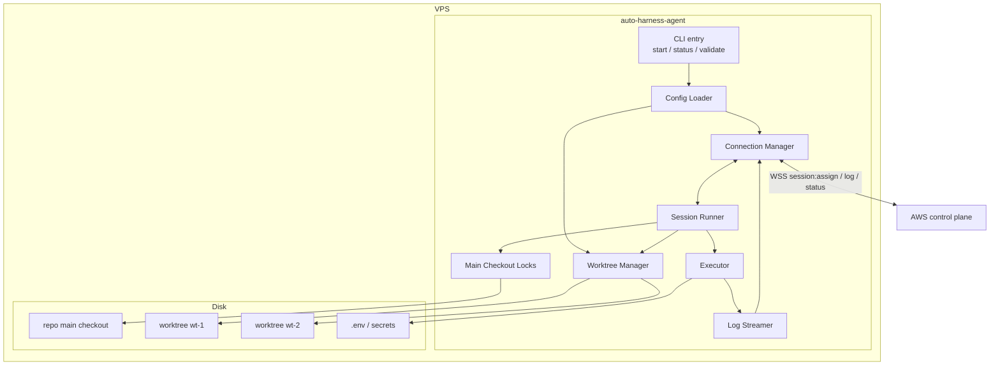
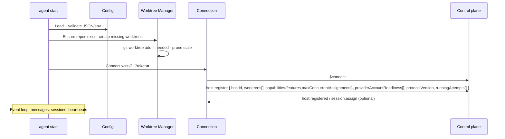
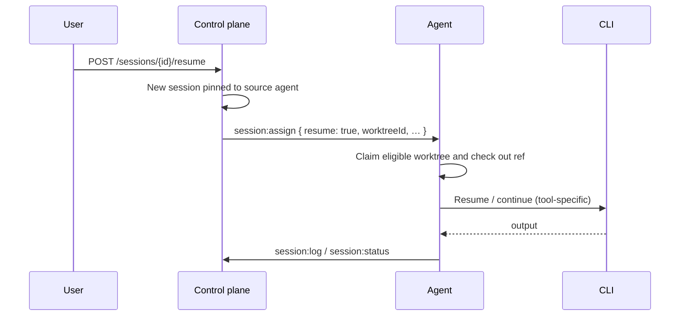
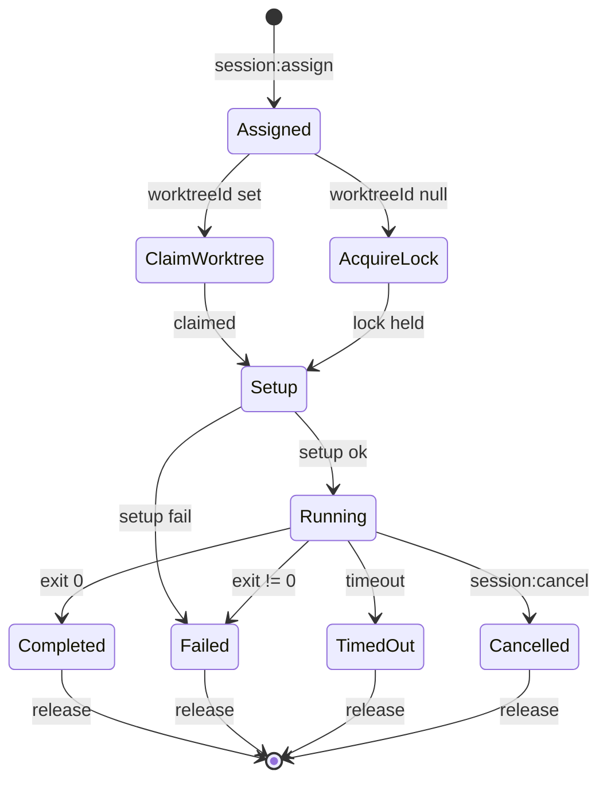
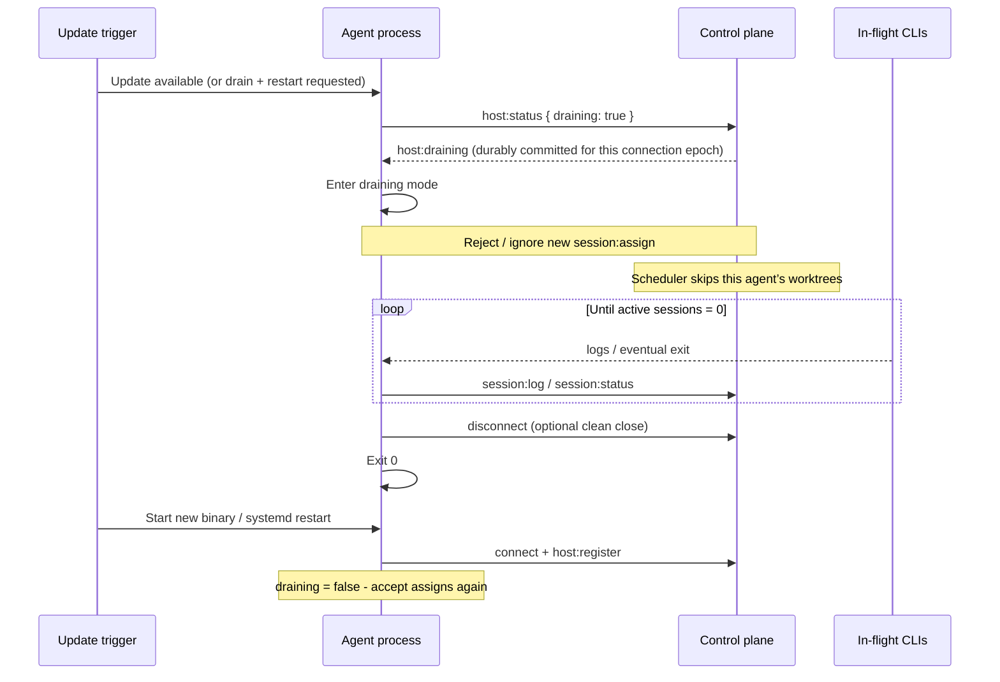

# Agent Layer (VPS Execution Plane)

Internals of the VPS daemon: process model, worktrees, executor, recovery.

## Session usage and cost attribution

Usage accounting is separate from usage-limit detection. A provider-aware CLI adapter may return a
structured `SessionUsage` value from the process runner; the daemon forwards it in terminal status
or a `session:usage` frame. The daemon does not scan prompts, stdout, stderr, or retained logs for
token counts or prices, and the control plane accepts only `source: "cli"`. Counts and configured
monetary values are decimal strings; monetary values use integer micros. Provider rates are
optional operator configuration and are never fetched from a vendor.

The adapter's own capture buffer is bounded differently per provider. Codex's JSONL event stream is
folded incrementally as PTY chunks arrive, so a long-running turn keeps yielding usage/usage-limit
signal with no whole-output cap; only a single unterminated JSONL line is bounded, and an oversized
one is dropped and resynced at the next newline. Claude, Gemini, and Grok still buffer their whole
result envelope up to a fixed cap, but on overflow they retain a trailing window of that buffer
instead of discarding it and giving up on the rest of the run.

| Need                       | Doc                                          |
| -------------------------- | -------------------------------------------- |
| Install / config / systemd | [setup.md](setup.md)                         |
| Local stack / e2e          | [local-development.md](local-development.md) |
| CLI commands               | [cli.md](cli.md)                             |
| Wire protocol              | [websocket.md](websocket.md)                 |
| Control plane              | [aws.md](aws.md)                             |

---

## Responsibilities

The agent owns:

| Concern                   | Implementation                                                       |
| ------------------------- | -------------------------------------------------------------------- |
| Outbound control channel  | Persistent WebSocket client to the control plane                     |
| Workspace concurrency     | Pre-provisioned git worktrees (one session per worktree)             |
| Process execution         | `node-pty` for assigned AI CLIs; `child_process` for git/setup/hooks |
| Main-checkout maintenance | Serial lock per repository for `scheduled` sessions                  |
| Live output               | Buffered stdout/stderr/system log streaming                          |
| Local secrets             | AI vendor keys, git credentials, `.env` files (never sent to AWS)    |
| Inventory reporting       | Worktree list + status on register and on change                     |

The agent **does not** implement the global queue, multi-agent round-robin, or durable session storage. Those live in the [AWS layer](aws.md).

---

## Runtime Overview



### Package layout

```
services/host-daemon/
├── src/
│   ├── index.ts              # CLI entry (start, status, …)
│   ├── config.ts             # load + validate config / env
│   ├── connection.ts         # WebSocket client, reconnect, routing
│   ├── worktree-manager.ts   # create, claim, release, status
│   ├── session-runner.ts     # session orchestration
│   ├── executor.ts           # spawn + PTY + timeout + signals
│   ├── log-streamer.ts       # buffer, rate-limit, emit
│   ├── main-lock.ts          # per-repo main checkout mutex
│   └── types.ts              # agent-local types
└── package.json
```

---

## Startup Sequence



On validation failure (missing repo path, bad JSON, missing key), the process exits non-zero before connecting.

---

## Internal Components

### Connection Manager

- Opens WebSocket with `Authorization: Bearer <apiKey>` (the key is kept out of URL/query logs)
- Sends `host:register` immediately after open, including `protocolVersion` and
  attempt-fenced `runningAttempts` (plus `runningSessions` for older control planes)
- Routes inbound messages by protocol command (`session:assign`, `session:cancel`,
  `session:acknowledged`, drain). In-flight state is keyed by `{sessionId, attemptId}`,
  not session id alone, so a delayed cancel/ACK/log from an old attempt cannot touch
  a newer assignment
- Auto-reconnect with exponential backoff: 1s → 2s → 4s → … → **max 60s**
- On reconnect: re-register full inventory + any **in-progress** attempts still running locally
- Responds to server `ping` with `pong`
- Handles `post` failures only as disconnect (server detects stale connections separately)

Outbound message types: `host:register`, `session:ack`, `session:log`, `session:status`, `worktree:status`, `pong`.

Each daemon process reports one opaque UUID and process start time on every registration. The UUID
remains unchanged across socket reconnects and inventory refreshes. A control plane with a prior
modern UUID records a restart only when a later registration reports a different UUID; first
registration is a baseline, and legacy registrations without the pair remain accepted. Detection
is durable local observability only: it neither restarts the host nor sends an external notification.

### Config Loader

- Merge file + env
- Resolve absolute paths
- Validate unique worktree ids, non-overlapping paths, non-empty `hostId`
- Expose immutable config snapshot to other modules
- Load daemon-local execution profiles from `HARNESS_EXECUTION_PROFILES` (JSON). Each profile is
  keyed by Provider Account ID and owns that account's CLI home and extra environment. Extra env
  may not set `HOME` or `USERPROFILE`; the isolated profile home always wins. `install-service`
  persists `HARNESS_EXECUTION_PROFILES` and `HARNESS_MAX_CONCURRENT_ASSIGNMENTS` in the service
  environment file. The profile JSON path must be absolute for `install-service`; relative paths
  are rejected rather than being interpreted using a supervisor working directory. Registration
  advertises only `ready` plus an opaque SHA-256 fingerprint of
  the home path and extra-env key names (values omitted) — never credentials, home paths, or env
  values. Assignment of a provider-backed session is refused (no ACK) when the exact account
  profile is missing or its home is not a directory. Unknown top-level or per-profile JSON keys
  are rejected so misspelled configuration cannot silently disable a profile.

```json
{
  "maxConcurrentAssignments": 4,
  "accounts": {
    "acct-claude-work": { "home": "/var/lib/harness/homes/claude-work" },
    "acct-codex-personal": {
      "home": "/var/lib/harness/homes/codex-personal",
      "env": { "CODEX_HOME": "/var/lib/harness/homes/codex-personal" }
    }
  }
}
```

### Worktree Manager

| Operation       | Behavior                                                                               |
| --------------- | -------------------------------------------------------------------------------------- |
| `ensureAll()`   | On startup: `git worktree list`; create missing via `git worktree add <path> <branch>` |
| `claim(id)`     | Local mutex: fail if already busy; set busy + `currentSessionId`                       |
| `release(id)`   | Clear session; set idle; emit `worktree:status`                                        |
| `snapshot()`    | Array for `host:register` and status CLI                                               |
| `markError(id)` | On unexpected git failures; report status `error`                                      |

**Concurrency:** number of configured worktrees. Each worktree runs **at most one** session at a time.

Worktree records in DynamoDB are written by the control plane from register/status messages; the agent is source of truth for **local** busy/idle.

### Session Runner

Orchestrates a single session after `session:assign`:

1. Validate payload (`sessionId`, `repositoryId`, `resolvedArgv`, `timeout`, optional `worktreeId`, `prompt`, `setupScript`, `resume`, `resumedFromSessionId`, `cliResumeRef`, and non-secret route metadata)
2. If `worktreeId` set → claim worktree; else → acquire main-checkout lock for `repositoryId`
3. Send `session:ack`
4. **Setup:**
   - Normal run: run the optional host setup, then the effective assignment/worktree/repository
     setup (may initialize the shell environment, reset a branch, or install dependencies)
   - **Resume** (`resume: true`): skip every host/repository/worktree setup script; the assigned worktree still checks out the session `ref` (or default branch) before the native CLI resume command starts
5. Spawn primary command via Executor (resume-aware argv when `resume: true`)
6. Pipe output to Log Streamer
7. On exit / timeout / cancel → `session:status`, release claim/lock, emit worktree status
8. If the CLI prints a resumable conversation/session id, capture and send it in status metadata as `cliResumeRef` for later resumes

Concurrent sessions: one runner instance per claimed worktree (and at most one main-lock session per repo).

Git checkout/setup failures retain a stable operation category (for example, switch, fetch,
resolve, or verification) and may include a short diagnostic excerpt. Git diagnostics are
single-line and UTF-8 bounded before they are placed in exceptions, logs, or `session:status`;
remote URL userinfo and token-shaped credential values are redacted.

### Session resume

Operators resume by session id via the control plane: [`POST /sessions/:id/resume`](api.md#post-sessionsidresume). The control plane first prefers the source session's native route. If that route is no longer schedulable, it discards the stored `cliResumeRef` and placement pins, preserves `resumedFromSessionId`, and schedules a fresh run through the configured target and ordered fallbacks. The agent then tries native resume only when the assignment includes a usable route.



#### Placement (control plane)

| Rule             | Behavior                                                                                          |
| ---------------- | ------------------------------------------------------------------------------------------------- |
| Prefer           | Pin the source `hostId`; select any eligible repository worktree there for `cliResumeRef`         |
| Re-establish ref | Check out the source session's `ref`, or its default branch, before starting the native CLI route |
| Re-route         | If unavailable, clear `cliResumeRef` and the host pin, then use target/fallback order             |
| Preserve         | Keep `resumedFromSessionId` on the fresh assignment for audit/history                             |
| Same agent state | Native resume uses CLI conversation state stored outside the repository worktree                  |

#### How the agent “tries to resume”

Order of preference:

1. **Native CLI resume** — after the assigned worktree checks out `ref` (or the default branch), invoke the tool's resume/continue mode with `cliResumeRef` and the continuation prompt.
2. **Fresh route** — if the native route cannot be scheduled, the control plane discards the native ref/host pin and executes the normal target/fallback chain. This is a fresh CLI run, but retains `resumedFromSessionId`.

#### Must / must not

| Must                                                                                             | Must not                                                                                                 |
| ------------------------------------------------------------------------------------------------ | -------------------------------------------------------------------------------------------------------- |
| Use the scheduler-assigned eligible worktree and re-check out the stored `ref` or default branch | Pin native resume to the source worktree or depend on its dirty/uncommitted state                        |
| Skip every configured setup script on native resume                                              | Run setup scripts that may reset, install, or otherwise mutate the re-established checkout               |
| Stream logs and honor timeout/cancel as usual                                                    | Assume every CLI has native resume — a fresh fallback route is valid when native resume is unschedulable |

#### Capturing `cliResumeRef`

When a CLI emits a session/conversation id, parse and return it on terminal `session:status` (or a dedicated field). The control plane stores it on the session row and passes it back in `session:assign` only for a native-route resume. A provider/account/route id is diagnostic metadata; it never changes the daemon's command resolution.

### Executor

**Goals:** correct TTY behavior for AI CLIs; no shell injection of prompts; **non-interactive** invocation suitable for **subscription-plan** CLIs (not Agent SDKs)—see [why.md](why.md) and [costs.md](costs.md).

#### Command execution model

| Piece             | Rule                                                                                                                                                                                                                                                                                                                                                                                                                                                                                                                                                                                                                                                                                                                                                                                                                                               |
| ----------------- | -------------------------------------------------------------------------------------------------------------------------------------------------------------------------------------------------------------------------------------------------------------------------------------------------------------------------------------------------------------------------------------------------------------------------------------------------------------------------------------------------------------------------------------------------------------------------------------------------------------------------------------------------------------------------------------------------------------------------------------------------------------------------------------------------------------------------------------------------- |
| Spawn             | Prefer **argv array** / `node-pty` spawn **without** `shell: true`. On Windows only, a trusted resolved `.cmd`/`.bat` target is launched through an absolute PATH-resolved `cmd.exe`; each fixed argv element is encoded separately for the two CMD parsing passes rather than accepting a caller-authored shell string. Batch arguments containing CR/LF are rejected because CMD cannot preserve them without command-separator ambiguity.                                                                                                                                                                                                                                                                                                                                                                                                       |
| `resolvedArgv`    | From `session:assign` — the target/fallback and complete argv are already resolved control-plane-side (**non-interactive CLI** form, e.g. `codex exec` / print flags, `claude -p`, not an Agent SDK process). The daemon does not select a provider/account/Command, but it does resolve `argv[0]` deterministically: a bare name through trusted `PATH`, or a relative path against the assigned checkout. An empty `resolvedArgv` is a defensive error (`unknown_command_profile`).                                                                                                                                                                                                                                                                                                                                                              |
| Route metadata    | Optional non-secret `targetIndex`, `commandId`, and `providerAccountId` breadcrumbs for logs and UI diagnostics. They are never used to select a command. A `providerAccountId` **does** select the daemon-local execution profile (CLI `HOME` / extra env) for the assigned AI CLI. Git, setup scripts, and terminal hooks keep the daemon's own child environment.                                                                                                                                                                                                                                                                                                                                                                                                                                                                               |
| `prompt`          | Already appended as the final `resolvedArgv` element when the Command's `appendPrompt` is true — never accepted as a free-form shell string. The Windows batch adapter encodes it as one argv value and rejects CR/LF; direct executables receive it unchanged. A literal `--` is inserted first when the Command opts in via `appendPromptSeparator`, or implicitly whenever the Command has a `providerId` and does not opt out (`appendPromptSeparator: false`) — safe only for getopt-style executables; e.g. `printf "%s"` reads `--` as data, not a terminator. See [api.md](api.md#post-commands).                                                                                                                                                                                                                                          |
| Working directory | Worktree path, or main repo path for scheduled sessions                                                                                                                                                                                                                                                                                                                                                                                                                                                                                                                                                                                                                                                                                                                                                                                            |
| Environment       | Small baseline (`PATH`, home/temp/locale/terminal fields) plus explicit `HARNESS_CHILD_ENV_ALLOWLIST`; control-plane `HARNESS_*` credentials are never inherited. Repo-local env files may be sourced only inside trusted setup scripts. **This includes CLI credential env vars** — `ANTHROPIC_API_KEY`, `OPENAI_API_KEY`, `CURSOR_API_KEY`, and similar are silently dropped unless explicitly added to `HARNESS_CHILD_ENV_ALLOWLIST`. A CLI configured for API-key auth (rather than a logged-in subscription CLI, which reads its own credential file under `$HOME`) will fail with what looks like a CLI-side auth error, not an obviously harness-side config problem — check the allowlist first. Per-account execution profiles override `HOME`/`USERPROFILE` for the assigned CLI only so two accounts can use different local CLI homes. |
| Timeout           | A single deadline covers checkout checks, setup, and the primary command. On POSIX, running processes receive SIGTERM, then SIGKILL after a 5-second grace period; report `timed_out`. On Windows, `SpawnProcessRunner` (git, setup scripts, terminal hooks) kills the full descendant process tree via a single forceful `taskkill /PID <pid> /T /F` instead — Windows has no signal-ignoring equivalent to escalate past, and a delayed second `taskkill` against the same numeric pid risks hitting a process Windows has since recycled that pid to.                                                                                                                                                                                                                                                                                           |
| Cancel            | `session:cancel { sessionId, attemptId }` aborts only that attempt through the same platform-specific termination path described under Timeout; delayed cancels for an old attempt are ignored. Report exactly one `cancelled` terminal status.                                                                                                                                                                                                                                                                                                                                                                                                                                                                                                                                                                                                    |

A repository-principal session drain uses this same cancel path. The control plane fences the
exact assignment attempt before sending `session:cancel`; the daemon reports its normal terminal
status and releases the worktree or main-checkout lock. A late acknowledgement, reconnect, or
terminal report is accepted only for that fenced attempt and cannot revive it or disturb a newer
assignment. The daemon does not list sessions or decide drain scope.

The assigned command runs in a single `node-pty` terminal (`xterm-256color`,
120 columns by 40 rows). Its merged terminal stream is reported as `stdout`,
including ANSI control sequences exactly as the CLI emits them. Resume-reference
capture treats configured stdout/stderr policies as matching this merged stream,
so opaque references remain captured and redacted. Git operations, trusted setup
scripts, and terminal hooks retain separate pipe-based execution;
this keeps PTY behavior confined to the CLI that needs a terminal. On POSIX,
cancel and timeout signal the PTY process group so helper descendants receive
the same SIGTERM → SIGKILL lifecycle.

On Windows, a resolved `.cmd`/`.bat` batch shim cannot be launched directly by
ConPTY's `CreateProcessW` boundary. `PtyProcessRunner` therefore resolves
`cmd.exe` through the same trusted `PATH`, then passes node-pty one pre-escaped
`/d /s /c` command line. This is a constrained platform adapter, not a general
shell execution mode: every batch path and argument is encoded independently,
and multiline arguments fail before spawn.

Example (illustrative):

```text
assign.resolvedArgv = ["./ci/agent", "Fix the failing test"]  // computed control-plane-side

→ executable: /home/harness/repos/my-app/.worktrees/wt-1/ci/agent
→ argv: ["Fix the failing test"]  // no shell or string re-parsing
→ cwd:  /home/harness/repos/my-app/.worktrees/wt-1
→ pty:  yes (cols/rows default 120x40)
```

If a site needs a full shell pipeline for maintenance, use a **scheduled** session whose Command
names a fixed executable on `PATH` or a worktree-relative script (for example
`./ci/daily-update.sh`) rather than untrusted prompt text.

#### Signals and exit

| Event                    | Action                                                                                    |
| ------------------------ | ----------------------------------------------------------------------------------------- |
| Process exit 0           | `status: completed`, `exitCode: 0`                                                        |
| Process exit ≠ 0         | `status: failed`, `exitCode`                                                              |
| **Usage limit detected** | failed provider CLI + classifier → `status: failed`, `errorCode: usage_limit` (see below) |
| Timeout                  | kill → `status: timed_out`                                                                |
| Cancel                   | kill → `status: cancelled`                                                                |
| Setup non-zero           | no primary spawn → `status: failed`                                                       |

#### Usage limits (AI vendor / CLI quotas)

AI CLIs often hit **plan or rate limits** (monthly quota, TPM/RPM, “you've hit your limit”, etc.).
Auto Harness reports a limit only when its provider-aware adapter validates a structured CLI result;
ordinary stdout/stderr is never quota evidence. A reported limit lets the control plane pause the
assigned account, try another eligible account/fallback, or queue-wait for cooldown recovery.

**Policy: trusted identity + failure → classify → report → let the control plane route.**

1. The assigned command runs to completion. Timeout and cancel are never `usage_limit`.
2. Exit `0` is always `completed`. Successful output — including adversarial or prompt-controlled phrases such as “rate limit” — never cools down a Provider Account.
3. On a failed command (`exitCode !== 0`), the daemon requires **trusted assignment identity**
   (`providerAccountId` from the control plane), a recognized **trusted catalog argv** executable
   (`resolvedArgv[0]`, fixed control-plane-side and location-resolved by the daemon), and the provider-aware adapter's
   structured `usageLimit` signal. Untrusted stdout/stderr is never enough on its own.
4. On that signal, report `session:status` with `status: failed`, `errorCode: "usage_limit"`,
   `errorMessage: "Usage limit detected"`, and `exitCode`. Do not retry or resolve a fallback on
   the host.
5. The control plane then pauses the assigned Provider Account globally for its configured cooldown (default 5 hours), releases the worktree, and immediately tries the next eligible account or explicit fallback. A queued session remains eligible until its absolute `queueTtlSeconds` expires (default 8 days), then fails with `queue_expired`.

Providerless commands (`providerId: null`, no `providerAccountId`), unknown executables, and
provider commands without a supported structured result **fail closed**: their quota-like text is
an ordinary `failed`, not `usage_limit`. No account is paused.

**What counts as a usage-limit error:**

Classification keys off a provider-backed assignment (`providerAccountId`), the spawned catalog
executable (basename of `resolvedArgv[0]`), and an adapter-supported structured output mode. The
currently supported adapter set is `claude`, `codex`, `gemini`, and `grok`; it validates each
provider's terminal/error envelope before emitting `usageLimit`. A generic phrase such as `rate
limit`, `too many requests`, or a bare `429` is **never** enough, even with a trusted executable
and a non-zero exit. The adapter signal is also ignored on success, on unknown/providerless argv,
and when the assignment has no `providerAccountId`.

The trusted surface is each CLI's own structured error envelope — never model/agent-generated
content. For Codex this includes the sentence its own Rust CLI error path writes verbatim onto
`turn.failed.error.message` or a top-level `{"type":"error"}.message` when it hits a usage limit;
that text is as trustworthy as the `error.type`/`code`/`status` fields the other adapters key off,
because it is written by the CLI process itself, not by the model. Codex's `item.*` records (agent
text, reasoning, tool output) are model-authored and are never inspected for this classification,
regardless of what they say.

Claude's own account-level plan quota (5h/weekly/model-specific caps) is enforced client-side, not
as an Anthropic API error: the result envelope carries no `rate_limit_error`/`usage_limit` code and
can still read `subtype: "success"`. The adapter instead reads the CLI's own `terminal_reason:
"budget_exhausted"` field — the same trust tier as the coded fields, since the CLI sets it on its
own terminal result line rather than the model.

**What is not a usage limit:**

- Successful commands (`exitCode === 0`), even when output contains vendor phrases
- Prompt-controlled / adversarial stdout or stderr: free-form text cannot classify a limit
- Providerless commands (no `providerAccountId`), unknown executables, and non-structured provider commands (fail closed)
- App under test returning 429
- GitHub API secondary rate limits during a push (unless classified separately later)
- Agent host OOM / missing CLI → ordinary `failed` without `usage_limit`
- Auto Harness API rate limits (control plane `429`) — separate; see [api.md](api.md) / [security.md](security.md#rate-limiting)

Account cooldown is not a general retry policy: ordinary command failures, timeouts, and cancellations remain terminal. Only `usage_limit` invokes account cooldown/fallback routing. Cooldown duration is configurable per Provider Account, and operators can clear it manually.

### Log Streamer

- Attach to PTY data / stdout / stderr
- Tag `stream`: `stdout` | `stderr` | `system`
- Add ISO timestamps
- **Rate limit:** default max ~10 WebSocket messages/sec/session
- **Batch:** coalesce consecutive stdout/stderr lines up to `logBatchMaxLines` (100) or
  `logBatchMaxWaitMs` (100ms), and up to the per-frame byte budget. A single write is
  split on UTF-8 and newline bounds so each frame stays within those caps. A stream
  change parks the other stream behind the current batch (it is not dropped). A
  system/lifecycle line flushes queued batches first. Coalesced `session:log` frames
  still carry `{sessionId, attemptId}` and keep insertion order (`timestampSeq`)
- Emit `session:log` via Connection Manager. Per-session output is capped (32 KiB per chunk, 256 KiB retained for output classification, and at most 10,000 streamed chunks / 10 MiB retained logs), and sequence numbers continue after a reassignment/retry.
- Serialize outbound messages FIFO. The daemon flushes queued logs before it sends a terminal `session:status`; a failed send is reported but does not permanently block later messages.
- On backpressure: prefer coalescing. A stream change or next frame that cannot join
  the current batch parks one overflow batch instead of dropping. Stdout/stderr is
  dropped only when the current frame cannot flush **and** the overflow batch cannot
  accept the write; the daemon then emits a system warning `N log chunk(s) dropped`
  with machine-readable `dropped: N` telemetry the control plane can later alarm on.
  Session-wide chunk/byte caps remain silent (no `dropped` counter); they bound
  retained stdout/stderr, not the live rate. System and lifecycle lines still stream
  after those caps so failure/completion messages are not lost. Each `dropped` notice
  is capped at 1_000_000; remainder is sent on later notices.

Control plane persists logs and fans out to UI subscribers ([aws.md](aws.md)).

### Main Checkout Locks

For `type: scheduled` / `worktreeId: null`:

- One FIFO async mutex **per `repositoryId`** on this agent; different repositories remain parallel.
- Waiting consumes the session deadline. Cancellation or timeout removes the waiter without running setup, the command, or a terminal hook in the busy checkout.
- The lock covers branch preparation, setup, the command, and the terminal hook, and is released in `finally` on every outcome.
- The capability-gated dispatcher issues these assignments only to a live host
  that advertises `scheduled-main-checkout` and registers the repository. Its
  durable per-host/repository lease complements this local mutex.

---

## Worktrees

### Lifecycle

1. Operator configures worktrees in agent config (paths + labels)
2. Agent creates missing worktrees on startup
3. Control plane learns inventory via `host:register`
4. Scheduler assigns sessions to idle matching worktrees ([round-robin](aws.md#scheduler))
5. Configured setup scripts prepare the worktree at **session start** ([below](#setup-scripts))
6. Worktree is reused across sessions (not deleted after each run)

### Ref checkout recovery

Daemon startup preflights the installed Git version for this recovery path. Git 2.36+ is required
because repair uses `git fetch --refetch`; an incompatible daemon registers its bounded readiness
reason for operators but refuses assignments and is excluded by the scheduler.

For a worktree session, the daemon resolves its `ref` to a commit before
detaching `HEAD`, so branch names, SHAs, lightweight tags, and annotated tags
all land on the exact target commit. If both detached-checkout forms fail, it
checks that target commit's object connectivity. Only an incomplete graph gets
one repair attempt: refetch every configured remote with `--refetch`, then
retry the detached checkout. Ordinary checkout failures do not trigger a
network retry.

### Labels

Same model as GitHub Actions runner labels:

- Session `requiredLabels: ["codex"]` → worktree must include `codex`
- Worktree `["codex","claude"]` can run either
- `requiredLabels: []` → any worktree
- Multiple labels → **all** required (AND)

### Setup scripts

Host inventory can declare `requiredEnvironment` at the host root and on each repository
attachment. Names must use environment-variable syntax and be unique within each list. The daemon
reports only the names visible to repository child processes—never their values. The control plane
combines the host and repository requirements, exposes `ready` and `missing` names per attached
repository in host status, and will not assign work to a host until all names are present. A
host/repository pair may require up to 256 distinct names; the bounded runtime report allows up to
512 names so baseline child variables do not consume that requirement capacity.

Configure these lists with the structured Host Advanced and repository-attachment settings forms.
Adding a name to the service environment is insufficient unless it is also permitted by
`HARNESS_CHILD_ENV_ALLOWLIST` (baseline child variables remain available automatically).

Setup is opt-in: the daemon does **not** source `.zshrc`, `.bashrc`, or any other shell startup file
by default. Configure a host-wide script, repository/worktree scripts, terminal hooks, and
host-local `allowedRoots` with `PUT /api/v1/hosts/:hostId/exec-config` (`fleet:exec-config`).
Ordinary `PUT /inventory` preserves omitted exec-config fields.

```json
{
  "setupScript": ". /opt/auto-harness/setup/host-environment",
  "allowedRoots": ["/home/harness"],
  "repositories": [
    {
      "id": "repo-abc",
      "setupScript": "/opt/auto-harness/setup/repo-abc",
      "terminalHookScript": "/home/harness/hooks/done.sh"
    }
  ]
}
```

When `allowedRoots` is set, the daemon `realpath`s inventory filesystem paths and terminal hook
paths (including at worktree claim and hook spawn) and refuses anything outside those roots.
Unset or empty roots apply no extra restriction. Catalog command argv is not checked against
these roots. Control-plane inventory and exec-config writes reject a relative `terminalHookScript`;
an unchanged legacy relative hook is preserved only for compatibility, while new or changed hooks
must be absolute. An empty string clears the stored hook. If a polled `allowedRoots` policy makes
the current repository or worktree paths invalid, the daemon immediately re-registers as draining
and refuses assignments; it continues polling and resumes only after a valid inventory applies.

For a fresh session, the host script runs first, followed by one effective scoped script using the
existing precedence `session assignment > worktree > host/repository attachment`. Both run in the
session cwd (worktree or main). They use `$SHELL` when it names an available POSIX-compatible shell
(`sh`, `bash`, `dash`, `ksh`, or `zsh`), otherwise `/bin/sh`.

Configured setup scripts are currently supported on POSIX hosts only. On Windows, the `/bin/sh`
fallback is not supplied by the operating system and typical shell executables named `bash.exe` or
`sh.exe` do not satisfy the current shell-selection contract; leave setup unset on Windows hosts.

The daemon never infers a package manager from repository manifests or lockfiles, and never runs a
package-manager command on its own. These trusted setup scripts are the sole place to install
dependencies or prepare a repository toolchain, using the repository's own explicit command and
policy. A repository with no configured setup launches its assigned command against its existing
worktree state.

The setup configuration is trusted, but the checkout remains untrusted. Invoking a checkout-owned
file such as `./ci/session-setup` deliberately delegates execution to the assigned ref. Prefer
reviewed host-owned scripts when that delegation is not intended. See
[Trusted setup scripts: do's and don'ts](setup-scripts.md) for the execution contract, package-manager
boundary, and operator checklist.

Exported variables flow from the host script into the scoped script and then into the provider
process. The daemon captures that environment through a mode-0600 temporary file, removes the file
before the session continues, and never writes the captured values to logs or session metadata.
Setup stdout/stderr is still streamed to the live and retained session log, so scripts must not
enable tracing or print secrets.
The reserved `HARNESS_*` namespace is always removed before provider launch. Because the provider
can read every other exported value, setup scripts are trusted operator code; sourcing a broad shell
profile may expose all of its exports to repository work. A successful script that replaces the
shell and bypasses environment capture fails setup rather than launching the provider with a stale
environment.

Examples using reviewed, host-owned files:

```text
/opt/auto-harness/setup/repo-abc
```

```text
. /opt/auto-harness/setup/host-environment
```

Non-zero exit → session `failed`, worktree released.

Resume sessions continue to skip every setup script so a destructive setup cannot reset the
conversation's existing worktree.

### Command resolution hardening

`runGit` (`services/host-daemon/src/git-commands.ts`) resolves its daemon-owned `git` name through
`resolveTrustedExecutable` (`services/host-daemon/src/resolve-executable.ts`). Assigned Commands
use a separate resolver with two explicit forms: a bare executable name such as `codex` searches
only the process's own trusted `env.PATH`, while `./ci/agent` or `ci/agent` is resolved lexically
against the assigned checkout and converted to an absolute spawn target. Native process lookup
therefore never receives a bare name with the untrusted checkout as its search cwd. This closes the
"bare argv0 + untrusted cwd" hijack tracked in
[jonathanong/auto-harness#349](https://github.com/jonathanong/auto-harness/issues/349)
for the git call site, and
[jonathanong/auto-harness#365](https://github.com/jonathanong/auto-harness/issues/365)
for the assigned CLI process. The daemon no longer detects repository manifests or lockfiles or
automatically invokes a package manager, so the pnpm-specific findings from #349 no longer have an
inferred dependency-install call site. An operator may still deliberately run a package manager
against the untrusted checkout through an assigned Command or a trusted setup script. Both are
privileged arbitrary-execution policy: Command argv requires
[`catalog:write`](roles.md#capabilities), while setup configuration requires `fleet:exec-config`.
`PtyProcessRunner` resolves a bare assigned package manager through the same trusted absolute-path
boundary described above; the
[setup-script guide](setup-scripts.md#package-manager-boundary) documents the package manager's
separate filesystem, tool-selection, and descendant-process risks.

Command creation and the daemon boundary both reject absolute or drive-qualified assigned
executables and any complete `..` path segment. Relative resolution is deliberately lexical: it
does not call `realpath`, inspect symlink targets, apply `allowedRoots`, or require the executable
to exist before spawn. A relative executable explicitly opts into running checkout-controlled
content, and a symlink in that checkout may point elsewhere.

When the assigned CLI resolves to a Windows batch shim, the PTY runner also
resolves `cmd.exe` through that trusted `PATH`; it never falls back to a bare
interpreter name or `ComSpec` lookup that could reintroduce cwd-first resolution.

### Disk layout (example)

```text
/home/harness/
├── .env                          # HARNESS_HOST_ID, HARNESS_API_URL, HARNESS_API_KEY
├── .env.codex                    # chmod 600 — AI CLI credentials
├── repos/
│   └── my-app/                   # main checkout (paths configured via API/UI)
│       ├── .git/
│       └── .worktrees/
│           ├── wt-1/
│           └── wt-2/
└── harness/                      # cloned auto-harness monorepo (agent code)
```

Host inventory (repo paths, worktrees, attached Provider Accounts) is **not** a local file — configure with `PUT /api/v1/hosts/:hostId/inventory` or the Agents UI. Setup scripts, terminal hooks, and `allowedRoots` use `PUT /api/v1/hosts/:hostId/exec-config`. Commands themselves live in the global Provider/Provider Account/Command catalog, not host inventory.

---

## Session Lifecycle (agent view)



### Inbound `session:assign` (typical fields)

```json
{
  "type": "session:assign",
  "sessionId": "sess-x1y2z3",
  "repositoryId": "repo-abc",
  "prompt": "Fix the failing test",
  "resolvedArgv": ["codex", "exec", "Fix the failing test"],
  "timeout": 1800,
  "worktreeId": "wt-1",
  "setupScript": "/opt/auto-harness/setup/repo-abc"
}
```

`worktreeId: null` → scheduled/main checkout path.

The capability-gated scheduled form is explicit on the wire:

```json
{
  "type": "session:assign",
  "sessionId": "sess-maintenance",
  "sessionType": "scheduled",
  "repositoryId": "repo-abc",
  "prompt": "Run daily maintenance",
  "resolvedArgv": ["pnpm", "lint:fix"],
  "timeout": 1800,
  "worktreeId": null
}
```

The durable `(host, repository)` lease is acquired before this frame is sent
and is retained through the reconnect grace period. The daemon additionally
serializes main-checkout execution with its per-repository mutex.

### Queue behavior (what the agent sees)

The agent does **not** pull a global queue. It only:

1. Accepts `session:assign` when the control plane chooses this worktree/agent
2. Reports idle via status/release so the control plane can **drain** the next queued session

If all matching worktrees are busy (possibly on other agents), the session stays `queued` in DynamoDB until capacity frees. Multi-agent **match then round-robin** is entirely control-plane logic ([aws.md](aws.md#scheduler)).

---

## Non-Worktree Sessions (Scheduled)

|                | Worktree session          | Non-worktree session              |
| -------------- | ------------------------- | --------------------------------- |
| Runs in        | Dedicated worktree        | Main repo checkout                |
| Concurrency    | Parallel (1 per worktree) | Serial (1 per repo on this agent) |
| Typical use    | AI coding prompts         | Maintenance scripts               |
| Created by     | API, UI, webhook          | Schedules, manual trigger         |
| Session `type` | `prompt`                  | `scheduled`                       |

Example maintenance commands (fixed scripts preferred):

```bash
git pull && pnpm install
pnpm lint:fix && git add -A && git commit -m 'chore: lint' && git push
pnpm audit fix && git add -A && git commit -m 'chore: security' && git push
```

Before a scheduled run, the daemon requires the main checkout to be clean,
including untracked files, and switches to `ref` or the configured default
branch without detaching or resetting. Scheduled refs are branch names; tags
and commit SHAs are rejected. A configured setup script is trusted operator
code and runs inside this locked main checkout, so destructive setup belongs
only in an explicitly chosen maintenance policy.

Capable daemons advertise `scheduled-main-checkout` during registration. The
control-plane dispatcher is deployed only after this capability, and excludes
older daemons that omit it.

---

## Auto-update target (graceful restart)

The daemon's drain protocol and signed-manifest orchestration core support the safety invariants below
without interrupting in-flight AI CLI work. Production manifest fetching, artifact installation, and
supervisor restart adapters are not wired yet, so the end-to-end auto-update path remains a target;
operators currently follow [the manual update runbook](deploy-host-daemon.md#update).

### Goals

| Goal                      | Behavior                                                                           |
| ------------------------- | ---------------------------------------------------------------------------------- |
| No new work during update | Agent enters **draining** — stops accepting new jobs                               |
| Finish current work       | In-progress sessions run to completion (or their normal timeout / explicit cancel) |
| Safe restart              | Process exits and restarts **only after** active sessions finish                   |
| Do not kill CLIs          | Auto-update **never** sends signals to in-process CLI commands                     |

This is different from session **cancel** or **timeout**, which intentionally stop a single session’s process.

### Flow



### Steps (agent)

1. **Detect update** — e.g. package updater, `auto-harness-agent update`, or `SIGUSR1` / systemd `ExecReload` mapped to drain-then-restart (not hard kill).
2. **Enter draining**
   - Send `host:status` with `draining: true` and wait for the control plane's durable `host:draining` acknowledgement before setting the local flag or refusing assignments
   - If the write/acknowledgement cannot complete, do not exit: keep the daemon alive and retry safely. A reconnect registers with `draining: true`, so it cannot briefly restore schedulable capacity while the acknowledgement is retried
   - Stop listening for **new** jobs: do not `session:ack` new assigns; if an assign arrives, reply with a drain nack (or ignore so control plane retries elsewhere after timeout — prefer explicit nack so the session stays queued for other agents)
3. **Keep running current jobs**
   - Continue log streaming, timeout watches, and cancel handling for sessions already claimed
   - **Do not** SIGTERM/SIGKILL child CLIs as part of the update path
4. **Wait for drain**
   - When active session count hits zero (all worktree + main-checkout jobs finished), proceed
   - Optional max drain wait (config); if exceeded, **still do not kill CLIs by default** — log a warning and keep waiting, or only force-exit if an operator opts into an unsafe flag (not the default auto-update path)
5. **Restart**
   - Exit cleanly (code 0)
   - Supervisor (systemd `Restart=always`, or updater) starts the new version
   - New process connects, `host:register` with inventory and no `draining` flag (equivalent to `draining: false`)

### What auto-update must not do

- Kill or reparent-kill in-process CLI commands to “hurry” the update
- Accept new `session:assign` while draining
- Leave the control plane thinking idle worktrees are schedulable while draining

### Control plane during drain

See [aws.md — Agent draining](aws.md#agent-draining). Summary: treat the agent as **online for existing sessions only**; exclude its worktrees from the idle candidate set for **new** assigns until re-register without draining.

### Relation to systemd

| Signal / action             | Intended behavior                                                                                                     |
| --------------------------- | --------------------------------------------------------------------------------------------------------------------- |
| Auto-update / drain restart | Drain → wait for jobs → exit → start new version                                                                      |
| `systemctl restart` (hard)  | Prefer configuring the unit so stop uses drain (long `TimeoutStopSec`) rather than immediate kill of the process tree |
| `session:cancel` / timeout  | May kill **that** session’s CLI only — unrelated to update                                                            |

Recommended: `TimeoutStopSec=` long enough for typical session length (or unbounded drain with a high limit), and `KillMode=mixed` / avoid killing the whole cgroup’s children before the agent has drained — the agent should own child lifecycle except on explicit cancel/timeout.

---

## Disconnect and Crash Recovery

| Scenario                        | Agent behavior                                                                     | Control plane (see aws.md)                                                 |
| ------------------------------- | ---------------------------------------------------------------------------------- | -------------------------------------------------------------------------- |
| Network blip                    | Reconnect backoff; re-register; keep local processes running                       | Rebind connection; reconcile running sessions                              |
| Agent process crash             | systemd restarts agent; in-flight children may be orphaned                         | After grace, mark stale running sessions timed_out/failed                  |
| **Auto-update / drain restart** | Stop new jobs; finish current CLIs; exit; restart — **no kill of in-process CLIs** | Skip agent for new assigns while `draining`; re-register restores capacity |
| Clean shutdown (operator stop)  | Same drain path as auto-update when possible                                       | Worktrees offline until re-register                                        |
| Mid-session host reboot         | Same as crash                                                                      | Sessions not auto-moved to another agent (disk state is local)             |

Force-killing the agent process (OOM, `kill -9`) is **not** the auto-update path and may orphan CLI children.

On re-register, include:

```json
{
  "type": "host:register",
  "hostId": "vps-prod-1",
  "capabilities": {
    "features": ["scheduled-main-checkout"],
    "maxConcurrentAssignments": 4
  },
  "providerAccountReadiness": [
    { "providerAccountId": "acct-claude-work", "ready": true, "fingerprint": "…" }
  ],
  "worktrees": [
    {
      "id": "wt-1",
      "name": "wt-1",
      "repositoryId": "repo-abc",
      "labels": ["codex"],
      "status": "busy",
      "currentSessionId": "sess-…"
    },
    {
      "id": "wt-2",
      "name": "wt-2",
      "repositoryId": "repo-abc",
      "labels": ["codex"],
      "status": "idle"
    }
  ],
  "runningSessions": ["sess-…"]
}
```

---

## Resource Planning

| Workloads                  | Guidance                                                                         |
| -------------------------- | -------------------------------------------------------------------------------- |
| 1–2 concurrent AI sessions | ≥ 2 vCPU, 4 GB RAM                                                               |
| 3–4 concurrent             | ≥ 4 vCPU, 8 GB RAM                                                               |
| Disk                       | Worktrees duplicate working trees; size ≈ N × repo checkout + git objects shared |
| Open files / PIDs          | AI CLIs + node can be noisy; raise `LimitNOFILE` in systemd if needed            |

Concurrency knobs: **number of worktrees** in config (not a separate thread pool size).

---

## Security (agent host)

- Dedicated non-root user (`harness`)
- API key and AI keys only on the VPS; never in session prompts
- `chmod 600` on env files
- SSH key auth only; firewall: outbound 443, inbound SSH restricted
- Prompt text is untrusted input: never `shell: true` with string interpolation
- Docker group membership is root-equivalent — grant only if required

Full matrix: [security.md](security.md). Agent API key binding: [auth.md](auth.md#vps-agent-authentication).

---

## Troubleshooting

### WebSocket connection failures

```text
ERROR: Failed to connect to wss://...
```

- Check `HARNESS_API_URL` and API stage
- Validate API key and `boundHostId` match `hostId`
- Outbound TCP 443 / corporate proxy

### Git worktree errors

```text
ERROR: Failed to create worktree at /path/wt-1
```

- Parent repo must already be cloned at `repositories[].path`
- Permissions for agent user
- `git worktree prune` for stale locks
- Git ≥ 2.36 (supports checkout recovery for incomplete object stores)

### CLI not found

```text
ERROR: CLI tool not found: codex
```

- Install tool for the **same user** as systemd
- Fix `PATH` in the unit file (nvm users: point at a stable node/bin path)
- `su - harness -c "which codex"`

### High memory

- Reduce worktree count
- `systemctl status` / `ps` / `htop`
- One heavy CLI per worktree is expected

### Session stuck busy after kill

- `auto-harness-agent status`
- Restart agent (releases local claims on clean start if no process)
- Control plane may still show busy until disconnect reconciliation or status fix

### Sessions stay queued, host reports healthy

```text
GET /hosts → online: true, gitReady: true
```

No control-plane error, no error from `status`. Sessions just stay `queued` and never move to
`running` — until `queueExpiresAt` (default `queueTtlSeconds`: 8 days), when the scheduler
transitions them to `failed` with `errorCode: queue_expired` on its own; installing the profile
after that point does not revive them; submit a new session instead. In this exact failure mode —
no host advertises readiness for the account at all — the control plane's own placement check
(`hostProviderAccountReady`, in `queue-placement-planner.ts` and `control-plane-scheduled-assign.ts`)
filters the account out before a `session:assign` message is ever sent, so the daemon never runs
`handleAssign` and never logs a refusal either. That local log line only fires for a narrower
late-readiness race (advertised ready, then refused by the time the assign message arrives) — don't
search for it as evidence of this failure mode; there is no local or control-plane trace here at all.

- Cause: `HARNESS_EXECUTION_PROFILES` is unset, or missing an entry for the account a session
  needs. Assignment is fail-closed by design (see [Config Loader](#config-loader)) — with no
  advertised readiness for that exact Provider Account ID, the daemon refuses the assignment with
  no ACK and no control-plane-visible error. The host keeps reporting healthy because registration
  and Git worktrees are unaffected.
- Fix: set `HARNESS_EXECUTION_PROFILES` to an absolute-path JSON file mapping every attached
  Provider Account ID (not Provider ID — see [api.md](api.md) `/provider-accounts`) to a `home`
  directory that exists on the host. Apply with `install-service`, which persists the env var and
  restarts the daemon in one step — see
  [deploy-host-daemon.md#provider-execution-profiles-required-for-provider-backed-dispatch](deploy-host-daemon.md#provider-execution-profiles-required-for-provider-backed-dispatch).
  (The generic `#deploy-install` walkthrough only sets identity variables — it will reinstall
  without ever touching `HARNESS_EXECUTION_PROFILES`.) On Linux, the file must also be _readable_
  by the `harness` service user, not just present — see the readability note in
  [deploy-host-daemon.md#provider-execution-profiles-required-for-provider-backed-dispatch](deploy-host-daemon.md#provider-execution-profiles-required-for-provider-backed-dispatch).
- Single-operator host running every provider CLI under one real account: point each account's
  `home` at a **distinct directory** that all resolve to the same real `$HOME`, e.g. a symlink
  farm (`execution-homes/<provider-name>` → the real home). This satisfies the daemon's
  home-uniqueness check (`parseExecutionProfiles` rejects two accounts reusing one `home`) while
  keeping a single real credential store. It buys distinct _configured paths_, not real
  credential isolation between accounts — don't reach for it if accounts actually need separating.
  No `env` override is needed when the symlink target is the CLI's real home, since each CLI's
  config directory already resolves correctly underneath it.
- Verify the fix landed: neither `status` nor `GET /hosts` expose per-account readiness, so both
  look identical whether the profile landed or not — checking them proves nothing.
  `providerAccountReadiness` is advertised in `host:register` but kept only on the live connection
  state; it is never persisted or exposed through any GET route. Two ways to actually confirm it:
  - **Pre-flight, no live session needed:** `loadExecutionProfiles`/`providerAccountReadiness` (see
    [Config Loader](#config-loader), `services/host-daemon/src/execution-profiles.ts`) read only
    `HARNESS_EXECUTION_PROFILES` from the process's own env — they don't interpret `HARNESS_ENV_FILE`
    themselves — and the persisted env file is root-owned mode `0600`, unreadable by `harness`
    directly. Extract the path as root, then run the actual check as `harness` with just that path;
    running it as your own shell instead reflects your own env and filesystem permissions, not the
    daemon's, and can report `ready: true` while the live daemon still refuses every assignment. See
    the two-step script below.
  - **Authoritative:** watch an account-specific session get picked up on _that host_ — check both
    `resolvedRoute.providerAccountId` and `resolvedRoute.hostId`, not the account alone. If the
    account is attached to more than one eligible host, the session can land on a different healthy
    host and prove nothing about the one you just repaired.

Linux pre-flight, in two steps because reading the persisted env file needs root but the readiness
check needs to run as `harness` to reflect its actual filesystem access. Don't hard-code
`/opt/auto-harness/current` as the import root: a custom `HARNESS_UPDATE_INSTALL_DIR` moves it, and
on a fresh install (or before the first release promotion) there's no `current` tree yet — the
daemon's own launcher falls back to the checkout root instead, and that fallback is re-decided live
on every daemon restart, so even the systemd unit's `WorkingDirectory=` can go stale. Reading the
running process's actual cwd via `/proc` is the only way to know the live root for certain. Likewise
don't assume a bare `node` resolves under `sudo` — its secure-path default excludes anything installed
outside `/usr/bin`, `/bin`, `/usr/sbin`, `/sbin` (nvm included), so pull the exact absolute node path
from the live daemon process's own `/proc/$pid/exe` instead. The launcher script itself now execs a
bare `node` resolved via `PATH` rather than baking in an absolute path at install time, so that path
is no longer recoverable by parsing the script — `/proc/$pid/exe` reflects whatever binary the launcher's
`exec` actually resolved to, so it stays correct regardless of how that resolution happened:

```bash
# 1. Root reads the persisted profiles path, the live daemon's actual working root and node
#    interpreter (both from its running process, not the static unit config or launcher script).
sudo sh <<'SCRIPT'
set -eu
profiles=$(sed -n 's/^HARNESS_EXECUTION_PROFILES=//p' /etc/auto-harness/host-daemon.env | tail -1)
pid=$(systemctl show auto-harness-host-daemon.service --property=MainPID --value)
root=$(readlink -f "/proc/$pid/cwd")
node_path=$(readlink -f "/proc/$pid/exe")
echo "PROFILES=$profiles"
echo "ROOT=$root"
echo "NODE_PATH=$node_path"
SCRIPT

# 2. As harness, run the daemon's own check against that path, using the resolved NODE_PATH and
#    ROOT from step 1 (substitute all three placeholders below). An absolute node path bypasses
#    PATH resolution entirely, so it works under sudo -u harness regardless of secure_path. The
#    release tree ships raw .ts source and runs it directly via Node's native type stripping (see
#    run-host-daemon.sh) — importing from the live root is exactly what's running.
sudo -u harness env HARNESS_EXECUTION_PROFILES=/absolute/path/to/execution-profiles.json \
  /absolute/path/to/node --input-type=module <<'NODE'
import {
  loadExecutionProfiles,
  providerAccountReadiness,
} from "/absolute/live/root/services/host-daemon/src/execution-profiles.ts";
console.log(providerAccountReadiness(loadExecutionProfiles()));
NODE
```

- Tracking: auto-harness#342.

---

## Related documents

| Doc                                          | Content                       |
| -------------------------------------------- | ----------------------------- |
| [setup.md](setup.md)                         | Install, config file, systemd |
| [local-development.md](local-development.md) | Local stack, e2e, manage UI   |
| [cli.md](cli.md)                             | Agent CLI                     |
| [websocket.md](websocket.md)                 | Message types                 |
| [aws.md](aws.md)                             | Scheduler, disconnect         |
| [architecture.md](architecture.md)           | Cross-plane flows             |
| [auth.md](auth.md)                           | Agent API key binding         |
| [security.md](security.md)                   | Host hardening                |
