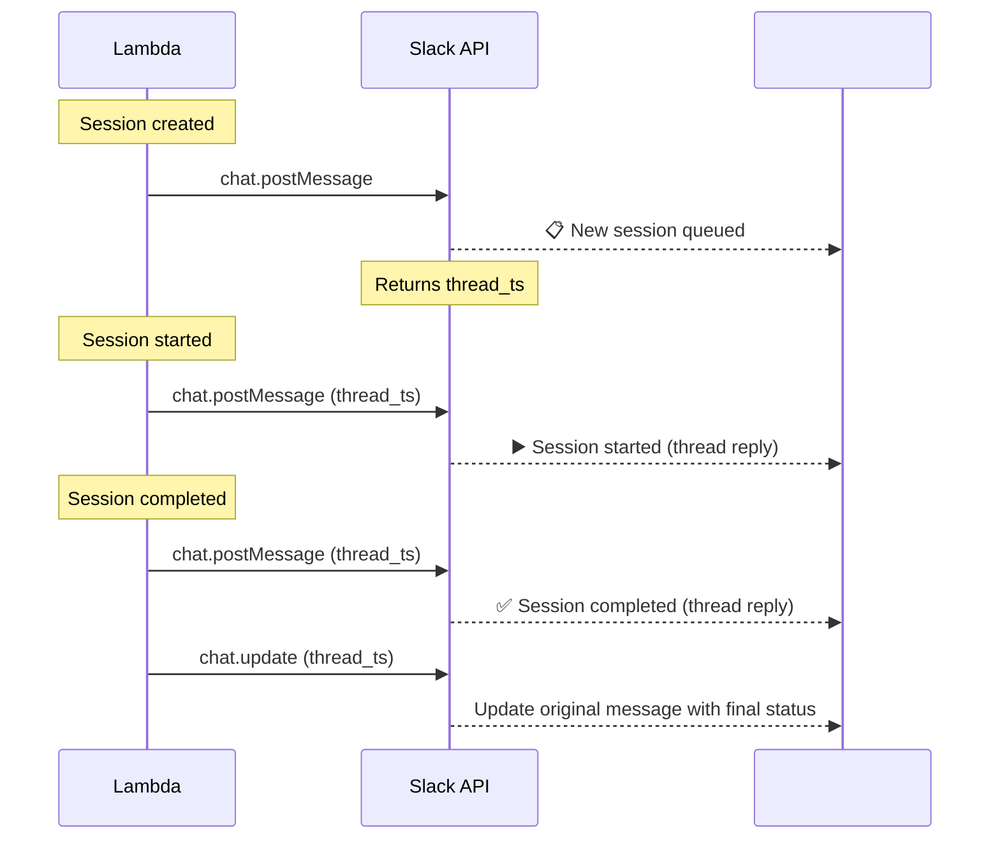

# Integrations

## Slack

For **fire-and-forget** callers (e.g. GitHub Actions `POST /sessions` then exit), humans do **not** watch the trigger job. They listen via:

| Channel    | What they see                                                                                             |
| ---------- | --------------------------------------------------------------------------------------------------------- |
| **Slack**  | Session lifecycle thread (queued → running → done/fail) from Auto Harness                                 |
| **GitHub** | PRs, issue/PR comments, reviews, checks—repo updates produced by the agent session (or follow-on tooling) |

Auto Harness owns the **Slack** session thread. **GitHub** updates depend on what the session is allowed to do on the VPS (git/`gh` credentials on the agent host)—not on the Actions run that kicked it off.

Auto Harness posts real-time session updates to Slack: each session gets a thread in a configured channel, updated as the session progresses.

### Setup

1. Create a Slack app at [api.slack.com/apps](https://api.slack.com/apps)
2. Add the `chat:write` OAuth scope
3. Install the app to your workspace
4. Copy the **Bot User OAuth Token** (`xoxb-...`)
5. Configure the integration via the API or Web UI

### Configuration

#### `POST /integrations/slack`

Configure Slack integration. **Admin only.**

**Request:**

```json
{
  "botToken": "xoxb-...",
  "defaultChannel": "#harness",
  "enabled": true,
  "notifications": {
    "onSessionCreated": true,
    "onSessionStarted": true,
    "onSessionCompleted": true,
    "onSessionFailed": true,
    "onSessionCancelled": true,
    "onScheduleCompleted": false
  }
}
```

| Field            | Type    | Required | Description                                                        |
| ---------------- | ------- | -------- | ------------------------------------------------------------------ |
| `botToken`       | string  | ✓        | Slack Bot User OAuth Token (`xoxb-...`)                            |
| `defaultChannel` | string  | ✓        | Default channel for notifications (e.g. `#harness`, `C0123ABCDEF`) |
| `enabled`        | boolean | ✗        | Default: `true`                                                    |
| `notifications`  | object  | ✗        | Toggle which events post to Slack                                  |

> **Note:** The bot token is encrypted at rest in DynamoDB using AWS KMS.

#### `GET /integrations/slack`

Get current Slack configuration (token is redacted).

#### `PUT /integrations/slack`

Update Slack configuration. **Admin only.**

#### `DELETE /integrations/slack`

Remove Slack integration. **Admin only.**

### Per-Repository Overrides

Repositories can override the default Slack channel:

```json
{
  "name": "my-app",
  "url": "git@github.com:org/my-app.git",
  "defaultBranch": "main",
  "slackChannel": "#my-app-auto-harness"
}
```

If not set, the default channel from the integration config is used.

### Thread Lifecycle

Each session creates a Slack thread that tracks the full lifecycle:



### Message Format

#### Session Created (channel message — starts the thread)

```
📋 Session queued — my-app
━━━━━━━━━━━━━━━━━━━━━━━━━
Prompt: Fix the failing test in src/utils.test.ts
Command: codex -p
Priority: 10
Source: ui (jong)
```

#### Session Started (thread reply)

```
▶️ Session started
Agent: vps-prod-1
Worktree: wt-2
```

#### Session Completed (thread reply + update original)

```
✅ Session completed in 5m 32s
Exit code: 0
```

The original channel message is also updated to show the final status:

```
✅ Session completed — my-app (5m 32s)
━━━━━━━━━━━━━━━━━━━━━━━━━
Prompt: Fix the failing test in src/utils.test.ts
Command: codex -p
Exit code: 0
```

#### Session Failed (thread reply + update original)

```
❌ Session failed after 2m 15s
Exit code: 1

Last 5 lines of stderr:
> Error: Cannot find module './parser'
> at Object.<anonymous> (src/utils.ts:12:1)
> ...
```

When `errorCode` is `usage_limit` (AI vendor quota / rate limit parsed by the agent):

```
❌ Session failed — usage limit
The AI CLI reported a plan or rate limit. Auto Harness pauses the assigned
Provider Account globally for its configured cooldown (5 hours by default),
then tries the next eligible account or configured fallback. Providerless
commands (`providerId: null`) are ungated and do not pause an account. A queued
session expires after its absolute queue TTL (8 days by default) with
`queue_expired`.
```

The original message is updated with ❌ status. The thread includes the last few lines of stderr to aid quick debugging without opening the UI.

#### Session Cancelled (thread reply + update original)

```
⚪ Session cancelled by jong
```

### Thread Metadata

The Slack `thread_ts` (thread timestamp) is stored on the Session record in DynamoDB so that subsequent status updates can reply to the correct thread:

```typescript
// Session record in DynamoDB
{
  id: "sess-x1y2z3",
  // ... other fields
  slackThreadTs: "1722556800.001234",
  slackChannel: "C0123ABCDEF"
}
```

### Rate Limiting

Slack API rate limits are ~1 message/second per channel. Auto-Harness batches updates:

- Log streaming is **not** sent to Slack (too noisy). Logs are only available in the Web UI (link the session from the thread when useful).
- Fire-and-forget CI callers rely on Slack (and GitHub repo activity) for humans; the trigger Actions run does not carry live agent logs.
- Status updates are sent immediately (queued → started → completed/failed).
- If multiple sessions complete in rapid succession, messages are queued and sent with a 1-second delay between each.

### Permissions Required

| Slack OAuth Scope | Purpose                               |
| ----------------- | ------------------------------------- |
| `chat:write`      | Post messages and replies to channels |

The bot must be invited to the target channel(s) via `/invite @auto-harness-bot`.

---

## Future Integrations

### GitHub Actions (caller pattern)

**Fire and forget** — not a long-running Actions job:

1. Event triggers a short workflow (failure, comment, schedule, …).
2. Workflow calls Auto Harness **`POST /sessions`** (service account).
3. Workflow **exits**; it does not poll session status.
4. Humans follow **Slack** (session thread) and/or **GitHub** (PRs/comments/checks). UI/logs for deep dive.

**Requirements:** Slack integration enabled for unattended runs; session id returned on create; no need for GHA to poll. Worked examples: [harness.md](harness.md).

### Custom Webhooks (Outbound)

Optional machine-to-machine callbacks if something other than Slack must react to terminal status. **Not required** for the GHA fire-and-forget + Slack pattern.

```json
{
  "url": "https://your-service.com/auto-harness-webhook",
  "events": ["session:completed", "session:failed", "session:timed_out", "session:cancelled"],
  "secret": "webhook-signing-secret"
}
```

### Email Notifications

Optional email notifications on session completion/failure via Amazon SES.
