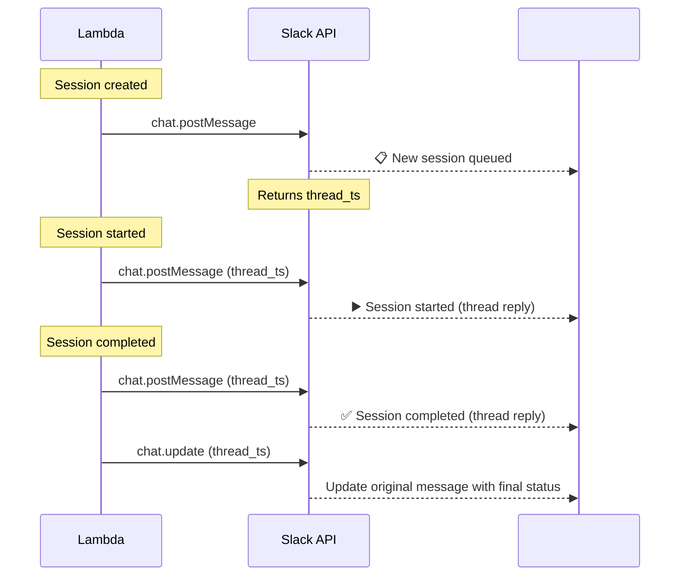

# Integrations

## Slack

> **Current status:** Auto Harness stores an encrypted, redacted Slack configuration through the
> admin API and Web UI. It supports both manual bot-token configuration and OAuth installation.
> Session lifecycle messages (`chat.postMessage` / `chat.update`) use the durable leased
> `NotificationDeliveries` outbox; local delivery runs only when its dependencies are injected and
> the deployed cron Lambda drains the same outbox. Delivery is **at-least-once** across Lambda
> invocations: a lost complete-after-send lease can post again after a cold start. If Slack is
> configured but this environment cannot decrypt the token or run the outbound worker, the API and
> UI report **configured but delivery unavailable**. OAuth installations also expose a public,
> signature-verified events endpoint that durably records supported mentions and DMs as pending
> inbound events. Events are not converted into sessions yet.

For **fire-and-forget** callers (e.g. GitHub Actions `POST /sessions` then exit), humans do **not** watch the trigger job. They listen via:

| Channel    | What they see                                                                                             |
| ---------- | --------------------------------------------------------------------------------------------------------- |
| **Slack**  | Target: session lifecycle thread (queued → running → done/fail) from Auto Harness                         |
| **GitHub** | PRs, issue/PR comments, reviews, checks—repo updates produced by the agent session (or follow-on tooling) |

Auto Harness owns the **Slack** session thread when delivery is available. **GitHub** updates depend on what the session is allowed to do on the VPS (git/`gh` credentials on the agent host)—not on the Actions run that kicked it off.

When outbound delivery is available, Auto Harness posts session updates to Slack: each session
gets a thread in the configured channel, updated as the session progresses.

### Delivery and installation setup

There are two equally supported setup paths. OAuth app credentials are optional; manual token
configuration works without them.

OAuth app credentials have the same JSON shape in both environments, but the configuration source
is intentionally different:

| Runtime                                   | Environment variable          | Value                                                                                     |
| ----------------------------------------- | ----------------------------- | ----------------------------------------------------------------------------------------- |
| AWS REST Lambda                           | `HARNESS_SLACK_APP_SSM_PARAM` | The **name** of an environment-scoped SSM `SecureString` containing the credentials JSON. |
| Local `createLocalApp` / `pnpm local:api` | `HARNESS_SLACK_APP`           | The credentials JSON itself; it is not an SSM parameter name.                             |

For local development, set `HARNESS_SLACK_APP` only in a local shell or uncommitted environment
file. This deliberately fake example shows the required shape; replace every value with the Slack
app's credentials and do not commit the result:

```sh
export HARNESS_SLACK_APP='{"clientId":"example-client-id","clientSecret":"example-client-secret","signingSecret":"example-signing-secret-not-real"}'
```

1. **OAuth (recommended):** configure the Slack app's client ID, client secret, and signing secret
   as JSON (`{"clientId":"…","clientSecret":"…","signingSecret":"…"}`) in the optional
   environment-scoped SSM `SecureString` named by `HARNESS_SLACK_APP_SSM_PARAM` (default
   `/auto-harness/<environment>/slack-app`), then select **Connect with Slack** in the admin Web
   UI. The app requests `chat:write`, `app_mentions:read`, and `im:history`; Slack redirects to
   the configured `/api/v1/integrations/slack/oauth/callback` URL after installation. AWS OAuth
   start requires a readable HTTPS public-base-url parameter and returns unavailable rather than
   giving Slack a localhost callback during a transient SSM failure. Only REST reads this
   parameter; Cron only needs the encrypted installation token for delivery.
2. **Manual:** create/install the Slack app, copy its Bot User OAuth Token (`xoxb-...`) and
   signing secret, and enter them in the Web UI or `POST /api/v1/integrations/slack`. Secrets are
   write-only and encrypted with KMS.

For inbound events, set the Slack Events API Request URL to
`/api/v1/integrations/slack/events` and subscribe to `app_mention` and `message.im`. Slack
signatures are verified against the raw request body; accepted events are durably stored as
pending with retry deduplication. Manual setup with a signing secret performs a bounded Slack
`auth.test` for its bot token and enables inbound only when it can persist both the workspace and
bot-user identity. OAuth installations require the signed envelope's workspace and app IDs to
match the stored installation; verified manual installations require the workspace and an
`authorizations[].user_id` to match the stored bot user. An unavailable manual identity check
leaves outbound delivery configured but inbound disabled. Receipts expire after seven days. URL verification challenges are
acknowledged, but unsupported event types are ignored. No inbound event creates a session yet.

OAuth installs use Slack's long-lived bot token; automatic token rotation is not enabled. Auto
Harness is currently a singleton, single-workspace integration, so an installation replaces the
previous OAuth installation rather than creating a tenant-specific connection.

### Configuration

#### `POST /api/v1/integrations/slack`

Configure Slack integration. **Admin only.**

**Request:**

```json
{
  "botToken": "xoxb-...",
  "defaultChannel": "#harness",
  "enabled": true,
  "notifications": {
    "onSessionCreated": true,
    "onSessionStarted": true,
    "onSessionCompleted": true,
    "onSessionFailed": true,
    "onSessionCancelled": true,
    "onScheduleCompleted": false,
    "onHostOffline": true
  }
}
```

| Field            | Type    | Required | Description                                                                  |
| ---------------- | ------- | -------- | ---------------------------------------------------------------------------- |
| `botToken`       | string  | ✓        | Slack Bot User OAuth Token (`xoxb-...`)                                      |
| `defaultChannel` | string  | ✓        | Default channel for notifications (e.g. `#harness`, `C0123ABCDEF`)           |
| `enabled`        | boolean | ✗        | Default: `true`                                                              |
| `notifications`  | object  | ✗        | Toggle session lifecycle events plus `onHostOffline` for stale/offline hosts |

> **Note:** The bot token is encrypted at rest in DynamoDB using AWS KMS.
> `KMS_KEY_ID` is required for configuration writes. Ciphertext is bound to the
> stable Slack integration encryption context, and the API never returns, logs,
> or audits bot tokens or optional signing secrets. Missing KMS configuration or
> encryption failures fail the write closed.

#### `GET /api/v1/integrations/slack`

Get current Slack configuration (token is redacted). The response includes
`deliveryAvailable`. When the integration is stored but this environment cannot
decrypt the bot token or run the outbound worker, that flag is `false` and the
UI reports **configured but delivery unavailable**.
The response also includes an opaque `installationId` when present; clients must retain and echo
it as `expectedInstallationId` when starting an OAuth reconnect. It is an identity fence, not a
credential.

#### `PUT /api/v1/integrations/slack`

Update Slack configuration. **Admin only.**

`PUT` replaces the complete configuration with manual credentials and therefore includes `botToken`.
For an OAuth-managed installation this explicitly switches the installation to manual credentials;
OAuth credentials are never returned.

#### `PATCH /api/v1/integrations/slack`

Update ordinary delivery settings without replacing credentials. **Admin only.** The request must
include `expectedVersion` from the preceding `GET` plus `defaultChannel`, `enabled`, and/or
`notifications`; credentials are rejected. `expectedVersion` must be a positive integer. A stale
editor receives `409` rather than overwriting a configuration that changed after it was read.

#### `POST /api/v1/integrations/slack/oauth/start`

Start an OAuth installation or reconnect. **Admin only.** The request includes the current
nonsecret delivery settings, the expected integration version (or `null` for a first install), and,
for an existing installation, its opaque `expectedInstallationId` from `GET`. A missing or stale
installation identity receives `409` and no OAuth state is created.
On reconnect, omitted `enabled` and `notifications` values inherit the current integration
settings; a first install defaults `enabled` to `true` and notifications to the global defaults.
The response is `{ "url": "https://slack.com/oauth/v2/authorize?..." }`. The URL
contains a one-time, expiring state; callers must navigate the browser to it and must not log it.

#### `GET /api/v1/integrations/slack/oauth/callback`

Public Slack redirect endpoint. The server consumes and validates state, exchanges the code, checks
workspace/app identity and required scopes, encrypts the bot token, and uses compare-and-swap
version plus opaque installation-identity fences. This prevents a delayed reconnect from applying
over a delete/recreate that reused version `1`. OAuth state is hash-only, single-use, and expires
after ten minutes. If the exchange succeeds but validation or durable installation is rejected, the
server makes a bounded best-effort `auth.revoke` call for the newly issued bot token; a revocation
failure does not replace the original installation failure. It redirects
to `/settings?slackOAuth=success|error`; the settings index forwards that bounded result to the
Slack settings page for display. OAuth codes, tokens, and Slack response details never appear in
the redirect.

#### `DELETE /api/v1/integrations/slack`

Remove Slack integration. **Admin only.**

### Thread Lifecycle

Each session creates a Slack thread that tracks the full lifecycle:



### Message Format

#### Session Created (channel message — starts the thread)

```
📋 Session queued — my-app
━━━━━━━━━━━━━━━━━━━━━━━━━
Prompt: Fix the failing test in src/utils.test.ts
Command: codex exec
Priority: 10
Source: ui (jong)
```

#### Session Started (thread reply)

```
▶️ Session started
Agent: vps-prod-1
Worktree: wt-2
```

#### Session Completed (thread reply + update original)

```
✅ Session completed in 5m 32s
Exit code: 0
```

The original channel message is also updated to show the final status:

```
✅ Session completed — my-app (5m 32s)
━━━━━━━━━━━━━━━━━━━━━━━━━
Prompt: Fix the failing test in src/utils.test.ts
Command: codex exec
Exit code: 0
```

#### Session Failed (thread reply + update original)

```
❌ Session failed after 2m 15s
Exit code: 1

Last 5 lines of stderr:
> Error: Cannot find module './parser'
> at Object.<anonymous> (src/utils.ts:12:1)
> ...
```

When `errorCode` is `usage_limit` (AI vendor quota / rate limit parsed by the agent):

```
❌ Session failed — usage limit
The AI CLI reported a plan or rate limit. Auto Harness pauses the assigned
Provider Account globally for its configured cooldown (5 hours by default),
then tries the next eligible account or configured fallback. Providerless
commands (`providerId: null`) are ungated and do not pause an account. A queued
session expires after its absolute queue TTL (8 days by default) with
`queue_expired`.
```

The original message is updated with ❌ status. The thread includes the last few lines of stderr to aid quick debugging without opening the UI.

#### Session Cancelled (thread reply + update original)

```
⚪ Session cancelled by jong
```

### Thread Metadata

Slack thread state belongs to the durable `NotificationDeliveries` rows, not to the Session
record. Each immutable lifecycle operation carries the configured channel and any thread
timestamp returned by Slack, allowing retries without adding Slack-specific fields to sessions.

### Rate Limiting

The delivery implementation must respect Slack API rate limits and batch updates:

- Log streaming is **not** sent to Slack (too noisy). Logs are only available in the Web UI (link the session from the thread when useful).
- When delivery is available, fire-and-forget CI callers can rely on Slack (and GitHub repo activity) for humans; the trigger Actions run does not carry live agent logs.
- Status updates are queued as durable operations (queued → started → completed/failed) and are
  leased in bounded batches. Slack rate-limit responses are retried according to the API's
  `Retry-After` guidance; there is no fixed one-second pacing promise.

The outbox stores one immutable operation ID per lifecycle action. REST/WS/cron session
writers enqueue those ids on create and status transitions so a session that is created and
cancelled between ticks is still in the outbox. The worker then leases due rows, recovers
expired leases after a restart, retries with bounded exponential backoff, and dead-letters
exhausted operations. A same-process sweep of queued/running sessions remains a safety net;
cron does not have to observe the session as active to deliver it. Failed snapshots fetch
stderr tails from durable logs when the process cache does not already have them. Replies depend on the sent root operation, while the final root update depends on the
terminal reply. The HTTP transport deduplicates ambiguous in-process retries with that operation
ID, including overlapping `deliver()` calls. Across Lambda invocations, delivery is
at-least-once: operators should treat a duplicate lifecycle post after a lost lease as
expected rather than exactly-once. Inbound events are separately deduplicated by workspace and
Slack `event_id` before they are acknowledged; they remain pending until a future consumer owns
session routing.
Failed sends store a secret-free `lastError` on the outbox row and emit a CloudWatch
line (`slack <operation> retried|dead <id>: …`).

### Permissions Required

| Slack OAuth Scope   | Purpose                               |
| ------------------- | ------------------------------------- |
| `chat:write`        | Post messages and replies to channels |
| `app_mentions:read` | Receive `app_mention` events          |
| `im:history`        | Receive direct-message history/events |

The bot must be invited to the target channel(s) via `/invite @auto-harness-bot`.

---

## Future Integrations

### GitHub Actions (caller pattern)

**Fire and forget** — not a long-running Actions job:

1. Event triggers a short workflow (failure, comment, schedule, …).
2. Workflow calls Auto Harness **`POST /sessions`** (service account).
3. Workflow **exits**; it does not poll session status.
4. Humans follow **Slack** (session thread) when delivery is available, plus **GitHub**
   (PRs/comments/checks) and the UI/logs.

**Target requirements:** Slack delivery enabled for unattended runs; session id returned on create;
no need for GHA to poll. If Slack is configured but delivery is unavailable, use GitHub activity
or the UI instead. Worked examples: [harness.md](harness.md).

### Custom Webhooks (Inbound and outbound)

Generic inbound webhooks are available at `POST /api/v1/webhooks/custom/:integrationId`. An admin
creates the integration at `/api/v1/integrations/custom/:integrationId`, choosing the repository
and target routing and supplying a signing secret. The secret is encrypted with KMS. Callers send
only `{prompt, idempotencyKey, ref?}` and sign the exact request bytes with HMAC-SHA256:

```text
x-auto-harness-signature-256: sha256=<lowercase hex digest>
```

Unknown fields and invalid signatures are rejected. A successful request returns a small `202`
acknowledgment after the session write and dispatch enqueue; `idempotencyKey` is scoped to the
integration and uses the existing atomic session concurrency lock to make concurrent or
active-session redelivery safe. Terminal sessions release that identity, so a later delivery can
intentionally start a new run; ingress does not add a second receipt store. The endpoint is
intentionally unauthenticated because the HMAC secret is its credential.

Outbound HTTP delivery signs the exact JSON event body with the same header and sends stable
`x-auto-harness-event` and `x-auto-harness-delivery` headers. Production destinations must be
HTTPS and redirects are disabled. HTTP 408, 429, and 5xx responses remain retryable; other 4xx
responses are permanent failures.

### Custom Webhooks (Outbound)

**Safe local pre-transport runtime:** optional machine-to-machine callbacks remain a target if
something other than Slack must react to terminal status. An opt-in local worker can reconcile
durable terminal session snapshots into the `WebhookDeliveries` outbox, query pending and expired
leases with bounded reads, recover exact lease fences, retry with bounded backoff, and dead-letter
exhausted rows. It starts only when durable storage, a secret-safe destination selector, and a
transport are all explicitly injected. Production injects none, so it performs no outbound request.
Webhooks are **not required** for the GHA fire-and-forget + Slack pattern.

Durable rows contain only a versioned configuration reference and this stable, secret-safe event
envelope:

```json
{
  "schemaVersion": 1,
  "id": "whe_<stable digest>",
  "type": "session.terminal",
  "occurredAt": "2026-08-12T20:00:00.000Z",
  "subject": { "type": "session", "id": "sess_123" },
  "data": {
    "repositoryId": "repo_123",
    "workspacePoolId": null,
    "workspaceSlotId": null,
    "attemptId": "attempt_123",
    "status": "completed"
  }
}
```

`repositoryId` is `null` for a workspace session. In that case `workspacePoolId` identifies the
non-Git pool and `workspaceSlotId` records the slot used by its terminal attempt (or is `null`
when it never received one). `attemptId` is `null` when a session becomes terminal before its first
assignment, such as a queued cancellation or queue expiry. The null participates in the stable
event digest; the worker never fabricates an assignment identity.

The outbox deliberately does not persist an endpoint, signing secret, request headers, prompt,
logs, metadata, response body, or free-form failure text. Destination selection freezes only the
exact `configurationId` + `configurationVersion`; the injected transport receives that reference,
the stable delivery idempotency key, and the exact event body only after a worker owns a live lease.
The selector is a historical resolver: for a given snapshot it must always return the configuration
versions that were effective at `occurredAt`, even after rotation or process restart, rather than
the versions that are current during a later reconciliation. The transport must deduplicate
ambiguous retries by the stable delivery key. Configuration CRUD and secret resolution stay outside
outbox rows; the opt-in runtime supplies a signed transport and destination resolver.

The eventual configuration shape remains target-only:

```json
{
  "url": "https://your-service.com/auto-harness-webhook",
  "events": ["session:completed", "session:failed", "session:timed_out", "session:cancelled"],
  "secret": "webhook-signing-secret"
}
```

### Email Notifications

Optional email notifications on session completion/failure via Amazon SES.
