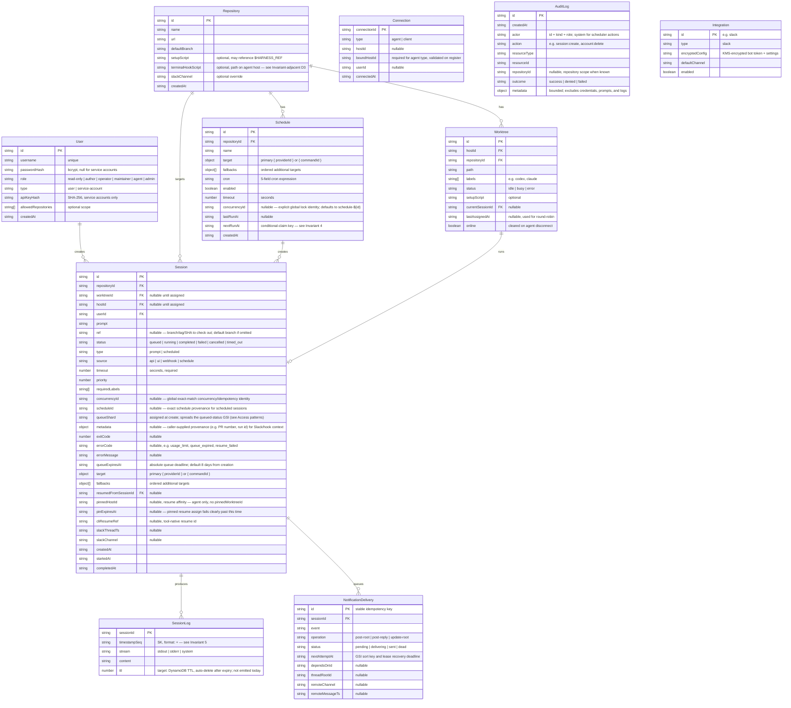

# Implementation Plan

This is the build-handoff document for Auto Harness. It exists so a different agent — with no
memory of how this spec came together — can pick it up and build without re-litigating decisions
that are already settled, or re-discovering correctness bugs that are already known.

**How to use this document:** this file owns _sequencing, structure, data model, and acceptance
criteria_. It does not restate layer detail — control-plane internals live in [aws.md](aws.md),
agent internals in [host-daemon.md](host-daemon.md), the wire formats in [api.md](api.md) and
[websocket.md](websocket.md). Section 8 lists exactly what to change in those sibling docs; do
that first, since phases below assume the amended API/data model, not the one currently written
in those files.

**Driving constraint, restated:** Auto Harness exists to spend **subscription plan capacity**
(Codex, Claude Code, etc.) on unattended coding work by driving **non-interactive CLIs**, not
Agent SDKs or pay-per-token APIs. See [why.md](why.md) and [costs.md](costs.md). Every design
choice below is in service of that — cheap coordination, not a second AI vendor account, not a
generic multi-tenant agent platform.

---

## 1. Locked decisions — do not re-litigate

These were decided against a real migration target (product-repo `codex-*` GitHub Actions
automation) and are settled. If an approach below looks more "complete" or "correct," that is not
sufficient reason to reopen it — these trade completeness for a smaller, more auditable system on
purpose. Raise it with the project owner before changing any row.

Repository admission is also locked: pause leaves running work alone; drain cancels all active
sessions and settles paused only after leases release. Missing state on legacy rows means active,
and cron occurrences skipped while closed are never caught up. The supported automation
distribution is the checked-in GitHub dispatch action plus public `auto-harness-client`, with
`docs/openapi.yaml` as its source contract.

| #   | Decision                                                                                                                                                                                                                                                                                                                                                                                                            | Rationale                                                                                                                                                                                                                                                                                                                                                                                                                                                    | Do not propose                                                                                                                                                                     |
| --- | ------------------------------------------------------------------------------------------------------------------------------------------------------------------------------------------------------------------------------------------------------------------------------------------------------------------------------------------------------------------------------------------------------------------- | ------------------------------------------------------------------------------------------------------------------------------------------------------------------------------------------------------------------------------------------------------------------------------------------------------------------------------------------------------------------------------------------------------------------------------------------------------------ | ---------------------------------------------------------------------------------------------------------------------------------------------------------------------------------- |
| D1  | The agent holds git + AI vendor credentials and does its own GitHub writes (PRs, comments, labels) directly from the session.                                                                                                                                                                                                                                                                                       | A prior design considered a three-phase execute → validate → publish split (run Codex with no push credential, validate the patch in an immutable runtime, publish from a separate pristine checkout) to keep untrusted output away from any credential. That split cost real complexity for a mitigation a scoped token buys more cheaply (see D7). Deliberately dropped: _"the current system is too complex and agents keep making it over complicated."_ | A bundle/validator/publisher pipeline. Patch attestation. Split-credential jobs. A "trusted runtime" concept.                                                                      |
| D2  | There is no callback DAG. Callers `POST /sessions` and exit. The target human feedback is the **Slack session thread** plus **the agent's own GitHub writes** (opening/updating a PR, commenting a link), not a webhook fired back at the caller. Slack delivery is not implemented yet; GitHub writes depend on agent credentials.                                                                                 | Repo harness callers are fire-and-forget by design ([harness.md](harness.md)); the triggering GitHub Actions job is gone by the time the session finishes.                                                                                                                                                                                                                                                                                                   | Blocking `POST /sessions` until terminal. Polling loops in the caller's CI. A generic outbound-webhook framework as a _required_ mechanism (optional, low-priority — see Phase 5). |
| D3  | Failure escalation (e.g. "Codex couldn't fix it, open an issue for a human") is an **agent-side terminal hook**: agent config points at a repo-local script, invoked with session metadata as env on every terminal status.                                                                                                                                                                                         | No GitHub Actions job survives to run escalation logic post-migration, so _something_ has to. Keeping it agent-side keeps escalation policy where it already lives (in the target repo, versioned with it) and keeps GitHub tokens out of the control plane. It also covers failure modes a prompt cannot see itself hit: `usage_limit`, `timed_out`, agent crash, setup-script failure.                                                                     | A rules engine or escalation templates inside Auto Harness. A control-plane GitHub App making the decision.                                                                        |
| D4  | `command` is a named catalog Command, or a Provider/Command target with ordered fallbacks, resolved control-plane-side into fixed `resolvedArgv`. Provider targets select healthy attached Provider Accounts; a `providerId: null` Command is a providerless pure CLI.                                                                                                                                              | A free string is a straight line from operator role to arbitrary command execution on the VPS, and string→argv construction is its own injection surface. Catalog names and fixed argv close that injection surface.                                                                                                                                                                                                                                         | Free-form `command` strings. Shell strings. `shell: true` anywhere in the executor.                                                                                                |
| D5  | Session **resume pins to the agent only**, not agent+worktree. The worktree is re-established via `ref` (see D6) rather than kept untouched.                                                                                                                                                                                                                                                                        | The AI CLIs this system targets keep their own session/conversation state outside the working tree (e.g. under the CLI's own state directory), and shepherd-style flows push their commits to the remote each tick. The durable state for resume is _(CLI session id, remote branch)_ — not "don't touch this worktree." Pinning to a worktree and waiting indefinitely for it to free up is a liveness hazard for no real benefit once this is understood.  | Worktree-level pinning. Indefinite pin waits. Snapshotting or freezing a worktree to preserve state.                                                                               |
| D6  | `POST /sessions` accepts a `ref` (branch/tag/SHA) so a session can run against something other than the repo default branch.                                                                                                                                                                                                                                                                                        | Without it, every session's worktree gets reset to the default branch by its setup script — so a session can never operate against a specific PR head. This blocks entire trigger patterns (comment-driven PR work, dependency-bot PR fixes), not an edge case.                                                                                                                                                                                              | Solving this by making callers pre-stage the ref out-of-band, or by adding N repo-specific "PR worktree" special cases instead of one general field.                               |
| D7  | The credential the agent uses for GitHub writes is a **fine-grained token scoped to one repository**: contents + pull-requests + issues write, no Actions/workflow write, no secrets read.                                                                                                                                                                                                                          | This is the primary mitigation for D1 and D4 relaxing the trust boundary — a prompt is attacker-influenced (it can originate from an issue comment or embed captured CI output), so bound what a compromised session can reach.                                                                                                                                                                                                                              | Broad PATs. Org-wide App installations. Reusing a human operator's token.                                                                                                          |
| D8  | A `usage_limit` pauses the assigned Provider Account globally for its configured cooldown (5 hours by default), releases the worktree, and immediately advances the session through ordered targets/fallbacks. It remains queued until capacity returns or its absolute queue TTL expires (8 days by default), then fails `queue_expired`; providerless Commands are ungated and ordinary failures remain terminal. | Account cooldowns model vendor capacity without rerunning a failed logical session; explicit fallbacks and an absolute deadline provide bounded, auditable liveness.                                                                                                                                                                                                                                                                                         | Session-scoped retry counters/backoff, a global retry cap, and automatic retries for ordinary failures.                                                                            |
| D9  | No Docker (or other sandbox) wraps the agent process itself. The host is trusted; the AI CLI runs directly on it, subject to the CLI's _own_ sandboxing (approval policy, writable-roots, hooks) which is configured per-repo, not by Auto Harness.                                                                                                                                                                 | Stated existing principle ([architecture.md](architecture.md), [security.md](security.md)) — keep it explicit here so it isn't "improved" into per-session containers as part of this work.                                                                                                                                                                                                                                                                  | Per-session containers, gVisor, rootless podman, or any other isolation layer wrapping the agent or its worktrees.                                                                 |

## 2. Non-goals

Explicitly out of scope for this project, regardless of how easy any individual piece looks:

- **API-metered agent farms.** This is a subscription-capacity scheduler, not a pay-per-token
  agent platform. See [why.md](why.md), [costs.md](costs.md).
- **Replacing interactive IDE/chat use.** Auto Harness is for unattended, queued work.
- **Owning a target repo's GitHub policy.** Trigger filtering, CI-failure triage, deduplication,
  comment-author authorization, and prompt content stay in the target repo
  ([harness.md](harness.md)). Auto Harness receives a rendered prompt and a target; it does not
  decide _whether_ to run.
- **Multi-tenant SaaS.** Single-org control plane; `allowedRepositories` scoping is the extent of
  multi-tenancy, not a hard security boundary between untrusted customers.
- **Per-session containerization** (see D9).
- **A general outbound-webhook / callback framework as a required path** (see D2) — an optional
  version may land in Phase 5 for callers who want it, but no phase before that depends on it.

---

## 3. Project Structure

**Layout convention:** shared code lives in `modules/`; deployable units live in
`services/`. Dependency-cruiser forbids modules→services and service→service imports.

Layer docs: [aws.md](aws.md) (control plane `services/cdk` + `services/api`),
[host-daemon.md](host-daemon.md) (`services/host-daemon`).

```
auto-harness/
├── modules/
│   └── shared/                 # @auto-harness/shared — types, constants, validation
│
├── services/
│   ├── cdk/                    # @auto-harness/cdk — AWS CDK (see aws.md)
│   ├── api/                    # @auto-harness/api — REST + WebSocket Lambda/local
│   ├── host-daemon/            # @auto-harness/host-daemon — VPS daemon (see host-daemon.md)
│   └── web/                    # @auto-harness/web — Next.js UI
│
├── docs/
├── .github/workflows/
├── pnpm-workspace.yaml         # modules/* + services/*
├── tsconfig.base.json
├── package.json
├── AGENTS.md
└── README.md
```

Target source layout inside services (as Phase 1+ lands) still follows the earlier design:
`api` owns handlers + session-service + scheduler; `agent` owns connection, executor,
worktree-manager, command-profiles, terminal-hook, etc. See Phase 1 deliverables below
(paths use `services/*` / `modules/shared`, not `packages/*`).

---

## 4. Data Model



**Changed from earlier drafts of this document:** free-form `command` first became a named
`commandProfile`, then the current catalog-backed `target` plus ordered `fallbacks` model (D4);
`pinnedWorktreeId` removed, `pinExpiresAt` added (D5); `ref`, `concurrencyKey`/`concurrencyId`, `onConflict`,
`queueShard`, `metadata`, `queueExpiresAt`, `retryAfter`, `retryCount`, `target`, and `fallbacks` added; `SessionLog` sort key changed from
bare `timestamp` to `timestampSeq`; `Worktree.online` and `Repository.terminalHookScript` added.

### Access patterns

| Access pattern                      | Table / index          | Key shape                                                                           | Notes                                                                                                                                                                                  |
| ----------------------------------- | ---------------------- | ----------------------------------------------------------------------------------- | -------------------------------------------------------------------------------------------------------------------------------------------------------------------------------------- |
| Get session by id                   | Sessions               | PK `id`                                                                             |                                                                                                                                                                                        |
| List queued sessions for assignment | Sessions               | GSI `status-createdAt`, sharded: query all of `queued#0` … `queued#(N-1)` and merge | See Invariant-adjacent note below — a single `status=queued` partition is a hot-partition risk under CI-storm bursts. `N` (shard count) is a deploy-time constant; start at 4–8.       |
| List sessions by repo               | Sessions               | GSI `repositoryId-createdAt`                                                        |                                                                                                                                                                                        |
| Full-text prompt search             | —                      | **not implemented in v1**                                                           | DynamoDB cannot do this without a scan or an external index (OpenSearch). Phase 4 ships filter-only; revisit only if a real need appears, with an explicit external index, not a scan. |
| Append session log chunk            | SessionLogs            | PK `sessionId`, SK `timestampSeq`                                                   | `seq` is a per-session monotonic counter assigned by the **agent**. Local WS ingress batches at most 25 adjacent chunks without changing this order.                                   |
| Range-read logs for REST/history    | SessionLogs            | PK `sessionId`, SK range                                                            | Sort order is correct because `timestampSeq` is lexicographically ordered by construction (fixed-width zero-padded seq).                                                               |
| Idle matching worktrees             | Worktrees              | GSI `repositoryId-status` (or scan for small fleets)                                | Claim uses a conditional write — see Invariant 1.                                                                                                                                      |
| Find agent connection for assign    | Connections            | GSI `hostId`                                                                        | Conditional put on register — see Invariant 3.                                                                                                                                         |
| Due schedules                       | Schedules              | GSI `repositoryId-nextRunAt`, or scan across all repos for the cron sweep           | Claim is the conditional advance of `nextRunAt` — see Invariant 4.                                                                                                                     |
| Due notification operations         | NotificationDeliveries | GSI `status-nextAttemptAt`                                                          | Workers conditionally lease pending or expired-delivering rows; stable IDs make lifecycle replay insert-only.                                                                          |

---

## 5. Invariants

These are the testable rules the implementation must uphold. Every phase's acceptance criteria
reference these by number; a phase is not done until its invariants have a passing test.

1. **Worktree claim is exclusive.** A worktree transitions `idle → busy` only via a conditional
   write (`ConditionExpression: status = :idle`). A losing writer (e.g. the create-path scheduler
   and the drain-path scheduler racing on the same idle worktree) retries against the next
   candidate instead of double-assigning.
2. **Assign has a deadline.** A session assigned to an agent (`session:assign` sent) that does not
   receive `session:ack` within a bounded ack deadline returns to `queued` and its worktree
   returns to `idle`. No unbounded "ignore" outcome is allowed to leave a worktree wedged `busy`
   forever.
3. **One live connection per agent.** `host:register` is a conditional put keyed on `hostId`
   ("no existing connection for this `hostId`"); a stale row from a lost `$disconnect` must not
   let two connections both believe they own one agent identity.
4. **A schedule fires at most once per `nextRunAt`.** The cron evaluator's claim _is_ the
   conditional advance of `nextRunAt` (`ConditionExpression: nextRunAt = :expected`). A retried or
   overlapping EventBridge invocation must not create two sessions for the same fire.
5. **Log ordering is total per session.** Under the `(timestamp, seq)` sort key, replay and
   reconnect must never renumber or reorder previously-assigned `seq` values, including across an
   agent reconnect mid-session.
6. **`usage_limit` pauses the assigned account and routes immediately.** No other terminal status
   (`failed` without that code, `timed_out`, `cancelled`) triggers account cooldown or fallback routing;
   queued sessions wait only until their fixed `queueExpiresAt` deadline.
7. **Native resume assigns only to `pinnedHostId`, on an agent-only pin, with an expiry.** It may
   use any eligible worktree for the repository and `ref` on that host. If the native route is
   unavailable or `pinExpiresAt` passes, the scheduler atomically clears the host, route, and CLI
   reference pins and continues as a fresh target/fallback run rather than waiting indefinitely.
8. **No shell interpolation of untrusted input.** Prompts, `ref`, and any caller-supplied string
   are passed as argv elements or via stdin — never concatenated into a shell command string, on
   the control plane or the agent.
9. **`concurrencyId` is globally exact and atomic.** A durable lock table permits only one active
   session for an identity across API workers. Duplicate manual creates return the existing
   session (`200`, `created: false`); new creates return `201`, `created: true`. Terminal
   completion releases the lock for an explicit retry. Automatic overlap skips the duplicate,
   advances `nextRunAt`, and leaves `lastRunAt` unchanged.
10. **The control plane can do everything; the host pane is debug-only.** Hosts connect to the
    control plane over WebSocket only — there is no reachable address for a host from the control
    plane's side. Every action a user needs on a host (attach/edit repositories, add/remove/edit
    worktrees, attach Provider Accounts, and configure scoped Command overrides) must be reachable
    from `services/web`. `services/host-pane`
    (`:7422`) is a local debugging tool for that host, never a required step in a normal workflow.

---

## 6. Phases

Each phase lists **Goal → Deliverables → Acceptance criteria → Tests → Exit condition**, plus a
migration marker. **No product-repo automation workflow may cut over before the marker on Phase 3 is met.**

### Phase 1 — Foundation

> Get one session running end-to-end on the local agent, no cloud.

**Deliverables**

- `pnpm` monorepo with workspaces; `modules/shared` with types + constants.
- `services/agent`:
  - Config loading (repos, worktrees, labels, **command profiles**, **terminal hook script
    path**) from JSON file + env vars.
  - Git worktree manager — create worktrees on startup, validate existing ones, **checkout a
    specific `ref` when the session specifies one** (D6), else the repo's default branch.
  - `command-profiles.ts` — maps a named profile (e.g. `codex-fix`) to a fixed argv template;
    rejects unknown profiles (D4).
  - Process executor — assigned AI CLIs use `node-pty` at 120x40; git, setup scripts, and
    terminal hooks use `child_process.spawn` with separate stdout/stderr pipes. Both paths use
    argv arrays with **no `shell: true`**; prompt is passed as argv/stdin only (Invariant 8).
  - Session runner — claim worktree → run setup script (ref-aware) → resolve command profile →
    spawn → collect output → release.
  - Session timeout — kill after `timeout` seconds, report `timed_out`.
  - Usage-limit detection — parse CLI output for quota/rate-limit text → `failed` +
    `errorCode: usage_limit` (no retry logic yet — that's Phase 2/3).
  - `terminal-hook.ts` — on every terminal status, if the repo config declares a hook script,
    invoke it with session metadata as env (`HARNESS_SESSION_ID`, `HARNESS_STATUS`,
    `HARNESS_ERROR_CODE`, `HARNESS_REF`, `HARNESS_METADATA`, worktree path); log and swallow hook
    failures, never let them change session status (D3).
  - Log streamer — buffer/emit stdout/stderr with timestamps **and a per-session monotonic
    `seq`** (Invariant 5).
- Minimal agent CLI: `auto-harness-agent start`, `auto-harness-agent status`.
- **Local API server** (`services/api/src/local-server.ts`) — Express + `ws` wrapper around the
  same Lambda handlers. REST on `localhost:7420`, WS on `ws://localhost:7420/ws`. DynamoDB Local.
  Auto-creates tables, seeds a default admin.
- Local-only mode for testing (accept sessions via local file or stdin).
- Full local stack: DynamoDB Local (Docker) + local API server + `services/web` dev server + agent
  — same code as production.
- **Testing:** vitest across packages; unit tests for session runner, worktree manager, config
  loader, command-profiles, terminal-hook; mock the `child_process.spawn` host boundary (and the
  `node-pty` boundary when the target PTY path is implemented);
  `modules/shared` type-level assertions.

**Acceptance criteria**

- A session with `ref` set checks out that ref, not the default branch (D6, Invariant 8).
- An unknown `commandProfile` is rejected before spawn, with no shell fallback (D4). **Superseded**
  by the Providers/Provider Accounts/Commands catalogs (see `docs/terminology.md`): a session now
  targets a `{ providerId }` or `{ commandId }` plus ordered fallbacks, and unknown or duplicate references are rejected at
  session/schedule **create** time (`resolveSessionTargetLabel`) — strictly earlier than "before
  spawn". A separate assign-time cascade/enablement check (`resolveSessionTargetArgv`) can still
  reject a specific worktree candidate even for a valid account (e.g. disabled for that worktree),
  which is why "before spawn" as a single flat check no longer fully describes the system. D4's
  substance (named, fixed argv; never a free string; never `shell: true`) is unchanged.
- A terminal hook script receives correct env on `completed`, `failed`, `timed_out`, and
  `usage_limit` and its failure does not alter the reported session status (D3).
- Log chunks emitted within the same millisecond are distinguishable and correctly ordered on
  replay (Invariant 5).

**Status (local exit):** done for agent + local REST without AWS. Verify with
`pnpm check`, `pnpm local:e2e`, `pnpm local:cli-e2e` (documented CLI + `ref: main` while primary
tree is on `main`), and `pnpm local:api-smoke`.

The current assigned-command executor uses a 120x40 `node-pty` terminal and preserves the
SIGTERM → SIGKILL process-group lifecycle for timeout and cancellation. Setup scripts, terminal
hooks, and git operations remain pipe-based. This provides TTY compatibility for non-interactive
CLI modes; it does not add an interactive user-input channel.

**Deviations (intentional, Phase 1 only):**

- Local API uses **Amazon DynamoDB Local** (`docker compose` / `pnpm local:dynamodb`) via the
  AWS SDK — not a custom DB. Process cache remains for single-process coordination; durable
  rows live in DynamoDB Local (same table shapes as CDK).
- Agent `start` (WebSocket daemon) is Phase 3; local path uses `run-session` / `local:e2e` bridge.
- `services/web` remains a stub until a later UI phase.
- Checkout always detaches at the resolved SHA so a session `ref` that is already checked out in
  the primary tree (e.g. `main`) still works.

**Migration marker:** none — Phase 1 is agent-local only; nothing can cut over yet.

### Phase 2 — Cloud Infrastructure + API

**Deliverables**

- `services/cdk`:
  - DynamoDB tables per §4, including the **sharded `status-createdAt` GSI** for the queue and
    the **`timestampSeq`** sort key for SessionLogs.
  - SessionLogs TTL (7 days).
  - S3 archive bucket, API Gateway (REST + WS), Lambda functions + IAM roles.
  - CloudWatch Events rule (1-minute) for cron evaluation (provisioned by the CDK runtime stack).
- `services/api` REST handlers:
  - Auth: login/logout, user CRUD, service account CRUD.
  - Sessions: create (**`ref`, `target`, `fallbacks`, `concurrencyId`, `metadata`
    accepted; response includes `url`**), list (`search` **omitted from v1** — see Access
    patterns), get, cancel, clone, resume (**agent-only pin**, D5).
  - Repositories: CRUD (include `terminalHookScript`).
  - Worktrees: list, get. Hosts: list, get inventory, drain. Schedules: CRUD + manual trigger. Integrations:
    Slack config CRUD.
- `services/api` WebSocket handlers:
  - `$connect`/`$disconnect` — validate token, manage Connections table with the **conditional put
    on `hostId`** (Invariant 3).
  - `$default` — route by `type`.
  - Task dispatch: `session:assign` to agent, including `ref` when set.
  - Status/log forwarding: agent → DynamoDB, agent → subscribed clients.
  - Live log replay: buffer recent chunks per session, replay on `session:subscribe`. The
    implemented window is **10,000 chunks / 10 MiB per session** (`control-plane-messages.ts`)
    rather than the 100 lines first sketched here. It is a memory bound only — chunks that
    leave the window stay in `SessionLogs`, which is what `GET /sessions/:id/logs` and
    `archiveSessionLogs` read. Durable retention is the SessionLogs TTL below, not eviction.
- Cron handler:
  - Due schedules via **conditional `nextRunAt` advance as the claim** (Invariant 4).
  - Creates sessions `type: scheduled`, `source: schedule`.
  - Stale-session sweep — see Phase 3 for the heartbeat-based version; a coarse
    `startedAt + timeout + grace` version is acceptable here as a placeholder but must be replaced
    before Phase 3 exits.
- Local development parity: DynamoDB Local, thin Express wrapper, mock WS server for agent dev,
  `.env.example` per package.
- **Testing:** integration tests against DynamoDB Local for every invariant in §5 that this phase
  implements (1, 3, 4, 5); API handler tests with mocked DynamoDB; WS handler tests with mocked
  API Gateway Management API.

**Acceptance criteria**

- Two concurrent `POST /sessions` racing for the same idle worktree: exactly one wins the claim,
  the other is queued or assigned elsewhere (Invariant 1).
- Two concurrent `host:register` calls with the same `hostId`: exactly one connection row
  survives (Invariant 3).
- A cron sweep re-invoked concurrently (simulating an EventBridge retry) creates at most one
  session per due schedule (Invariant 4).
- `GET /sessions/:id/logs` replays events in insertion order even when two log-writes land in the
  same millisecond (Invariant 5).
- `POST /sessions` response includes a `url` that resolves to the session in the local Web UI.

**Status (code-complete, local parity):** `ControlPlane` implements exclusive claim (Inv 1),
agent register uniqueness (Inv 3), cron `nextRunAt` claim (Inv 4), `timestampSeq` logs (Inv 5),
session create with `ref`/`target`/`fallbacks`/`concurrencyId`/`metadata`/`url`.
CDK table definitions plus deployable HTTP/WebSocket Lambda runtime resources live in
`services/cdk`, including an EventBridge rule and cron Lambda for durable scheduling sweeps.
The explicit deploy, update, and teardown lifecycle and REST health check were verified against
an AWS account in `us-west-2` on 2026-08-16. The SessionLogs
table enables the `ttl` attribute, but runtime log records do not populate it and local table
creation does not configure TTL, so current logs do not expire through TTL. Terminal archival
retains bounded pointer/status metadata in the DynamoDB Archives table and writes JSONL objects to
S3 when `ARCHIVE_BUCKET` configures the archive writer. No account-backed upload has been verified.
The local store is DynamoDB Local via `pnpm local:dynamodb` (official image).

**Migration marker:** none — cloud plumbing only, no live agent assignment loop yet.

### Phase 3 — Agent ↔ Cloud Integration

**Deliverables**

- Agent WebSocket client — connect, auto-reconnect (exponential backoff, max 60s).
- **Agent-initiated keepalive**: the agent sends periodic pings (or equivalent activity) to keep
  the API Gateway WS connection alive; do **not** implement a server-originated timer-based
  `ping`, since Lambda has no persistent process to hold one (this replaces an earlier,
  unimplementable "server pings every 30s" design).
- `host:register` on connect — worktree inventory, validated against `boundHostId`.
- **Ack-deadline enforcement**: `session:assign` without `session:ack` inside the deadline
  requeues the session and frees the worktree (Invariant 2) — implemented in the scheduler
  service, triggered by a short-lived timer or a re-check on next scheduling pass.
- Live log streaming over WS. The local WebSocket ingress coalesces at most 25 adjacent log
  frames and commits them with one connection-fenced DynamoDB transaction; a plain
  `BatchWriteItem` cannot preserve the host-connection fence.
- Session status lifecycle: `queued → running → completed | failed | cancelled | timed_out`.
- Session timeout enforcement (agent-side kill + report).
- Queue management with priority; **durable `concurrencyId` lock resolution** (Invariant 9) at
  session-create time.
- Worktree label matching; multi-agent round-robin by `lastAssignedAt`.
- **Session resume** — pin to `pinnedHostId` only; agent re-checks-out via `ref` +
  `cliResumeRef`/native CLI resume rather than relying on undisturbed worktree state; pin honors
  `pinExpiresAt` (Invariant 7, D5).
- **Usage-limit routing** (D8, Invariant 6): on `errorCode: usage_limit`, pause the assigned Provider
  Account globally, release the worktree, and immediately try the next eligible account or fallback.
  If none is eligible, leave the session queued until its fixed `queueExpiresAt`; then fail with
  `queue_expired`. Providerless Commands are ungated.
- Reconnection recovery — re-report running sessions and worktree state; **heartbeat-based stale
  detection** replaces the coarse `timeout + grace` sweep from Phase 2 (use log/status recency,
  not just `startedAt`, so a crashed agent's worktree is reclaimed promptly rather than after up to
  the full session timeout).
- Non-worktree (`scheduled`) session execution on main repo checkout; main-checkout lock, serial
  per repository. A scheduled `ref` is a branch name only (never a tag/SHA) and must exist on an
  eligible host; generic prompt-session `ref` remains branch/tag/SHA (D6).
- **Testing:** E2E test — create session (with `ref`) → agent picks up → runs → completes, using
  DynamoDB Local + mock WS; dedicated tests for Invariants 2, 6, 7, 9; a resume test that resumes
  onto a **different** worktree path after the original was reused by an intervening session,
  proving D5 actually works.

**Acceptance criteria**

- A session assigned to an agent that never acks (simulated) returns to `queued` within the ack
  deadline and its worktree returns to `idle` (Invariant 2).
- A `usage_limit` session releases its worktree and advances immediately; account cooldown expiry or
  manual clearing makes it eligible again, while the fixed queue TTL bounds waiting (Invariant 6, D8).
- A resumed session reaches the correct `ref`/branch state even when its original worktree was
  reassigned and reset in between (D5, Invariant 7).
- Two concurrent creates sharing a `concurrencyId` — exactly one session is created and the
  duplicate receives the existing session (`200`, `created: false`; Invariant 9).
- A crashed agent's worktree is reclaimed materially faster than the full session `timeout` would
  otherwise require.

**Status (code-complete and tested locally):** `DaemonLoop` + **WebSocket** (`/ws` on local API,
`auto-harness-agent start`, `pnpm local:ws-e2e`) and loopback (`pnpm local:cloud-e2e`). Ack
deadline requeue (Inv 2), usage_limit retry (Inv 6), agent-only resume pin (Inv 7), durable
concurrency dedupe (Inv 9), heartbeat stale reclaim. Local WS log ingress commits up to 25
adjacent chunks in one connection-fenced transaction; a plain `BatchWriteItem` would not preserve
that fence. No live AWS API Gateway deployment or account-backed Phase 3 E2E has been demonstrated.

**Migration marker: a plan-only repo workflow (e.g. `codex-plan`, no publication) may cut over once this
phase's acceptance criteria pass, plus the terminal hook from Phase 1 and account cooldown/fallback routing
above are live in a real deployment.** No workflow that needs `ref`, resume, or
`concurrencyId` may move before this phase is fully done.

### Phase 4 — Web UI

**Deliverables** — unchanged in scope from the original draft, with one correction:

- `services/web` Next.js app: dashboard, session list/detail/create, schedule management,
  repository management, settings, auth, Slack config UI — see [web.md](web.md) for full detail.
- **Session search is scoped to client-side filtering over the current page**, not a
  full-text `search` query param against DynamoDB (see Access patterns, §4) — do not implement a
  DynamoDB scan-backed search endpoint. If full-text search becomes a real requirement, it needs
  an explicit external index (e.g. OpenSearch), scoped and estimated as its own piece of work, not
  bundled into Phase 4.
- Create-session form includes **ref**, **concurrencyId**, and **labels** fields, a catalog-backed
  primary Provider/Command target picker, and ordered fallback targets (never free text).

**Acceptance criteria**

- Creating a session from the UI with a `ref` produces a session that checks out that ref.
- The target and fallback pickers only offer catalog Providers and Commands returned by
  `GET /session-targets`; assignment later selects an eligible attached Provider Account or an
  eligible providerless Command route.
- `GET /sessions` uses the repository/principal-scoped, filter-first cursor contract documented in
  [api.md](api.md): latest/oldest/priority sorting, a default 50/max 100 page size, and signed
  cursors; search remains client-side over the current page.

**Status (local):** the `services/web` Next.js app provides the supported control-plane management
surfaces. Its API-backed create-session UI includes target/fallback routing, ref, concurrency
identity, priority, and label constraints populated from online worktrees; it also provides
authenticated live-log tailing and Slack configuration. `services/host-pane` on `:7422` is a
local, per-host debugging tool and is never required for normal management workflows (Invariant
10). The log viewer is a read-only xterm.js renderer with ANSI, search, font-size, fullscreen, and
download controls, and the daemon feeds it the assigned CLI's merged 120x40 PTY output. Git
operations, setup scripts, and terminal hooks remain pipe-based. Slack configuration is
storage-only and does not send messages. A local session-lifecycle worker and durable outbox can
run only with an explicitly injected transport; production supplies none, so real Slack delivery
remains disabled. No cloud-hosted UI/runtime has been deployed or account-tested.

**Migration marker:** UI availability doesn't gate any repo-workflow cutover — CLI/API-driven
callers don't need it. Useful before wider multi-repo rollout.

### Phase 5 — Polish + Advanced Features

**Deliverables** — replaces the original Phase 5, which listed items that either contradict D2/D3
(webhook triggers as an Auto Harness feature, PR shepherding as an Auto Harness feature — both are
repo-harness concerns per [harness.md](harness.md)) or are already covered earlier in this
rewrite (account cooldown/fallback routing is now Phase 3, not Phase 5):

- Session archival — DynamoDB → S3 for completed session logs.
- Optional outbound webhooks — **opt-in, not required by any documented pattern** (D2); a caller
  that wants a machine-readable callback instead of Slack/GitHub can configure one, but no phase
  before this one depends on it existing.
- Agent health monitoring — heartbeat, auto-restart detection (builds on the Phase 3 heartbeat
  work).
- Agent auto-update — drain (no new jobs), finish in-flight CLIs without kill, then restart.
- Rate limiting + cost tracking; recompute log-volume assumptions against a real CLI transcript
  before finalizing DynamoDB/S3 cost estimates (see [costs.md](costs.md) — prior estimates assumed
  roughly two orders of magnitude fewer log chunks per session than a long-running CLI session
  actually produces).
- Audit logging (append-only AuditLogs records, authenticated admin history,
  bounded secret-safe metadata, and fail-closed acknowledgement if an audit
  append cannot persist).

**Status (local/runtime code complete, deployment unproven):** `archiveSessionLogs` serializes
terminal logs to `sessions/{sessionId}/logs.jsonl`, retains archive metadata in DynamoDB, and uses
the private S3 writer when `ARCHIVE_BUCKET` is configured. Metadata is bounded and records a
pending upload before the PUT so a repeated terminal message can retry safely. The bucket name and
scoped archive policy are wired into the synthesized runtime functions; no account-backed upload
or deployment has been run. An opt-in local webhook worker reconciles terminal session snapshots
into the secret-safe durable outbox and processes bounded pending or expired leases through
explicitly injected destination and transport boundaries. Production supplies neither boundary,
so no outbound HTTP/configuration or secret runtime exists. `drainHost` +
`DaemonLoop.beginDrain` stop new assignments without killing
in-flight CLIs. The signed-manifest updater core sequences drain, idle, checksum
verification, staging, activation, and restart through injected boundaries, but production
download/install/supervisor adapters remain unwired, so operators still execute that path
manually. Host registration carries one daemon-process identity across reconnects; durable
inventory records count identity changes and expose local API/UI restart observability without
restarting a host or sending an external alert. Slack config CRUD exists, while OAuth, delivery, inbound
verification, and session-thread lifecycle do not.

**Migration marker:** none of this gates any product-repo automation workflow.

---

## 7. Spec deltas to apply to sibling docs

The phases above assume these changes exist in the referenced docs. Apply them before or during
Phase 1/2 implementation — do not implement against the currently-written text where it conflicts
with this table.

| File                      | Section                                        | Change                                                                                                                                                                                                                                                      |
| ------------------------- | ---------------------------------------------- | ----------------------------------------------------------------------------------------------------------------------------------------------------------------------------------------------------------------------------------------------------------- |
| `api.md`                  | `POST /sessions` request                       | Add `ref`, optional global exact `concurrencyId`, and `metadata`. Replace free-form `command` with a catalog-backed `{ providerId }` or `{ commandId }` `target` plus ordered `fallbacks`.                                                                  |
| `api.md`                  | `POST /sessions` response, `GET /sessions/:id` | Add `url` (UI deep link).                                                                                                                                                                                                                                   |
| `api.md`                  | `POST /sessions/:id/resume`                    | Remove `pinnedWorktreeId` from behavior description; document agent-only pin + `pinExpiresAt` + re-checkout-via-`ref` (D5).                                                                                                                                 |
| `api.md`                  | `GET /sessions` query params                   | Remove or caveat `search` — not implemented against DynamoDB (see §4 Access patterns).                                                                                                                                                                      |
| `host-daemon.md`          | Executor                                       | Replace free-string `command` handling with control-plane-resolved catalog target argv (D4); document the per-session env allowlist (don't inherit the agent user's full environment).                                                                      |
| `host-daemon.md`          | Worktree Manager / Setup scripts               | Document `ref`-aware checkout (D6).                                                                                                                                                                                                                         |
| `host-daemon.md`          | Session resume                                 | Rewrite around agent-only pin (D5); remove worktree-preservation language.                                                                                                                                                                                  |
| `host-daemon.md`          | Usage limits                                   | Document global Provider Account cooldowns, ordered fallback routing, providerless Commands, and absolute queue TTL; ordinary failures remain terminal.                                                                                                     |
| `host-daemon.md`          | New section                                    | Terminal hook (D3): config shape, invocation contract, env vars, failure handling.                                                                                                                                                                          |
| `aws.md`                  | Scheduler                                      | Add conditional worktree claim (Invariant 1), ack-deadline requeue (Invariant 2), and atomic durable `concurrencyId` lock resolution (Invariant 9).                                                                                                         |
| `aws.md`                  | Cron Evaluator                                 | Conditional `nextRunAt` claim (Invariant 4); heartbeat-based stale sweep (Phase 3) replacing the coarse `timeout + grace` version.                                                                                                                          |
| `aws.md`                  | DynamoDB tables                                | Sharded queue GSI; `SessionLogs` SK becomes `timestampSeq`.                                                                                                                                                                                                 |
| `websocket.md` / `aws.md` | Keepalive                                      | Remove "server pings every ~30s" (no server process holds this timer under Lambda); document agent-initiated keepalive instead.                                                                                                                             |
| `security.md`             | New section                                    | Threat model: prompt is untrusted/attacker-influenced input; the agent-held credential is scoped per D7; state plainly what this does and does not protect against, replacing the argument the dropped validator/publisher split used to make structurally. |
| `auth.md`                 | Service accounts / roles                       | Note that `operator` maps to "run any configured catalog Provider/Command target" post-D4, not arbitrary command execution.                                                                                                                                 |
| `costs.md`                | SessionLogs cost estimate                      | Recompute against a realistic long-running CLI session's message volume, not the prior ~50-chunk assumption; note the API Gateway 128 KB frame limit and DynamoDB 400 KB item limit as constraints on prompt/log-chunk size.                                |

---

## 8. Verification

Because this is a from-scratch build, verification is staged with the phases themselves rather
than as one final pass:

1. **Phase 1 exit:** run one real prompt (borrowed from a target repo's automation) end-to-end on
   the local agent with no cloud — confirm ref checkout, catalog target resolution, and the
   terminal hook fire correctly.
2. **Phase 2 exit:** invariant-focused integration tests (1, 3, 4, 5) pass against DynamoDB Local
   under concurrent/racing conditions, not just the happy path.
3. **Phase 3 exit ("migration marker"):** the acceptance criteria in Phase 3 pass in a real
   (non-local) deployment, and a plan-only workflow can be cut over per §6's marker.
4. **Cross-doc consistency:** after applying §7's deltas, re-read `api.md`, `host-daemon.md`, `aws.md`,
   `websocket.md` and confirm none of them still describe a behavior this document's §1 decisions
   or §5 invariants contradict (e.g. no lingering "server ping" language, no lingering
   worktree-pin resume language).
5. **Non-goal check:** before merging any addition to this plan, confirm it isn't reintroducing
   something §2 rules out (a callback framework as a required path, a rules engine for
   escalation, per-session containers).
