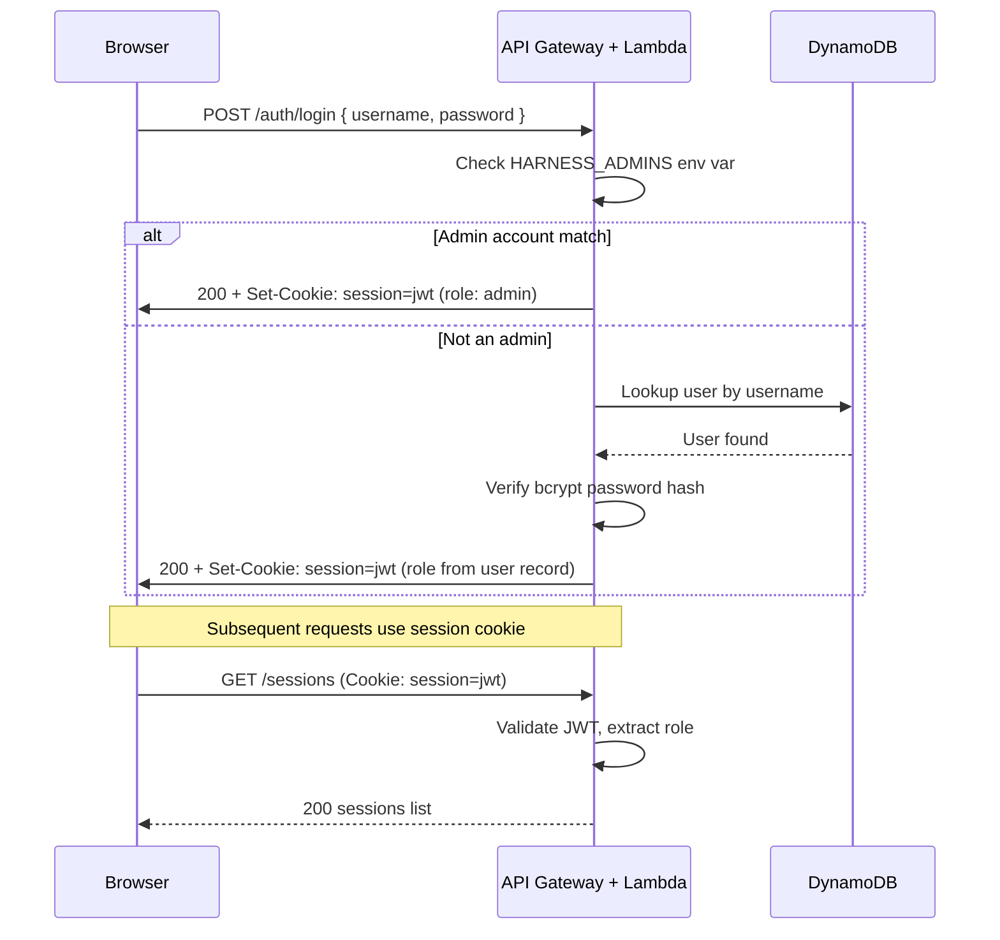
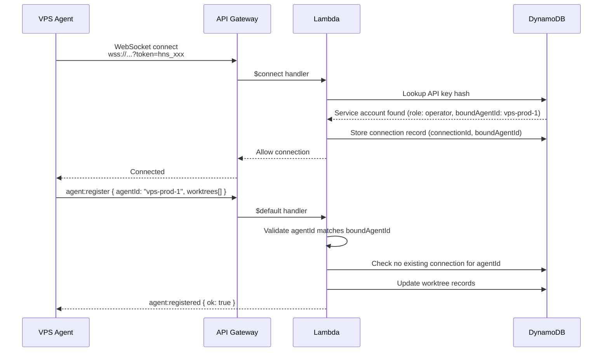

# Security

## Principles

1. **No secrets in the control plane.** The Auto-Auto-Harness cloud service holds no repository credentials, SSH keys, or AI tool API keys. All credentials live on the VPS.
2. **No secrets in prompts.** Never pass secrets through the API or in session prompts. The prompt is stored in DynamoDB and visible in the UI.
3. **Trusted execution environment.** The VPS agent runs directly on a secure server — no Docker isolation wrapping the agent. The AI agents themselves may use Docker for development work within repositories.
4. **Principle of least privilege.** Service accounts are scoped by role and optionally by repository.

## Credential Types

Auto-Harness has three tiers of credentials:

| Tier | For | Auth Method | Managed By |
|------|-----|-------------|------------|
| Admin accounts | Platform administrators | Username + password (env var) | Environment variable |
| User accounts | Human operators | Username + password (basic auth) | Admins |
| Service accounts | Machines (CI/CD, agents) | API key (`hns_...`) | Admins |

### Admin Accounts

Admin accounts are bootstrapped via environment variable on the Lambda. This is the root credential — it exists before any database records.

| Property | Value |
|----------|-------|
| Source | `HARNESS_ADMINS` environment variable on Lambda |
| Format | Base64-encoded JSON array of `{ username, password }` objects |
| Rotation | Update the environment variable and redeploy via CDK |
| Storage | Never stored in a database — only in Lambda environment |
| Auth method | Basic auth (`Authorization: Basic <base64(username:password)>`) |

**Setting the environment variable:**

```bash
# Create the admins JSON
echo '[{"username":"admin","password":"your-secure-password-here"}]' | base64
# Result: W3sidXNlcm5hbWUiOiJhZG1pbiIsInBhc3N3b3JkIjoieW91ci1zZWN1cmUtcGFzc3dvcmQtaGVyZSJ9XQ==

# Set in CDK
HARNESS_ADMINS=W3sidXNlcm5hbWUiOiJhZG1pbiIsInBhc3N3b3JkIjoieW91ci1zZWN1cmUtcGFzc3dvcmQtaGVyZSJ9XQ==
```

Multiple admins can be defined in the array. Passwords should be long, random strings.

Admin operations:
- Create, list, delete **user accounts**
- Create, list, delete **service accounts**
- Manage repositories
- View all sessions across all users
- System configuration

> **Note:** Admin accounts can only manage accounts and platform settings. To actually use the service (create sessions, view logs), use a separate user account. This separation keeps admin credentials off everyday workflows.

### User Accounts

User accounts are for humans interacting with the Web UI and API. Created by admins.

| Property | Value |
|----------|-------|
| Storage | DynamoDB (Users table), password bcrypt-hashed |
| Auth method | Basic auth (`Authorization: Basic <base64(username:password)>`) |
| Session | On Web UI login, a session cookie is issued (HTTP-only, secure, 24h expiry) |

Admins create user accounts via the API or Web UI:

```json
{
  "username": "jong",
  "password": "initial-password",
  "role": "operator"
}
```

The user can change their password after first login.

#### Roles

| Role | Create Sessions | Cancel Sessions | List/View | Manage Repos | Manage Accounts |
|------|:-:|:-:|:-:|:-:|:-:|
| `read-only` | ✗ | ✗ | ✓ | ✗ | ✗ |
| `operator` | ✓ | Own only | ✓ | ✗ | ✗ |
| `admin` | ✓ | Any | ✓ | ✓ | ✓ |

User accounts with `admin` role have the same permissions as env-var admins but are tracked per-user in audit logs.

### Service Accounts (API Keys)

Service accounts are for machines — CI/CD systems, VPS agents, and external integrations. Created by admins.

| Property | Value |
|----------|-------|
| Format | `hns_` prefix + 48 random characters |
| Storage | SHA-256 hash stored in DynamoDB. Plain key shown once on creation. |
| Rotation | Create a new key, update consumers, delete the old key |
| Auth method | `Authorization: Bearer <api-key>` header (REST) or `?token=<api-key>` query param (WebSocket) |

Service accounts have the same role system as user accounts (`read-only`, `operator`, `admin`) and can optionally be scoped to specific repositories:

```json
{
  "name": "ci-frontend",
  "role": "operator",
  "allowedRepositories": ["repo-abc", "repo-def"]
}
```

## Web UI Login Flow



**Session cookie details:**

| Property | Value |
|----------|-------|
| Name | `auto_harness_session` |
| Content | Signed JWT with `{ userId, username, role, exp }` |
| Flags | `HttpOnly`, `Secure`, `SameSite=Strict` |
| Expiry | 24 hours (configurable) |
| Signing key | `HARNESS_SESSION_SECRET` env var on Lambda |

## Auth Priority

When a request arrives, the API checks credentials in this order:

1. **Session cookie** (`auto_harness_session`) — Web UI users
2. **Bearer token** (`Authorization: Bearer hns_...`) — service accounts
3. **Basic auth** (`Authorization: Basic ...`) — admin or user accounts (direct API usage)

If none are present, the request receives `401 Unauthorized`.

## VPS Agent Authentication

The VPS agent authenticates using a service account API key. Each agent service account is **bound** to a specific `agentId` to prevent spoofing.

### Agent Binding

When creating a service account for an agent, the admin specifies the `boundAgentId`:

```json
{
  "name": "vps-prod-1-agent",
  "role": "operator",
  "boundAgentId": "vps-prod-1"
}
```

The `boundAgentId` is stored on the service account record. On WebSocket connect and `agent:register`, the server validates:

1. The API key is valid and has `operator` role
2. The `agentId` in the `agent:register` message matches the `boundAgentId` on the service account
3. No other connection is already registered with the same `agentId`

If any check fails, the connection is rejected with an error message and closed.

### Connection Flow



**Why this matters:** Without binding, a compromised CI service account could connect as `agent:register { agentId: "vps-prod-1" }` and receive sessions intended for a legitimate agent. Binding ensures each API key can only claim its designated agent identity.

**Reconnection:** On disconnect, the agent reconnects with exponential backoff (1s, 2s, 4s, ... max 60s). On reconnect, it re-sends `agent:register` and reports any in-progress sessions.

**Recommended role:** Use an `operator` service account dedicated to the agent. Do not reuse CI/CD keys.

## Transport Security

| Layer | Protection |
|-------|-----------|
| REST API | HTTPS enforced by API Gateway (TLS 1.2+) |
| WebSocket | WSS enforced by API Gateway (TLS 1.2+) |
| DynamoDB | Encrypted at rest (AWS managed keys) |
| S3 | Encrypted at rest (SSE-S3), bucket policy denies non-TLS |

## CORS Policy

The Web UI domain is the only allowed origin for browser requests. Configure via CDK:

```typescript
cors: {
  allowOrigins: ['https://auto-harness.yourdomain.com'],
  allowMethods: ['GET', 'POST', 'PUT', 'DELETE'],
  allowHeaders: ['Authorization', 'Content-Type'],
}
```

## Rate Limiting

| Endpoint | Limit |
|----------|-------|
| `POST /sessions` | 60 requests/minute per service account |
| `GET` endpoints | 300 requests/minute per service account |
| WebSocket messages | 100 messages/second per connection |

Rate limit headers are returned on all REST responses:
- `X-RateLimit-Limit`
- `X-RateLimit-Remaining`
- `X-RateLimit-Reset`

## Audit Logging

All mutating operations are logged in DynamoDB:

| Field | Description |
|-------|-------------|
| `timestamp` | ISO 8601 timestamp |
| `userId` | Service account or admin ID |
| `action` | e.g. `session:create`, `account:delete` |
| `resourceId` | ID of the affected resource |
| `metadata` | Additional context (IP, user agent) |

## VPS Hardening Recommendations

The VPS runs AI agents with filesystem and network access. Harden it:

- **SSH:** Key-based authentication only. Disable password auth. Disable root login.
- **Firewall:** Allow inbound SSH (restricted to your IPs) only. The agent makes only outbound WebSocket connections.
- **User:** Run the agent as a dedicated non-root user (e.g. `harness`).
- **File permissions:** Worktree directories owned by the agent user. Restrict access to `.env` files (`chmod 600`).
- **Docker:** If installed for agent tool use, add the agent user to the `docker` group. Be aware this grants root-equivalent access on the host.
- **Updates:** Keep the OS, Node.js, git, and AI CLI tools up to date.
- **Monitoring:** Monitor disk usage (worktrees and logs can grow), CPU/memory (AI agents can be resource-intensive).
- **Secrets management:** Store AI tool API keys in `.env` files or environment variables on the VPS. Never commit them.

## Security Boundaries

```
┌──────────────────────────────────────────────────┐
│  Cloud (AWS)                                     │
│                                                  │
│  ✓ Admin accounts (Lambda env var, base64)       │
│  ✓ User password hashes (DynamoDB, bcrypt)        │
│  ✓ Service account key hashes (DynamoDB, SHA-256) │
│  ✓ Session cookies (signed JWT)                   │
│  ✓ Session data, logs, prompts                   │
│  ✗ NO repository credentials                     │
│  ✗ NO AI tool API keys                           │
│  ✗ NO secrets in prompts                         │
└───────────────────────┬──────────────────────────┘
                        │ WebSocket (TLS)
                        │ Authenticated via API key
┌───────────────────────▼──────────────────────────┐
│  VPS / Secure Server                             │
│                                                  │
│  ✓ SSH keys for git access                       │
│  ✓ AI tool API keys (.env / env vars)            │
│  ✓ Docker available for agent development use    │
│  ✓ Filesystem access to repositories             │
│  ✓ Agent service account API key                 │
└──────────────────────────────────────────────────┘
```
