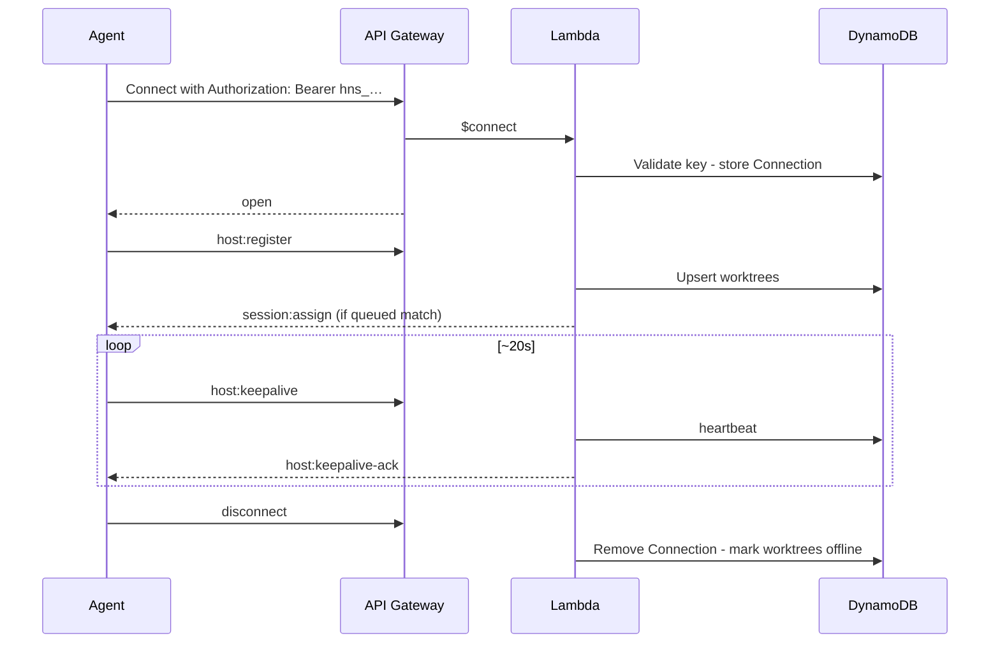

# WebSocket Protocol

Real-time channel between the control plane, VPS agents, and the Web UI. REST CRUD is documented in [api.md](api.md). Agent internals: [host-daemon.md](host-daemon.md). Server routing/IAM: [aws.md](aws.md).

`session:usage` is a host-to-control-plane message carrying a CLI-authoritative provider-neutral
usage record (`sessionId`, `worktreeId`, `attemptId`, and `usage`). The control plane ignores stale
attempts and stale host connections, deduplicates sequence numbers, and never derives usage from
prompts or log chunks.

## Endpoint

```
wss://<api-domain>/ws                  host control with `Authorization: Bearer <credential>`
wss://<api-domain>/ws/viewer?ticket=… browser log viewing with a short-lived viewer ticket
```

`<api-domain>` is the local API (`127.0.0.1:7420`) in dev, or — on AWS — the CloudFront `WebUrl`
from the deploy output, **not** the raw `WebSocketUrl`/`RestApiUrl` API Gateway domains. See
[aws.md](aws.md#topology) and [deploy-host-daemon.md](deploy-host-daemon.md) for why AWS always
has two separate API Gateway APIs behind that one CloudFront hostname.

| Connection | Credential                                                                                                          | First message       |
| ---------- | ------------------------------------------------------------------------------------------------------------------- | ------------------- |
| VPS agent  | Service account API key (`hns_…`) bound to `hostId`                                                                 | `host:register`     |
| Web UI     | One-time 60s viewer ticket obtained with a browser session cookie or user/admin Basic auth (see [auth.md](auth.md)) | `session:subscribe` |

All application messages are JSON with a `type` field. API Gateway routes: `$connect`, `$disconnect`, `$default`.

Unauthenticated connect → reject. Keepalive: **agent-initiated** (`host:keepalive`); the control plane replies `host:keepalive-ack` after the durable heartbeat commits. Lambda has no server-side ping timer. A successful daemon WebSocket write is not evidence the peer received the frame.

---

## Agent ↔ server

### Server → agent

| Type                                 | Payload                                                                                                                                                                                                                                                                                                                    | Purpose                                                                                                                                                                                                                                                                                                                                                                                                                                                                                                                                                                                                                                                                                                                                                                                                                                                                                                                                                                                                                                                                                                                                                                                                                                                                                                                                                                        |
| ------------------------------------ | -------------------------------------------------------------------------------------------------------------------------------------------------------------------------------------------------------------------------------------------------------------------------------------------------------------------------- | ------------------------------------------------------------------------------------------------------------------------------------------------------------------------------------------------------------------------------------------------------------------------------------------------------------------------------------------------------------------------------------------------------------------------------------------------------------------------------------------------------------------------------------------------------------------------------------------------------------------------------------------------------------------------------------------------------------------------------------------------------------------------------------------------------------------------------------------------------------------------------------------------------------------------------------------------------------------------------------------------------------------------------------------------------------------------------------------------------------------------------------------------------------------------------------------------------------------------------------------------------------------------------------------------------------------------------------------------------------------------------ |
| `session:assign`                     | `sessionId`, `attemptId`, `repositoryId`, `prompt`, `resolvedArgv`, `timeout`, `worktreeId?`, `infrastructureRetryCount?`, `ref?`, `setupScript?`, `resume?`, `resumedFromSessionId?`, `cliResumeRef?`, `priorContext?`, `metadata?`, `providerAccountId?`, `commandId?`, `targetIndex?`, `sessionApiKey?`, `logSettings?` | Run or **resume** a session (`attemptId` is an immutable assignment fence that must be echoed in ACK/status; `worktreeId` null = main checkout). For a v6 first-attempt checkout fetch failure, the daemon holds its hook and pre-hook result until the durable status acknowledgement says whether the bounded retry was accepted; a later queued expiry remains control-plane-only. `resolvedArgv` has its target and arguments resolved control-plane-side from a Provider Account/Command (D4). `sessionApiKey`, when present, is a short-lived attempt-scoped credential for the assigned CLI to call `POST /sessions/{sessionId}/children`; it is never persisted in the session record, emitted in logs, or returned by REST. The agent never selects a target, but resolves a bare `argv[0]` through trusted `PATH` or a relative one against the assigned checkout before spawn. `providerAccountId` is the daemon-local execution-profile key (CLI `HOME`/extra env); omit it only for providerless commands. `priorContext: { sourceSessionId }` is present only on a fresh-routed resume (native resume unavailable, or a `target` override) on a host that advertised the `prior-session-context` capability — it tells the daemon to `GET /sessions/<this sessionId>/prior-context` and write the result into the worktree; no URL or file path crosses the wire |
| `session:cancel`                     | `sessionId`, `attemptId`                                                                                                                                                                                                                                                                                                   | Stop that exact assignment attempt; delayed cancels for an old attempt are ignored                                                                                                                                                                                                                                                                                                                                                                                                                                                                                                                                                                                                                                                                                                                                                                                                                                                                                                                                                                                                                                                                                                                                                                                                                                                                                             |
| `session:log-watch`                  | `sessionId`                                                                                                                                                                                                                                                                                                                | First control-plane viewer subscribed; host uploads parts when `logSettings.uploadMode` is `subscribed`                                                                                                                                                                                                                                                                                                                                                                                                                                                                                                                                                                                                                                                                                                                                                                                                                                                                                                                                                                                                                                                                                                                                                                                                                                                                        |
| `session:log-unwatch`                | `sessionId`                                                                                                                                                                                                                                                                                                                | Last control-plane viewer left; host stops subscribed-only uploads                                                                                                                                                                                                                                                                                                                                                                                                                                                                                                                                                                                                                                                                                                                                                                                                                                                                                                                                                                                                                                                                                                                                                                                                                                                                                                             |
| `session:command-start-acknowledged` | `sessionId`, `attemptId`                                                                                                                                                                                                                                                                                                   | Durable authorization for a v4 daemon to spawn the primary CLI. The control plane fences this to the current assignment attempt.                                                                                                                                                                                                                                                                                                                                                                                                                                                                                                                                                                                                                                                                                                                                                                                                                                                                                                                                                                                                                                                                                                                                                                                                                                               |
| `session:status-acknowledged`        | `sessionId`, `attemptId`, optional `retryAccepted`, optional `terminalHookHandoffId`, optional `terminalHookHandoffExpiresAt`                                                                                                                                                                                              | Durable application of a terminal report. For a v6 first-attempt `checkout_fetch_failed`, `retryAccepted: true` transfers terminal-hook ownership to the accepted retry. A terminal disposition — including storage-less exhausted `checkout_fetch_failed` — carries the durable handoff id; the reporting daemon runs its retained hook, recollects the structured result, and completes that handoff before archival. If operator cancellation or a running-timeout sweep already committed, a deferred checkout-failure still receives that handoff id (and v7 expiry) on durable and storage-less paths so the daemon can complete the retained hook exactly once.                                                                                                                                                                                                                                                                                                                                                                                                                                                                                                                                                                                                                                                                                                         |
| `host:registered`                    | `hostId`, `connectionId?`, `protocolVersion?`                                                                                                                                                                                                                                                                              | Durable acknowledgement that `host:register` was accepted. `protocolVersion` is the control plane's protocol (currently `7`); older daemons keep their negotiated behavior during rollout                                                                                                                                                                                                                                                                                                                                                                                                                                                                                                                                                                                                                                                                                                                                                                                                                                                                                                                                                                                                                                                                                                                                                                                      |
| `host:keepalive-ack`                 | `hostId`, `at`                                                                                                                                                                                                                                                                                                             | Durable acknowledgement that `host:keepalive` committed (`at` echoed). Sent via `postToConnection` / the local hub socket — never as a Lambda `$default` response body. Protocol-2 daemons re-arm the stall watchdog only on this frame (or `host:registered`), not on a local `send()`                                                                                                                                                                                                                                                                                                                                                                                                                                                                                                                                                                                                                                                                                                                                                                                                                                                                                                                                                                                                                                                                                        |

Scheduled main-checkout assignments use `sessionType: "scheduled"` and
`worktreeId: null`; hosts must not route them through worktree handling.

```json
{
  "type": "session:assign",
  "sessionId": "sess-x1y2z3",
  "attemptId": "attempt-4e6b9a",
  "repositoryId": "repo-abc",
  "prompt": "Fix the failing test in src/utils.test.ts",
  "resolvedArgv": ["codex", "exec", "Fix the failing test in src/utils.test.ts"],
  "sessionApiKey": "hns_session_…",
  "ref": "main",
  "timeout": 1800,
  "worktreeId": "wt-1",
  "setupScript": "/opt/auto-harness/setup/repo-abc",
  "providerAccountId": "acct-claude-work",
  "commandId": "cmd-claude-print",
  "targetIndex": 0
}
```

**Resume assign** (native route preferred; fresh fallback route if unavailable):

```json
{
  "type": "session:assign",
  "sessionId": "sess-r9s8t7",
  "attemptId": "attempt-71d2cc",
  "repositoryId": "repo-abc",
  "prompt": "Continue: also fix the edge case",
  "resolvedArgv": ["codex", "exec", "Continue: also fix the edge case"],
  "ref": "main",
  "timeout": 1800,
  "worktreeId": "wt-1",
  "resume": true,
  "resumedFromSessionId": "sess-x1y2z3",
  "cliResumeRef": "optional-tool-native-id"
}
```

When `resume: true`, the agent must **not** treat this as a fresh clean setup (avoid destructive reset). See [host-daemon.md — Session resume](host-daemon.md#session-resume).

**Fresh-routed resume assign** (native route unavailable, or a `target` override — no `resume`/`cliResumeRef`, `priorContext` present when the host advertised `prior-session-context`):

```json
{
  "type": "session:assign",
  "sessionId": "sess-r9s8t7",
  "attemptId": "attempt-71d2cc",
  "repositoryId": "repo-abc",
  "prompt": "Continue: also fix the edge case",
  "resolvedArgv": ["claude", "-p", "Continue: also fix the edge case"],
  "ref": "main",
  "timeout": 1800,
  "worktreeId": "wt-2",
  "resumedFromSessionId": "sess-x1y2z3",
  "priorContext": { "sourceSessionId": "sess-x1y2z3" },
  "commandId": "cmd-new",
  "targetIndex": 0
}
```

### Agent → server

| Type                             | Payload                                                                                                                                                                                                                                                                                                                                               | Purpose                                                                                                                                                                                                                                                                                                                                                                                                                                                                                                                                                                          |
| -------------------------------- | ----------------------------------------------------------------------------------------------------------------------------------------------------------------------------------------------------------------------------------------------------------------------------------------------------------------------------------------------------- | -------------------------------------------------------------------------------------------------------------------------------------------------------------------------------------------------------------------------------------------------------------------------------------------------------------------------------------------------------------------------------------------------------------------------------------------------------------------------------------------------------------------------------------------------------------------------------- |
| `host:register`                  | `hostId`, `worktrees[]`, optional `repositories[]`, optional `workspacePools[]`, optional `capabilities` (legacy feature array or `{ features[], maxConcurrentAssignments }`), optional `providerAccountReadiness[]`, optional `runtime`, optional `runningSessions[]`, optional `runningAttempts[]`, optional `protocolVersion`, optional `draining` | Inventory, repository/workspace-slot metadata, rollout capabilities including assignment capacity, opaque per-account execution-profile readiness, Git checkout-recovery readiness, reclaim after reconnect (attempt-fenced), protocol negotiation, and a reconnecting drain intent                                                                                                                                                                                                                                                                                              |
| `session:ack`                    | `sessionId`, `worktreeId`, `attemptId`                                                                                                                                                                                                                                                                                                                | Accepted assign; echoes the immutable assignment fence                                                                                                                                                                                                                                                                                                                                                                                                                                                                                                                           |
| `session:command-start`          | `sessionId`, `worktreeId`, `attemptId`                                                                                                                                                                                                                                                                                                                | Requests durable authorization immediately before the primary CLI spawn; the daemon must wait for `session:command-start-acknowledged` and may safely resend this idempotently after reconnect.                                                                                                                                                                                                                                                                                                                                                                                  |
| `session:status`                 | `sessionId`, `worktreeId`, `workspaceSlotId?`, `workspaceSlotError?`, `attemptId`, `status`, `exitCode?`, `errorCode?`, `errorMessage?`, `result?`, `deferTerminalHookResult?`                                                                                                                                                                        | Lifecycle (`running`, `completed`, `failed`, `cancelled`, `timed_out`); echoes the assignment fence. Workspace cleanup diagnostics use `workspaceSlotError` and terminal `errorCode: "workspace_cleanup_failed"`. Protocol v6 uses `deferTerminalHookResult: true` for a first checkout-fetch failure whose retry disposition must precede its hook and result. Infrastructure failures use `checkout_fetch_failed` or `host_lost`.                                                                                                                                              |
| `session:log`                    | `sessionId`, `attemptId`, `stream`, `content`, `timestamp`, `seq`, optional `dropped`                                                                                                                                                                                                                                                                 | Legacy in-memory/test path only. Durable transcript bodies are host `PUT` gzip parts, not WebSocket frames.                                                                                                                                                                                                                                                                                                                                                                                                                                                                      |
| `session:terminal-hook-complete` | `sessionId`, `handoffId`, optional `result`                                                                                                                                                                                                                                                                                                           | Durable confirmation after the daemon ran or safely no-oped a retained terminal hook. A v6 deferred-result handoff includes the bounded post-hook structured result, using a harness fallback when checkout revalidation, the hook, or result probes fail closed. Protocol-v5 host-loss completions may omit `result`. A v5+ same-process host-loss handoff that reuses an already-run ordinary terminal hook forwards that buffered `session:status` result instead of omitting it or substituting the harness fallback. Duplicate completions keep the first committed result. |
| `worktree:status`                | `worktreeId`, `status`, `currentSessionId?`                                                                                                                                                                                                                                                                                                           | idle / busy / error                                                                                                                                                                                                                                                                                                                                                                                                                                                                                                                                                              |
| `host:status`                    | `hostId`, `draining: true`                                                                                                                                                                                                                                                                                                                            | Authenticated, connection-fenced request to durably drain this host; server replies `host:draining` only after commit                                                                                                                                                                                                                                                                                                                                                                                                                                                            |
| `host:keepalive`                 | `hostId`, `at`, optional `runningSessions[]`                                                                                                                                                                                                                                                                                                          | Agent-initiated heartbeat. The control plane replies `host:keepalive-ack` only after the durable heartbeat write succeeds; a rejected keepalive is not acked                                                                                                                                                                                                                                                                                                                                                                                                                     |

### Server → agent

| Type                                 | Payload                                                                                                          | Purpose                                                                                                                                                                                                                                                                                                                                                                                                                                                                                                                                                                                                                                                                                                                                                      |
| ------------------------------------ | ---------------------------------------------------------------------------------------------------------------- | ------------------------------------------------------------------------------------------------------------------------------------------------------------------------------------------------------------------------------------------------------------------------------------------------------------------------------------------------------------------------------------------------------------------------------------------------------------------------------------------------------------------------------------------------------------------------------------------------------------------------------------------------------------------------------------------------------------------------------------------------------------ |
| `host:draining`                      | `hostId`                                                                                                         | Durable acknowledgement that the matching `host:status { draining: true }` request committed; the daemon may now finish its graceful shutdown.                                                                                                                                                                                                                                                                                                                                                                                                                                                                                                                                                                                                               |
| `session:terminal-hook`              | `sessionId`, `handoffId`, `repositoryId`, `worktreeId`, `status`, `expiresAt`, `errorCode?`, `ref?`, `metadata?` | A durable terminal-hook handoff. The daemon resolves its live local policy, never a server-provided script path. `expiresAt` is the control-plane-owned absolute deadline; the daemon neither starts nor retries the handoff beyond it. On the storage-less local hub, registration and keepalive handling return this list from a per-host index of pending handoffs so the hub can emit it on the newly fenced socket after `host:registered` (or after `host:keepalive-ack`) without scanning every session. Healthy keepalives re-list still-pending handoffs so a transient local send loss is retried. The synchronous register path does not push recovery handoffs through `onHostMessage`, so a replacement cannot deliver to the incumbent socket. |
| `session:terminal-hook-acknowledged` | `sessionId`, `handoffId`                                                                                         | Durable settlement of the v5 handoff; the daemon can stop retrying completion. Duplicate completions for the exact settled handoff (same ID and host) re-emit this acknowledgement on both the durable and storage-less local paths. Mismatched handoff IDs and host owners stay rejected.                                                                                                                                                                                                                                                                                                                                                                                                                                                                   |

**Draining (auto-update):** agent sends `host:status { draining: true }` and waits for `host:draining` before it stops accepting new `session:assign`. The request is authenticated by the bound WebSocket identity and fenced to that connection epoch; a stale socket cannot drain a replacement. A reconnect while the request is pending registers with `draining: true`, preserving exclusion until shutdown completes. The agent then finishes in-flight sessions **without killing CLIs**, disconnects, and restarts. A fresh process registers without `draining` and restores capacity. See [host-daemon.md — Auto-update](host-daemon.md#auto-update-graceful-restart).

```json
{
  "type": "session:log",
  "sessionId": "sess-x1y2z3",
  "attemptId": "attempt-4e6b9a",
  "stream": "stdout",
  "content": "Analyzing codebase...\n",
  "timestamp": "2026-08-01T12:00:06.123Z",
  "seq": 4
}
```

Daemons coalesce consecutive stdout/stderr for the **host-pane** live stream at about **10
messages/sec/session** (`logBatchMaxWaitMs` 100, `logBatchMaxLines` 100, plus the PTY byte budget).
Those frames are **not** sent on the control-plane `/ws`. S3 gzip parts use the operator batch
knobs (default 60s / 256 KB / 500 lines) when upload is on.
A write is split on UTF-8 character and newline boundaries; later pieces never rejoin a
batch that already rejected an earlier piece. A stream change parks one overflow batch
instead of dropping the other stream. Coalesced frames still carry `{sessionId, attemptId}`
and keep insertion order via per-session `seq`; the daemon never renumbers after emit. When a
session exceeds that rate and both the current frame and the overflow batch are at bound, the
daemon drops further stdout/stderr and later emits a system frame on the **host-pane** stream:

```json
{
  "type": "session:log",
  "sessionId": "sess-x1y2z3",
  "attemptId": "attempt-4e6b9a",
  "stream": "system",
  "content": "12 log chunk(s) dropped",
  "timestamp": "2026-08-01T12:00:07.000Z",
  "seq": 5,
  "dropped": 12
}
```

`dropped` is bounded machine-readable telemetry (`0…1_000_000`). If more chunks were
dropped than that, the daemon sends further notices with the remainder. Control-plane
alarming on it is follow-up work; gzip JSONL ingest persists the field when upload is on.
System/lifecycle lines are not dropped (including after session-wide stdout/stderr caps) and flush any
coalesced stdout/stderr ahead of themselves so a terminal `session:status` cannot
overtake logs.

Modern daemons advertise `protocolVersion` (currently `7`) and `runningAttempts: [{ sessionId, attemptId }]`.
Version `7` adds the absolute control-plane expiry to terminal-hook handoffs; only a v7 daemon may
receive one, and it bounds hook execution, post-hook result probes, and same-process overlap
settlement of a retained deferred status to that deadline.
Version `6` adds the deferred checkout-failure result handoff: terminal disposition is persisted
before the daemon runs its retained hook, and archival waits for the post-hook result completion.
The storage-less local path uses that same two-phase settlement for exhausted checkout failures.
It also retains the failed worktree or main-checkout lease until settlement or expiry so another
assignment cannot claim or reset that checkout while the retained hook and result probes run.
That exhausted checkout-failure handoff also enqueues the terminal Slack lifecycle when it
settles or expires; host-loss already enqueued Slack at the terminal write.
Version `5` adds the durable terminal-hook handoff used when final `host_lost` recovery transfers
hook ownership to a replacement daemon. A same-process reuse of an already-run ordinary hook
forwards that buffered `session:status` result on completion. Version `4` adds the durable pre-launch
`session:command-start` handshake: the control plane records
`primaryCommandStartState: "authorized"` before acknowledging, and the daemon must not spawn the
primary CLI until that acknowledgement arrives. This checkpoint lets pre-launch host loss consume
the one bounded infrastructure retry; post-launch or ambiguous loss remains terminal. Version `3`
adds the bounded `SessionResult` on terminal `session:status`; the daemon sends it only when the
server advertises version 3 or newer, and the server accepts it only on a version-3-or-newer host
connection.
Version `2` is keepalive-ack: the daemon re-arms its stall watchdog on `host:keepalive-ack` /
`host:registered` rather than on a local keepalive write. Version `1` is attempt-fenced
scheduling without requiring keepalive acks. A missing `protocolVersion` is a legacy daemon
(version 0): it may finish the attempts it reports
but receives no new `session:assign` once attempt-fenced scheduling is enabled. The control plane
always emits `host:keepalive-ack` after a successful heartbeat (old daemons drop unknown types)
and includes `protocolVersion` on `host:registered` so a new daemon talking to an old control
plane keeps send-based re-arm. Legacy `session:log`
frames may omit `attemptId`; the control plane accepts those only on a version-0 connection and
fences them against that host's currently owned attempt. The control plane ignores delayed ACK,
cancel, reconnect-claim, status, usage, and log frames whose `attemptId` is no longer current,
including stale reconnect claims reported at `host:register`. Durable log writes condition on both
the host connection lock and the current session `attemptId`. The server confirms a durable ACK
with `session:acknowledged { sessionId, attemptId }`. Log `seq` is monotonic per session across
attempts (Invariant 5).

`host:register` worktree item shape:

```json
{
  "id": "wt-1",
  "name": "codex-1",
  "repositoryId": "repo-abc",
  "path": "/home/harness/repos/my-app/.worktrees/wt-1",
  "labels": ["codex", "claude"]
}
```

`capabilities` is either a bounded list of recognized daemon features or an object
`{ "features": ["scheduled-main-checkout"], "maxConcurrentAssignments": 4 }`. A daemon that
can safely execute scheduled sessions in the repository main checkout sends
`scheduled-main-checkout`. Missing capabilities mean an older daemon and
normalize to `[]`; the scheduler must not send that daemon a null-worktree
assignment. `maxConcurrentAssignments` is the host-wide concurrent assignment cap
(default 64 when the daemon advertises the object form without an override).

`providerAccountReadiness` is a bounded list of `{ providerAccountId, ready, fingerprint }`.

A daemon that can execute non-git sessions advertises `workspace-sessions` and registers attached
workspace pools as `{ workspacePoolId, slots: [{ id, name, path }] }`. Workspace assignments have
no Git ref or labels and are sent only to a daemon with this capability.
`fingerprint` is an opaque SHA-256 of the local CLI home plus extra-env **key names** (values
are omitted so secrets are not a confirmation oracle). Credentials, CLI homes, and env values
never cross the wire. Scheduling uses `ready`. The fingerprint lets the control plane detect
that a host's local profile changed without learning home paths or env values; it is
daemon-advertised runtime metadata, not an operator-editable setting. Assignment of a
provider-backed session fails closed unless this host advertised `ready: true` for that exact
account.

Modern daemons include `runtime: { daemonVersion, gitVersion, gitReady, gitReadinessReason?,
environmentNames?, environmentNamesCaseSensitive? }`. `environmentNames` includes names only, and
Windows daemons set `environmentNamesCaseSensitive: false` because their child-process environment
lookup is case-insensitive; other platforms set it to `true`. The control plane treats a missing
runtime report or comparison-mode field as legacy and uses exact (POSIX-compatible) matching. The
runtime report allows up to 512 names, leaving baseline child-environment capacity beyond the 256
distinct names a host/repository pair may require. The control plane fails closed for scheduling
when Git readiness is absent. Reasons are bounded codes only; command output and local paths are
never sent over the wire.

---

## Client (Web UI) ↔ server

### Client → server

| Type                  | Payload                              |
| --------------------- | ------------------------------------ |
| `session:subscribe`   | `{ sessionId, after? }`              |
| `session:unsubscribe` | `{ sessionId }` — sent on page leave |

### Server → client

| Type                 | Payload                                                                                   |
| -------------------- | ----------------------------------------------------------------------------------------- |
| `session:log-part`   | `{ sessionId, key, seqStart, seqEnd }` when a gzip part lands and ≥1 viewer is subscribed |
| `session:status`     | `{ sessionId, status, exitCode? }`                                                        |
| `session:subscribed` | `{ sessionId, cursor, status }` after replay                                              |
| `session:error`      | `{ sessionId, code }` (`NOT_FOUND` never reveals scope)                                   |

---

## Live session viewing

1. `POST /auth/viewer-ticket` through the web origin with the authenticated browser session. The body is `{ ticket }` and the response is `Cache-Control: no-store`. Service-account credentials cannot mint a ticket.
2. Connect to API `/ws/viewer?ticket=…` from that same web origin (the server requires a matching `Origin` and consumes the ticket once), then `session:subscribe` for one session id (the server checks repository scope).
3. Server acknowledges with `session:subscribed` `{ sessionId, cursor, status }`. Log **text** is
   not sent on this socket. When upload is on and this session has subscribers, the server may
   emit `session:log-part` so the UI can refetch REST immediately; otherwise the UI polls
   [`GET /sessions/:id/logs`](api.md). The viewer socket must not `PostToConnection` a history
   page on subscribe.
4. Reconnect with a **fresh** ticket.
5. `session:status` reports lifecycle changes; `session:unsubscribe` is sent on leave (or auto on disconnect).

Notes:

- Many clients may subscribe to one session
- Full history remains bounded REST [`GET /sessions/:id/logs`](api.md) from S3. Subscribe does not replay that history over WebSocket and does not carry log bodies.
- Host gzip-part flush (kb / lines / time) is independent of the old 10 msg/s PTY coalesce used for the host-pane live stream.
- The AWS WebSocket Lambda stores viewer identity and subscriptions in DynamoDB. Each committed
  log record is fanned out through the API Gateway Management API, so browser viewing does not
  require a long-running server.

---

## Connection lifecycle (agent)



Disconnect and reconnect reconciliation: [aws.md](aws.md#disconnect-handling), [host-daemon.md](host-daemon.md#disconnect-and-crash-recovery).
On the storage-less local hub, omitted-session reconcile is awaited before `host:register` is
accepted; a false result fails closed and rolls back provisional ads and unacked claims without
overwriting a newer same-host catalog inventory, including a delete-and-recreate at version 1.
Requeued sessions get an assignment request on that host register path so they do not wait for the
repair sweep. If a newer same-host registration already won while reconcile was pending, the sweep
waits until that winner's socket is published (`host:registered`) so `session:assign` is not dropped
on the closing loser.

---

## Related

| Doc                                                            | Role                                    |
| -------------------------------------------------------------- | --------------------------------------- |
| [api.md](api.md)                                               | REST                                    |
| [host-daemon.md](host-daemon.md)                               | How the agent handles assign/log/status |
| [aws.md](aws.md)                                               | Scheduler, fan-out, connections table   |
| [architecture/communication.md](architecture/communication.md) | When Lambda runs vs outbound push       |
| [web.md](web.md)                                               | UI live terminal                        |
| [setup.md](setup.md)                                           | Deploy / URLs and tokens                |
| [local-development.md](local-development.md)                   | Local API + `/ws` e2e                   |
