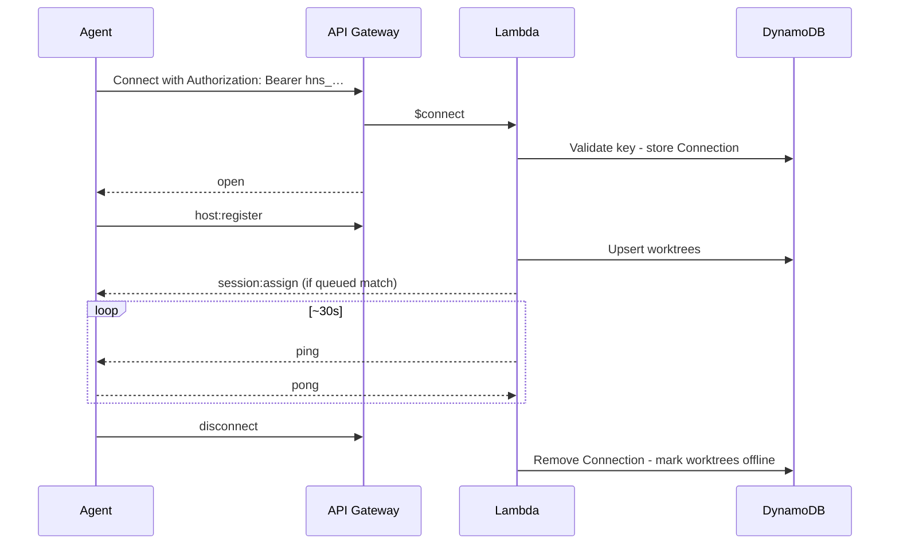

# WebSocket Protocol

Real-time channel between the control plane, VPS agents, and the Web UI. REST CRUD is documented in [api.md](api.md). Agent internals: [host-daemon.md](host-daemon.md). Server routing/IAM: [aws.md](aws.md).

`session:usage` is a host-to-control-plane message carrying a CLI-authoritative provider-neutral
usage record (`sessionId`, `worktreeId`, `attemptId`, and `usage`). The control plane ignores stale
attempts and stale host connections, deduplicates sequence numbers, and never derives usage from
prompts or log chunks.

## Endpoint

```
wss://<api-domain>/ws                  host control with `Authorization: Bearer <credential>`
wss://<api-domain>/ws/viewer?ticket=… browser log viewing with a short-lived viewer ticket
```

`<api-domain>` is the local API (`127.0.0.1:7420`) in dev, or — on AWS — the CloudFront `WebUrl`
from the deploy output, **not** the raw `WebSocketUrl`/`RestApiUrl` API Gateway domains. See
[aws.md](aws.md#topology) and [deploy-host-daemon.md](deploy-host-daemon.md) for why AWS always
has two separate API Gateway APIs behind that one CloudFront hostname.

| Connection | Credential                                                                                                          | First message       |
| ---------- | ------------------------------------------------------------------------------------------------------------------- | ------------------- |
| VPS agent  | Service account API key (`hns_…`) bound to `hostId`                                                                 | `host:register`     |
| Web UI     | One-time 60s viewer ticket obtained with a browser session cookie or user/admin Basic auth (see [auth.md](auth.md)) | `session:subscribe` |

All application messages are JSON with a `type` field. API Gateway routes: `$connect`, `$disconnect`, `$default`.

Unauthenticated connect → reject. Keepalive: **agent-initiated** (`host:keepalive`); Lambda has no server-side ping timer.

---

## Agent ↔ server

### Server → agent

| Type             | Payload                                                                                                                                                                                | Purpose                                                                                                                                                                                                                                                                                         |
| ---------------- | -------------------------------------------------------------------------------------------------------------------------------------------------------------------------------------- | ----------------------------------------------------------------------------------------------------------------------------------------------------------------------------------------------------------------------------------------------------------------------------------------------- |
| `session:assign` | `sessionId`, `attemptId`, `repositoryId`, `prompt`, `resolvedArgv`, `timeout`, `worktreeId?`, `ref?`, `setupScript?`, `resume?`, `resumedFromSessionId?`, `cliResumeRef?`, `metadata?` | Run or **resume** a session (`attemptId` is an immutable assignment fence that must be echoed in ACK/status; `worktreeId` null = main checkout); `resolvedArgv` is already resolved control-plane-side from a Provider Account/Command (D4) — the agent never resolves a target, just spawns it |
| `session:cancel` | `sessionId`, `attemptId`                                                                                                                                                               | Stop that exact assignment attempt; delayed cancels for an old attempt are ignored                                                                                                                                                                                                              |
| `ping`           | `{}`                                                                                                                                                                                   | Keepalive                                                                                                                                                                                                                                                                                       |

Scheduled main-checkout assignments use `sessionType: "scheduled"` and
`worktreeId: null`; hosts must not route them through worktree handling.

```json
{
  "type": "session:assign",
  "sessionId": "sess-x1y2z3",
  "attemptId": "attempt-4e6b9a",
  "repositoryId": "repo-abc",
  "prompt": "Fix the failing test in src/utils.test.ts",
  "resolvedArgv": ["codex", "exec", "Fix the failing test in src/utils.test.ts"],
  "ref": "main",
  "timeout": 1800,
  "worktreeId": "wt-1",
  "setupScript": "git fetch && git reset --hard origin/main && pnpm install"
}
```

**Resume assign** (native route preferred; fresh fallback route if unavailable):

```json
{
  "type": "session:assign",
  "sessionId": "sess-r9s8t7",
  "attemptId": "attempt-71d2cc",
  "repositoryId": "repo-abc",
  "prompt": "Continue: also fix the edge case",
  "resolvedArgv": ["codex", "exec", "Continue: also fix the edge case"],
  "ref": "main",
  "timeout": 1800,
  "worktreeId": "wt-1",
  "resume": true,
  "resumedFromSessionId": "sess-x1y2z3",
  "cliResumeRef": "optional-tool-native-id"
}
```

When `resume: true`, the agent must **not** treat this as a fresh clean setup (avoid destructive reset). See [host-daemon.md — Session resume](host-daemon.md#session-resume).

### Agent → server

| Type              | Payload                                                                                                                                                                                                        | Purpose                                                                                                                                                                                                                                                                                                       |
| ----------------- | -------------------------------------------------------------------------------------------------------------------------------------------------------------------------------------------------------------- | ------------------------------------------------------------------------------------------------------------------------------------------------------------------------------------------------------------------------------------------------------------------------------------------------------------- |
| `host:register`   | `hostId`, `worktrees[]`, optional `repositories[]`, optional `capabilities[]`, optional `runtime`, optional `runningSessions[]`, optional `runningAttempts[]`, optional `protocolVersion`, optional `draining` | Inventory, repository metadata, rollout capabilities, Git checkout-recovery readiness, reclaim after reconnect (attempt-fenced), protocol negotiation, and a reconnecting drain intent                                                                                                                        |
| `session:ack`     | `sessionId`, `worktreeId`, `attemptId`                                                                                                                                                                         | Accepted assign; echoes the immutable assignment fence                                                                                                                                                                                                                                                        |
| `session:status`  | `sessionId`, `worktreeId`, `attemptId`, `status`, `exitCode?`, `errorCode?`, `errorMessage?`                                                                                                                   | Lifecycle (`running`, `completed`, `failed`, `cancelled`, `timed_out`); echoes the assignment fence. Terminal status persists a captured native resume ref when available. On AI quota hits: `failed` + `errorCode: "usage_limit"` (see [host-daemon.md](host-daemon.md#usage-limits-ai-vendor--cli-quotas)). |
| `session:log`     | `sessionId`, `attemptId`, `stream`, `content`, `timestamp`, `seq`, optional `dropped`                                                                                                                          | stdout / stderr / system chunk; delayed chunks from an old attempt are ignored. `dropped` is source-side drop telemetry (chunks discarded to honor ~10 msg/s and byte/line bounds) so the control plane can alarm without parsing log text                                                                    |
| `worktree:status` | `worktreeId`, `status`, `currentSessionId?`                                                                                                                                                                    | idle / busy / error                                                                                                                                                                                                                                                                                           |
| `host:status`     | `hostId`, `draining: true`                                                                                                                                                                                     | Authenticated, connection-fenced request to durably drain this host; server replies `host:draining` only after commit                                                                                                                                                                                         |
| `pong`            | `{}`                                                                                                                                                                                                           | Keepalive reply                                                                                                                                                                                                                                                                                               |

### Server → agent

| Type            | Payload  | Purpose                                                                                                                                        |
| --------------- | -------- | ---------------------------------------------------------------------------------------------------------------------------------------------- |
| `host:draining` | `hostId` | Durable acknowledgement that the matching `host:status { draining: true }` request committed; the daemon may now finish its graceful shutdown. |

**Draining (auto-update):** agent sends `host:status { draining: true }` and waits for `host:draining` before it stops accepting new `session:assign`. The request is authenticated by the bound WebSocket identity and fenced to that connection epoch; a stale socket cannot drain a replacement. A reconnect while the request is pending registers with `draining: true`, preserving exclusion until shutdown completes. The agent then finishes in-flight sessions **without killing CLIs**, disconnects, and restarts. A fresh process registers without `draining` and restores capacity. See [host-daemon.md — Auto-update](host-daemon.md#auto-update-graceful-restart).

```json
{
  "type": "session:log",
  "sessionId": "sess-x1y2z3",
  "attemptId": "attempt-4e6b9a",
  "stream": "stdout",
  "content": "Analyzing codebase...\n",
  "timestamp": "2026-08-01T12:00:06.123Z",
  "seq": 4
}
```

Daemons coalesce consecutive stdout/stderr writes to about **10 WebSocket messages/sec/session**
(`logBatchMaxWaitMs` 100, `logBatchMaxLines` 100, plus the existing per-frame byte budget).
Coalesced frames still carry `{sessionId, attemptId}` and keep insertion order via
`timestampSeq` (`timestamp#seq`); the daemon never renumbers after emit. When a session
exceeds that rate and the current coalesced frame is already at its byte/line bound, the
daemon drops further stdout/stderr and later emits a system frame:

```json
{
  "type": "session:log",
  "sessionId": "sess-x1y2z3",
  "attemptId": "attempt-4e6b9a",
  "stream": "system",
  "content": "12 log chunk(s) dropped",
  "timestamp": "2026-08-01T12:00:07.000Z",
  "seq": 5,
  "dropped": 12
}
```

`dropped` is bounded machine-readable telemetry (`0…1_000_000`). If more chunks were
dropped than that, the daemon sends further notices with the remainder. Control-plane
alarming on it is follow-up work; ingest already persists the field. System/lifecycle
lines are not dropped (including after session-wide stdout/stderr caps) and flush any
coalesced stdout/stderr ahead of themselves so a terminal `session:status` cannot
overtake logs.

Modern daemons advertise `protocolVersion` (currently `1`) and `runningAttempts: [{ sessionId, attemptId }]`.
A missing `protocolVersion` is a legacy daemon (version 0): it may finish the attempts it reports
but receives no new `session:assign` once attempt-fenced scheduling is enabled. Legacy `session:log`
frames may omit `attemptId`; the control plane accepts those only on a version-0 connection and
fences them against that host's currently owned attempt. The control plane ignores delayed ACK,
cancel, reconnect-claim, status, usage, and log frames whose `attemptId` is no longer current,
including stale reconnect claims reported at `host:register`. Durable log writes condition on both
the host connection lock and the current session `attemptId`. The server confirms a durable ACK
with `session:acknowledged { sessionId, attemptId }`. Log `seq` is monotonic per session across
attempts (Invariant 5).

`host:register` worktree item shape:

```json
{
  "id": "wt-1",
  "name": "codex-1",
  "repositoryId": "repo-abc",
  "path": "/home/harness/repos/my-app/.worktrees/wt-1",
  "labels": ["codex", "claude"]
}
```

`capabilities` is a bounded list of recognized daemon features. A daemon that
can safely execute scheduled sessions in the repository main checkout sends
`["scheduled-main-checkout"]`. Missing capabilities mean an older daemon and
normalize to `[]`; the scheduler must not send that daemon a null-worktree
assignment.

Modern daemons include `runtime: { daemonVersion, gitVersion, gitReady, gitReadinessReason?,
environmentNames?, environmentNamesCaseSensitive? }`. `environmentNames` includes names only, and
Windows daemons set `environmentNamesCaseSensitive: false` because their child-process environment
lookup is case-insensitive; other platforms set it to `true`. The control plane treats a missing
runtime report or comparison-mode field as legacy and uses exact (POSIX-compatible) matching. The
runtime report allows up to 512 names, leaving baseline child-environment capacity beyond the 256
distinct names a host/repository pair may require. The control plane fails closed for scheduling
when Git readiness is absent. Reasons are bounded codes only; command output and local paths are
never sent over the wire.

---

## Client (Web UI) ↔ server

### Client → server

| Type                  | Payload                              |
| --------------------- | ------------------------------------ |
| `session:subscribe`   | `{ sessionId, after? }`              |
| `session:unsubscribe` | `{ sessionId }` — sent on page leave |

### Server → client

| Type                 | Payload                                                 |
| -------------------- | ------------------------------------------------------- |
| `session:log`        | Same as agent log plus `timestampSeq` cursor            |
| `session:status`     | `{ sessionId, status, exitCode? }`                      |
| `session:subscribed` | `{ sessionId, cursor, status }` after replay            |
| `session:error`      | `{ sessionId, code }` (`NOT_FOUND` never reveals scope) |

---

## Live session viewing

1. `POST /auth/viewer-ticket` through the web origin with the authenticated browser session. The body is `{ ticket }` and the response is `Cache-Control: no-store`. Service-account credentials cannot mint a ticket.
2. Connect to API `/ws/viewer?ticket=…` from that same web origin (the server requires a matching `Origin` and consumes the ticket once), then `session:subscribe` for one session id (the server checks repository scope).
3. Server replays a bounded cursor page, then tails new `session:log` records.
4. Reconnect with a **fresh** ticket and the last received `timestampSeq` as optional `after`; duplicate log replay is safe, ticket replay is not.
5. `session:status` reports lifecycle changes; `session:unsubscribe` is sent on leave (or auto on disconnect).

Notes:

- Many clients may subscribe to one session
- Full history remains bounded REST [`GET /sessions/:id/logs`](api.md); this protocol only fills the live tail
- Streams may interleave; order is preserved per stream
- The daemon already coalesces source-side to ~10 messages/sec/session (see above). Independently,
  the local WebSocket server coalesces up to 25 adjacent log frames over a short bounded window,
  flushes them before any later control/status frame, and persists the batch in one
  connection-fenced DynamoDB transaction before fan-out. The agent's `timestampSeq` order is
  unchanged; the server never renumbers or reorders chunks.
- The AWS WebSocket Lambda stores viewer identity and subscriptions in DynamoDB. Each committed
  log record is fanned out through the API Gateway Management API, so browser viewing does not
  require a long-running server.

---

## Connection lifecycle (agent)



Disconnect and reconnect reconciliation: [aws.md](aws.md#disconnect-handling), [host-daemon.md](host-daemon.md#disconnect-and-crash-recovery).

---

## Related

| Doc                                          | Role                                    |
| -------------------------------------------- | --------------------------------------- |
| [api.md](api.md)                             | REST                                    |
| [host-daemon.md](host-daemon.md)             | How the agent handles assign/log/status |
| [aws.md](aws.md)                             | Scheduler, fan-out, connections table   |
| [web.md](web.md)                             | UI live terminal                        |
| [setup.md](setup.md)                         | Deploy / URLs and tokens                |
| [local-development.md](local-development.md) | Local API + `/ws` e2e                   |
