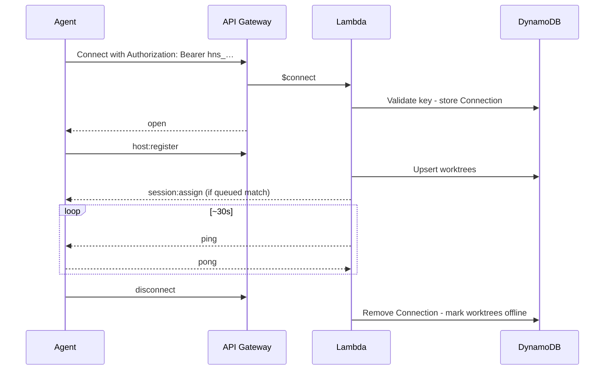

# WebSocket Protocol

Real-time channel between the control plane, VPS agents, and the Web UI. REST CRUD is documented in [api.md](api.md). Agent internals: [host-daemon.md](host-daemon.md). Server routing/IAM: [aws.md](aws.md).

## Endpoint

```
wss://<api-domain>/ws with `Authorization: Bearer <credential>`
```

| Connection | Credential                                                           | First message     |
| ---------- | -------------------------------------------------------------------- | ----------------- |
| VPS agent  | Service account API key (`hns_…`) bound to `hostId`                  | `host:register`   |
| Web UI     | Short-lived ticket or session-derived token (see [auth.md](auth.md)) | `client:register` |

All application messages are JSON with a `type` field. API Gateway routes: `$connect`, `$disconnect`, `$default`.

### Reconnect fence and registration barrier

Every accepted `host:register` has a durable `connectionId`. A socket must wait
for `host:registered` before assignments are delivered or its outbound FIFO is
flushed. A new authenticated registration can replace an orphaned same-host
lease; subsequent host mutations are conditioned on the exact connection ID,
so stale sockets and delayed closes cannot mutate the replacement.

Reconnect retries use 1, 2, 4, … seconds capped at 60 seconds. The daemon
updates and sends its fresh registration snapshot ahead of its source outbound
FIFO, then re-registers bounded running-session IDs. Unacknowledged work requeues
immediately; acknowledged work stays busy through a 75-second deadline and is
reclaimed only when omitted or expired. Dropped outage logs are followed by a
recovery `system` log marker.

Unauthenticated connect → reject. Keepalive: **agent-initiated** (`host:keepalive`); Lambda has no server-side ping timer.

---

## Agent ↔ server

### Server → agent

| Type                   | Payload                                                                                                                                                                                        | Purpose                                                                                                                                                             |
| ---------------------- | ---------------------------------------------------------------------------------------------------------------------------------------------------------------------------------------------- | ------------------------------------------------------------------------------------------------------------------------------------------------------------------- |
| `session:assign`       | `sessionId`, `repositoryId`, `prompt`, `resolvedArgv`, `timeout`, `worktreeId?`, `ref?`, `setupScript?`, `resume?`, `resumedFromSessionId?`, `cliResumeRef?`, `resumeRefCapture?`, `metadata?` | Run or **resume** a session; the agent checks out `ref` when present (otherwise default branch), skips setup for resume, and spawns the control-plane-resolved argv |
| `session:acknowledged` | `sessionId`                                                                                                                                                                                    | The current host connection's `session:ack` committed durably. The daemon may start setup/CLI work only after this reply.                                           |
| `session:cancel`       | `sessionId`                                                                                                                                                                                    | Stop queued/running work                                                                                                                                            |
| `ping`                 | `{}`                                                                                                                                                                                           | Keepalive                                                                                                                                                           |

```json
{
  "type": "session:assign",
  "sessionId": "sess-x1y2z3",
  "repositoryId": "repo-abc",
  "prompt": "Fix the failing test in src/utils.test.ts",
  "resolvedArgv": ["codex", "exec", "Fix the failing test in src/utils.test.ts"],
  "ref": "main",
  "timeout": 1800,
  "worktreeId": "wt-1",
  "setupScript": "git fetch && git reset --hard origin/main && pnpm install"
}
```

**Resume assign** (host-pinned; worktree may differ from the prior session):

```json
{
  "type": "session:assign",
  "sessionId": "sess-r9s8t7",
  "repositoryId": "repo-abc",
  "prompt": "Continue: also fix the edge case",
  "resolvedArgv": [
    "codex",
    "resume",
    "optional-tool-native-id",
    "Continue: also fix the edge case"
  ],
  "ref": "main",
  "timeout": 1800,
  "worktreeId": "wt-2",
  "resume": true,
  "resumedFromSessionId": "sess-x1y2z3",
  "cliResumeRef": "optional-tool-native-id"
}
```

When `resume: true`, the agent checks out `ref` when present (otherwise the repository default branch) and skips setup. `resolvedArgv` is either the exact native template expansion or the frozen normal command fallback. See [host-daemon.md — Session resume](host-daemon.md#session-resume).

### Agent → server

| Type              | Payload                                                                            | Purpose                                                                                                                                                                                                                                                                         |
| ----------------- | ---------------------------------------------------------------------------------- | ------------------------------------------------------------------------------------------------------------------------------------------------------------------------------------------------------------------------------------------------------------------------------- |
| `host:register`   | `hostId`, `worktrees[]`, optional `runningSessions[]`                              | Inventory + reclaim after reconnect                                                                                                                                                                                                                                             |
| `session:ack`     | `sessionId`                                                                        | Accepted assign                                                                                                                                                                                                                                                                 |
| `session:status`  | `sessionId`, `status`, `exitCode?`, `errorCode?`, `errorMessage?`, `cliResumeRef?` | Lifecycle (`running`, `completed`, `failed`, `cancelled`, `timed_out`); terminal status persists a captured native resume ref when available. On AI quota hits: `failed` + `errorCode: "usage_limit"` (see [host-daemon.md](host-daemon.md#usage-limits-ai-vendor--cli-quotas)) |
| `session:log`     | `sessionId`, `stream`, `content`, `timestamp`                                      | stdout / stderr / system chunk                                                                                                                                                                                                                                                  |
| `worktree:status` | `worktreeId`, `status`, `currentSessionId?`                                        | idle / busy / error                                                                                                                                                                                                                                                             |
| `host:status`     | `hostId`, `draining?`, `status?`                                                   | Drain / health (e.g. auto-update)                                                                                                                                                                                                                                               |
| `pong`            | `{}`                                                                               | Keepalive reply                                                                                                                                                                                                                                                                 |

**Draining (auto-update):** agent sets `draining: true`, stops accepting new `session:assign` (nack or ignore), finishes in-flight sessions **without killing CLIs**, then disconnects and restarts. Control plane must not schedule new work to that agent while draining. See [host-daemon.md — Auto-update](host-daemon.md#auto-update-graceful-restart).

`session:ack` is not itself permission to execute: a successful client write
only proves the frame reached the local WebSocket stack. The server sends
`session:acknowledged` only after its fenced durable acknowledgement commits.
The daemon aborts an unconfirmed assignment on disconnect or confirmation
timeout and does not include it in reconnect `runningSessions`.

```json
{
  "type": "session:log",
  "sessionId": "sess-x1y2z3",
  "stream": "stdout",
  "content": "Analyzing codebase...\n",
  "timestamp": "2026-08-01T12:00:06.123Z"
}
```

`host:register` worktree item shape:

```json
{
  "id": "wt-1",
  "name": "codex-1",
  "repositoryId": "repo-abc",
  "path": "/home/harness/repos/my-app/.worktrees/wt-1",
  "labels": ["codex", "claude"]
}
```

---

## Client (Web UI) ↔ server

### Client → server

| Type                  | Payload                                       |
| --------------------- | --------------------------------------------- |
| `client:register`     | `{ userId }` (or principal from connect auth) |
| `session:subscribe`   | `{ sessionId }`                               |
| `session:unsubscribe` | `{ sessionId }`                               |

### Server → client

| Type             | Payload                             |
| ---------------- | ----------------------------------- |
| `session:log`    | Same as agent log (forwarded)       |
| `session:status` | `{ sessionId, status, exitCode? }`  |
| `host:status`    | `{ hostId, status }` online/offline |

---

## Live session viewing

1. Connect + `client:register`
2. `session:subscribe` for a session id
3. Server **replays last ~100** buffered lines, then tails new `session:log`
4. `session:status` on terminal transitions
5. `session:unsubscribe` on leave (or auto on disconnect)

Notes:

- Many clients may subscribe to one session
- Full history: REST [`GET /sessions/:id/logs`](api.md); live tail: this protocol
- Streams may interleave; order is preserved per stream
- Agent rate-limits/batches logs; server persists to DynamoDB and fans out

---

## Connection lifecycle (agent)



Disconnect and reconnect reconciliation: [aws.md](aws.md#disconnect-handling), [host-daemon.md](host-daemon.md#disconnect-and-crash-recovery).

---

## Related

| Doc                                          | Role                                    |
| -------------------------------------------- | --------------------------------------- |
| [api.md](api.md)                             | REST                                    |
| [host-daemon.md](host-daemon.md)             | How the agent handles assign/log/status |
| [aws.md](aws.md)                             | Scheduler, fan-out, connections table   |
| [web.md](web.md)                             | UI live terminal                        |
| [setup.md](setup.md)                         | Deploy / URLs and tokens                |
| [local-development.md](local-development.md) | Local API + `/ws` e2e                   |
