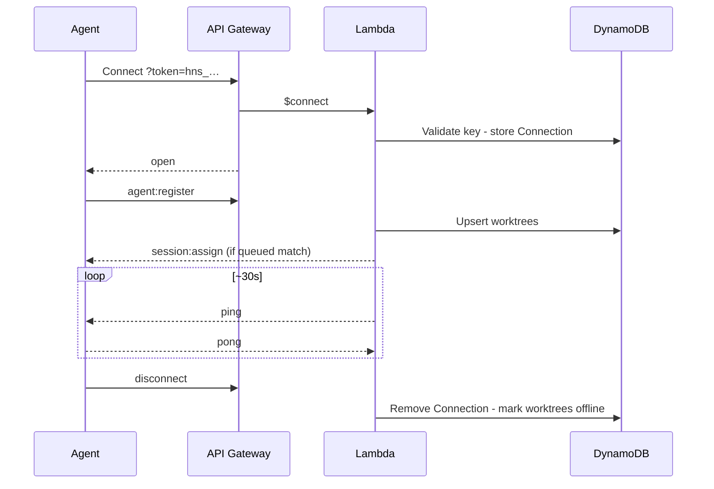

# WebSocket Protocol

Real-time channel between the control plane, VPS agents, and the Web UI. REST CRUD is documented in [api.md](api.md). Agent internals: [agent.md](agent.md). Server routing/IAM: [aws.md](aws.md).

## Endpoint

```
wss://<api-domain>/ws?token=<credential>
```

| Connection | Credential                                                           | First message     |
| ---------- | -------------------------------------------------------------------- | ----------------- |
| VPS agent  | Service account API key (`hns_…`) bound to `agentId`                 | `agent:register`  |
| Web UI     | Short-lived ticket or session-derived token (see [auth.md](auth.md)) | `client:register` |

All application messages are JSON with a `type` field. API Gateway routes: `$connect`, `$disconnect`, `$default`.

Unauthenticated connect → reject. Keepalive: **agent-initiated** (`agent:keepalive`); Lambda has no server-side ping timer.

---

## Agent ↔ server

### Server → agent

| Type             | Payload                                                                                                                                                                     | Purpose                                                                                                             |
| ---------------- | --------------------------------------------------------------------------------------------------------------------------------------------------------------------------- | ------------------------------------------------------------------------------------------------------------------- |
| `session:assign` | `sessionId`, `repositoryId`, `prompt`, `commandProfile`, `timeout`, `worktreeId?`, `ref?`, `setupScript?`, `resume?`, `resumedFromSessionId?`, `cliResumeRef?`, `metadata?` | Run or **resume** a session (`worktreeId` null = main checkout); profile is named (D4), never a free command string |
| `session:cancel` | `sessionId`                                                                                                                                                                 | Stop queued/running work                                                                                            |
| `ping`           | `{}`                                                                                                                                                                        | Keepalive                                                                                                           |

```json
{
  "type": "session:assign",
  "sessionId": "sess-x1y2z3",
  "repositoryId": "repo-abc",
  "prompt": "Fix the failing test in src/utils.test.ts",
  "commandProfile": "codex-fix",
  "ref": "main",
  "timeout": 1800,
  "worktreeId": "wt-1",
  "setupScript": "git fetch && git reset --hard origin/main && pnpm install"
}
```

**Resume assign** (pinned to same worktree/agent as a prior session):

```json
{
  "type": "session:assign",
  "sessionId": "sess-r9s8t7",
  "repositoryId": "repo-abc",
  "prompt": "Continue: also fix the edge case",
  "commandProfile": "codex-fix",
  "ref": "main",
  "timeout": 1800,
  "worktreeId": "wt-1",
  "resume": true,
  "resumedFromSessionId": "sess-x1y2z3",
  "cliResumeRef": "optional-tool-native-id"
}
```

When `resume: true`, the agent must **not** treat this as a fresh clean setup (avoid destructive reset). See [agent.md — Session resume](agent.md#session-resume).

### Agent → server

| Type              | Payload                                                           | Purpose                                                                                                                                                                                       |
| ----------------- | ----------------------------------------------------------------- | --------------------------------------------------------------------------------------------------------------------------------------------------------------------------------------------- |
| `agent:register`  | `agentId`, `worktrees[]`, optional `runningSessions[]`            | Inventory + reclaim after reconnect                                                                                                                                                           |
| `session:ack`     | `sessionId`                                                       | Accepted assign                                                                                                                                                                               |
| `session:status`  | `sessionId`, `status`, `exitCode?`, `errorCode?`, `errorMessage?` | Lifecycle (`running`, `completed`, `failed`, `cancelled`, `timed_out`). On AI quota hits: `failed` + `errorCode: "usage_limit"` (see [agent.md](agent.md#usage-limits-ai-vendor--cli-quotas)) |
| `session:log`     | `sessionId`, `stream`, `content`, `timestamp`                     | stdout / stderr / system chunk                                                                                                                                                                |
| `worktree:status` | `worktreeId`, `status`, `currentSessionId?`                       | idle / busy / error                                                                                                                                                                           |
| `agent:status`    | `agentId`, `draining?`, `status?`                                 | Drain / health (e.g. auto-update)                                                                                                                                                             |
| `pong`            | `{}`                                                              | Keepalive reply                                                                                                                                                                               |

**Draining (auto-update):** agent sets `draining: true`, stops accepting new `session:assign` (nack or ignore), finishes in-flight sessions **without killing CLIs**, then disconnects and restarts. Control plane must not schedule new work to that agent while draining. See [agent.md — Auto-update](agent.md#auto-update-graceful-restart).

```json
{
  "type": "session:log",
  "sessionId": "sess-x1y2z3",
  "stream": "stdout",
  "content": "Analyzing codebase...\n",
  "timestamp": "2026-08-01T12:00:06.123Z"
}
```

`agent:register` worktree item shape:

```json
{
  "id": "wt-1",
  "name": "codex-1",
  "repositoryId": "repo-abc",
  "path": "/home/harness/repos/my-app/.worktrees/wt-1",
  "labels": ["codex", "claude"]
}
```

---

## Client (Web UI) ↔ server

### Client → server

| Type                  | Payload                                       |
| --------------------- | --------------------------------------------- |
| `client:register`     | `{ userId }` (or principal from connect auth) |
| `session:subscribe`   | `{ sessionId }`                               |
| `session:unsubscribe` | `{ sessionId }`                               |

### Server → client

| Type             | Payload                              |
| ---------------- | ------------------------------------ |
| `session:log`    | Same as agent log (forwarded)        |
| `session:status` | `{ sessionId, status, exitCode? }`   |
| `agent:status`   | `{ agentId, status }` online/offline |

---

## Live session viewing

1. Connect + `client:register`
2. `session:subscribe` for a session id
3. Server **replays last ~100** buffered lines, then tails new `session:log`
4. `session:status` on terminal transitions
5. `session:unsubscribe` on leave (or auto on disconnect)

Notes:

- Many clients may subscribe to one session
- Full history: REST [`GET /sessions/:id/logs`](api.md); live tail: this protocol
- Streams may interleave; order is preserved per stream
- Agent rate-limits/batches logs; server persists to DynamoDB and fans out

---

## Connection lifecycle (agent)



Disconnect and reconnect reconciliation: [aws.md](aws.md#disconnect-handling), [agent.md](agent.md#disconnect-and-crash-recovery).

---

## Related

| Doc                                          | Role                                    |
| -------------------------------------------- | --------------------------------------- |
| [api.md](api.md)                             | REST                                    |
| [agent.md](agent.md)                         | How the agent handles assign/log/status |
| [aws.md](aws.md)                             | Scheduler, fan-out, connections table   |
| [web.md](web.md)                             | UI live terminal                        |
| [setup.md](setup.md)                         | Deploy / URLs and tokens                |
| [local-development.md](local-development.md) | Local API + `/ws` e2e                   |
