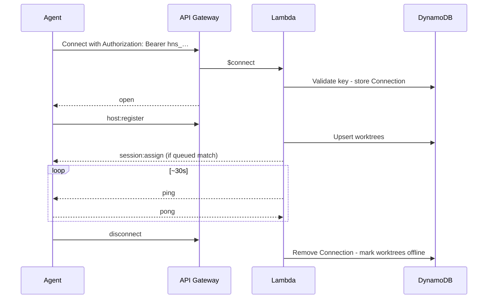

# WebSocket Protocol

Real-time channel between the control plane, VPS agents, and the Web UI. REST CRUD is documented in [api.md](api.md). Agent internals: [host-daemon.md](host-daemon.md). Server routing/IAM: [aws.md](aws.md).

## Endpoint

```
wss://<api-domain>/ws with `Authorization: Bearer <credential>`
```

| Connection | Credential                                                           | First message     |
| ---------- | -------------------------------------------------------------------- | ----------------- |
| VPS agent  | Service account API key (`hns_…`) bound to `hostId`                  | `host:register`   |
| Web UI     | Short-lived ticket or session-derived token (see [auth.md](auth.md)) | `client:register` |

All application messages are JSON with a `type` field. API Gateway routes: `$connect`, `$disconnect`, `$default`.

Unauthenticated connect → reject. Keepalive: **agent-initiated** (`host:keepalive`); Lambda has no server-side ping timer.

---

## Agent ↔ server

### Server → agent

| Type             | Payload                                                                                                                                                                                | Purpose                                                                                                                                                                                                                                                                                         |
| ---------------- | -------------------------------------------------------------------------------------------------------------------------------------------------------------------------------------- | ----------------------------------------------------------------------------------------------------------------------------------------------------------------------------------------------------------------------------------------------------------------------------------------------- |
| `session:assign` | `sessionId`, `attemptId`, `repositoryId`, `prompt`, `resolvedArgv`, `timeout`, `worktreeId?`, `ref?`, `setupScript?`, `resume?`, `resumedFromSessionId?`, `cliResumeRef?`, `metadata?` | Run or **resume** a session (`attemptId` is an immutable assignment fence that must be echoed in ACK/status; `worktreeId` null = main checkout); `resolvedArgv` is already resolved control-plane-side from a Provider Account/Command (D4) — the agent never resolves a target, just spawns it |
| `session:cancel` | `sessionId`                                                                                                                                                                            | Stop queued/running work                                                                                                                                                                                                                                                                        |
| `ping`           | `{}`                                                                                                                                                                                   | Keepalive                                                                                                                                                                                                                                                                                       |

Scheduled main-checkout assignments use `sessionType: "scheduled"` and
`worktreeId: null`; hosts must not route them through worktree handling.

```json
{
  "type": "session:assign",
  "sessionId": "sess-x1y2z3",
  "attemptId": "attempt-4e6b9a",
  "repositoryId": "repo-abc",
  "prompt": "Fix the failing test in src/utils.test.ts",
  "resolvedArgv": ["codex", "exec", "Fix the failing test in src/utils.test.ts"],
  "ref": "main",
  "timeout": 1800,
  "worktreeId": "wt-1",
  "setupScript": "git fetch && git reset --hard origin/main && pnpm install"
}
```

**Resume assign** (native route preferred; fresh fallback route if unavailable):

```json
{
  "type": "session:assign",
  "sessionId": "sess-r9s8t7",
  "attemptId": "attempt-71d2cc",
  "repositoryId": "repo-abc",
  "prompt": "Continue: also fix the edge case",
  "resolvedArgv": ["codex", "exec", "Continue: also fix the edge case"],
  "ref": "main",
  "timeout": 1800,
  "worktreeId": "wt-1",
  "resume": true,
  "resumedFromSessionId": "sess-x1y2z3",
  "cliResumeRef": "optional-tool-native-id"
}
```

When `resume: true`, the agent must **not** treat this as a fresh clean setup (avoid destructive reset). See [host-daemon.md — Session resume](host-daemon.md#session-resume).

### Agent → server

| Type              | Payload                                                                                      | Purpose                                                                                                                                                                                                                                                                                                       |
| ----------------- | -------------------------------------------------------------------------------------------- | ------------------------------------------------------------------------------------------------------------------------------------------------------------------------------------------------------------------------------------------------------------------------------------------------------------- |
| `host:register`   | `hostId`, `worktrees[]`, optional `capabilities[]`, optional `runningSessions[]`             | Inventory, rollout capabilities, and reclaim after reconnect                                                                                                                                                                                                                                                  |
| `session:ack`     | `sessionId`, `worktreeId`, `attemptId`                                                       | Accepted assign; echoes the immutable assignment fence                                                                                                                                                                                                                                                        |
| `session:status`  | `sessionId`, `worktreeId`, `attemptId`, `status`, `exitCode?`, `errorCode?`, `errorMessage?` | Lifecycle (`running`, `completed`, `failed`, `cancelled`, `timed_out`); echoes the assignment fence. Terminal status persists a captured native resume ref when available. On AI quota hits: `failed` + `errorCode: "usage_limit"` (see [host-daemon.md](host-daemon.md#usage-limits-ai-vendor--cli-quotas)). |
| `session:log`     | `sessionId`, `stream`, `content`, `timestamp`                                                | stdout / stderr / system chunk                                                                                                                                                                                                                                                                                |
| `worktree:status` | `worktreeId`, `status`, `currentSessionId?`                                                  | idle / busy / error                                                                                                                                                                                                                                                                                           |
| `host:status`     | `hostId`, `draining?`, `status?`                                                             | Drain / health (e.g. auto-update)                                                                                                                                                                                                                                                                             |
| `pong`            | `{}`                                                                                         | Keepalive reply                                                                                                                                                                                                                                                                                               |

**Draining (auto-update):** agent sets `draining: true`, stops accepting new `session:assign` (nack or ignore), finishes in-flight sessions **without killing CLIs**, then disconnects and restarts. Control plane must not schedule new work to that agent while draining. See [host-daemon.md — Auto-update](host-daemon.md#auto-update-graceful-restart).

```json
{
  "type": "session:log",
  "sessionId": "sess-x1y2z3",
  "stream": "stdout",
  "content": "Analyzing codebase...\n",
  "timestamp": "2026-08-01T12:00:06.123Z"
}
```

`host:register` worktree item shape:

```json
{
  "id": "wt-1",
  "name": "codex-1",
  "repositoryId": "repo-abc",
  "path": "/home/harness/repos/my-app/.worktrees/wt-1",
  "labels": ["codex", "claude"]
}
```

`capabilities` is a bounded list of recognized daemon features. A daemon that
can safely execute scheduled sessions in the repository main checkout sends
`["scheduled-main-checkout"]`. Missing capabilities mean an older daemon and
normalize to `[]`; the scheduler must not send that daemon a null-worktree
assignment.

---

## Browser log viewer ↔ server

The browser viewer is a **separate read-only protocol** at
`wss://<api-domain>/ws/viewer`. It is not the `/ws` host mutation channel.
The upgrade validates the `auto_harness_session` JWT cookie (or another
non-host-bound authenticated principal) before accepting the socket. A
host-bound service-account credential is never a viewer credential.

### Client → server

| Type                 | Payload                               |
| -------------------- | ------------------------------------- |
| `viewer:subscribe`   | `{ sessionId, after?: timestampSeq }` |
| `viewer:unsubscribe` | `{ sessionId }`                       |

### Server → client

| Type                | Payload                                            |
| ------------------- | -------------------------------------------------- | ----------------------- |
| `viewer:log`        | `{ record }`, where record includes `timestampSeq` |
| `viewer:subscribed` | `{ sessionId, cursor }`                            |
| `viewer:error`      | `{ code: "NOT_FOUND"                               | "SUBSCRIPTION_LIMIT" }` |

No other incoming frame is accepted; a browser connection cannot submit
`host:register`, `session:log`, acknowledgements, or status mutations. Each
connection has at most eight session subscriptions. The server authorizes the
session's repository before replaying or tailing it and returns `NOT_FOUND`
for both missing and out-of-scope sessions.

---

## Live session viewing

1. REST bootstrap `GET /sessions/:id/logs`, retaining the greatest `timestampSeq`.
2. Connect to `/ws/viewer` and send `viewer:subscribe` with that cursor.
3. Server replays committed records strictly after the cursor, then tails committed records.
4. On disconnect, reconnect with exponential backoff and the latest rendered cursor.
5. `viewer:unsubscribe` on leave (or auto on disconnect).

Notes:

- Many clients may subscribe to one session; client memory is capped and keeps the newest cursor records.
- The cursor is `timestampSeq` (`<timestamp>#<zero-padded-seq>`), so replay and tail are globally ordered and deduplicable.
- Logs are sent only after a durable fenced write succeeds. A bounded durable cursor poll fills records committed by another API worker.
- If a socket has more than 512 KiB buffered, the server closes it with `1013`; reconnect replay is the backpressure recovery path.

---

## Connection lifecycle (agent)



Disconnect and reconnect reconciliation: [aws.md](aws.md#disconnect-handling), [host-daemon.md](host-daemon.md#disconnect-and-crash-recovery).

---

## Related

| Doc                                          | Role                                    |
| -------------------------------------------- | --------------------------------------- |
| [api.md](api.md)                             | REST                                    |
| [host-daemon.md](host-daemon.md)             | How the agent handles assign/log/status |
| [aws.md](aws.md)                             | Scheduler, fan-out, connections table   |
| [web.md](web.md)                             | UI live terminal                        |
| [setup.md](setup.md)                         | Deploy / URLs and tokens                |
| [local-development.md](local-development.md) | Local API + `/ws` e2e                   |
